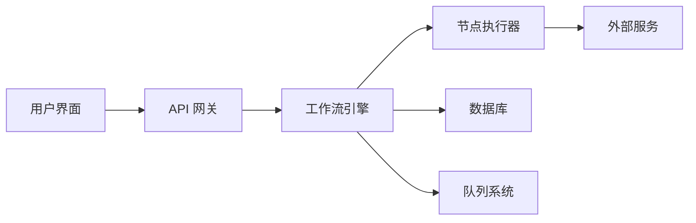

# n8n 开发完整指南

> **综合性开发文档中心** - 从入门到精通的完整技术指南

欢迎来到 n8n 项目的综合开发文档中心！本指南汇集了项目分析、技术栈、架构设计、开发环境和最佳实践的全部精华，为开发者提供一站式的学习和参考资源。

---

## 🚀 快速导航

### 📊 项目概览
- **n8n** - 面向技术人员的开源工作流自动化平台
- **版本**: 1.103.0 | **许可**: Fair-code | **语言**: TypeScript
- **核心优势**: 代码灵活性 + 数据控制权 + AI原生能力

### 🏗️ 技术架构
- **前端**: Vue.js 3 + Vite + Element Plus + Pinia
- **后端**: Node.js 22+ + Express.js + TypeORM + Bull Queue
- **AI层**: LangChain.js + 多模型集成 (OpenAI, Anthropic, Ollama)
- **工具**: TypeScript + pnpm + Turbo + Biome

---

## 📚 专题文档导航

### 🎯 [本地开发环境指南](local_development_guide/)
**适合**: 新手开发者、环境配置
- ✅ [环境要求和初始设置](local_development_guide/01_环境要求和初始设置.md)
- 🚀 [开发服务器启动指南](local_development_guide/02_开发服务器启动指南.md)
- 🐛 [调试配置指南](local_development_guide/03_调试配置指南.md)
- 🔄 [开发工作流和最佳实践](local_development_guide/04_开发工作流和最佳实践.md)
- 🚨 [故障排除和性能优化](local_development_guide/05_故障排除和性能优化.md)

### 🔧 [技术栈深度分析](technology_stack_analysis/)
**适合**: 架构师、技术选型决策者
- 📋 [技术栈概览](technology_stack_analysis/00_Technology_Stack_Overview.md)
- 🎨 [前端技术栈](technology_stack_analysis/01_Frontend_Technology_Stack.md)
- ⚙️ [后端技术栈](technology_stack_analysis/02_Backend_Technology_Stack.md)
- 🛠️ [开发工具和构建系统](technology_stack_analysis/03_Development_Tools_and_Build_System.md)
- 🧪 [测试框架和质量工具](technology_stack_analysis/04_Testing_Framework_and_Quality_Tools.md)
- 🤖 [AI/ML 集成技术](technology_stack_analysis/05_AI_ML_Integration_Technology.md)

### 🏛️ [系统架构设计](architecture_analysis/)
**适合**: 高级开发者、系统设计师
- 🔍 [系统架构设计分析](architecture_analysis/01_System_Architecture_Design.md)
- 🎨 [设计模式分析](architecture_analysis/02_Design_Patterns_Analysis.md)

### 🤖 [AI 功能集成](ai_integration_analysis/)
**适合**: AI开发者、LangChain开发者
- 📖 [AI 功能概览](ai_integration_analysis/00_AI_Feature_Overview.md)
- 🔗 [LangChain 节点架构](ai_integration_analysis/01_LangChain_Nodes_Architecture.md)
- 🎯 [AI Agent 执行流程](ai_integration_analysis/02_AI_Agent_Execution_Flow.md)

### 📁 [项目结构分析](project_structure_analysis/)
**适合**: 新手开发者、项目理解
- 🗂️ [项目概览和结构](project_structure_analysis/00_Project_Overview_and_Structure.md)

### 🔄 [工作流即代码 & DevOps](workflow_as_code_devops/)
**适合**: DevOps工程师、企业部署
- 📋 [Workflow as Code 概览](workflow_as_code_devops/00_Workflow_As_Code_Overview.md)
- 💾 [工作流存储格式](workflow_as_code_devops/01_Workflow_Storage_Format.md)
- 🔧 [Git 管理策略](workflow_as_code_devops/02_Git_Management_Strategy.md)
- 🧪 [测试与 CI/CD](workflow_as_code_devops/03_Testing_And_CI_CD.md)
- 📊 [工作流版本控制格式分析](workflow_as_code_devops/04_Workflow_Version_Control_Format_Analysis.md)

### 📖 [初始分析档案](initial_analysis/)
**适合**: 项目历史了解、深度研究
- 🎯 [项目概览](initial_analysis/00_Project_Overview.md)
- 📦 [架构和包结构](initial_analysis/01_Architecture_And_Packages.md)
- 🧩 [核心概念](initial_analysis/02_Core_Concepts.md)
- 🔄 [工作流执行流程](initial_analysis/03_Workflow_Execution_Flow.md)
- ⚙️ [如何创建节点](initial_analysis/04_How_To_Create_A_Node.md)
- 🛠️ [开发环境](initial_analysis/05_Development_Environment.md)
- 🚀 [部署](initial_analysis/06_Deployment.md)

---

## 🎯 按角色快速开始

### 👶 新手开发者路径
1. **环境准备** → [环境要求和初始设置](local_development_guide/01_环境要求和初始设置.md)
2. **项目理解** → [项目概览](initial_analysis/00_Project_Overview.md)
3. **首次启动** → [开发服务器启动指南](local_development_guide/02_开发服务器启动指南.md)
4. **核心概念** → [核心概念](initial_analysis/02_Core_Concepts.md)

### 💪 有经验开发者路径
1. **技术栈了解** → [技术栈概览](technology_stack_analysis/00_Technology_Stack_Overview.md)
2. **架构理解** → [系统架构设计分析](architecture_analysis/01_System_Architecture_Design.md)
3. **快速启动** → [开发服务器启动指南](local_development_guide/02_开发服务器启动指南.md)
4. **开发流程** → [开发工作流和最佳实践](local_development_guide/04_开发工作流和最佳实践.md)

### 🤖 AI 功能开发者路径
1. **AI 功能概览** → [AI 功能概览](ai_integration_analysis/00_AI_Feature_Overview.md)
2. **LangChain 架构** → [LangChain 节点架构](ai_integration_analysis/01_LangChain_Nodes_Architecture.md)
3. **AI 技术栈** → [AI/ML 集成技术](technology_stack_analysis/05_AI_ML_Integration_Technology.md)
4. **AI 开发模式** → [开发服务器启动指南](local_development_guide/02_开发服务器启动指南.md#ai-开发模式)

### 🏢 企业部署工程师路径
1. **DevOps 概览** → [Workflow as Code 概览](workflow_as_code_devops/00_Workflow_As_Code_Overview.md)
2. **版本控制** → [Git 管理策略](workflow_as_code_devops/02_Git_Management_Strategy.md)
3. **CI/CD 流程** → [测试与 CI/CD](workflow_as_code_devops/03_Testing_And_CI_CD.md)
4. **生产部署** → [部署](initial_analysis/06_Deployment.md)

---

## ⚡ 常用开发命令

### 🚀 启动命令
```bash
# 全栈开发 (推荐首次使用)
pnpm dev

# 仅后端开发 (节省资源)
pnpm dev:be

# 仅前端开发
pnpm dev:fe

# AI 节点开发
pnpm dev:ai

# 带热重载
N8N_DEV_RELOAD=true pnpm dev
```

### 🔧 构建命令
```bash
# 完整构建
pnpm build

# 分模块构建
pnpm build:backend
pnpm build:frontend
pnpm build:nodes
```

### 🧪 测试命令
```bash
# 运行所有测试
pnpm test

# 分模块测试
pnpm test:backend
pnpm test:frontend
pnpm test:nodes
```

### 🛠️ 维护命令
```bash
# 代码格式化
pnpm format

# 类型检查
pnpm typecheck

# 清理重建
pnpm clean && pnpm install && pnpm build
```

---

## 🚨 快速故障排除

### ❌ 启动失败
```bash
# 端口占用
lsof -i :5678 && kill -9 <PID>

# 依赖问题
pnpm clean && pnpm install

# 内存不足
NODE_OPTIONS="--max-old-space-size=4096" pnpm dev
```

### 🐛 开发问题
- **热重载失效** → 确保 `N8N_DEV_RELOAD=true`
- **类型错误** → 运行 `pnpm typecheck`
- **构建失败** → 检查 Node.js 版本 (需要 22.16+)
- **调试断点失效** → 参考 [调试配置指南](local_development_guide/03_调试配置指南.md)

### 📊 性能问题
- **启动缓慢** → 使用选择性开发模式 (`pnpm dev:be` 或 `pnpm dev:fe`)
- **内存占用高** → 调整 Node.js 内存限制
- **构建耗时** → 利用 Turbo 缓存机制

详细解决方案请参考：[故障排除和性能优化](local_development_guide/05_故障排除和性能优化.md)

---

## 📋 开发环境检查清单

### ✅ 基础环境
- [ ] Node.js 22.16+ 已安装
- [ ] pnpm 10.2.1+ 已安装并启用 corepack
- [ ] Git 已配置用户信息
- [ ] 构建工具已安装 (gcc, make, python3)

### ✅ 项目设置
- [ ] 项目已克隆并配置远程仓库
- [ ] 依赖已安装 (`pnpm install`)
- [ ] 项目可以构建 (`pnpm build`)
- [ ] 开发服务器可以启动 (`pnpm dev`)

### ✅ 开发工具
- [ ] VSCode 调试配置正常
- [ ] 代码格式化工具可用 (`pnpm format`)
- [ ] 类型检查通过 (`pnpm typecheck`)
- [ ] 测试可以运行 (`pnpm test`)

---

## 🏗️ n8n 项目架构一览

### 📦 核心包结构
```
n8n/
├── packages/
│   ├── cli/                    # 🖥️  主服务器和 CLI
│   ├── core/                   # ⚙️  工作流执行引擎
│   ├── editor-ui/              # 🎨 Vue.js 前端编辑器
│   ├── nodes-base/             # 🧩 基础节点集合
│   ├── workflow/               # 📋 工作流数据结构
│   └── @n8n/
│       ├── design-system/      # 🎛️  UI 组件库
│       ├── n8n-nodes-langchain/ # 🤖 AI/LangChain 节点
│       ├── api-types/          # 📡 API 类型定义
│       ├── config/             # ⚙️  配置管理
│       └── permissions/        # 🔐 权限系统
```

### 🔄 系统交互流程


### 🧠 AI 功能架构
- **LangChain.js 集成**: 深度集成各种 LLM 和向量数据库
- **AI 节点库**: 400+ 个预构建的 AI 功能节点
- **多模型支持**: OpenAI, Anthropic, Cohere, Ollama 等
- **可视化 AI 工作流**: 将复杂 AI 逻辑转换为可视化流程

---

## 📊 项目规模统计

### 📈 代码规模
- **包数量**: 35+ 个独立包
- **内置节点**: 400+ 个功能节点
- **AI 节点**: 50+ 个 LangChain 集成节点
- **测试用例**: 1000+ 个测试
- **总代码行数**: 500,000+ 行

### 🔧 技术栈深度
- **前端依赖**: 100+ 个 npm 包
- **后端依赖**: 150+ 个 npm 包
- **AI 依赖**: 30+ 个 LangChain 相关包
- **开发工具**: 50+ 个开发和构建工具

---

## 🤝 如何贡献

### 📝 文档贡献
1. **发现问题**: 在使用文档过程中发现错误或缺失
2. **提出改进**: 创建 Issue 描述问题或建议
3. **直接改进**: 提交 Pull Request 改进文档
4. **分享经验**: 在团队内分享使用心得

### 💻 代码贡献
1. **阅读指南**: 参考 [开发工作流和最佳实践](local_development_guide/04_开发工作流和最佳实践.md)
2. **环境配置**: 按照本指南配置开发环境
3. **创建节点**: 参考 [如何创建节点](initial_analysis/04_How_To_Create_A_Node.md)
4. **提交代码**: 遵循项目的 Git 工作流

---

## 📚 学习资源

### 🌐 官方资源
- [n8n 官方文档](https://docs.n8n.io/)
- [n8n GitHub 仓库](https://github.com/n8n-io/n8n)
- [n8n 社区论坛](https://community.n8n.io/)

### 🧠 技术学习
- [Vue.js 3 官方文档](https://v3.vuejs.org/)
- [LangChain.js 文档](https://js.langchain.com/)
- [TypeScript 手册](https://www.typescriptlang.org/docs/)
- [Express.js 指南](https://expressjs.com/)

### 🎯 专业发展
- **工作流自动化**: 学习业务流程优化和自动化设计
- **AI 应用开发**: 掌握 LLM 应用开发和 RAG 系统构建
- **企业级部署**: 了解容器化、微服务和云原生部署

---

## 🔮 未来规划

### 🚀 短期目标 (6个月)
- [ ] 完善 AI 功能开发指南
- [ ] 增加微服务部署指南
- [ ] 补充性能优化最佳实践
- [ ] 增加更多实际案例分析

### 🎯 中期目标 (1年)
- [ ] 建立视频教程库
- [ ] 创建交互式学习路径
- [ ] 开发自动化文档更新系统
- [ ] 建立社区贡献激励机制

---

**💡 提示**: 本文档会随着项目发展持续更新。建议收藏此页面作为 n8n 开发的主要参考入口。

**📞 获取帮助**: 遇到问题时，请先查阅相关专题文档，然后在项目 Issue 中搜索或提问。

---

*最后更新: 2024年12月* | *版本: 1.0* | *贡献者: Ethan*