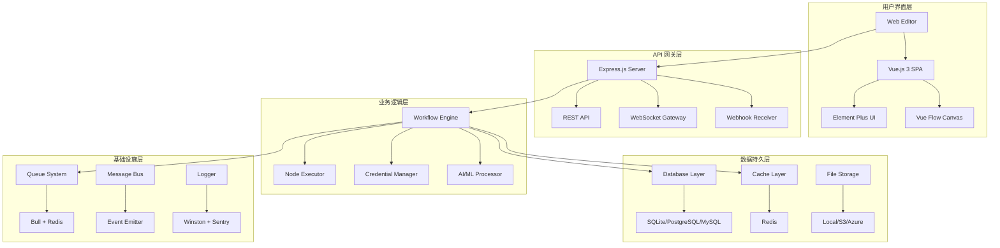

# 01 - 系统架构设计深度分析

本文档深入分析 n8n 系统的整体架构设计，包括核心设计原则、架构模式、组件交互和扩展策略等关键技术决策。

---

## 1. 系统架构概览

### 1.1 整体架构模式

n8n 采用 **分层 + 微服务 + 事件驱动** 的混合架构模式：



### 1.2 核心设计原则

#### 1.2.1 关注点分离 (Separation of Concerns)
```typescript
// 清晰的层级职责划分
interface SystemLayers {
  presentation: 'UI 渲染和用户交互';
  api: 'HTTP/WebSocket 通信协议';
  business: '工作流逻辑和规则处理';
  data: '数据持久化和查询';
  infrastructure: '系统服务和支撑';
}
```

#### 1.2.2 单一职责原则 (Single Responsibility)
```typescript
// 每个包都有明确的单一职责
const packageResponsibilities = {
  'n8n-workflow': '工作流数据结构和验证',
  'n8n-core': '执行引擎和节点管理',
  'n8n-editor-ui': 'Web界面和用户交互',
  'n8n-nodes-base': '基础节点实现',
  '@n8n/typeorm': '数据访问抽象',
  'cli': 'HTTP服务器和API路由'
};
```

#### 1.2.3 依赖倒置原则 (Dependency Inversion)
```typescript
// 基于接口的依赖注入
interface INodeType {
  description: INodeTypeDescription;
  execute(context: IExecuteFunctions): Promise<INodeExecutionData[][]>;
}

// 容器注入实现
class NodeTypeContainer {
  private nodeTypes = new Map<string, INodeType>();
  
  register(name: string, nodeType: INodeType): void {
    this.nodeTypes.set(name, nodeType);
  }
  
  get(name: string): INodeType | undefined {
    return this.nodeTypes.get(name);
  }
}
```

---

## 2. 核心架构组件

### 2.1 工作流引擎架构

#### 2.1.1 引擎核心组件
```typescript
// packages/core/src/workflow-execute.ts
export class WorkflowExecute {
  private workflow: Workflow;
  private additionalData: IWorkflowExecuteAdditionalData;
  private mode: WorkflowExecuteMode;
  
  // 执行策略模式
  private executionStrategy: Map<WorkflowExecuteMode, IExecutionStrategy> = new Map([
    ['integrated', new IntegratedExecutionStrategy()],
    ['queue', new QueueExecutionStrategy()],
    ['webhook', new WebhookExecutionStrategy()]
  ]);
  
  async run(
    workflow: IWorkflowBase,
    startNodes?: INode[],
    destinationNode?: string
  ): Promise<IRun> {
    const strategy = this.executionStrategy.get(this.mode);
    if (!strategy) {
      throw new Error(`Unsupported execution mode: ${this.mode}`);
    }
    
    return strategy.execute(workflow, startNodes, destinationNode);
  }
}
```

#### 2.1.2 节点执行流水线
```typescript
// 节点执行管道设计
export class NodeExecutionPipeline {
  private middlewares: INodeMiddleware[] = [];
  
  use(middleware: INodeMiddleware): void {
    this.middlewares.push(middleware);
  }
  
  async execute(context: IExecuteFunctions): Promise<INodeExecutionData[][]> {
    let index = 0;
    
    const next = async (): Promise<INodeExecutionData[][]> => {
      if (index >= this.middlewares.length) {
        return context.node.execute(context);
      }
      
      const middleware = this.middlewares[index++];
      return middleware(context, next);
    };
    
    return next();
  }
}

// 中间件示例
export const loggingMiddleware: INodeMiddleware = async (context, next) => {
  const startTime = Date.now();
  logger.info(`Executing node: ${context.node.name}`);
  
  try {
    const result = await next();
    logger.info(`Node execution completed in ${Date.now() - startTime}ms`);
    return result;
  } catch (error) {
    logger.error(`Node execution failed: ${error.message}`);
    throw error;
  }
};
```

### 2.2 数据层架构

#### 2.2.1 Repository 模式实现
```typescript
// 统一的仓储接口
export interface IRepository<T> {
  find(criteria?: FindManyOptions<T>): Promise<T[]>;
  findOne(criteria: FindOneOptions<T>): Promise<T | null>;
  create(data: DeepPartial<T>): Promise<T>;
  update(id: string, data: DeepPartial<T>): Promise<T>;
  delete(id: string): Promise<void>;
}

// 具体实现
@Injectable()
export class WorkflowRepository implements IRepository<WorkflowEntity> {
  constructor(
    @InjectRepository(WorkflowEntity)
    private repository: Repository<WorkflowEntity>
  ) {}
  
  async find(criteria?: FindManyOptions<WorkflowEntity>): Promise<WorkflowEntity[]> {
    return this.repository.find(criteria);
  }
  
  async findOne(criteria: FindOneOptions<WorkflowEntity>): Promise<WorkflowEntity | null> {
    return this.repository.findOne(criteria);
  }
  
  // 业务特定查询方法
  async findActiveWorkflows(): Promise<WorkflowEntity[]> {
    return this.repository.find({
      where: { active: true },
      relations: ['owner', 'executions']
    });
  }
  
  async findByOwnerAndTags(ownerId: string, tags: string[]): Promise<WorkflowEntity[]> {
    return this.repository
      .createQueryBuilder('workflow')
      .leftJoinAndSelect('workflow.tags', 'tag')
      .where('workflow.ownerId = :ownerId', { ownerId })
      .andWhere('tag.name IN (:...tags)', { tags })
      .getMany();
  }
}
```

#### 2.2.2 数据访问层抽象
```typescript
// 数据库适配器模式
export interface IDatabaseAdapter {
  connect(): Promise<void>;
  disconnect(): Promise<void>;
  migrate(): Promise<void>;
  getRepository<T>(entity: EntityTarget<T>): Repository<T>;
}

export class PostgreSQLAdapter implements IDatabaseAdapter {
  private dataSource: DataSource;
  
  constructor(config: PostgreSQLConfig) {
    this.dataSource = new DataSource({
      type: 'postgres',
      host: config.host,
      port: config.port,
      username: config.username,
      password: config.password,
      database: config.database,
      entities: [...ENTITIES],
      migrations: [...MIGRATIONS]
    });
  }
  
  async connect(): Promise<void> {
    await this.dataSource.initialize();
  }
  
  async migrate(): Promise<void> {
    await this.dataSource.runMigrations();
  }
  
  getRepository<T>(entity: EntityTarget<T>): Repository<T> {
    return this.dataSource.getRepository(entity);
  }
}
```

### 2.3 缓存架构

#### 2.3.1 多级缓存系统
```typescript
// 缓存策略接口
export interface ICacheStrategy {
  get<T>(key: string): Promise<T | null>;
  set<T>(key: string, value: T, ttl?: number): Promise<void>;
  del(key: string): Promise<void>;
  clear(): Promise<void>;
}

// L1: 内存缓存
export class MemoryCache implements ICacheStrategy {
  private cache = new Map<string, { value: any; expiry: number }>();
  
  async get<T>(key: string): Promise<T | null> {
    const item = this.cache.get(key);
    if (!item || Date.now() > item.expiry) {
      this.cache.delete(key);
      return null;
    }
    return item.value;
  }
  
  async set<T>(key: string, value: T, ttl = 300): Promise<void> {
    this.cache.set(key, {
      value,
      expiry: Date.now() + ttl * 1000
    });
  }
}

// L2: Redis 缓存
export class RedisCache implements ICacheStrategy {
  constructor(private redis: Redis) {}
  
  async get<T>(key: string): Promise<T | null> {
    const value = await this.redis.get(key);
    return value ? JSON.parse(value) : null;
  }
  
  async set<T>(key: string, value: T, ttl = 3600): Promise<void> {
    await this.redis.setex(key, ttl, JSON.stringify(value));
  }
}

// 多级缓存管理器
export class MultiLevelCache implements ICacheStrategy {
  constructor(
    private l1Cache: MemoryCache,
    private l2Cache: RedisCache
  ) {}
  
  async get<T>(key: string): Promise<T | null> {
    // 先查 L1 缓存
    let value = await this.l1Cache.get<T>(key);
    if (value !== null) {
      return value;
    }
    
    // 再查 L2 缓存
    value = await this.l2Cache.get<T>(key);
    if (value !== null) {
      // 回填 L1 缓存
      await this.l1Cache.set(key, value, 60); // 1分钟 TTL
      return value;
    }
    
    return null;
  }
  
  async set<T>(key: string, value: T, ttl?: number): Promise<void> {
    // 同时写入两级缓存
    await Promise.all([
      this.l1Cache.set(key, value, Math.min(ttl || 300, 300)),
      this.l2Cache.set(key, value, ttl)
    ]);
  }
}
```

---

## 3. 事件驱动架构

### 3.1 事件系统设计

#### 3.1.1 事件总线实现
```typescript
// 事件类型定义
export interface IWorkflowEvent {
  type: string;
  workflowId: string;
  data: any;
  timestamp: Date;
  userId?: string;
}

// 事件总线
export class EventBus extends EventEmitter {
  private static instance: EventBus;
  private subscribers = new Map<string, IEventHandler[]>();
  
  static getInstance(): EventBus {
    if (!EventBus.instance) {
      EventBus.instance = new EventBus();
    }
    return EventBus.instance;
  }
  
  subscribe(eventType: string, handler: IEventHandler): void {
    if (!this.subscribers.has(eventType)) {
      this.subscribers.set(eventType, []);
    }
    this.subscribers.get(eventType)!.push(handler);
  }
  
  async publish(event: IWorkflowEvent): Promise<void> {
    const handlers = this.subscribers.get(event.type) || [];
    
    // 并行处理所有订阅者
    await Promise.allSettled(
      handlers.map(handler => handler.handle(event))
    );
    
    // 发出内部事件
    this.emit(event.type, event);
  }
}
```

#### 3.1.2 领域事件处理
```typescript
// 工作流生命周期事件
export enum WorkflowEventType {
  CREATED = 'workflow.created',
  UPDATED = 'workflow.updated',
  ACTIVATED = 'workflow.activated',
  DEACTIVATED = 'workflow.deactivated',
  EXECUTION_STARTED = 'workflow.execution.started',
  EXECUTION_COMPLETED = 'workflow.execution.completed',
  EXECUTION_FAILED = 'workflow.execution.failed'
}

// 事件处理器
@Injectable()
export class WorkflowAuditHandler implements IEventHandler {
  constructor(private auditService: AuditService) {}
  
  async handle(event: IWorkflowEvent): Promise<void> {
    if (event.type.startsWith('workflow.')) {
      await this.auditService.logEvent({
        entityType: 'workflow',
        entityId: event.workflowId,
        action: event.type,
        userId: event.userId,
        details: event.data,
        timestamp: event.timestamp
      });
    }
  }
}

@Injectable()
export class WorkflowMetricsHandler implements IEventHandler {
  constructor(private metricsService: MetricsService) {}
  
  async handle(event: IWorkflowEvent): Promise<void> {
    switch (event.type) {
      case WorkflowEventType.EXECUTION_STARTED:
        this.metricsService.incrementCounter('workflow_executions_started');
        break;
      case WorkflowEventType.EXECUTION_COMPLETED:
        this.metricsService.incrementCounter('workflow_executions_completed');
        this.metricsService.recordHistogram(
          'workflow_execution_duration',
          event.data.duration
        );
        break;
      case WorkflowEventType.EXECUTION_FAILED:
        this.metricsService.incrementCounter('workflow_executions_failed');
        break;
    }
  }
}
```

### 3.2 异步消息处理

#### 3.2.1 队列架构设计
```typescript
// 队列抽象接口
export interface IQueueProcessor {
  process<T>(jobName: string, processor: (job: Job<T>) => Promise<any>): void;
  add<T>(jobName: string, data: T, options?: JobOptions): Promise<Job<T>>;
}

// Bull 队列实现
export class BullQueueProcessor implements IQueueProcessor {
  private queues = new Map<string, Queue>();
  
  constructor(private redisConfig: RedisConfig) {}
  
  private getQueue(name: string): Queue {
    if (!this.queues.has(name)) {
      const queue = new Bull(name, {
        redis: this.redisConfig,
        defaultJobOptions: {
          removeOnComplete: 100,
          removeOnFail: 50,
          attempts: 3,
          backoff: 'exponential'
        }
      });
      
      this.queues.set(name, queue);
    }
    
    return this.queues.get(name)!;
  }
  
  process<T>(jobName: string, processor: (job: Job<T>) => Promise<any>): void {
    const queue = this.getQueue(jobName);
    queue.process(jobName, processor);
  }
  
  async add<T>(jobName: string, data: T, options?: JobOptions): Promise<Job<T>> {
    const queue = this.getQueue(jobName);
    return queue.add(jobName, data, options);
  }
}
```

#### 3.2.2 工作流执行队列
```typescript
// 工作流执行服务
@Injectable()
export class WorkflowExecutionService {
  constructor(
    private queueProcessor: IQueueProcessor,
    private workflowRepository: WorkflowRepository,
    private executionRepository: ExecutionRepository
  ) {
    this.setupProcessors();
  }
  
  private setupProcessors(): void {
    // 标准工作流执行
    this.queueProcessor.process('workflow-execution', async (job) => {
      return this.executeWorkflow(job.data);
    });
    
    // 定时任务执行
    this.queueProcessor.process('scheduled-workflow', async (job) => {
      return this.executeScheduledWorkflow(job.data);
    });
    
    // Webhook 触发执行
    this.queueProcessor.process('webhook-workflow', async (job) => {
      return this.executeWebhookWorkflow(job.data);
    });
  }
  
  async scheduleExecution(request: IExecutionRequest): Promise<string> {
    const executionId = generateId();
    
    await this.queueProcessor.add('workflow-execution', {
      executionId,
      workflowId: request.workflowId,
      inputData: request.inputData,
      userId: request.userId,
      mode: request.mode || 'integrated'
    }, {
      priority: request.priority || 5,
      delay: request.delay || 0
    });
    
    return executionId;
  }
  
  private async executeWorkflow(data: IWorkflowExecutionData): Promise<IRun> {
    const workflow = await this.workflowRepository.findOne({
      where: { id: data.workflowId }
    });
    
    if (!workflow) {
      throw new Error(`Workflow not found: ${data.workflowId}`);
    }
    
    // 创建执行记录
    const execution = await this.executionRepository.create({
      id: data.executionId,
      workflowId: data.workflowId,
      status: 'running',
      startedAt: new Date(),
      mode: data.mode
    });
    
    try {
      // 执行工作流
      const workflowExecute = new WorkflowExecute(
        additionalData,
        data.mode
      );
      
      const result = await workflowExecute.run(workflow, undefined, undefined);
      
      // 更新执行记录
      await this.executionRepository.update(execution.id, {
        status: 'success',
        finishedAt: new Date(),
        data: result.data
      });
      
      // 发布执行完成事件
      await EventBus.getInstance().publish({
        type: WorkflowEventType.EXECUTION_COMPLETED,
        workflowId: data.workflowId,
        data: { executionId: execution.id, duration: result.duration },
        timestamp: new Date(),
        userId: data.userId
      });
      
      return result;
    } catch (error) {
      // 更新执行记录为失败状态
      await this.executionRepository.update(execution.id, {
        status: 'error',
        finishedAt: new Date(),
        error: error.message
      });
      
      // 发布执行失败事件
      await EventBus.getInstance().publish({
        type: WorkflowEventType.EXECUTION_FAILED,
        workflowId: data.workflowId,
        data: { executionId: execution.id, error: error.message },
        timestamp: new Date(),
        userId: data.userId
      });
      
      throw error;
    }
  }
}
```

---

## 4. 微服务架构考虑

### 4.1 服务边界划分

#### 4.1.1 核心服务识别
```typescript
// 服务边界定义
export const ServiceBoundaries = {
  // 用户和认证服务
  UserService: {
    responsibilities: ['用户管理', '认证授权', '权限控制'],
    entities: ['User', 'Role', 'Permission'],
    apis: ['/api/v1/users', '/api/v1/auth']
  },
  
  // 工作流服务
  WorkflowService: {
    responsibilities: ['工作流CRUD', '版本管理', '模板管理'],
    entities: ['Workflow', 'WorkflowVersion', 'Template'],
    apis: ['/api/v1/workflows', '/api/v1/templates']
  },
  
  // 执行服务
  ExecutionService: {
    responsibilities: ['工作流执行', '任务调度', '状态跟踪'],
    entities: ['Execution', 'ExecutionData', 'TaskQueue'],
    apis: ['/api/v1/executions', '/api/v1/queue']
  },
  
  // 凭证服务
  CredentialService: {
    responsibilities: ['凭证管理', '加密存储', '访问控制'],
    entities: ['Credential', 'CredentialType'],
    apis: ['/api/v1/credentials']
  },
  
  // 节点服务
  NodeService: {
    responsibilities: ['节点注册', '类型管理', '版本控制'],
    entities: ['NodeType', 'NodeVersion'],
    apis: ['/api/v1/nodes']
  }
};
```

#### 4.1.2 服务通信模式
```typescript
// 服务间通信接口
export interface IServiceCommunication {
  // 同步调用
  call<T>(service: string, method: string, params: any): Promise<T>;
  
  // 异步消息
  publish(event: string, data: any): Promise<void>;
  subscribe(event: string, handler: (data: any) => Promise<void>): void;
}

// gRPC 服务实现
export class GrpcServiceCommunication implements IServiceCommunication {
  private clients = new Map<string, any>();
  
  async call<T>(service: string, method: string, params: any): Promise<T> {
    const client = this.getClient(service);
    return new Promise((resolve, reject) => {
      client[method](params, (error: any, response: T) => {
        if (error) reject(error);
        else resolve(response);
      });
    });
  }
  
  async publish(event: string, data: any): Promise<void> {
    // 使用消息队列发布事件
    await this.messageQueue.publish(event, data);
  }
  
  subscribe(event: string, handler: (data: any) => Promise<void>): void {
    // 订阅消息队列事件
    this.messageQueue.subscribe(event, handler);
  }
}
```

### 4.2 数据一致性策略

#### 4.2.1 Saga 模式实现
```typescript
// Saga 协调器
export class WorkflowExecutionSaga {
  private steps: ISagaStep[] = [];
  
  constructor(
    private userService: IUserService,
    private workflowService: IWorkflowService,
    private executionService: IExecutionService,
    private auditService: IAuditService
  ) {}
  
  async execute(request: IWorkflowExecutionRequest): Promise<void> {
    const saga = new SagaOrchestrator();
    
    try {
      // Step 1: 验证用户权限
      await saga.addStep({
        execute: () => this.userService.validatePermission(
          request.userId, 
          'workflow:execute', 
          request.workflowId
        ),
        compensate: () => Promise.resolve() // 无需补偿
      });
      
      // Step 2: 创建执行记录
      const executionId = await saga.addStep({
        execute: () => this.executionService.createExecution({
          workflowId: request.workflowId,
          userId: request.userId,
          status: 'pending'
        }),
        compensate: (executionId) => this.executionService.deleteExecution(executionId)
      });
      
      // Step 3: 启动工作流执行
      await saga.addStep({
        execute: () => this.executionService.startExecution(executionId),
        compensate: () => this.executionService.cancelExecution(executionId)
      });
      
      // Step 4: 记录审计日志
      await saga.addStep({
        execute: () => this.auditService.logExecution({
          userId: request.userId,
          workflowId: request.workflowId,
          executionId: executionId,
          action: 'started'
        }),
        compensate: () => this.auditService.deleteLog(executionId)
      });
      
      await saga.execute();
    } catch (error) {
      await saga.compensate();
      throw error;
    }
  }
}
```

#### 4.2.2 事件溯源模式
```typescript
// 事件存储
export interface IEventStore {
  appendEvents(streamId: string, events: IDomainEvent[]): Promise<void>;
  getEvents(streamId: string, fromVersion?: number): Promise<IDomainEvent[]>;
}

// 工作流聚合根
export class WorkflowAggregate {
  private id: string;
  private version: number = 0;
  private uncommittedEvents: IDomainEvent[] = [];
  
  // 领域事件
  private name: string;
  private nodes: INode[] = [];
  private connections: IConnections = {};
  private active: boolean = false;
  
  static create(name: string, ownerId: string): WorkflowAggregate {
    const aggregate = new WorkflowAggregate();
    aggregate.apply(new WorkflowCreatedEvent(
      generateId(),
      name,
      ownerId,
      new Date()
    ));
    return aggregate;
  }
  
  updateNodes(nodes: INode[]): void {
    this.apply(new WorkflowNodesUpdatedEvent(
      this.id,
      nodes,
      this.version + 1,
      new Date()
    ));
  }
  
  activate(): void {
    if (this.active) {
      throw new Error('Workflow is already active');
    }
    
    this.apply(new WorkflowActivatedEvent(
      this.id,
      this.version + 1,
      new Date()
    ));
  }
  
  private apply(event: IDomainEvent): void {
    this.uncommittedEvents.push(event);
    this.version++;
    
    // 应用事件到聚合状态
    switch (event.constructor) {
      case WorkflowCreatedEvent:
        const createdEvent = event as WorkflowCreatedEvent;
        this.id = createdEvent.aggregateId;
        this.name = createdEvent.name;
        break;
        
      case WorkflowNodesUpdatedEvent:
        const updatedEvent = event as WorkflowNodesUpdatedEvent;
        this.nodes = updatedEvent.nodes;
        break;
        
      case WorkflowActivatedEvent:
        this.active = true;
        break;
    }
  }
  
  getUncommittedEvents(): IDomainEvent[] {
    return [...this.uncommittedEvents];
  }
  
  markEventsAsCommitted(): void {
    this.uncommittedEvents = [];
  }
}
```

---

## 5. 可扩展性设计

### 5.1 水平扩展策略

#### 5.1.1 无状态服务设计
```typescript
// 无状态服务原则
export class StatelessWorkflowService {
  constructor(
    private repository: IWorkflowRepository,
    private cache: ICacheStrategy,
    private eventBus: IEventBus
  ) {}
  
  // 所有状态都通过外部存储管理
  async getWorkflow(id: string): Promise<IWorkflow> {
    // 先尝试缓存
    let workflow = await this.cache.get<IWorkflow>(`workflow:${id}`);
    if (workflow) {
      return workflow;
    }
    
    // 从数据库获取
    workflow = await this.repository.findById(id);
    if (workflow) {
      await this.cache.set(`workflow:${id}`, workflow, 300);
    }
    
    return workflow;
  }
  
  // 无副作用的操作
  async updateWorkflow(id: string, updates: Partial<IWorkflow>): Promise<IWorkflow> {
    const workflow = await this.repository.update(id, updates);
    
    // 清除缓存
    await this.cache.del(`workflow:${id}`);
    
    // 发布事件
    await this.eventBus.publish({
      type: 'workflow.updated',
      workflowId: id,
      data: updates,
      timestamp: new Date()
    });
    
    return workflow;
  }
}
```

#### 5.1.2 负载均衡配置
```yaml
# nginx 负载均衡配置
upstream n8n_backend {
    least_conn;
    server n8n-api-1:5678;
    server n8n-api-2:5678;
    server n8n-api-3:5678;
}

server {
    listen 80;
    server_name n8n.example.com;
    
    location / {
        proxy_pass http://n8n_backend;
        proxy_set_header Host $host;
        proxy_set_header X-Real-IP $remote_addr;
        proxy_set_header X-Forwarded-For $proxy_add_x_forwarded_for;
        
        # WebSocket 支持
        proxy_http_version 1.1;
        proxy_set_header Upgrade $http_upgrade;
        proxy_set_header Connection "upgrade";
    }
    
    # API 路由
    location /api/ {
        proxy_pass http://n8n_backend;
        proxy_set_header Content-Type application/json;
    }
    
    # Webhook 路由 (粘性会话)
    location /webhook/ {
        proxy_pass http://n8n_backend;
        ip_hash; # 确保同一 webhook 路由到同一实例
    }
}
```

### 5.2 垂直扩展优化

#### 5.2.1 内存管理策略
```typescript
// 内存池管理
export class MemoryPool {
  private pool: Buffer[] = [];
  private maxSize: number;
  private blockSize: number;
  
  constructor(maxSize: number = 100, blockSize: number = 1024 * 1024) {
    this.maxSize = maxSize;
    this.blockSize = blockSize;
  }
  
  acquire(): Buffer {
    if (this.pool.length > 0) {
      return this.pool.pop()!;
    }
    
    return Buffer.allocUnsafe(this.blockSize);
  }
  
  release(buffer: Buffer): void {
    if (this.pool.length < this.maxSize) {
      buffer.fill(0); // 清零
      this.pool.push(buffer);
    }
  }
}

// 工作流执行内存优化
export class OptimizedWorkflowExecutor {
  private memoryPool = new MemoryPool();
  
  async executeNode(node: INode, input: any): Promise<any> {
    const buffer = this.memoryPool.acquire();
    
    try {
      // 使用 buffer 进行数据处理
      const result = await this.processNodeWithBuffer(node, input, buffer);
      return result;
    } finally {
      this.memoryPool.release(buffer);
    }
  }
  
  private async processNodeWithBuffer(
    node: INode, 
    input: any, 
    buffer: Buffer
  ): Promise<any> {
    // 在 buffer 中处理数据，避免频繁的内存分配
    // ...
  }
}
```

#### 5.2.2 CPU 优化策略
```typescript
// Worker Threads 池
export class WorkerPool {
  private workers: Worker[] = [];
  private queue: Array<{
    data: any;
    resolve: (value: any) => void;
    reject: (error: Error) => void;
  }> = [];
  
  constructor(size: number = os.cpus().length) {
    for (let i = 0; i < size; i++) {
      this.createWorker();
    }
  }
  
  private createWorker(): void {
    const worker = new Worker('./workflow-worker.js');
    
    worker.on('message', (result) => {
      const task = this.queue.shift();
      if (task) {
        task.resolve(result);
        this.processQueue();
      }
    });
    
    worker.on('error', (error) => {
      const task = this.queue.shift();
      if (task) {
        task.reject(error);
        this.processQueue();
      }
    });
    
    this.workers.push(worker);
  }
  
  async execute<T>(data: any): Promise<T> {
    return new Promise((resolve, reject) => {
      this.queue.push({ data, resolve, reject });
      this.processQueue();
    });
  }
  
  private processQueue(): void {
    if (this.queue.length === 0) return;
    
    const availableWorker = this.workers.find(w => !w.busy);
    if (availableWorker) {
      const task = this.queue[0];
      availableWorker.busy = true;
      availableWorker.postMessage(task.data);
    }
  }
}
```

---

## 6. 安全架构

### 6.1 多层安全防护

#### 6.1.1 网络层安全
```typescript
// Rate Limiting 实现
export class RateLimiter {
  private requests = new Map<string, number[]>();
  
  constructor(
    private maxRequests: number = 100,
    private windowMs: number = 60000 // 1分钟
  ) {}
  
  isAllowed(clientId: string): boolean {
    const now = Date.now();
    const windowStart = now - this.windowMs;
    
    // 获取客户端请求历史
    let requests = this.requests.get(clientId) || [];
    
    // 移除过期请求
    requests = requests.filter(time => time > windowStart);
    
    // 检查是否超过限制
    if (requests.length >= this.maxRequests) {
      return false;
    }
    
    // 记录新请求
    requests.push(now);
    this.requests.set(clientId, requests);
    
    return true;
  }
}

// 中间件应用
export const rateLimitMiddleware = (req: Request, res: Response, next: NextFunction) => {
  const clientId = req.ip || req.get('X-Forwarded-For') || 'unknown';
  const rateLimiter = new RateLimiter();
  
  if (!rateLimiter.isAllowed(clientId)) {
    return res.status(429).json({
      error: 'Too many requests',
      retryAfter: 60
    });
  }
  
  next();
};
```

#### 6.1.2 应用层安全
```typescript
// 输入验证和清理
export class SecurityValidator {
  private static XSS_PATTERNS = [
    /<script[^>]*>.*?<\/script>/gi,
    /<iframe[^>]*>.*?<\/iframe>/gi,
    /javascript:/gi,
    /on\w+\s*=/gi
  ];
  
  static sanitizeInput(input: string): string {
    let sanitized = input;
    
    // 移除 XSS 攻击模式
    this.XSS_PATTERNS.forEach(pattern => {
      sanitized = sanitized.replace(pattern, '');
    });
    
    // HTML 编码特殊字符
    sanitized = sanitized
      .replace(/&/g, '&amp;')
      .replace(/</g, '&lt;')
      .replace(/>/g, '&gt;')
      .replace(/"/g, '&quot;')
      .replace(/'/g, '&#x27;');
    
    return sanitized;
  }
  
  static validateWorkflowData(workflow: any): void {
    // 验证工作流结构
    if (!workflow.nodes || !Array.isArray(workflow.nodes)) {
      throw new ValidationError('Invalid workflow structure');
    }
    
    // 验证节点数据
    workflow.nodes.forEach((node: any, index: number) => {
      if (!node.id || !node.type) {
        throw new ValidationError(`Invalid node at index ${index}`);
      }
      
      // 清理节点参数
      if (node.parameters) {
        Object.keys(node.parameters).forEach(key => {
          if (typeof node.parameters[key] === 'string') {
            node.parameters[key] = this.sanitizeInput(node.parameters[key]);
          }
        });
      }
    });
  }
}
```

### 6.2 加密和密钥管理

#### 6.2.1 数据加密服务
```typescript
// 加密服务
export class EncryptionService {
  private algorithm = 'aes-256-gcm';
  private keyDerivationIterations = 100000;
  
  constructor(private masterKey: string) {}
  
  async encrypt(data: string, additionalData?: string): Promise<IEncryptedData> {
    const salt = crypto.randomBytes(32);
    const iv = crypto.randomBytes(16);
    
    // 密钥派生
    const key = crypto.pbkdf2Sync(this.masterKey, salt, this.keyDerivationIterations, 32, 'sha256');
    
    // 加密
    const cipher = crypto.createCipherGCM(this.algorithm, key, iv);
    
    if (additionalData) {
      cipher.setAAD(Buffer.from(additionalData, 'utf8'));
    }
    
    let encrypted = cipher.update(data, 'utf8');
    encrypted = Buffer.concat([encrypted, cipher.final()]);
    
    const authTag = cipher.getAuthTag();
    
    return {
      data: encrypted.toString('base64'),
      salt: salt.toString('base64'),
      iv: iv.toString('base64'),
      authTag: authTag.toString('base64'),
      algorithm: this.algorithm
    };
  }
  
  async decrypt(encryptedData: IEncryptedData, additionalData?: string): Promise<string> {
    const salt = Buffer.from(encryptedData.salt, 'base64');
    const iv = Buffer.from(encryptedData.iv, 'base64');
    const authTag = Buffer.from(encryptedData.authTag, 'base64');
    const encrypted = Buffer.from(encryptedData.data, 'base64');
    
    // 密钥派生
    const key = crypto.pbkdf2Sync(this.masterKey, salt, this.keyDerivationIterations, 32, 'sha256');
    
    // 解密
    const decipher = crypto.createDecipherGCM(this.algorithm, key, iv);
    decipher.setAuthTag(authTag);
    
    if (additionalData) {
      decipher.setAAD(Buffer.from(additionalData, 'utf8'));
    }
    
    let decrypted = decipher.update(encrypted);
    decrypted = Buffer.concat([decrypted, decipher.final()]);
    
    return decrypted.toString('utf8');
  }
}
```

#### 6.2.2 凭证安全管理
```typescript
// 安全凭证存储
@Injectable()
export class CredentialSecurityService {
  constructor(
    private encryptionService: EncryptionService,
    private auditService: IAuditService
  ) {}
  
  async storeCredential(credential: ICredentialData, userId: string): Promise<string> {
    // 记录访问日志
    await this.auditService.logAccess({
      userId,
      action: 'credential.store',
      resource: credential.type,
      timestamp: new Date()
    });
    
    // 加密敏感数据
    const encryptedData = await this.encryptionService.encrypt(
      JSON.stringify(credential.data),
      `${credential.type}:${userId}` // 附加认证数据
    );
    
    // 存储到数据库
    const credentialEntity = await this.credentialRepository.create({
      id: generateId(),
      name: credential.name,
      type: credential.type,
      data: encryptedData,
      ownerId: userId,
      createdAt: new Date(),
      updatedAt: new Date()
    });
    
    return credentialEntity.id;
  }
  
  async retrieveCredential(credentialId: string, userId: string): Promise<ICredentialData> {
    // 验证访问权限
    const hasAccess = await this.checkAccess(credentialId, userId);
    if (!hasAccess) {
      throw new ForbiddenError('Access denied to credential');
    }
    
    // 记录访问日志
    await this.auditService.logAccess({
      userId,
      action: 'credential.retrieve',
      resource: credentialId,
      timestamp: new Date()
    });
    
    const credential = await this.credentialRepository.findById(credentialId);
    if (!credential) {
      throw new NotFoundError('Credential not found');
    }
    
    // 解密数据
    const decryptedData = await this.encryptionService.decrypt(
      credential.data,
      `${credential.type}:${userId}`
    );
    
    return {
      id: credential.id,
      name: credential.name,
      type: credential.type,
      data: JSON.parse(decryptedData)
    };
  }
  
  private async checkAccess(credentialId: string, userId: string): Promise<boolean> {
    // 实现基于角色的访问控制
    const credential = await this.credentialRepository.findById(credentialId);
    if (!credential) return false;
    
    // 所有者访问
    if (credential.ownerId === userId) return true;
    
    // 共享访问
    const sharedAccess = await this.credentialShareRepository.findOne({
      where: { credentialId, userId }
    });
    
    return !!sharedAccess;
  }
}
```

---

## 7. 监控和可观测性

### 7.1 全链路追踪

#### 7.1.1 分布式追踪实现
```typescript
// 追踪上下文
export class TraceContext {
  constructor(
    public traceId: string,
    public spanId: string,
    public parentSpanId?: string
  ) {}
  
  createChildSpan(operationName: string): TraceContext {
    return new TraceContext(
      this.traceId,
      generateId(),
      this.spanId
    );
  }
}

// 追踪装饰器
export function Trace(operationName?: string) {
  return function (target: any, propertyName: string, descriptor: PropertyDescriptor) {
    const method = descriptor.value;
    
    descriptor.value = async function (...args: any[]) {
      const context = TraceContext.current() || new TraceContext(generateId(), generateId());
      const childContext = context.createChildSpan(operationName || `${target.constructor.name}.${propertyName}`);
      
      const span = {
        traceId: childContext.traceId,
        spanId: childContext.spanId,
        parentSpanId: childContext.parentSpanId,
        operationName: operationName || propertyName,
        startTime: Date.now(),
        tags: {},
        logs: []
      };
      
      try {
        TraceContext.setCurrent(childContext);
        const result = await method.apply(this, args);
        
        span.tags.status = 'success';
        span.finishTime = Date.now();
        span.duration = span.finishTime - span.startTime;
        
        await TraceCollector.getInstance().collect(span);
        return result;
      } catch (error) {
        span.tags.status = 'error';
        span.tags.error = error.message;
        span.finishTime = Date.now();
        span.duration = span.finishTime - span.startTime;
        
        await TraceCollector.getInstance().collect(span);
        throw error;
      } finally {
        TraceContext.setCurrent(context);
      }
    };
  };
}
```

#### 7.1.2 工作流执行追踪
```typescript
// 工作流执行追踪
export class WorkflowExecutionTracer {
  @Trace('workflow.execute')
  async executeWorkflow(workflowId: string, inputData: any): Promise<any> {
    const context = TraceContext.current();
    
    // 添加工作流级别的标签
    context.setTag('workflow.id', workflowId);
    context.setTag('workflow.input_size', JSON.stringify(inputData).length);
    
    const workflow = await this.getWorkflow(workflowId);
    const result = await this.runWorkflow(workflow, inputData);
    
    context.setTag('workflow.output_size', JSON.stringify(result).length);
    context.setTag('workflow.nodes_executed', result.executedNodes?.length || 0);
    
    return result;
  }
  
  @Trace('node.execute')
  async executeNode(node: INode, inputData: any): Promise<any> {
    const context = TraceContext.current();
    
    context.setTag('node.type', node.type);
    context.setTag('node.id', node.id);
    context.setTag('node.name', node.name);
    
    try {
      const result = await this.runNode(node, inputData);
      
      context.setTag('node.status', 'success');
      context.setTag('node.output_count', result?.length || 0);
      
      return result;
    } catch (error) {
      context.setTag('node.status', 'error');
      context.setTag('node.error_type', error.constructor.name);
      context.setTag('node.error_message', error.message);
      
      throw error;
    }
  }
}
```

### 7.2 指标收集和监控

#### 7.2.1 业务指标定义
```typescript
// 业务指标收集器
export class BusinessMetricsCollector {
  private registry = new promClient.Registry();
  
  // 工作流执行指标
  private workflowExecutions = new promClient.Counter({
    name: 'n8n_workflow_executions_total',
    help: 'Total number of workflow executions',
    labelNames: ['workflow_id', 'status', 'trigger_type'],
    registers: [this.registry]
  });
  
  private executionDuration = new promClient.Histogram({
    name: 'n8n_workflow_execution_duration_seconds',
    help: 'Workflow execution duration in seconds',
    labelNames: ['workflow_id'],
    buckets: [0.1, 0.5, 1, 2, 5, 10, 30, 60, 120],
    registers: [this.registry]
  });
  
  // 节点执行指标
  private nodeExecutions = new promClient.Counter({
    name: 'n8n_node_executions_total',
    help: 'Total number of node executions',
    labelNames: ['node_type', 'status'],
    registers: [this.registry]
  });
  
  private nodeExecutionDuration = new promClient.Histogram({
    name: 'n8n_node_execution_duration_seconds',
    help: 'Node execution duration in seconds',
    labelNames: ['node_type'],
    buckets: [0.01, 0.05, 0.1, 0.5, 1, 2, 5],
    registers: [this.registry]
  });
  
  // 系统资源指标
  private activeExecutions = new promClient.Gauge({
    name: 'n8n_active_executions',
    help: 'Number of currently active workflow executions',
    registers: [this.registry]
  });
  
  private queueSize = new promClient.Gauge({
    name: 'n8n_queue_size',
    help: 'Number of jobs in the execution queue',
    labelNames: ['queue_name'],
    registers: [this.registry]
  });
  
  recordWorkflowExecution(workflowId: string, status: string, triggerType: string): void {
    this.workflowExecutions.inc({
      workflow_id: workflowId,
      status,
      trigger_type: triggerType
    });
  }
  
  recordExecutionDuration(workflowId: string, duration: number): void {
    this.executionDuration.observe({ workflow_id: workflowId }, duration);
  }
  
  recordNodeExecution(nodeType: string, status: string): void {
    this.nodeExecutions.inc({ node_type: nodeType, status });
  }
  
  recordNodeDuration(nodeType: string, duration: number): void {
    this.nodeExecutionDuration.observe({ node_type: nodeType }, duration);
  }
  
  setActiveExecutions(count: number): void {
    this.activeExecutions.set(count);
  }
  
  setQueueSize(queueName: string, size: number): void {
    this.queueSize.set({ queue_name: queueName }, size);
  }
  
  getMetrics(): string {
    return this.registry.metrics();
  }
}
```

#### 7.2.2 健康检查系统
```typescript
// 健康检查接口
export interface IHealthCheck {
  name: string;
  check(): Promise<IHealthStatus>;
}

export interface IHealthStatus {
  status: 'healthy' | 'unhealthy' | 'degraded';
  message?: string;
  details?: any;
  duration: number;
}

// 数据库健康检查
export class DatabaseHealthCheck implements IHealthCheck {
  name = 'database';
  
  constructor(private dataSource: DataSource) {}
  
  async check(): Promise<IHealthStatus> {
    const startTime = Date.now();
    
    try {
      await this.dataSource.query('SELECT 1');
      
      return {
        status: 'healthy',
        message: 'Database connection is working',
        duration: Date.now() - startTime
      };
    } catch (error) {
      return {
        status: 'unhealthy',
        message: 'Database connection failed',
        details: { error: error.message },
        duration: Date.now() - startTime
      };
    }
  }
}

// Redis 健康检查
export class RedisHealthCheck implements IHealthCheck {
  name = 'redis';
  
  constructor(private redis: Redis) {}
  
  async check(): Promise<IHealthStatus> {
    const startTime = Date.now();
    
    try {
      const result = await this.redis.ping();
      
      return {
        status: result === 'PONG' ? 'healthy' : 'unhealthy',
        message: 'Redis connection is working',
        duration: Date.now() - startTime
      };
    } catch (error) {
      return {
        status: 'unhealthy',
        message: 'Redis connection failed',
        details: { error: error.message },
        duration: Date.now() - startTime
      };
    }
  }
}

// 健康检查聚合器
export class HealthCheckService {
  private checks: IHealthCheck[] = [];
  
  addCheck(check: IHealthCheck): void {
    this.checks.push(check);
  }
  
  async checkHealth(): Promise<{ status: string; checks: Record<string, IHealthStatus> }> {
    const results: Record<string, IHealthStatus> = {};
    let overallStatus = 'healthy';
    
    await Promise.all(
      this.checks.map(async (check) => {
        try {
          const result = await check.check();
          results[check.name] = result;
          
          if (result.status === 'unhealthy') {
            overallStatus = 'unhealthy';
          } else if (result.status === 'degraded' && overallStatus === 'healthy') {
            overallStatus = 'degraded';
          }
        } catch (error) {
          results[check.name] = {
            status: 'unhealthy',
            message: 'Health check failed',
            details: { error: error.message },
            duration: 0
          };
          overallStatus = 'unhealthy';
        }
      })
    );
    
    return { status: overallStatus, checks: results };
  }
}
```

---

## 8. 总结

### 8.1 架构优势

1. **模块化设计**: 清晰的包结构和职责分离
2. **可扩展性**: 支持水平和垂直扩展
3. **高可用性**: 无状态设计和故障恢复机制
4. **安全性**: 多层安全防护和加密保护
5. **可观测性**: 全链路追踪和综合监控

### 8.2 设计模式应用

1. **策略模式**: 执行策略和缓存策略
2. **观察者模式**: 事件驱动架构
3. **工厂模式**: 节点类型创建
4. **装饰器模式**: 中间件和AOP
5. **仓储模式**: 数据访问抽象

### 8.3 技术创新点

1. **可视化编程**: 将复杂逻辑转换为可视化流程
2. **AI集成**: 深度的AI/ML能力整合
3. **微服务就绪**: 支持微服务架构演进
4. **云原生**: 容器化和云平台支持
5. **企业级**: 完整的企业功能支持

n8n 的系统架构展现了现代软件架构的最佳实践，为构建大规模、高可用的工作流自动化平台提供了坚实的技术基础。