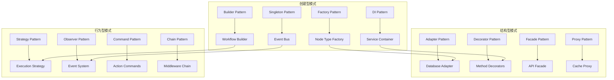

# 02 - 设计模式深度分析

本文档深入分析 n8n 项目中应用的设计模式，包括创建型、结构型和行为型模式的具体实现和应用场景。

---

## 1. 设计模式概览

### 1.1 模式分类统计

n8n 项目中广泛应用了多种设计模式，体现了良好的架构设计：

```typescript
// 设计模式应用统计
const designPatterns = {
  creational: {
    factory: ['NodeTypeFactory', 'CredentialTypeFactory', 'DatabaseAdapterFactory'],
    builder: ['WorkflowBuilder', 'QueryBuilder', 'ConfigBuilder'],
    singleton: ['EventBus', 'ConfigService', 'Logger'],
    dependency_injection: ['IoC Container', 'Service Registration']
  },
  
  structural: {
    adapter: ['DatabaseAdapter', 'CacheAdapter', 'AuthAdapter'],
    decorator: ['@Trace', '@Cache', '@Auth', '@Validate'],
    facade: ['WorkflowFacade', 'ExecutionFacade', 'NodeFacade'],
    proxy: ['LazyLoading', 'CacheProxy', 'SecurityProxy']
  },
  
  behavioral: {
    strategy: ['ExecutionStrategy', 'CacheStrategy', 'AuthStrategy'],
    observer: ['EventEmitter', 'WorkflowObserver', 'ExecutionObserver'],
    command: ['WorkflowCommand', 'NodeCommand', 'ExecutionCommand'],
    chain_of_responsibility: ['MiddlewareChain', 'ValidationChain'],
    template_method: ['NodeExecutor', 'WorkflowRunner'],
    state: ['WorkflowState', 'ExecutionState'],
    visitor: ['NodeVisitor', 'WorkflowVisitor']
  }
};
```

### 1.2 核心模式架构图



---

## 2. 创建型模式

### 2.1 工厂模式 (Factory Pattern)

#### 2.1.1 节点类型工厂
```typescript
// packages/core/src/NodeTypeFactory.ts
export interface INodeTypeFactory {
  createNodeType(nodeTypeName: string, version?: number): INodeType;
  registerNodeType(nodeTypeName: string, nodeType: INodeType): void;
}

export class NodeTypeFactory implements INodeTypeFactory {
  private static instance: NodeTypeFactory;
  private nodeTypes = new Map<string, Map<number, INodeType>>();
  
  static getInstance(): NodeTypeFactory {
    if (!NodeTypeFactory.instance) {
      NodeTypeFactory.instance = new NodeTypeFactory();
    }
    return NodeTypeFactory.instance;
  }
  
  registerNodeType(nodeTypeName: string, nodeType: INodeType): void {
    if (!this.nodeTypes.has(nodeTypeName)) {
      this.nodeTypes.set(nodeTypeName, new Map());
    }
    
    const versions = this.nodeTypes.get(nodeTypeName)!;
    const version = nodeType.description.version || 1;
    versions.set(version, nodeType);
  }
  
  createNodeType(nodeTypeName: string, version: number = 1): INodeType {
    const versions = this.nodeTypes.get(nodeTypeName);
    if (!versions) {
      throw new Error(`Node type "${nodeTypeName}" not found`);
    }
    
    const nodeType = versions.get(version);
    if (!nodeType) {
      // 查找最高版本
      const availableVersions = Array.from(versions.keys()).sort((a, b) => b - a);
      const latestVersion = availableVersions[0];
      const latestNodeType = versions.get(latestVersion);
      
      if (!latestNodeType) {
        throw new Error(`No version found for node type "${nodeTypeName}"`);
      }
      
      return latestNodeType;
    }
    
    return nodeType;
  }
  
  // 抽象工厂方法
  createNodesByCategory(category: string): INodeType[] {
    const nodeTypes: INodeType[] = [];
    
    for (const [nodeTypeName, versions] of this.nodeTypes) {
      for (const [version, nodeType] of versions) {
        if (nodeType.description.group?.includes(category)) {
          nodeTypes.push(nodeType);
        }
      }
    }
    
    return nodeTypes;
  }
}
```

#### 2.1.2 数据库适配器工厂
```typescript
// packages/core/src/database/DatabaseAdapterFactory.ts
export abstract class DatabaseAdapterFactory {
  static createAdapter(config: IDatabaseConfig): IDatabaseAdapter {
    switch (config.type) {
      case 'sqlite':
        return new SQLiteAdapter(config as ISQLiteConfig);
      case 'postgres':
        return new PostgreSQLAdapter(config as IPostgreSQLConfig);
      case 'mysql':
        return new MySQLAdapter(config as IMySQLConfig);
      case 'mariadb':
        return new MariaDBAdapter(config as IMariaDBConfig);
      default:
        throw new Error(`Unsupported database type: ${config.type}`);
    }
  }
  
  // 工厂方法模式 - 由子类决定具体实例
  abstract createConnection(): Promise<Connection>;
  abstract createQueryBuilder(): QueryBuilder;
  abstract createMigrationRunner(): MigrationRunner;
}

// 具体工厂实现
export class PostgreSQLAdapterFactory extends DatabaseAdapterFactory {
  constructor(private config: IPostgreSQLConfig) {
    super();
  }
  
  async createConnection(): Promise<Connection> {
    return createConnection({
      type: 'postgres',
      host: this.config.host,
      port: this.config.port,
      username: this.config.username,
      password: this.config.password,
      database: this.config.database,
      ssl: this.config.ssl
    });
  }
  
  createQueryBuilder(): QueryBuilder {
    return new PostgreSQLQueryBuilder();
  }
  
  createMigrationRunner(): MigrationRunner {
    return new PostgreSQLMigrationRunner(this.config);
  }
}
```

### 2.2 建造者模式 (Builder Pattern)

#### 2.2.1 工作流建造者
```typescript
// packages/workflow/src/WorkflowBuilder.ts
export class WorkflowBuilder {
  private workflow: Partial<IWorkflow> = {
    nodes: [],
    connections: {},
    settings: {}
  };
  
  setName(name: string): WorkflowBuilder {
    this.workflow.name = name;
    return this;
  }
  
  setDescription(description: string): WorkflowBuilder {
    this.workflow.description = description;
    return this;
  }
  
  addNode(node: INode): WorkflowBuilder {
    if (!this.workflow.nodes) {
      this.workflow.nodes = [];
    }
    this.workflow.nodes.push(node);
    return this;
  }
  
  addConnection(
    sourceNode: string, 
    targetNode: string, 
    sourceOutput = 'main', 
    targetInput = 'main'
  ): WorkflowBuilder {
    if (!this.workflow.connections) {
      this.workflow.connections = {};
    }
    
    if (!this.workflow.connections[sourceNode]) {
      this.workflow.connections[sourceNode] = {};
    }
    
    if (!this.workflow.connections[sourceNode][sourceOutput]) {
      this.workflow.connections[sourceNode][sourceOutput] = [];
    }
    
    this.workflow.connections[sourceNode][sourceOutput].push({
      node: targetNode,
      type: targetInput,
      index: 0
    });
    
    return this;
  }
  
  addTrigger(triggerNode: INode): WorkflowBuilder {
    return this.addNode({
      ...triggerNode,
      parameters: {
        ...triggerNode.parameters,
        triggerOn: 'workflow_start'
      }
    });
  }
  
  setSetting(key: string, value: any): WorkflowBuilder {
    if (!this.workflow.settings) {
      this.workflow.settings = {};
    }
    this.workflow.settings[key] = value;
    return this;
  }
  
  setActive(active: boolean): WorkflowBuilder {
    this.workflow.active = active;
    return this;
  }
  
  // 复杂构建方法
  addBranch(condition: INode, trueBranch: INode[], falseBranch: INode[]): WorkflowBuilder {
    // 添加条件节点
    this.addNode(condition);
    
    // 添加真分支
    let lastTrueNode = condition.id;
    trueBranch.forEach(node => {
      this.addNode(node);
      this.addConnection(lastTrueNode, node.id);
      lastTrueNode = node.id;
    });
    
    // 添加假分支
    let lastFalseNode = condition.id;
    falseBranch.forEach(node => {
      this.addNode(node);
      this.addConnection(lastFalseNode, node.id, 'false');
      lastFalseNode = node.id;
    });
    
    return this;
  }
  
  build(): IWorkflow {
    // 验证工作流完整性
    this.validate();
    
    return {
      id: generateId(),
      name: this.workflow.name || 'Untitled Workflow',
      description: this.workflow.description || '',
      nodes: this.workflow.nodes || [],
      connections: this.workflow.connections || {},
      active: this.workflow.active || false,
      settings: this.workflow.settings || {},
      createdAt: new Date(),
      updatedAt: new Date()
    };
  }
  
  private validate(): void {
    if (!this.workflow.nodes || this.workflow.nodes.length === 0) {
      throw new Error('Workflow must have at least one node');
    }
    
    // 验证连接的有效性
    const nodeIds = new Set(this.workflow.nodes.map(n => n.id));
    
    for (const [sourceId, outputs] of Object.entries(this.workflow.connections || {})) {
      if (!nodeIds.has(sourceId)) {
        throw new Error(`Source node "${sourceId}" not found in workflow`);
      }
      
      for (const [output, connections] of Object.entries(outputs)) {
        for (const connection of connections) {
          if (!nodeIds.has(connection.node)) {
            throw new Error(`Target node "${connection.node}" not found in workflow`);
          }
        }
      }
    }
  }
}

// 使用示例
export class WorkflowTemplateBuilder extends WorkflowBuilder {
  static createEmailNotificationWorkflow(): IWorkflow {
    return new WorkflowTemplateBuilder()
      .setName('Email Notification Workflow')
      .setDescription('Send email notifications based on triggers')
      .addTrigger({
        id: 'webhook-trigger',
        type: 'n8n-nodes-base.webhook',
        typeVersion: 1,
        name: 'Webhook Trigger',
        parameters: {
          httpMethod: 'POST',
          path: 'notification'
        },
        position: [100, 100]
      })
      .addNode({
        id: 'email-send',
        type: 'n8n-nodes-base.emailSend',
        typeVersion: 1,
        name: 'Send Email',
        parameters: {
          subject: 'Notification',
          message: '={{$json.message}}'
        },
        position: [300, 100]
      })
      .addConnection('webhook-trigger', 'email-send')
      .setActive(true)
      .build();
  }
}
```

### 2.3 单例模式 (Singleton Pattern)

#### 2.3.1 事件总线单例
```typescript
// packages/core/src/EventBus.ts
export class EventBus extends EventEmitter {
  private static instance: EventBus;
  private subscriptions = new Map<string, Set<IEventHandler>>();
  private eventHistory: IEvent[] = [];
  private maxHistorySize = 1000;
  
  private constructor() {
    super();
    this.setMaxListeners(100); // 防止内存泄漏警告
  }
  
  static getInstance(): EventBus {
    if (!EventBus.instance) {
      EventBus.instance = new EventBus();
    }
    return EventBus.instance;
  }
  
  // 防止克隆
  private clone(): never {
    throw new Error('Cannot clone singleton EventBus');
  }
  
  // 订阅事件
  subscribe(eventType: string, handler: IEventHandler): () => void {
    if (!this.subscriptions.has(eventType)) {
      this.subscriptions.set(eventType, new Set());
    }
    
    this.subscriptions.get(eventType)!.add(handler);
    
    // 返回取消订阅函数
    return () => {
      const handlers = this.subscriptions.get(eventType);
      if (handlers) {
        handlers.delete(handler);
        if (handlers.size === 0) {
          this.subscriptions.delete(eventType);
        }
      }
    };
  }
  
  // 发布事件
  async publish(event: IEvent): Promise<void> {
    // 记录事件历史
    this.addToHistory(event);
    
    // 获取订阅者
    const handlers = this.subscriptions.get(event.type) || new Set();
    
    // 并行处理所有处理器
    const promises = Array.from(handlers).map(async handler => {
      try {
        await handler.handle(event);
      } catch (error) {
        console.error(`Error in event handler for ${event.type}:`, error);
        // 发布错误事件
        this.emit('error', { event, error, handler });
      }
    });
    
    await Promise.allSettled(promises);
    
    // 发出内部事件供调试
    this.emit(event.type, event);
  }
  
  private addToHistory(event: IEvent): void {
    this.eventHistory.push(event);
    
    // 限制历史大小
    if (this.eventHistory.length > this.maxHistorySize) {
      this.eventHistory.shift();
    }
  }
  
  getEventHistory(eventType?: string): IEvent[] {
    if (eventType) {
      return this.eventHistory.filter(e => e.type === eventType);
    }
    return [...this.eventHistory];
  }
  
  // 清理方法
  clear(): void {
    this.subscriptions.clear();
    this.eventHistory = [];
    this.removeAllListeners();
  }
}
```

### 2.4 依赖注入模式

#### 2.4.1 IoC 容器实现
```typescript
// packages/core/src/di/Container.ts
export interface IServiceDescriptor {
  name: string;
  implementation: any;
  lifecycle: 'singleton' | 'transient' | 'scoped';
  dependencies?: string[];
}

export class DIContainer {
  private services = new Map<string, IServiceDescriptor>();
  private instances = new Map<string, any>();
  private resolutionStack: string[] = [];
  
  // 注册服务
  register<T>(
    name: string, 
    implementation: new (...args: any[]) => T,
    lifecycle: 'singleton' | 'transient' | 'scoped' = 'singleton',
    dependencies: string[] = []
  ): void {
    this.services.set(name, {
      name,
      implementation,
      lifecycle,
      dependencies
    });
  }
  
  // 注册单例
  registerSingleton<T>(
    name: string,
    implementation: new (...args: any[]) => T,
    dependencies: string[] = []
  ): void {
    this.register(name, implementation, 'singleton', dependencies);
  }
  
  // 注册瞬态
  registerTransient<T>(
    name: string,
    implementation: new (...args: any[]) => T,
    dependencies: string[] = []
  ): void {
    this.register(name, implementation, 'transient', dependencies);
  }
  
  // 解析服务
  resolve<T>(name: string): T {
    // 检查循环依赖
    if (this.resolutionStack.includes(name)) {
      throw new Error(`Circular dependency detected: ${this.resolutionStack.join(' -> ')} -> ${name}`);
    }
    
    const descriptor = this.services.get(name);
    if (!descriptor) {
      throw new Error(`Service "${name}" not registered`);
    }
    
    // 单例模式
    if (descriptor.lifecycle === 'singleton') {
      if (!this.instances.has(name)) {
        this.instances.set(name, this.createInstance(descriptor));
      }
      return this.instances.get(name);
    }
    
    // 瞬态模式
    return this.createInstance(descriptor);
  }
  
  private createInstance(descriptor: IServiceDescriptor): any {
    this.resolutionStack.push(descriptor.name);
    
    try {
      // 解析依赖
      const dependencies = descriptor.dependencies?.map(dep => this.resolve(dep)) || [];
      
      // 创建实例
      const instance = new descriptor.implementation(...dependencies);
      
      return instance;
    } finally {
      this.resolutionStack.pop();
    }
  }
  
  // 检查服务是否已注册
  has(name: string): boolean {
    return this.services.has(name);
  }
  
  // 获取所有已注册的服务名称
  getServiceNames(): string[] {
    return Array.from(this.services.keys());
  }
}

// 装饰器支持
export function Injectable(name?: string) {
  return function <T extends { new (...args: any[]): {} }>(constructor: T) {
    const serviceName = name || constructor.name;
    
    // 获取依赖信息
    const dependencies = Reflect.getMetadata('design:paramtypes', constructor) || [];
    const dependencyNames = dependencies.map((dep: any) => dep.name);
    
    // 自动注册到容器
    DIContainer.getInstance().register(serviceName, constructor, 'singleton', dependencyNames);
    
    return constructor;
  };
}

export function Inject(serviceName: string) {
  return function (target: any, propertyKey: string | symbol | undefined, parameterIndex: number) {
    const existingTokens = Reflect.getMetadata('inject:tokens', target) || [];
    existingTokens[parameterIndex] = serviceName;
    Reflect.defineMetadata('inject:tokens', existingTokens, target);
  };
}
```

---

## 3. 结构型模式

### 3.1 适配器模式 (Adapter Pattern)

#### 3.1.1 数据库适配器
```typescript
// packages/core/src/database/adapters/DatabaseAdapter.ts
export interface IDatabaseAdapter {
  connect(): Promise<void>;
  disconnect(): Promise<void>;
  query<T>(sql: string, params?: any[]): Promise<T[]>;
  execute(sql: string, params?: any[]): Promise<number>;
  beginTransaction(): Promise<ITransaction>;
}

// 目标接口 - 统一的数据库操作接口
export interface IStandardDatabaseOperations {
  findOne<T>(table: string, conditions: any): Promise<T | null>;
  findMany<T>(table: string, conditions?: any): Promise<T[]>;
  insert<T>(table: string, data: Partial<T>): Promise<T>;
  update<T>(table: string, id: any, data: Partial<T>): Promise<T>;
  delete(table: string, id: any): Promise<void>;
}

// SQLite 适配器
export class SQLiteAdapter implements IDatabaseAdapter, IStandardDatabaseOperations {
  private db: Database;
  
  constructor(private config: ISQLiteConfig) {
    this.db = new Database(config.database);
  }
  
  async connect(): Promise<void> {
    // SQLite 自动连接，这里可以做初始化工作
    await this.db.exec('PRAGMA foreign_keys = ON;');
  }
  
  async disconnect(): Promise<void> {
    await this.db.close();
  }
  
  async query<T>(sql: string, params: any[] = []): Promise<T[]> {
    const stmt = this.db.prepare(sql);
    return stmt.all(params) as T[];
  }
  
  async execute(sql: string, params: any[] = []): Promise<number> {
    const stmt = this.db.prepare(sql);
    const result = stmt.run(params);
    return result.changes;
  }
  
  async beginTransaction(): Promise<ITransaction> {
    return new SQLiteTransaction(this.db);
  }
  
  // 适配器方法 - 将复杂的 SQL 操作包装为简单的接口
  async findOne<T>(table: string, conditions: any): Promise<T | null> {
    const { sql, params } = this.buildSelectQuery(table, conditions, 1);
    const results = await this.query<T>(sql, params);
    return results[0] || null;
  }
  
  async findMany<T>(table: string, conditions: any = {}): Promise<T[]> {
    const { sql, params } = this.buildSelectQuery(table, conditions);
    return this.query<T>(sql, params);
  }
  
  async insert<T>(table: string, data: Partial<T>): Promise<T> {
    const columns = Object.keys(data);
    const placeholders = columns.map(() => '?').join(', ');
    const values = Object.values(data);
    
    const sql = `INSERT INTO ${table} (${columns.join(', ')}) VALUES (${placeholders})`;
    await this.execute(sql, values);
    
    // 返回插入的记录
    const lastId = this.db.prepare('SELECT last_insert_rowid() as id').get();
    return this.findOne<T>(table, { id: lastId.id })!;
  }
  
  async update<T>(table: string, id: any, data: Partial<T>): Promise<T> {
    const columns = Object.keys(data);
    const setClause = columns.map(col => `${col} = ?`).join(', ');
    const values = [...Object.values(data), id];
    
    const sql = `UPDATE ${table} SET ${setClause} WHERE id = ?`;
    await this.execute(sql, values);
    
    return this.findOne<T>(table, { id })!;
  }
  
  async delete(table: string, id: any): Promise<void> {
    const sql = `DELETE FROM ${table} WHERE id = ?`;
    await this.execute(sql, [id]);
  }
  
  private buildSelectQuery(table: string, conditions: any, limit?: number): { sql: string; params: any[] } {
    let sql = `SELECT * FROM ${table}`;
    const params: any[] = [];
    
    if (Object.keys(conditions).length > 0) {
      const whereClause = Object.keys(conditions)
        .map(key => `${key} = ?`)
        .join(' AND ');
      sql += ` WHERE ${whereClause}`;
      params.push(...Object.values(conditions));
    }
    
    if (limit) {
      sql += ` LIMIT ${limit}`;
    }
    
    return { sql, params };
  }
}

// PostgreSQL 适配器
export class PostgreSQLAdapter implements IDatabaseAdapter, IStandardDatabaseOperations {
  private client: Client;
  
  constructor(private config: IPostgreSQLConfig) {
    this.client = new Client({
      host: config.host,
      port: config.port,
      user: config.username,
      password: config.password,
      database: config.database
    });
  }
  
  async connect(): Promise<void> {
    await this.client.connect();
  }
  
  async disconnect(): Promise<void> {
    await this.client.end();
  }
  
  async query<T>(sql: string, params: any[] = []): Promise<T[]> {
    const result = await this.client.query(sql, params);
    return result.rows as T[];
  }
  
  async execute(sql: string, params: any[] = []): Promise<number> {
    const result = await this.client.query(sql, params);
    return result.rowCount || 0;
  }
  
  // 实现相同的标准接口，但使用 PostgreSQL 语法
  async findOne<T>(table: string, conditions: any): Promise<T | null> {
    const { sql, params } = this.buildSelectQuery(table, conditions, 1);
    const results = await this.query<T>(sql, params);
    return results[0] || null;
  }
  
  async insert<T>(table: string, data: Partial<T>): Promise<T> {
    const columns = Object.keys(data);
    const placeholders = columns.map((_, index) => `$${index + 1}`).join(', ');
    const values = Object.values(data);
    
    const sql = `INSERT INTO ${table} (${columns.join(', ')}) VALUES (${placeholders}) RETURNING *`;
    const results = await this.query<T>(sql, values);
    return results[0];
  }
  
  // PostgreSQL 特定的查询构建
  private buildSelectQuery(table: string, conditions: any, limit?: number): { sql: string; params: any[] } {
    let sql = `SELECT * FROM ${table}`;
    const params: any[] = [];
    
    if (Object.keys(conditions).length > 0) {
      const whereClause = Object.keys(conditions)
        .map((key, index) => `${key} = $${index + 1}`)
        .join(' AND ');
      sql += ` WHERE ${whereClause}`;
      params.push(...Object.values(conditions));
    }
    
    if (limit) {
      sql += ` LIMIT ${limit}`;
    }
    
    return { sql, params };
  }
}
```

### 3.2 装饰器模式 (Decorator Pattern)

#### 3.2.1 方法装饰器
```typescript
// packages/core/src/decorators/MethodDecorators.ts

// 缓存装饰器
export function Cache(ttl: number = 300, keyPrefix?: string) {
  return function (target: any, propertyName: string, descriptor: PropertyDescriptor) {
    const method = descriptor.value;
    const cache = new Map<string, { value: any; expiry: number }>();
    
    descriptor.value = async function (...args: any[]) {
      const cacheKey = keyPrefix 
        ? `${keyPrefix}:${JSON.stringify(args)}` 
        : `${target.constructor.name}:${propertyName}:${JSON.stringify(args)}`;
      
      // 检查缓存
      const cached = cache.get(cacheKey);
      if (cached && Date.now() < cached.expiry) {
        return cached.value;
      }
      
      // 执行方法
      const result = await method.apply(this, args);
      
      // 缓存结果
      cache.set(cacheKey, {
        value: result,
        expiry: Date.now() + ttl * 1000
      });
      
      return result;
    };
  };
}

// 重试装饰器
export function Retry(maxAttempts: number = 3, delay: number = 1000, backoff: number = 2) {
  return function (target: any, propertyName: string, descriptor: PropertyDescriptor) {
    const method = descriptor.value;
    
    descriptor.value = async function (...args: any[]) {
      let lastError: Error;
      let currentDelay = delay;
      
      for (let attempt = 1; attempt <= maxAttempts; attempt++) {
        try {
          return await method.apply(this, args);
        } catch (error) {
          lastError = error as Error;
          
          if (attempt === maxAttempts) {
            throw new Error(
              `Method failed after ${maxAttempts} attempts. Last error: ${lastError.message}`
            );
          }
          
          // 等待后重试
          await new Promise(resolve => setTimeout(resolve, currentDelay));
          currentDelay *= backoff;
        }
      }
    };
  };
}

// 认证装饰器
export function RequireAuth(requiredRole?: string) {
  return function (target: any, propertyName: string, descriptor: PropertyDescriptor) {
    const method = descriptor.value;
    
    descriptor.value = async function (...args: any[]) {
      // 假设第一个参数包含认证信息
      const context = args[0];
      
      if (!context?.user) {
        throw new UnauthorizedError('Authentication required');
      }
      
      if (requiredRole && context.user.role !== requiredRole) {
        throw new ForbiddenError(`Role "${requiredRole}" required`);
      }
      
      return method.apply(this, args);
    };
  };
}

// 验证装饰器
export function Validate(schema: any) {
  return function (target: any, propertyName: string, descriptor: PropertyDescriptor) {
    const method = descriptor.value;
    
    descriptor.value = async function (...args: any[]) {
      // 验证输入参数
      for (let i = 0; i < args.length; i++) {
        try {
          args[i] = schema.parse(args[i]);
        } catch (error) {
          throw new ValidationError(`Invalid argument at position ${i}: ${error.message}`);
        }
      }
      
      return method.apply(this, args);
    };
  };
}

// 性能监控装饰器
export function Monitor(metricName?: string) {
  return function (target: any, propertyName: string, descriptor: PropertyDescriptor) {
    const method = descriptor.value;
    const name = metricName || `${target.constructor.name}.${propertyName}`;
    
    descriptor.value = async function (...args: any[]) {
      const startTime = Date.now();
      const timer = metrics.histogram('method_duration_ms');
      
      try {
        const result = await method.apply(this, args);
        
        // 记录成功指标
        metrics.counter('method_calls_total').inc({ method: name, status: 'success' });
        timer.observe({ method: name }, Date.now() - startTime);
        
        return result;
      } catch (error) {
        // 记录失败指标
        metrics.counter('method_calls_total').inc({ method: name, status: 'error' });
        metrics.counter('method_errors_total').inc({ method: name, error: error.constructor.name });
        timer.observe({ method: name }, Date.now() - startTime);
        
        throw error;
      }
    };
  };
}

// 组合装饰器使用示例
export class WorkflowService {
  @Cache(300, 'workflow')
  @Monitor('workflow.get')
  @RequireAuth('user')
  async getWorkflow(id: string, context: IRequestContext): Promise<IWorkflow> {
    return this.workflowRepository.findById(id);
  }
  
  @Retry(3, 1000, 2)
  @Monitor('workflow.execute')
  async executeWorkflow(workflowId: string, data: any): Promise<IExecutionResult> {
    // 执行工作流逻辑
    return this.workflowEngine.execute(workflowId, data);
  }
}
```

### 3.3 外观模式 (Facade Pattern)

#### 3.3.1 工作流操作外观
```typescript
// packages/cli/src/facades/WorkflowFacade.ts
export class WorkflowFacade {
  constructor(
    private workflowService: WorkflowService,
    private executionService: ExecutionService,
    private credentialService: CredentialService,
    private nodeService: NodeService,
    private validationService: ValidationService,
    private auditService: AuditService,
    private eventBus: EventBus
  ) {}
  
  // 简化的工作流创建接口
  async createWorkflow(request: ICreateWorkflowRequest): Promise<IWorkflowResponse> {
    try {
      // 1. 验证用户权限
      await this.validateUserPermissions(request.userId, 'workflow:create');
      
      // 2. 验证工作流数据
      const validatedData = await this.validationService.validateWorkflow(request.workflowData);
      
      // 3. 验证节点类型
      await this.validateNodeTypes(validatedData.nodes);
      
      // 4. 验证凭证引用
      await this.validateCredentials(validatedData.nodes, request.userId);
      
      // 5. 创建工作流
      const workflow = await this.workflowService.create({
        ...validatedData,
        ownerId: request.userId,
        active: false // 默认不激活
      });
      
      // 6. 记录审计日志
      await this.auditService.logWorkflowCreation(workflow, request.userId);
      
      // 7. 发布事件
      await this.eventBus.publish({
        type: 'workflow.created',
        workflowId: workflow.id,
        userId: request.userId,
        timestamp: new Date(),
        data: { workflowName: workflow.name }
      });
      
      return {
        id: workflow.id,
        name: workflow.name,
        active: workflow.active,
        createdAt: workflow.createdAt,
        nodes: workflow.nodes,
        connections: workflow.connections
      };
    } catch (error) {
      // 错误处理和日志
      await this.auditService.logError('workflow.create', request.userId, error);
      throw error;
    }
  }
  
  // 简化的工作流执行接口
  async executeWorkflow(request: IExecuteWorkflowRequest): Promise<IExecutionResponse> {
    try {
      // 1. 获取工作流
      const workflow = await this.workflowService.getById(request.workflowId);
      if (!workflow) {
        throw new NotFoundError('Workflow not found');
      }
      
      // 2. 验证执行权限
      await this.validateExecutionPermissions(request.userId, workflow);
      
      // 3. 验证输入数据
      const validatedInput = await this.validationService.validateExecutionInput(
        request.inputData, 
        workflow.nodes
      );
      
      // 4. 检查工作流状态
      if (!workflow.active && request.mode !== 'manual') {
        throw new Error('Workflow is not active');
      }
      
      // 5. 准备执行上下文
      const executionContext = await this.prepareExecutionContext(workflow, request.userId);
      
      // 6. 启动执行
      const execution = await this.executionService.start({
        workflowId: request.workflowId,
        inputData: validatedInput,
        mode: request.mode || 'manual',
        userId: request.userId,
        context: executionContext
      });
      
      // 7. 记录执行启动
      await this.auditService.logExecutionStart(execution, request.userId);
      
      // 8. 发布执行开始事件
      await this.eventBus.publish({
        type: 'workflow.execution.started',
        workflowId: request.workflowId,
        userId: request.userId,
        timestamp: new Date(),
        data: { executionId: execution.id, mode: request.mode }
      });
      
      return {
        executionId: execution.id,
        status: execution.status,
        startedAt: execution.startedAt,
        workflowId: request.workflowId
      };
    } catch (error) {
      await this.auditService.logError('workflow.execute', request.userId, error);
      throw error;
    }
  }
  
  // 复合操作：克隆并修改工作流
  async cloneAndModifyWorkflow(request: ICloneWorkflowRequest): Promise<IWorkflowResponse> {
    // 1. 获取原工作流
    const originalWorkflow = await this.workflowService.getById(request.sourceWorkflowId);
    
    // 2. 验证克隆权限
    await this.validateUserPermissions(request.userId, 'workflow:read', originalWorkflow);
    
    // 3. 创建克隆数据
    const cloneData = {
      ...originalWorkflow,
      name: request.newName || `${originalWorkflow.name} (Copy)`,
      id: undefined, // 让系统生成新ID
      active: false, // 克隆的工作流默认不激活
      createdAt: undefined,
      updatedAt: undefined
    };
    
    // 4. 应用修改
    if (request.modifications) {
      Object.assign(cloneData, request.modifications);
    }
    
    // 5. 创建新工作流
    return this.createWorkflow({
      userId: request.userId,
      workflowData: cloneData
    });
  }
  
  private async validateUserPermissions(
    userId: string, 
    permission: string, 
    resource?: any
  ): Promise<void> {
    const hasPermission = await this.permissionService.check(userId, permission, resource);
    if (!hasPermission) {
      throw new ForbiddenError(`Permission "${permission}" required`);
    }
  }
  
  private async validateNodeTypes(nodes: INode[]): Promise<void> {
    for (const node of nodes) {
      const nodeType = await this.nodeService.getNodeType(node.type, node.typeVersion);
      if (!nodeType) {
        throw new ValidationError(`Unknown node type: ${node.type}`);
      }
    }
  }
  
  private async validateCredentials(nodes: INode[], userId: string): Promise<void> {
    for (const node of nodes) {
      if (node.credentials) {
        for (const [credType, credRef] of Object.entries(node.credentials)) {
          const hasAccess = await this.credentialService.hasAccess(credRef.id, userId);
          if (!hasAccess) {
            throw new ForbiddenError(`Access denied to credential: ${credRef.id}`);
          }
        }
      }
    }
  }
  
  private async prepareExecutionContext(workflow: IWorkflow, userId: string): Promise<IExecutionContext> {
    return {
      userId,
      workflowId: workflow.id,
      timezone: 'UTC', // 可以从用户设置获取
      variables: await this.getWorkflowVariables(workflow.id),
      credentials: await this.getWorkflowCredentials(workflow.nodes, userId)
    };
  }
}
```

---

## 4. 行为型模式

### 4.1 策略模式 (Strategy Pattern)

#### 4.1.1 执行策略
```typescript
// packages/core/src/strategies/ExecutionStrategy.ts
export interface IExecutionStrategy {
  execute(
    workflow: IWorkflow, 
    inputData: any, 
    context: IExecutionContext
  ): Promise<IExecutionResult>;
}

// 集成执行策略 - 在主进程中执行
export class IntegratedExecutionStrategy implements IExecutionStrategy {
  constructor(
    private workflowExecutor: WorkflowExecutor,
    private logger: Logger
  ) {}
  
  async execute(
    workflow: IWorkflow, 
    inputData: any, 
    context: IExecutionContext
  ): Promise<IExecutionResult> {
    this.logger.info(`Starting integrated execution for workflow: ${workflow.id}`);
    
    try {
      const result = await this.workflowExecutor.run(workflow, inputData, context);
      
      this.logger.info(`Integrated execution completed for workflow: ${workflow.id}`);
      return result;
    } catch (error) {
      this.logger.error(`Integrated execution failed for workflow: ${workflow.id}`, error);
      throw error;
    }
  }
}

// 队列执行策略 - 通过队列异步执行
export class QueueExecutionStrategy implements IExecutionStrategy {
  constructor(
    private queueService: QueueService,
    private executionRepository: ExecutionRepository,
    private logger: Logger
  ) {}
  
  async execute(
    workflow: IWorkflow, 
    inputData: any, 
    context: IExecutionContext
  ): Promise<IExecutionResult> {
    this.logger.info(`Queuing workflow execution: ${workflow.id}`);
    
    // 创建执行记录
    const execution = await this.executionRepository.create({
      workflowId: workflow.id,
      status: 'queued',
      inputData,
      context,
      queuedAt: new Date()
    });
    
    // 添加到队列
    await this.queueService.addJob('workflow-execution', {
      executionId: execution.id,
      workflowId: workflow.id,
      inputData,
      context
    }, {
      priority: context.priority || 5,
      delay: context.delay || 0,
      attempts: 3
    });
    
    this.logger.info(`Workflow queued for execution: ${workflow.id}, execution: ${execution.id}`);
    
    return {
      executionId: execution.id,
      status: 'queued',
      startedAt: new Date(),
      mode: 'queue'
    };
  }
}

// Worker 执行策略 - 在独立 Worker 进程中执行
export class WorkerExecutionStrategy implements IExecutionStrategy {
  constructor(
    private workerPool: WorkerPool,
    private logger: Logger
  ) {}
  
  async execute(
    workflow: IWorkflow, 
    inputData: any, 
    context: IExecutionContext
  ): Promise<IExecutionResult> {
    this.logger.info(`Starting worker execution for workflow: ${workflow.id}`);
    
    try {
      const result = await this.workerPool.execute({
        type: 'workflow-execution',
        data: {
          workflow,
          inputData,
          context
        }
      });
      
      this.logger.info(`Worker execution completed for workflow: ${workflow.id}`);
      return result;
    } catch (error) {
      this.logger.error(`Worker execution failed for workflow: ${workflow.id}`, error);
      throw error;
    }
  }
}

// 执行策略上下文
export class ExecutionStrategyContext {
  private strategy: IExecutionStrategy;
  
  constructor(
    private integratedStrategy: IntegratedExecutionStrategy,
    private queueStrategy: QueueExecutionStrategy,
    private workerStrategy: WorkerExecutionStrategy
  ) {
    this.strategy = this.integratedStrategy; // 默认策略
  }
  
  setStrategy(mode: ExecutionMode): void {
    switch (mode) {
      case 'integrated':
        this.strategy = this.integratedStrategy;
        break;
      case 'queue':
        this.strategy = this.queueStrategy;
        break;
      case 'worker':
        this.strategy = this.workerStrategy;
        break;
      default:
        throw new Error(`Unsupported execution mode: ${mode}`);
    }
  }
  
  async execute(
    workflow: IWorkflow, 
    inputData: any, 
    context: IExecutionContext
  ): Promise<IExecutionResult> {
    return this.strategy.execute(workflow, inputData, context);
  }
}
```

### 4.2 观察者模式 (Observer Pattern)

#### 4.2.1 工作流状态观察者
```typescript
// packages/core/src/observers/WorkflowObserver.ts
export interface IWorkflowObserver {
  onWorkflowCreated(workflow: IWorkflow): Promise<void>;
  onWorkflowUpdated(workflow: IWorkflow, changes: Partial<IWorkflow>): Promise<void>;
  onWorkflowDeleted(workflowId: string): Promise<void>;
  onWorkflowActivated(workflow: IWorkflow): Promise<void>;
  onWorkflowDeactivated(workflow: IWorkflow): Promise<void>;
}

export class WorkflowSubject {
  private observers: IWorkflowObserver[] = [];
  
  addObserver(observer: IWorkflowObserver): void {
    this.observers.push(observer);
  }
  
  removeObserver(observer: IWorkflowObserver): void {
    const index = this.observers.indexOf(observer);
    if (index > -1) {
      this.observers.splice(index, 1);
    }
  }
  
  async notifyWorkflowCreated(workflow: IWorkflow): Promise<void> {
    await Promise.allSettled(
      this.observers.map(observer => observer.onWorkflowCreated(workflow))
    );
  }
  
  async notifyWorkflowUpdated(workflow: IWorkflow, changes: Partial<IWorkflow>): Promise<void> {
    await Promise.allSettled(
      this.observers.map(observer => observer.onWorkflowUpdated(workflow, changes))
    );
  }
  
  async notifyWorkflowDeleted(workflowId: string): Promise<void> {
    await Promise.allSettled(
      this.observers.map(observer => observer.onWorkflowDeleted(workflowId))
    );
  }
  
  async notifyWorkflowActivated(workflow: IWorkflow): Promise<void> {
    await Promise.allSettled(
      this.observers.map(observer => observer.onWorkflowActivated(workflow))
    );
  }
  
  async notifyWorkflowDeactivated(workflow: IWorkflow): Promise<void> {
    await Promise.allSettled(
      this.observers.map(observer => observer.onWorkflowDeactivated(workflow))
    );
  }
}

// 具体观察者：审计日志观察者
export class AuditLogObserver implements IWorkflowObserver {
  constructor(private auditService: AuditService) {}
  
  async onWorkflowCreated(workflow: IWorkflow): Promise<void> {
    await this.auditService.log({
      action: 'workflow.created',
      entityType: 'workflow',
      entityId: workflow.id,
      userId: workflow.ownerId,
      details: {
        workflowName: workflow.name,
        nodeCount: workflow.nodes.length
      },
      timestamp: new Date()
    });
  }
  
  async onWorkflowUpdated(workflow: IWorkflow, changes: Partial<IWorkflow>): Promise<void> {
    await this.auditService.log({
      action: 'workflow.updated',
      entityType: 'workflow',
      entityId: workflow.id,
      userId: workflow.ownerId,
      details: {
        changes: Object.keys(changes),
        workflowName: workflow.name
      },
      timestamp: new Date()
    });
  }
  
  async onWorkflowDeleted(workflowId: string): Promise<void> {
    await this.auditService.log({
      action: 'workflow.deleted',
      entityType: 'workflow',
      entityId: workflowId,
      details: {},
      timestamp: new Date()
    });
  }
  
  async onWorkflowActivated(workflow: IWorkflow): Promise<void> {
    await this.auditService.log({
      action: 'workflow.activated',
      entityType: 'workflow',
      entityId: workflow.id,
      userId: workflow.ownerId,
      details: { workflowName: workflow.name },
      timestamp: new Date()
    });
  }
  
  async onWorkflowDeactivated(workflow: IWorkflow): Promise<void> {
    await this.auditService.log({
      action: 'workflow.deactivated',
      entityType: 'workflow',
      entityId: workflow.id,
      userId: workflow.ownerId,
      details: { workflowName: workflow.name },
      timestamp: new Date()
    });
  }
}

// 具体观察者：指标收集观察者
export class MetricsObserver implements IWorkflowObserver {
  constructor(private metricsService: MetricsService) {}
  
  async onWorkflowCreated(workflow: IWorkflow): Promise<void> {
    this.metricsService.incrementCounter('workflows_created_total');
    this.metricsService.setGauge('workflow_node_count', workflow.nodes.length, {
      workflow_id: workflow.id
    });
  }
  
  async onWorkflowUpdated(workflow: IWorkflow, changes: Partial<IWorkflow>): Promise<void> {
    this.metricsService.incrementCounter('workflows_updated_total');
    
    if (changes.nodes) {
      this.metricsService.setGauge('workflow_node_count', workflow.nodes.length, {
        workflow_id: workflow.id
      });
    }
  }
  
  async onWorkflowDeleted(workflowId: string): Promise<void> {
    this.metricsService.incrementCounter('workflows_deleted_total');
    this.metricsService.deleteGauge('workflow_node_count', { workflow_id: workflowId });
  }
  
  async onWorkflowActivated(workflow: IWorkflow): Promise<void> {
    this.metricsService.incrementCounter('workflows_activated_total');
    this.metricsService.incrementGauge('active_workflows_count');
  }
  
  async onWorkflowDeactivated(workflow: IWorkflow): Promise<void> {
    this.metricsService.incrementCounter('workflows_deactivated_total');
    this.metricsService.decrementGauge('active_workflows_count');
  }
}

// 工作流服务集成观察者模式
export class WorkflowService extends WorkflowSubject {
  constructor(
    private workflowRepository: WorkflowRepository,
    private validationService: ValidationService
  ) {
    super();
    
    // 注册观察者
    this.addObserver(new AuditLogObserver(auditService));
    this.addObserver(new MetricsObserver(metricsService));
    this.addObserver(new CacheInvalidationObserver(cacheService));
  }
  
  async createWorkflow(data: ICreateWorkflowData): Promise<IWorkflow> {
    // 验证数据
    const validatedData = await this.validationService.validate(data);
    
    // 创建工作流
    const workflow = await this.workflowRepository.create(validatedData);
    
    // 通知观察者
    await this.notifyWorkflowCreated(workflow);
    
    return workflow;
  }
  
  async updateWorkflow(id: string, changes: Partial<IWorkflow>): Promise<IWorkflow> {
    const workflow = await this.workflowRepository.update(id, changes);
    
    // 通知观察者
    await this.notifyWorkflowUpdated(workflow, changes);
    
    return workflow;
  }
  
  async deleteWorkflow(id: string): Promise<void> {
    await this.workflowRepository.delete(id);
    
    // 通知观察者
    await this.notifyWorkflowDeleted(id);
  }
  
  async activateWorkflow(id: string): Promise<IWorkflow> {
    const workflow = await this.workflowRepository.update(id, { active: true });
    
    // 通知观察者
    await this.notifyWorkflowActivated(workflow);
    
    return workflow;
  }
}
```

### 4.3 命令模式 (Command Pattern)

#### 4.3.1 工作流操作命令
```typescript
// packages/core/src/commands/Command.ts
export interface ICommand {
  execute(): Promise<any>;
  undo(): Promise<void>;
  canUndo(): boolean;
  getDescription(): string;
}

export interface ICommandContext {
  userId: string;
  timestamp: Date;
  metadata?: any;
}

// 抽象命令基类
export abstract class BaseCommand implements ICommand {
  protected executed = false;
  protected result: any;
  
  constructor(
    protected context: ICommandContext,
    protected description: string
  ) {}
  
  abstract execute(): Promise<any>;
  abstract undo(): Promise<void>;
  
  canUndo(): boolean {
    return this.executed;
  }
  
  getDescription(): string {
    return this.description;
  }
  
  getContext(): ICommandContext {
    return this.context;
  }
  
  getResult(): any {
    return this.result;
  }
}

// 创建工作流命令
export class CreateWorkflowCommand extends BaseCommand {
  private createdWorkflowId?: string;
  
  constructor(
    context: ICommandContext,
    private workflowData: ICreateWorkflowData,
    private workflowService: WorkflowService
  ) {
    super(context, `Create workflow: ${workflowData.name}`);
  }
  
  async execute(): Promise<IWorkflow> {
    if (this.executed) {
      throw new Error('Command already executed');
    }
    
    try {
      const workflow = await this.workflowService.create(this.workflowData);
      this.createdWorkflowId = workflow.id;
      this.result = workflow;
      this.executed = true;
      
      return workflow;
    } catch (error) {
      this.executed = false;
      throw error;
    }
  }
  
  async undo(): Promise<void> {
    if (!this.canUndo() || !this.createdWorkflowId) {
      throw new Error('Cannot undo: command not executed or workflow ID not available');
    }
    
    try {
      await this.workflowService.delete(this.createdWorkflowId);
      this.executed = false;
      this.result = null;
    } catch (error) {
      throw new Error(`Failed to undo workflow creation: ${error.message}`);
    }
  }
}

// 更新工作流命令
export class UpdateWorkflowCommand extends BaseCommand {
  private originalData?: Partial<IWorkflow>;
  
  constructor(
    context: ICommandContext,
    private workflowId: string,
    private changes: Partial<IWorkflow>,
    private workflowService: WorkflowService
  ) {
    super(context, `Update workflow: ${workflowId}`);
  }
  
  async execute(): Promise<IWorkflow> {
    if (this.executed) {
      throw new Error('Command already executed');
    }
    
    try {
      // 保存原始数据用于撤销
      const currentWorkflow = await this.workflowService.getById(this.workflowId);
      if (!currentWorkflow) {
        throw new Error('Workflow not found');
      }
      
      this.originalData = {};
      for (const key of Object.keys(this.changes)) {
        this.originalData[key] = currentWorkflow[key];
      }
      
      // 执行更新
      const updatedWorkflow = await this.workflowService.update(this.workflowId, this.changes);
      this.result = updatedWorkflow;
      this.executed = true;
      
      return updatedWorkflow;
    } catch (error) {
      this.executed = false;
      throw error;
    }
  }
  
  async undo(): Promise<void> {
    if (!this.canUndo() || !this.originalData) {
      throw new Error('Cannot undo: command not executed or original data not available');
    }
    
    try {
      await this.workflowService.update(this.workflowId, this.originalData);
      this.executed = false;
      this.result = null;
    } catch (error) {
      throw new Error(`Failed to undo workflow update: ${error.message}`);
    }
  }
}

// 复合命令 - 批量操作
export class BatchCommand extends BaseCommand {
  private executedCommands: ICommand[] = [];
  
  constructor(
    context: ICommandContext,
    private commands: ICommand[],
    description?: string
  ) {
    super(context, description || `Batch operation with ${commands.length} commands`);
  }
  
  async execute(): Promise<any[]> {
    if (this.executed) {
      throw new Error('Batch command already executed');
    }
    
    const results: any[] = [];
    
    try {
      for (const command of this.commands) {
        const result = await command.execute();
        results.push(result);
        this.executedCommands.push(command);
      }
      
      this.result = results;
      this.executed = true;
      
      return results;
    } catch (error) {
      // 回滚已执行的命令
      await this.rollbackExecutedCommands();
      this.executed = false;
      throw error;
    }
  }
  
  async undo(): Promise<void> {
    if (!this.canUndo()) {
      throw new Error('Cannot undo: batch command not executed');
    }
    
    await this.rollbackExecutedCommands();
    this.executed = false;
    this.result = null;
  }
  
  private async rollbackExecutedCommands(): Promise<void> {
    // 按相反顺序撤销已执行的命令
    const commandsToRollback = [...this.executedCommands].reverse();
    
    for (const command of commandsToRollback) {
      try {
        if (command.canUndo()) {
          await command.undo();
        }
      } catch (error) {
        console.error('Error rolling back command:', error);
        // 继续尝试回滚其他命令
      }
    }
    
    this.executedCommands = [];
  }
}

// 命令历史管理器
export class CommandHistory {
  private history: ICommand[] = [];
  private currentIndex = -1;
  private maxHistorySize = 100;
  
  async executeCommand(command: ICommand): Promise<any> {
    try {
      const result = await command.execute();
      
      // 清除当前位置之后的历史
      if (this.currentIndex < this.history.length - 1) {
        this.history = this.history.slice(0, this.currentIndex + 1);
      }
      
      // 添加新命令到历史
      this.history.push(command);
      this.currentIndex++;
      
      // 限制历史大小
      if (this.history.length > this.maxHistorySize) {
        this.history.shift();
        this.currentIndex--;
      }
      
      return result;
    } catch (error) {
      throw error;
    }
  }
  
  async undo(): Promise<void> {
    if (!this.canUndo()) {
      throw new Error('No command to undo');
    }
    
    const command = this.history[this.currentIndex];
    await command.undo();
    this.currentIndex--;
  }
  
  async redo(): Promise<void> {
    if (!this.canRedo()) {
      throw new Error('No command to redo');
    }
    
    this.currentIndex++;
    const command = this.history[this.currentIndex];
    await command.execute();
  }
  
  canUndo(): boolean {
    return this.currentIndex >= 0 && 
           this.currentIndex < this.history.length &&
           this.history[this.currentIndex].canUndo();
  }
  
  canRedo(): boolean {
    return this.currentIndex + 1 < this.history.length;
  }
  
  getHistory(): ICommand[] {
    return [...this.history];
  }
  
  getCurrentCommand(): ICommand | null {
    return this.currentIndex >= 0 ? this.history[this.currentIndex] : null;
  }
  
  clear(): void {
    this.history = [];
    this.currentIndex = -1;
  }
}
```

---

## 5. 总结

### 5.1 设计模式应用效果

1. **代码复用性**: 工厂模式和建造者模式提高了对象创建的灵活性
2. **系统扩展性**: 策略模式和装饰器模式支持功能的动态扩展
3. **松耦合**: 观察者模式和依赖注入实现了组件间的松耦合
4. **可维护性**: 命令模式和外观模式简化了复杂操作的管理

### 5.2 模式组合使用

1. **工厂 + 策略**: 动态创建不同的执行策略
2. **观察者 + 命令**: 事件驱动的命令执行
3. **装饰器 + 代理**: 方法增强和访问控制
4. **建造者 + 外观**: 简化复杂对象的构建过程

### 5.3 最佳实践

1. **适度使用**: 避免过度设计，根据实际需求选择合适的模式
2. **文档说明**: 明确说明模式的使用意图和实现方式
3. **性能考虑**: 注意模式使用对性能的影响
4. **团队理解**: 确保团队成员理解所使用的设计模式

n8n 项目中的设计模式应用展现了良好的软件架构设计，为系统的可扩展性、可维护性和可复用性提供了强有力的支撑。