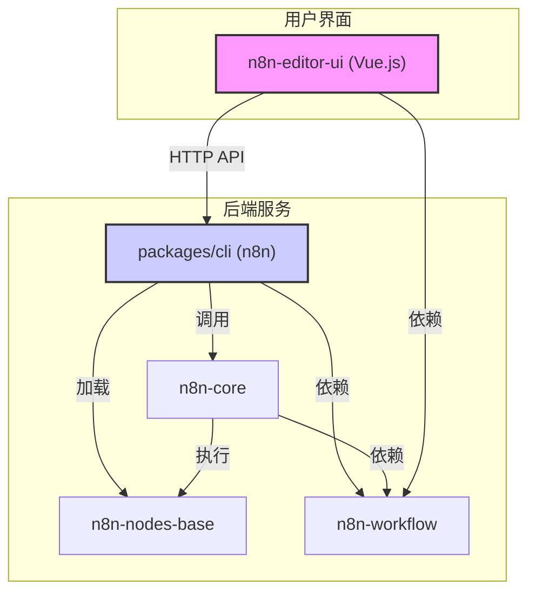

# 01 - 架构与模块（Packages）

本文档深入分析 n8n Monorepo 的结构，详细介绍 `packages` 目录下每一个核心模块的职责、关键技术以及它们之间的相互关系。

n8n 采用典型的 Monorepo 架构，通过 `pnpm-workspace.yaml` 进行管理，将复杂的系统拆分为多个高内聚、低耦合的独立模块（Package）。这种结构使得代码更易于维护、复用和独立开发。

## 核心模块分析

以下是 n8n 最关键的几个模块的详细分析：

---

### 1. `packages/cli` (`n8n`)

- **角色**: **应用启动器与组装者 (Application Bootstrapper & Assembler)**
- **简介**: 这是整个 n8n 应用的最终入口。它被打包成 `n8n` 这个可执行的命令行工具。它的核心职责是“组装”所有其他模块（后端、核心、节点、前端），并将它们作为一个统一的应用程序启动。
- **关键职责**: 
    - **启动 Web 服务器**: 内置 `express`，负责启动一个 Web 服务器，用于接收 API 请求（如 Webhook 触发器）和托管前端静态资源。
    - **提供前端界面**: 它会将 `n8n-editor-ui` 构建好的前端应用作为静态文件提供服务，让用户可以通过浏览器访问工作流编辑器。
    - **解析命令行**: 使用 `yargs-parser` 等工具解析命令行参数，实现 `n8n start`、`n8n worker`、`n8n webhook` 等不同的启动模式。
    - **数据库集成**: 包含了 `sqlite3`, `pg`, `mysql2` 等数据库驱动，负责初始化和管理数据库连接，为整个应用提供数据持久化能力。
    - **整合所有模块**: 从其 `dependencies` 可以看出，它几乎依赖了所有其他的核心模块，如 `n8n-core`, `n8n-workflow`, `n8n-nodes-base`，将它们的功能整合在一起。

---

### 2. `packages/core` (`n8n-core`)

- **角色**: **工作流执行引擎 (Workflow Execution Engine)**
- **简介**: `n8n-core` 是 n8n 的“心脏”。它包含了执行工作流所需的所有核心后端逻辑，但本身不关心具体节点的实现细节，也不涉及任何前端界面。
- **关键职责**: 
    - **执行调度**: 接收一个工作流的定义（来自 `n8n-workflow`），然后负责解析、调度并按顺序执行其中的每一个节点。
    - **HTTP 通信**: 内置 `axios` 等 HTTP 客户端，负责代表节点向外部 API 发送请求并处理响应。
    - **数据处理**: 提供处理不同数据格式（如 XML, 二进制文件）和编码的底层能力。
    - **日志与监控**: 集成了 `winston` 和 `sentry`，负责记录详细的工作流执行日志和上报系统错误。
    - **触发器逻辑**: 包含了 `cron` 依赖，用于实现定时任务（Schedule Trigger）等内置的触发器。
    - **纯粹的库**: 它没有 Web 服务器依赖，是一个纯粹的逻辑库，被 `packages/cli` 调用。

---

### 3. `packages/workflow` (`n8n-workflow`)

- **角色**: **数据模型层 (Data Model Layer)**
- **简介**: 这是一个非常轻量且专注的模块。它不处理执行，也不关心UI，其唯一职责就是**定义“什么是工作流”**。
- **关键职责**: 
    - **类型定义**: 提供了构成一个工作流的所有核心元素的 TypeScript 类型和类，如 `Workflow`, `Node`, `Connection`, `Credentials` 等。这为整个项目提供了一个统一且强类型的数据结构蓝图。
    - **数据操作工具**: 提供了大量用于在工作流内部进行数据操作和转换的底层工具函数。例如，当用户在节点中使用表达式（Expressions）来提取或转换数据时，实际调用的就是这个包里的代码。
    - **代码解析**: 依赖 `esprima-next` 和 `recast`，具备解析和转换 JavaScript 代码的能力，用于处理节点中的自定义代码片段或复杂表达式。

---

### 4. `packages/nodes-base` (`n8n-nodes-base`)

- **角色**: **功能库 (Functionality Library)**
- **简介**: 这是 n8n 生态系统的核心内容库，它定义了所有**内置的节点（Nodes）和凭证（Credentials）**。n8n 的强大功能很大程度上体现在此包提供的丰富集成上。
- **关键职责**: 
    - **节点实现**: `nodes/` 目录下包含了数百个节点的具体实现。每个节点都是一个独立的单元，封装了与特定第三方服务（如 AWS, Slack, Google Sheets）的交互逻辑。
    - **凭证实现**: `credentials/` 目录下包含了处理各种 API 认证（如 OAuth2, API Key）的逻辑。
    - **节点发现机制**: `package.json` 中有一个巨大的 `n8n` 字段，通过声明式地列出所有节点和凭证的文件路径，让 n8n 主程序可以在启动时自动发现并注册它们。
    - **丰富的外部依赖**: 为了和数百个不同的 API 通信，这个包引入了大量的第三方 SDK 和库。

---

### 5. `packages/frontend/editor-ui` (`n8n-editor-ui`)

- **角色**: **工作流编辑器 (Workflow Editor UI)**
- **简介**: 这是一个功能丰富的单页应用（SPA），是 n8n 的用户界面核心。用户在浏览器中看到和操作的一切都由它负责。
- **关键职责**: 
    - **技术栈**: 基于 **Vue.js 3** 和 **Vite** 构建，使用 **Pinia** 进行状态管理，并采用 **Element Plus** 作为 UI 组件库。
    - **可视化画布**: 使用 **`@vue-flow/core`** 库来构建核心的节点式拖拽画布，实现了节点的添加、删除、连接和布局等功能。
    - **内嵌代码编辑器**: 集成了 **CodeMirror**，为用户在编写表达式和自定义代码时提供了强大的编辑体验。
    - **API 通信**: 通过 `axios` 和自定义的 API Client 与后端服务（由 `packages/cli` 提供）进行通信，以加载、保存和执行工作流。
    - **共享数据模型**: 直接依赖 `n8n-workflow` 包，确保了前端渲染和操作的数据结构与后端完全一致。

## 模块关系图

