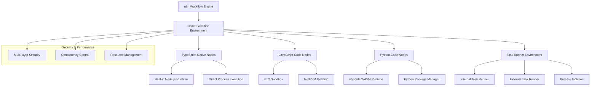
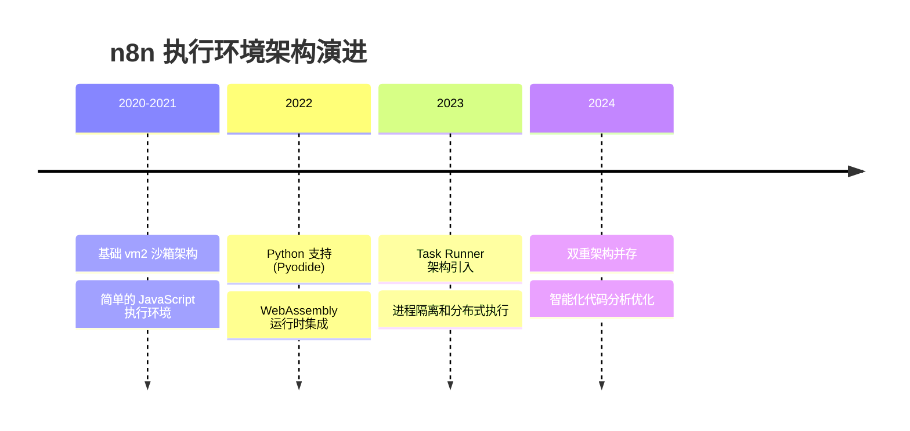
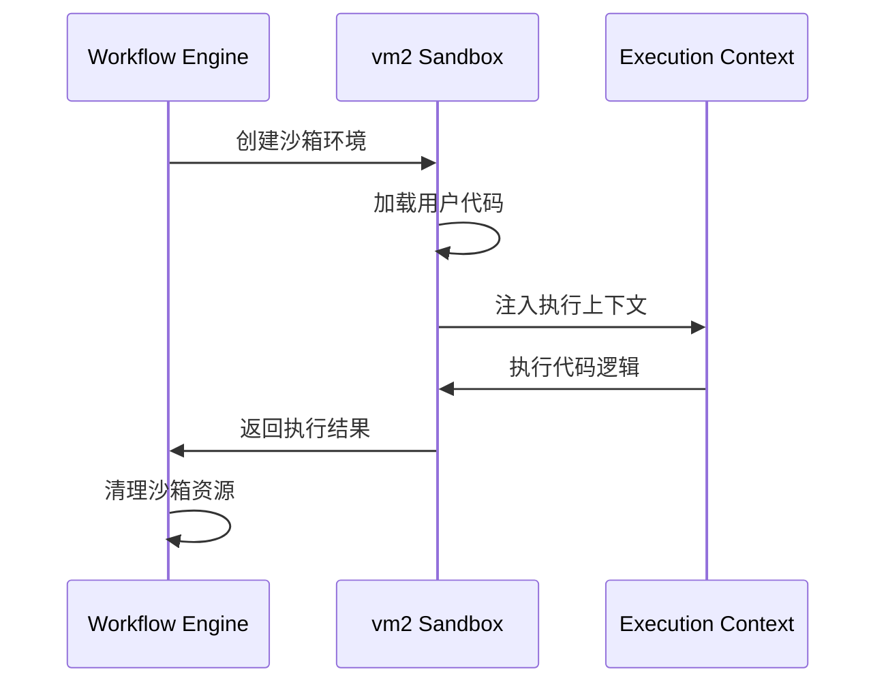
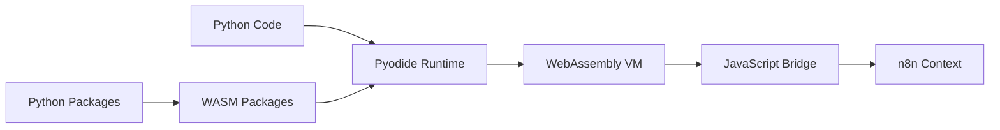
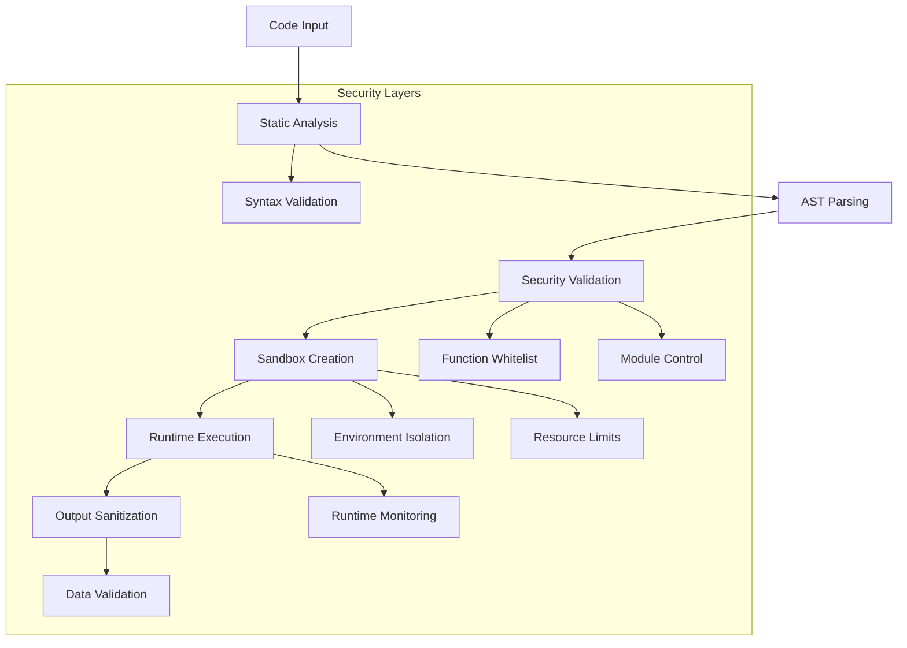
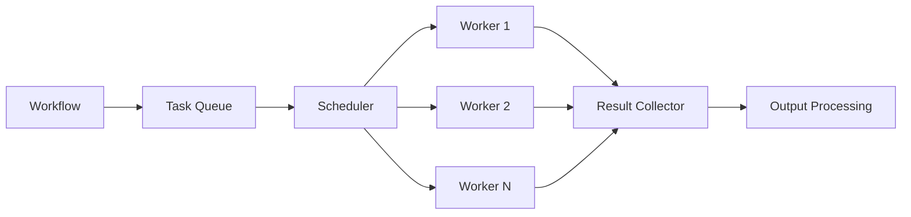
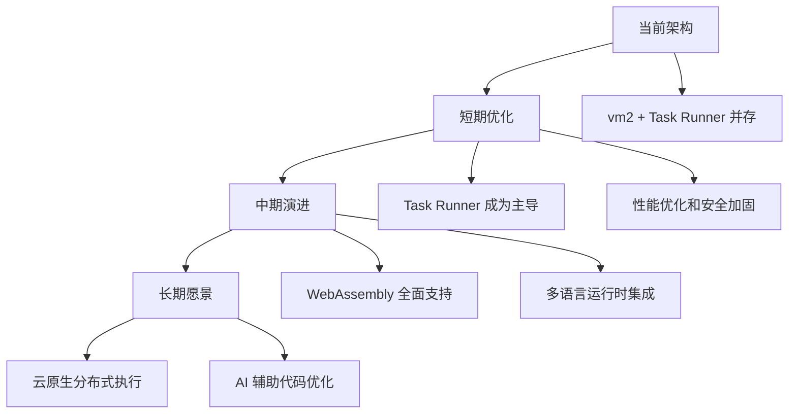

# 01 - n8n 执行环境架构概览

> **架构基础** - 全面理解 n8n 节点执行环境的技术架构和设计理念

本文档从宏观角度解析 n8n 的执行环境架构，为后续的深入技术分析奠定基础。

---

## 🏗️ 整体架构设计

### 核心架构图



### 架构演进历史



---

## 🔧 核心执行环境类型

### 1. TypeScript 内置节点环境

#### 🎯 **运行特性**
- **执行环境**: 直接在 Node.js 主进程中运行
- **安全级别**: 完全信任，无沙箱隔离
- **性能表现**: 最高性能，无额外开销
- **资源访问**: 完整的系统资源访问权限

#### 💻 **技术实现**
```typescript
// 内置节点的基本结构
export class HttpRequestNode implements INodeType {
  description: INodeTypeDescription = {
    displayName: 'HTTP Request',
    name: 'httpRequest',
    icon: 'fa:external-link-alt',
    group: ['input'],
    version: 1,
    // ... 其他配置
  };

  async execute(this: IExecuteFunctions): Promise<INodeExecutionData[][]> {
    // 直接在 Node.js 环境中执行
    const items = this.getInputData();
    // ... 业务逻辑
    return [items];
  }
}
```

#### 🔍 **适用场景**
- 高性能需求的核心功能
- 需要深度系统集成的节点
- 官方维护的标准节点

### 2. JavaScript Code 节点环境 (vm2 Sandbox)

#### 🛡️ **沙箱特性**
- **隔离机制**: vm2/NodeVM 沙箱隔离
- **安全级别**: 高安全级别，严格控制
- **模块访问**: 受限的模块导入能力
- **API 限制**: 预定义的安全 API 集合

#### 🔒 **安全机制**
```javascript
// vm2 沙箱配置示例
const vm = new NodeVM({
  console: 'redirect',
  sandbox: {
    $input: inputData,
    $node: nodeContext,
    // 预定义的安全对象
  },
  require: {
    external: allowedExternalModules,
    builtin: allowedBuiltinModules,
  },
  timeout: executionTimeout,
});
```

#### ⚡ **执行流程**


### 3. Python Code 节点环境 (Pyodide WASM)

#### 🌐 **WASM 运行时**
- **基础架构**: Pyodide WebAssembly 运行时
- **Python 版本**: Python 3.11+ (编译为 WASM)
- **包管理**: 内置包管理系统
- **性能特点**: 接近原生 Python 性能

#### 📦 **包生态支持**
```python
# Pyodide 环境中的包使用
import micropip
await micropip.install(['numpy', 'pandas', 'requests'])

import numpy as np
import pandas as pd

# 用户代码执行
def main(input_data):
    df = pd.DataFrame(input_data)
    result = df.describe()
    return result.to_dict()
```

#### 🔧 **技术架构**


### 4. Task Runner 执行环境

#### 🚀 **新一代架构**
- **设计理念**: 分布式任务执行
- **进程模型**: 独立进程隔离
- **性能优化**: 并发和资源优化
- **扩展性**: 水平扩展能力

#### 🏗️ **双模式架构**

##### **Internal Mode (内部模式)**
```typescript
// 内部模式配置
const internalRunner = {
  mode: 'internal',
  isolation: 'thread',
  security: 'enhanced',
  performance: 'optimized'
};
```

##### **External Mode (外部模式)**
```typescript
// 外部模式配置
const externalRunner = {
  mode: 'external', 
  isolation: 'process',
  security: 'maximum',
  scalability: 'horizontal'
};
```

#### 📊 **模式对比分析**

| 特性 | Internal Mode | External Mode |
|------|---------------|---------------|
| **隔离级别** | 线程级隔离 | 进程级隔离 |
| **安全性** | 高 ⭐⭐⭐⭐ | 极高 ⭐⭐⭐⭐⭐ |
| **性能开销** | 低 | 中等 |
| **扩展性** | 垂直扩展 | 水平扩展 |
| **适用场景** | 开发环境 | 生产环境 |

---

## 🔐 多层安全架构

### 安全防护层级



### 15+ 安全机制概览

| 安全机制 | 实现层面 | 防护对象 |
|----------|----------|----------|
| **AST 静态分析** | 编译时 | 恶意代码检测 |
| **函数调用白名单** | 运行时 | 危险函数调用 |
| **模块导入控制** | 加载时 | 未授权模块 |
| **原型链冻结** | 初始化 | 原型污染攻击 |
| **环境变量隔离** | 沙箱级 | 敏感信息泄露 |
| **资源使用限制** | 系统级 | 资源耗尽攻击 |
| **执行超时控制** | 运行时 | 无限循环攻击 |
| **内存使用监控** | 系统级 | 内存泄漏 |
| **网络访问控制** | 沙箱级 | 未授权网络访问 |
| **文件系统隔离** | 进程级 | 文件系统攻击 |

---

## ⚡ 性能优化机制

### 并发执行模型



### 智能化优化策略

#### 🧠 **AST 分析优化**
```typescript
// 静态代码分析优化数据传输
const astAnalysis = {
  requiredData: ['$input', '$node.parameter'],
  unusedData: ['$workflow', '$env'], 
  optimization: 'reduce_context_size'
};
```

#### 🔄 **缓存机制**
```javascript
// 多级缓存策略
const cachingLayers = {
  code_compilation: 'V8编译缓存',
  module_resolution: '模块解析缓存',
  execution_context: '上下文对象池',
  result_caching: '结果数据缓存'
};
```

#### 📊 **性能监控指标**
```typescript
interface PerformanceMetrics {
  executionTime: number;     // 执行时间
  memoryUsage: number;       // 内存使用
  cpuUtilization: number;    // CPU利用率
  concurrentTasks: number;   // 并发任务数
  errorRate: number;         // 错误率
  throughput: number;        // 吞吐量
}
```

---

## 🌟 技术创新亮点

### 1. 混合执行架构
- **传统模式**: vm2 沙箱的成熟稳定性
- **未来模式**: Task Runner 的先进性能
- **平滑迁移**: 两种模式并存，逐步迁移

### 2. 跨语言支持
- **JavaScript**: 原生支持，性能最优
- **Python**: WASM 运行时，功能完整
- **未来扩展**: 为其他语言留出技术空间

### 3. 智能化优化
- **静态分析**: AST 解析优化数据传输
- **动态调整**: 根据负载自动调整资源
- **预测性缓存**: 基于使用模式的缓存策略

### 4. 安全性创新
- **零信任架构**: 默认拒绝，白名单授权
- **深度防护**: 多层次、多维度安全策略
- **动态监控**: 运行时安全状态监控

---

## 🎯 架构选择指南

### 根据使用场景选择执行环境

#### 🏢 **企业级部署**
```yaml
recommended_setup:
  primary: "Task Runner External Mode"
  fallback: "vm2 Sandbox"
  security_level: "Maximum"
  performance_priority: "Stability"
```

#### 🚀 **高性能场景**
```yaml
recommended_setup:
  primary: "Task Runner Internal Mode"
  optimization: "Performance First"
  caching: "Aggressive"
  monitoring: "Real-time"
```

#### 🔬 **开发和测试**
```yaml
recommended_setup:
  primary: "vm2 Sandbox"
  debugging: "Enhanced"
  hot_reload: "Enabled"
  security_level: "Balanced"
```

### 技术栈兼容性矩阵

| 需求场景 | TypeScript | JavaScript | Python | 推荐架构 |
|----------|------------|------------|--------|----------|
| **高性能计算** | ⭐⭐⭐⭐⭐ | ⭐⭐⭐ | ⭐⭐⭐⭐ | Task Runner |
| **快速原型** | ⭐⭐⭐ | ⭐⭐⭐⭐⭐ | ⭐⭐⭐⭐ | Code 节点 |
| **数据科学** | ⭐⭐⭐ | ⭐⭐⭐ | ⭐⭐⭐⭐⭐ | Pyodide |
| **企业集成** | ⭐⭐⭐⭐⭐ | ⭐⭐⭐⭐ | ⭐⭐⭐ | 内置节点 |
| **安全敏感** | ⭐⭐⭐⭐ | ⭐⭐⭐⭐⭐ | ⭐⭐⭐⭐ | External Task Runner |

---

## 🔮 未来发展方向

### 技术演进路径



### 预期技术改进

#### **2025 年目标**
- Task Runner 架构全面优化
- WebAssembly 性能提升 50%+
- 安全机制进一步加固

#### **2026-2027 年愿景**  
- 支持 Rust/Go 等编译语言
- 分布式执行集群能力
- AI 驱动的性能自动调优

---

## 💡 关键技术洞察

### 架构设计哲学
1. **安全第一**: 多层防护，零信任模型
2. **性能优化**: 智能缓存，异步执行
3. **灵活扩展**: 模块化设计，插件架构
4. **用户友好**: 降低技术门槛，提升开发体验

### 技术权衡考虑
- **安全 vs 性能**: 在保证安全的前提下最大化性能
- **灵活性 vs 复杂度**: 平衡功能丰富性和使用复杂度
- **兼容性 vs 创新**: 保持向后兼容，同时引入新技术

### 竞争优势分析
- **多语言支持**: 领先的 JavaScript + Python 双语言架构
- **安全性**: 业界领先的多层安全防护体系
- **性能**: Task Runner 架构的分布式执行能力
- **开放性**: 开源架构，社区驱动创新

---

*本文档提供了 n8n 执行环境架构的全景视图，为深入理解后续技术文档奠定了基础。下一章将深入分析 JavaScript 执行机制的技术细节。*