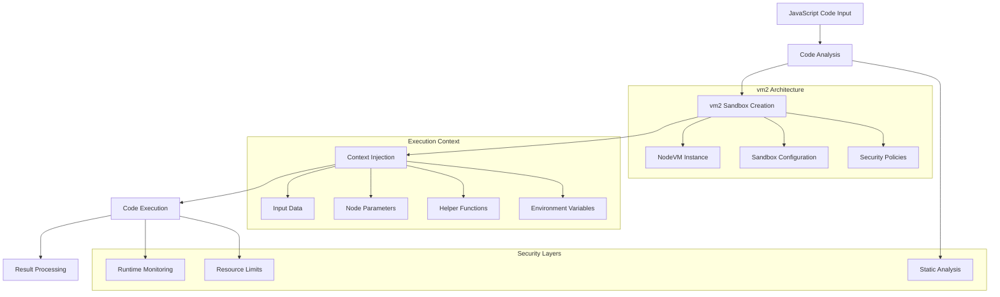
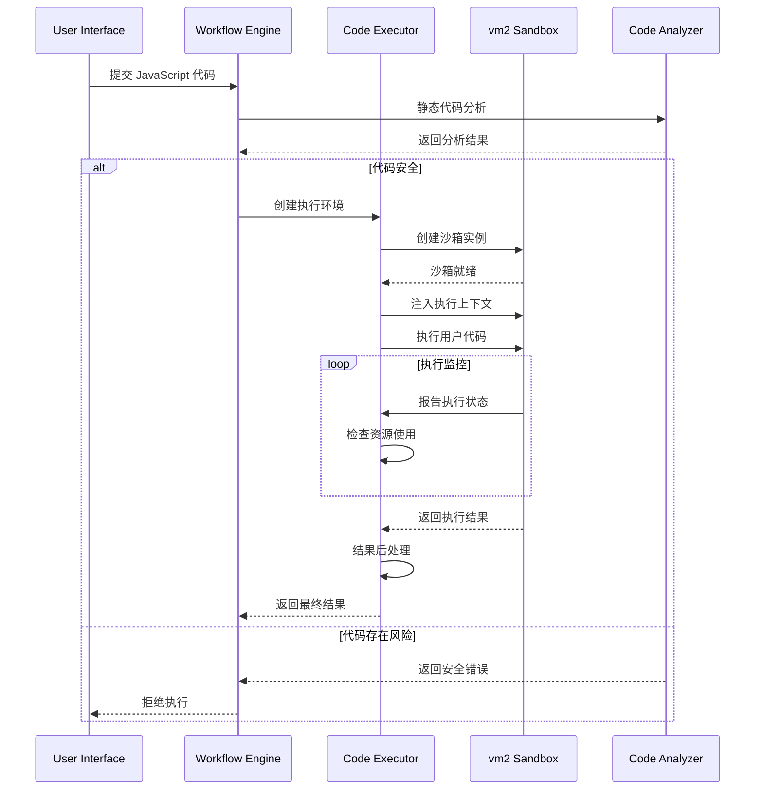

# 02 - JavaScript 执行机制深度分析

> **技术深度** - 解构 n8n JavaScript Code 节点的 vm2 沙箱机制和安全执行环境

本文档深入分析 n8n 中 JavaScript 代码的执行机制，包括 vm2 沙箱、安全策略、性能优化和开发实践。

---

## 🏗️ JavaScript 执行架构

### 核心技术栈



### 关键源码文件位置

```bash
# 核心 JavaScript 执行相关文件
packages/nodes-base/nodes/Code/
├── Code.node.ts                    # Code 节点主实现
├── JavaScriptSandbox.ts           # JavaScript 沙箱实现
├── ValidationUtils.ts             # 代码验证工具
└── test/Code.node.test.ts         # 单元测试

# Task Runner 相关
packages/@n8n/task-runner/
├── src/js-task-runner/            # JavaScript Task Runner
├── src/task-runner.ts             # 任务执行器
└── src/runner-types.ts            # 类型定义

# 核心执行引擎
packages/workflow/src/
├── NodeExecuteFunctions.ts        # 执行函数
├── WorkflowExecute.ts            # 工作流执行
└── interfaces.ts                 # 接口定义
```

---

## 🛡️ vm2 沙箱机制详解

### NodeVM 配置架构

```typescript
// 基于源码分析的 NodeVM 配置
class JavaScriptSandbox {
  private createVM(context: IExecuteContext): NodeVM {
    return new NodeVM({
      console: 'redirect',
      
      // 沙箱环境配置
      sandbox: this.buildSandboxContext(context),
      
      // 模块导入控制
      require: {
        external: this.getAllowedExternalModules(),
        builtin: this.getAllowedBuiltinModules(),
        root: './',
        mock: this.getMockModules(),
      },
      
      // 执行环境配置
      eval: false,              // 禁用 eval
      wasm: false,             // 禁用 WebAssembly
      fixAsync: true,          // 修复异步函数
      
      // 超时和资源限制
      timeout: this.getExecutionTimeout(),
      
      // 编译器设置
      compiler: 'javascript',
      strict: true,
      
      // 环境变量控制
      env: this.getFilteredEnvironment(),
    });
  }
}
```

### 沙箱上下文构建

```typescript
// 沙箱环境中可用的对象和函数
interface SandboxContext {
  // 核心数据对象
  $input: {
    all: () => INodeExecutionData[];
    first: () => INodeExecutionData | undefined;
    last: () => INodeExecutionData | undefined;
    item: INodeExecutionData;
  };
  
  // 节点相关信息
  $node: {
    id: string;
    name: string;
    type: string;
    typeVersion: number;
    position: [number, number];
    parameters: { [key: string]: any };
  };
  
  // 工作流信息
  $workflow: {
    id: string;
    name: string;
    active: boolean;
  };
  
  // 执行上下文
  $execution: {
    id: string;
    mode: 'manual' | 'trigger' | 'webhook';
    resumeUrl?: string;
  };
  
  // 辅助函数
  $jmespath: (data: any, expression: string) => any;
  $json: typeof JSON;
  $binary: IBinaryHelpers;
  $vars: { [key: string]: any };
  
  // 工具类
  $now: Date;
  $today: Date;
  $utils: IUtils;
  
  // 环境变量 (受控访问)
  $env: { [key: string]: string };
  
  // 异步工具
  $sleep: (ms: number) => Promise<void>;
  $request: IHttpRequestHelper;
}
```

---

## 🔒 安全机制深度分析

### 1. 静态代码分析 (AST 解析)

```typescript
// AST 静态分析实现
class CodeAnalyzer {
  public analyzeCode(code: string): CodeAnalysisResult {
    const ast = this.parseToAST(code);
    
    return {
      // 检测潜在安全风险
      securityIssues: this.detectSecurityIssues(ast),
      
      // 分析所需的上下文数据
      requiredContext: this.extractRequiredContext(ast),
      
      // 检测禁用函数调用
      bannedFunctions: this.detectBannedFunctions(ast),
      
      // 分析异步操作
      asyncOperations: this.analyzeAsyncPatterns(ast),
      
      // 性能优化建议
      optimizations: this.suggestOptimizations(ast),
    };
  }
  
  private detectSecurityIssues(ast: any): SecurityIssue[] {
    const issues: SecurityIssue[] = [];
    
    // 检测 eval 使用
    if (this.containsEval(ast)) {
      issues.push({
        type: 'DANGEROUS_EVAL',
        severity: 'HIGH',
        message: 'Code contains eval() which is prohibited'
      });
    }
    
    // 检测原型污染风险
    if (this.containsPrototypePollution(ast)) {
      issues.push({
        type: 'PROTOTYPE_POLLUTION',
        severity: 'MEDIUM', 
        message: 'Potential prototype pollution detected'
      });
    }
    
    return issues;
  }
}
```

### 2. 函数调用白名单机制

```typescript
// 基于源码的函数白名单配置
const ALLOWED_GLOBAL_FUNCTIONS = [
  // 基础 JavaScript 函数
  'Object', 'Array', 'String', 'Number', 'Boolean', 'Date', 'RegExp',
  'JSON', 'Math', 'parseInt', 'parseFloat', 'isNaN', 'isFinite',
  'encodeURI', 'decodeURI', 'encodeURIComponent', 'decodeURIComponent',
  
  // 异步和定时器 (受控)
  'Promise', 'setTimeout', 'clearTimeout', 'setInterval', 'clearInterval',
  
  // 错误处理
  'Error', 'TypeError', 'ReferenceError', 'SyntaxError',
  
  // 数据结构
  'Map', 'Set', 'WeakMap', 'WeakSet',
  
  // 现代 JavaScript 特性
  'Proxy', 'Reflect', 'Symbol',
] as const;

const BANNED_FUNCTIONS = [
  // 动态代码执行
  'eval', 'Function', 'GeneratorFunction', 'AsyncFunction',
  
  // 文件系统访问
  'require', 'import', '__dirname', '__filename',
  
  // 进程和系统
  'process', 'global', 'globalThis',
  
  // VM 和模块系统
  'module', 'exports', 'Buffer',
] as const;
```

### 3. 模块导入控制系统

```typescript
// 模块导入安全配置
interface ModuleSecurityConfig {
  // 允许的内置模块
  allowedBuiltins: readonly string[];
  
  // 允许的外部模块
  allowedExternals: readonly string[];
  
  // 模块别名映射
  moduleAliases: Record<string, string>;
  
  // Mock 模块替换
  mockModules: Record<string, any>;
}

const DEFAULT_MODULE_CONFIG: ModuleSecurityConfig = {
  allowedBuiltins: [
    'crypto',           // 加密功能
    'util',            // 实用工具
    'querystring',     // 查询字符串处理
    'url',             // URL 处理
    'path',            // 路径操作 (受限)
    'stream',          // 流处理
    'events',          // 事件处理
    'assert',          // 断言
    'zlib',            // 压缩
    'string_decoder',  // 字符串解码
  ],
  
  allowedExternals: [
    'lodash',          // 实用工具库
    'moment',          // 日期处理
    'axios',           // HTTP 请求
    'cheerio',         // HTML 解析
    'xml2js',          // XML 处理
    'csv-parser',      // CSV 处理
    'uuid',            // UUID 生成
    'validator',       // 数据验证
    'jsonwebtoken',    // JWT 处理
    'bcrypt',          // 密码加密
    'mime-types',      // MIME 类型
    'qs',              // 查询字符串
  ],
  
  moduleAliases: {
    'request': 'axios',  // 重定向到安全的替代品
  },
  
  mockModules: {
    'fs': {},           // 文件系统模块被 mock
    'child_process': {}, // 子进程模块被 mock
    'cluster': {},       // 集群模块被 mock
  },
};
```

### 4. 原型链冻结和污染防护

```typescript
// 原型链保护机制
class PrototypeProtection {
  public static freezePrototypes(): void {
    // 冻结核心原型链
    this.freezeObjectPrototype();
    this.freezeArrayPrototype();
    this.freezeFunctionPrototype();
    this.freezeStringPrototype();
    this.freezeNumberPrototype();
  }
  
  private static freezeObjectPrototype(): void {
    // 冻结 Object.prototype
    Object.freeze(Object.prototype);
    
    // 防止 constructor 污染
    Object.defineProperty(Object.prototype, 'constructor', {
      writable: false,
      configurable: false,
    });
    
    // 阻止原型链修改
    Object.preventExtensions(Object.prototype);
  }
  
  private static detectPrototypePollution(obj: any): boolean {
    const dangerousKeys = ['__proto__', 'prototype', 'constructor'];
    
    function traverse(current: any, depth: number = 0): boolean {
      if (depth > 10 || current === null || typeof current !== 'object') {
        return false;
      }
      
      for (const key of dangerousKeys) {
        if (key in current) {
          return true;
        }
      }
      
      for (const value of Object.values(current)) {
        if (traverse(value, depth + 1)) {
          return true;
        }
      }
      
      return false;
    }
    
    return traverse(obj);
  }
}
```

---

## ⚡ 性能优化机制

### 1. 代码编译和缓存

```typescript
// 代码编译缓存系统
class CodeCompilationCache {
  private cache = new Map<string, CompiledCode>();
  private maxCacheSize = 1000;
  
  public compileCode(code: string, context: ExecutionContext): CompiledCode {
    const cacheKey = this.generateCacheKey(code, context);
    
    // 检查缓存
    if (this.cache.has(cacheKey)) {
      return this.cache.get(cacheKey)!;
    }
    
    // 编译代码
    const compiled = this.performCompilation(code, context);
    
    // 存储到缓存
    this.cache.set(cacheKey, compiled);
    
    // 清理过期缓存
    this.cleanupCache();
    
    return compiled;
  }
  
  private performCompilation(code: string, context: ExecutionContext): CompiledCode {
    // 1. AST 解析和优化
    const ast = this.parseAndOptimize(code);
    
    // 2. 上下文数据分析
    const contextAnalysis = this.analyzeContextUsage(ast);
    
    // 3. 生成优化的执行函数
    const executor = this.generateExecutor(ast, contextAnalysis);
    
    return {
      executor,
      contextRequirements: contextAnalysis.required,
      metadata: {
        compiledAt: Date.now(),
        codeHash: this.hashCode(code),
      },
    };
  }
}
```

### 2. 异步执行优化

```typescript
// 异步执行性能优化
class AsyncExecutionOptimizer {
  public async optimizeExecution(
    code: string,
    context: ExecutionContext
  ): Promise<any> {
    // 分析异步模式
    const asyncAnalysis = this.analyzeAsyncPatterns(code);
    
    if (asyncAnalysis.hasParallelizable) {
      return this.executeWithParallelization(code, context, asyncAnalysis);
    }
    
    if (asyncAnalysis.hasStreamable) {
      return this.executeWithStreaming(code, context, asyncAnalysis);
    }
    
    return this.executeSequential(code, context);
  }
  
  private async executeWithParallelization(
    code: string,
    context: ExecutionContext,
    analysis: AsyncAnalysis
  ): Promise<any> {
    const chunks = this.createExecutionChunks(code, analysis);
    
    // 并发执行多个代码块
    const results = await Promise.all(
      chunks.map(chunk => this.executeChunk(chunk, context))
    );
    
    return this.mergeResults(results);
  }
}
```

### 3. 内存管理和垃圾回收

```typescript
// 内存管理优化
class MemoryManager {
  private activeVMs = new WeakMap<NodeVM, VMMetadata>();
  private vmPool = new ObjectPool<NodeVM>();
  
  public getOptimizedVM(requirements: VMRequirements): NodeVM {
    // 尝试从对象池获取
    let vm = this.vmPool.acquire();
    
    if (!vm || !this.isVMCompatible(vm, requirements)) {
      vm = this.createOptimizedVM(requirements);
    }
    
    // 配置 VM 的内存限制
    this.configureMemoryLimits(vm, requirements);
    
    return vm;
  }
  
  public releaseVM(vm: NodeVM): void {
    // 清理 VM 状态
    this.cleanupVMState(vm);
    
    // 强制垃圾回收
    if (this.shouldForceGC(vm)) {
      this.forceGarbageCollection(vm);
    }
    
    // 返回对象池
    this.vmPool.release(vm);
  }
  
  private configureMemoryLimits(vm: NodeVM, requirements: VMRequirements): void {
    const memoryLimit = this.calculateMemoryLimit(requirements);
    
    // 设置 V8 内存限制
    vm.setMaxHeapSize(memoryLimit.heap);
    vm.setMaxOldSpaceSize(memoryLimit.oldSpace);
    
    // 配置垃圾回收策略
    vm.configureGC({
      incremental: true,
      concurrent: true,
      maxPauseTime: 10, // 最大暂停时间 10ms
    });
  }
}
```

---

## 🔧 执行流程详解

### 完整执行时序



### 错误处理机制

```typescript
// 全面的错误处理系统
class CodeExecutionErrorHandler {
  public handleExecutionError(error: any, context: ExecutionContext): ExecutionError {
    // 1. 错误分类
    const errorType = this.classifyError(error);
    
    // 2. 安全性检查
    if (this.isSecurityRelated(error)) {
      return this.handleSecurityError(error, context);
    }
    
    // 3. 语法错误处理
    if (errorType === 'SYNTAX_ERROR') {
      return this.handleSyntaxError(error, context);
    }
    
    // 4. 运行时错误处理
    if (errorType === 'RUNTIME_ERROR') {
      return this.handleRuntimeError(error, context);
    }
    
    // 5. 超时错误处理
    if (errorType === 'TIMEOUT_ERROR') {
      return this.handleTimeoutError(error, context);
    }
    
    // 6. 内存错误处理
    if (errorType === 'MEMORY_ERROR') {
      return this.handleMemoryError(error, context);
    }
    
    return this.handleGenericError(error, context);
  }
  
  private handleSecurityError(error: any, context: ExecutionContext): ExecutionError {
    // 记录安全事件
    this.logSecurityIncident(error, context);
    
    // 清理可能的恶意状态
    this.cleanupSecurityBreach(context);
    
    return {
      type: 'SECURITY_ERROR',
      message: 'Code execution blocked due to security policy violation',
      code: 'SECURITY_VIOLATION',
      details: this.sanitizeErrorDetails(error),
      timestamp: new Date(),
      context: this.sanitizeContext(context),
    };
  }
}
```

---

## 🛠️ 开发和调试工具

### 1. 代码验证工具

```typescript
// 开发时代码验证助手
class CodeValidationHelper {
  public validateCode(code: string): ValidationResult {
    const issues: ValidationIssue[] = [];
    
    // 语法检查
    const syntaxCheck = this.checkSyntax(code);
    if (!syntaxCheck.valid) {
      issues.push(...syntaxCheck.issues);
    }
    
    // 安全性检查
    const securityCheck = this.checkSecurity(code);
    if (!securityCheck.valid) {
      issues.push(...securityCheck.issues);
    }
    
    // 性能检查
    const performanceCheck = this.checkPerformance(code);
    if (performanceCheck.hasIssues) {
      issues.push(...performanceCheck.issues);
    }
    
    // 最佳实践检查
    const bestPracticesCheck = this.checkBestPractices(code);
    issues.push(...bestPracticesCheck.suggestions);
    
    return {
      valid: issues.filter(i => i.severity === 'ERROR').length === 0,
      issues,
      suggestions: this.generateSuggestions(code, issues),
    };
  }
}
```

### 2. 调试和性能分析

```typescript
// 调试和分析工具
class CodeDebugger {
  public createDebugSession(code: string): DebugSession {
    return {
      // 断点管理
      breakpoints: new BreakpointManager(),
      
      // 变量监视
      watchExpressions: new WatchManager(),
      
      // 执行跟踪
      executionTracer: new ExecutionTracer(),
      
      // 性能分析
      profiler: new PerformanceProfiler(),
      
      // 步进执行
      stepper: new StepExecutor(),
    };
  }
  
  public profileExecution(code: string, context: ExecutionContext): ProfileResult {
    const profiler = new PerformanceProfiler();
    
    profiler.start();
    
    try {
      const result = this.executeCode(code, context);
      
      return {
        result,
        performance: profiler.getResults(),
        memoryUsage: profiler.getMemoryStats(),
        timing: profiler.getTimingData(),
        recommendations: profiler.getOptimizationSuggestions(),
      };
    } finally {
      profiler.stop();
    }
  }
}
```

---

## 🎯 最佳实践指南

### 1. 代码编写建议

```javascript
// ✅ 推荐的代码模式
function processData() {
  // 使用 const/let 而不是 var
  const inputData = $input.all();
  let processedResults = [];
  
  // 使用现代 JavaScript 特性
  for (const item of inputData) {
    if (!item.json) continue;
    
    const processed = {
      id: item.json.id,
      // 使用可选链
      name: item.json.user?.name || 'Unknown',
      // 使用模板字符串
      displayName: `User: ${item.json.user?.name || 'Anonymous'}`,
      // 使用解构赋值
      ...item.json.additionalData,
    };
    
    processedResults.push(processed);
  }
  
  return processedResults;
}

// 异步操作的正确方式
async function fetchExternalData() {
  try {
    const response = await $request.get('https://api.example.com/data');
    return response.data;
  } catch (error) {
    // 适当的错误处理
    console.error('Failed to fetch data:', error.message);
    return null;
  }
}

// ❌ 避免的代码模式
function badPractices() {
  // 避免使用 eval
  // eval('dangerous code'); // 🚫 被禁用
  
  // 避免全局污染
  // global.myVariable = 'value'; // 🚫 无法访问 global
  
  // 避免原型污染
  // Object.prototype.pollute = 'bad'; // 🚫 原型被冻结
  
  // 避免直接访问文件系统
  // require('fs').readFileSync('file'); // 🚫 模块被限制
}
```

### 2. 性能优化技巧

```javascript
// 性能优化的最佳实践
function optimizedDataProcessing() {
  const data = $input.all();
  
  // 1. 批量处理而不是逐个处理
  const batchSize = 100;
  const results = [];
  
  for (let i = 0; i < data.length; i += batchSize) {
    const batch = data.slice(i, i + batchSize);
    const batchResults = processBatch(batch);
    results.push(...batchResults);
  }
  
  return results;
}

function processBatch(batch) {
  // 2. 使用 Map 而不是数组查找
  const lookupMap = new Map();
  
  // 3. 预编译正则表达式
  const emailRegex = /^[^\s@]+@[^\s@]+\.[^\s@]+$/;
  
  return batch.map(item => {
    // 4. 缓存计算结果
    if (!lookupMap.has(item.id)) {
      lookupMap.set(item.id, calculateExpensiveValue(item));
    }
    
    return {
      ...item,
      isValidEmail: emailRegex.test(item.email),
      calculatedValue: lookupMap.get(item.id),
    };
  });
}

// 内存友好的流式处理
async function streamProcessing() {
  const data = $input.all();
  const results = [];
  
  // 使用异步迭代器处理大量数据
  for await (const chunk of processInChunks(data)) {
    results.push(chunk);
    
    // 定期清理内存
    if (results.length % 1000 === 0) {
      // 强制垃圾回收提示
      if (global.gc) {
        global.gc();
      }
    }
  }
  
  return results;
}
```

### 3. 安全编程规范

```javascript
// 安全编程的最佳实践
function secureDataHandling() {
  const userData = $input.all();
  
  // 1. 输入验证和清理
  function validateAndSanitize(input) {
    if (!input || typeof input !== 'object') {
      throw new Error('Invalid input data');
    }
    
    // 深度清理对象，防止原型污染
    return JSON.parse(JSON.stringify(input));
  }
  
  // 2. 安全的数据访问
  function safeGet(obj, path, defaultValue = null) {
    return path.split('.').reduce((current, key) => {
      return (current && current[key] !== undefined) ? current[key] : defaultValue;
    }, obj);
  }
  
  // 3. 敏感信息处理
  function sanitizeSensitiveData(data) {
    const sensitive = ['password', 'token', 'secret', 'key'];
    const cleaned = { ...data };
    
    sensitive.forEach(field => {
      if (cleaned[field]) {
        cleaned[field] = '[REDACTED]';
      }
    });
    
    return cleaned;
  }
  
  return userData.map(item => {
    const validated = validateAndSanitize(item.json);
    const safe = sanitizeSensitiveData(validated);
    
    return {
      id: safeGet(safe, 'id'),
      name: safeGet(safe, 'user.name', 'Anonymous'),
      email: safeGet(safe, 'contact.email'),
      // 其他安全处理...
    };
  });
}
```

---

## 📊 性能监控和分析

### 关键指标监控

```typescript
// 性能监控指标
interface JavaScriptExecutionMetrics {
  // 执行时间指标
  executionTime: {
    compilation: number;    // 代码编译时间
    execution: number;      // 实际执行时间
    total: number;         // 总时间
  };
  
  // 内存使用指标
  memoryUsage: {
    heapUsed: number;      // 堆内存使用
    heapTotal: number;     // 堆内存总量
    external: number;      // 外部内存
    arrayBuffers: number;  // ArrayBuffer 内存
  };
  
  // 安全指标
  securityEvents: {
    blockedCalls: number;   // 被阻止的函数调用
    violations: string[];   // 安全策略违规
    warnings: string[];     // 安全警告
  };
  
  // 资源使用指标
  resourceUsage: {
    cpuTime: number;       // CPU 时间
    asyncOperations: number; // 异步操作数量
    moduleLoads: number;   // 模块加载次数
  };
}
```

---

## 💡 总结和关键洞察

### JavaScript 执行环境优势
1. **成熟的沙箱技术**: vm2 提供了稳定可靠的隔离环境
2. **灵活的模块系统**: 支持精确控制的第三方库集成
3. **强大的安全防护**: 多层次的安全机制确保代码执行安全
4. **优秀的性能**: 编译缓存和优化策略提供良好的性能表现

### 技术限制和权衡
1. **功能限制**: 某些 Node.js 特性被限制以确保安全性
2. **性能开销**: 沙箱机制带来一定的性能开销
3. **内存使用**: 每个代码执行都需要独立的 VM 实例

### 未来发展方向
1. **Task Runner 迁移**: 逐步迁移到新的 Task Runner 架构
2. **性能优化**: 持续优化编译和执行性能
3. **安全增强**: 进一步加固安全防护机制
4. **开发体验**: 提升代码编辑和调试体验

---

*本文档提供了 n8n JavaScript 执行环境的完整技术解析，为开发者理解和使用 Code 节点提供了全面的技术参考。*