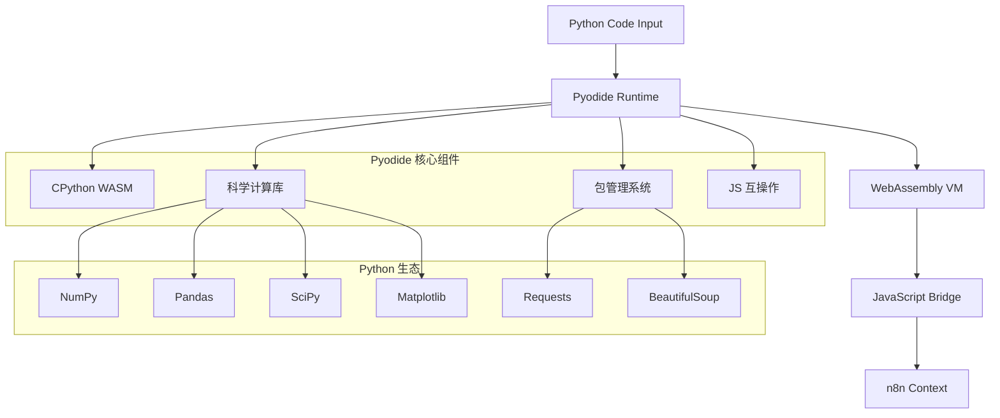

# 03 - Python Pyodide 执行环境分析

> **技术创新** - 深入解析 n8n 中基于 WebAssembly 的 Python 执行环境及其技术实现

本文档全面分析 n8n 如何通过 Pyodide 实现在浏览器和 Node.js 环境中运行 Python 代码，这是工作流自动化领域的重要技术创新。

---

## 🌐 Pyodide 技术架构

### 整体架构设计



### 核心技术组件

```typescript
// Pyodide 执行环境接口
interface PyodideEnvironment {
    // Python 解释器实例
    pythonInterpreter: PyodideInterface;
    
    // 包管理器
    packageManager: MicropipManager;
    
    // JavaScript 桥接
    jsBridge: JavaScriptBridge;
    
    // 内存管理
    memoryManager: WASMMemoryManager;
    
    // 异常处理
    exceptionHandler: PythonExceptionHandler;
}

// Pyodide 配置
interface PyodideConfig {
    // 运行时配置
    runtime: {
        indexURL: string;           // Pyodide CDN 地址
        fullStdLib: boolean;        // 是否加载完整标准库
        homedir: string;           // 虚拟主目录
    };
    
    // 包管理配置
    packages: {
        allowAllPackages: boolean;  // 是否允许安装任意包
        whitelist: string[];       // 包白名单
        preloadPackages: string[]; // 预加载包列表
    };
    
    // 安全配置
    security: {
        allowNetwork: boolean;     // 网络访问权限
        allowFileSystem: boolean;  // 文件系统访问
        memoryLimit: number;      // 内存限制(MB)
        executionTimeout: number; // 执行超时(ms)
    };
}
```

---

## 🏗️ WebAssembly 运行时机制

### WASM 模块加载和初始化

```javascript
// Pyodide 初始化流程
class PyodideInitializer {
  private static instance: PyodideInterface | null = null;
  private static initPromise: Promise<PyodideInterface> | null = null;
  
  public static async initialize(): Promise<PyodideInterface> {
    if (this.instance) {
      return this.instance;
    }
    
    if (this.initPromise) {
      return this.initPromise;
    }
    
    this.initPromise = this.performInitialization();
    this.instance = await this.initPromise;
    
    return this.instance;
  }
  
  private static async performInitialization(): Promise<PyodideInterface> {
    console.log('Initializing Pyodide...');
    
    // 1. 加载 Pyodide WASM 模块
    const pyodide = await loadPyodide({
      indexURL: 'https://cdn.jsdelivr.net/pyodide/',
      fullStdLib: false, // 按需加载以提高性能
      homedir: '/home/n8n',
    });
    
    // 2. 设置 Python 环境
    await this.setupPythonEnvironment(pyodide);
    
    // 3. 安装核心包
    await this.installCorePackages(pyodide);
    
    // 4. 配置安全策略
    await this.configureSecurity(pyodide);
    
    console.log('Pyodide initialized successfully');
    return pyodide;
  }
  
  private static async setupPythonEnvironment(pyodide: PyodideInterface): Promise<void> {
    // 设置 Python 路径和环境变量
    pyodide.runPython(`
import sys
import os

# 设置虚拟环境路径
sys.path.insert(0, '/home/n8n')

# 配置环境变量
os.environ['N8N_PYTHON_ENV'] = 'pyodide'
os.environ['PYTHONPATH'] = '/home/n8n'

# 导入常用模块
import json
import re
import datetime
from typing import Dict, List, Any, Optional

print("Python environment configured")
    `);
  }
  
  private static async installCorePackages(pyodide: PyodideInterface): Promise<void> {
    const corePackages = [
      'micropip',     // 包管理器
      'numpy',        // 数值计算
      'pandas',       // 数据处理
      'requests',     // HTTP 请求
      'beautifulsoup4', // HTML 解析
      'python-dateutil', // 日期处理
      'pytz',         // 时区处理
    ];
    
    try {
      // 使用 micropip 安装包
      await pyodide.loadPackage('micropip');
      
      const micropip = pyodide.pyimport('micropip');
      
      for (const package_name of corePackages.slice(1)) { // 跳过 micropip
        console.log(`Installing ${package_name}...`);
        await micropip.install(package_name);
      }
      
      console.log('Core packages installed successfully');
    } catch (error) {
      console.error('Error installing core packages:', error);
      throw error;
    }
  }
  
  private static async configureSecurity(pyodide: PyodideInterface): Promise<void> {
    // 配置安全限制
    pyodide.runPython(`
import sys
import builtins

# 限制危险的内置函数
restricted_builtins = ['exec', 'eval', 'compile', '__import__']

original_builtins = {}
for name in restricted_builtins:
    if hasattr(builtins, name):
        original_builtins[name] = getattr(builtins, name)
        setattr(builtins, name, lambda *args, **kwargs: 
               exec("raise SecurityError(f'Function {name} is restricted in n8n Python environment')"))

# 设置内存限制监控
import resource
try:
    # 设置内存限制 (如果支持)
    resource.setrlimit(resource.RLIMIT_AS, (512 * 1024 * 1024, -1))  # 512MB
except:
    pass  # WASM 环境可能不支持 resource 限制

print("Security configuration applied")
    `);
  }
}
```

### 内存管理机制

```typescript
// WebAssembly 内存管理
class WASMMemoryManager {
  private memoryStats: MemoryStats = {
    heapSize: 0,
    heapUsed: 0,
    lastGC: 0,
    gcCount: 0,
  };
  
  private memoryLimit = 512 * 1024 * 1024; // 512MB 限制
  private gcThreshold = 0.8; // 80% 内存使用时触发 GC
  
  public monitorMemoryUsage(pyodide: PyodideInterface): void {
    setInterval(() => {
      this.updateMemoryStats(pyodide);
      this.checkMemoryPressure(pyodide);
    }, 5000); // 每5秒检查一次
  }
  
  private updateMemoryStats(pyodide: PyodideInterface): void {
    try {
      // 获取 WASM 内存统计
      const memory = (pyodide as any)._module.HEAP8.buffer;
      this.memoryStats.heapSize = memory.byteLength;
      
      // 通过 Python 获取更详细的内存信息
      const memInfo = pyodide.runPython(`
import sys
import gc

# 获取对象统计
gc.collect()  # 强制垃圾回收
obj_count = len(gc.get_objects())

# 获取内存使用情况
memory_info = {
    'objects': obj_count,
    'gc_count': sum(gc.get_count()),
    'heap_size': sys.getsizeof('') * obj_count  # 估算
}

memory_info
      `);
      
      const stats = memInfo.toJs();
      this.memoryStats.heapUsed = stats.heap_size;
      this.memoryStats.gcCount = stats.gc_count;
      
    } catch (error) {
      console.warn('Failed to update memory stats:', error);
    }
  }
  
  private checkMemoryPressure(pyodide: PyodideInterface): void {
    const memoryUsageRatio = this.memoryStats.heapUsed / this.memoryLimit;
    
    if (memoryUsageRatio > this.gcThreshold) {
      console.warn(`High memory usage detected: ${(memoryUsageRatio * 100).toFixed(2)}%`);
      this.forceGarbageCollection(pyodide);
    }
    
    if (memoryUsageRatio > 0.95) {
      console.error('Critical memory usage, execution may be terminated');
      throw new Error('Memory limit exceeded');
    }
  }
  
  private forceGarbageCollection(pyodide: PyodideInterface): void {
    try {
      // Python 垃圾回收
      pyodide.runPython(`
import gc
import sys

# 强制垃圾回收
collected = gc.collect()
print(f"Garbage collection freed {collected} objects")

# 清理大对象
for obj in gc.get_objects():
    if hasattr(obj, '__dict__') and sys.getsizeof(obj) > 1024 * 1024:  # > 1MB
        # 大对象清理逻辑
        pass
      `);
      
      this.memoryStats.lastGC = Date.now();
      
    } catch (error) {
      console.error('Failed to perform garbage collection:', error);
    }
  }
}

interface MemoryStats {
  heapSize: number;
  heapUsed: number;
  lastGC: number;
  gcCount: number;
}
```

---

## 📦 包管理系统深度分析

### Micropip 包管理器

```python
# Micropip 包管理器的高级封装
import asyncio
import sys
from typing import List, Dict, Any, Optional
import micropip

class N8nPackageManager:
    """n8n 专用的 Python 包管理器"""
    
    def __init__(self):
        self.installed_packages = set()
        self.package_versions = {}
        self.installation_cache = {}
        
        # 包白名单 - 只允许安装这些包
        self.allowed_packages = {
            # 数据科学和分析
            'numpy', 'pandas', 'scipy', 'matplotlib', 'seaborn',
            'scikit-learn', 'statsmodels', 'plotly',
            
            # Web 和网络
            'requests', 'urllib3', 'aiohttp', 'httpx',
            'beautifulsoup4', 'lxml', 'selenium',
            
            # 数据格式处理
            'openpyxl', 'xlsxwriter', 'pyyaml', 'toml',
            'python-dateutil', 'pytz', 'arrow',
            
            # 文本和内容处理
            'nltk', 'textblob', 'regex', 'markdown',
            
            # 加密和安全
            'cryptography', 'bcrypt', 'pyjwt', 'passlib',
            
            # 图像处理
            'pillow', 'imageio',
            
            # 数据库连接（安全的）
            'pymongo', 'redis', 'elasticsearch',
            
            # 实用工具
            'tqdm', 'click', 'colorama', 'python-dotenv',
        }
        
        # 危险包黑名单
        self.blocked_packages = {
            'subprocess', 'os', 'sys', 'importlib',
            'exec', 'eval', 'compile',
            'socket', 'threading', 'multiprocessing',
        }
    
    async def install_package(self, package_name: str, version: str = None) -> Dict[str, Any]:
        """安全地安装 Python 包"""
        try:
            # 1. 安全检查
            if not self.is_package_allowed(package_name):
                return {
                    'success': False,
                    'error': f'Package "{package_name}" is not in the allowed list',
                    'allowed_packages': list(self.allowed_packages)
                }
            
            # 2. 检查缓存
            cache_key = f"{package_name}:{version}" if version else package_name
            if cache_key in self.installation_cache:
                return self.installation_cache[cache_key]
            
            # 3. 构建包规范
            package_spec = f"{package_name}=={version}" if version else package_name
            
            # 4. 执行安装
            print(f"Installing {package_spec}...")
            await micropip.install(package_spec, keep_going=True)
            
            # 5. 验证安装
            installed_version = await self.get_package_version(package_name)
            
            result = {
                'success': True,
                'package': package_name,
                'version': installed_version,
                'installation_time': self.get_current_time()
            }
            
            # 6. 更新状态
            self.installed_packages.add(package_name)
            self.package_versions[package_name] = installed_version
            self.installation_cache[cache_key] = result
            
            return result
            
        except Exception as e:
            error_result = {
                'success': False,
                'package': package_name,
                'error': str(e),
                'error_type': type(e).__name__
            }
            
            self.installation_cache[cache_key] = error_result
            return error_result
    
    async def install_multiple_packages(self, packages: List[str]) -> Dict[str, Any]:
        """批量安装包"""
        results = {}
        
        for package in packages:
            if ':' in package:
                name, version = package.split(':', 1)
                result = await self.install_package(name, version)
            else:
                result = await self.install_package(package)
            
            results[package] = result
        
        return {
            'overall_success': all(r.get('success', False) for r in results.values()),
            'results': results,
            'summary': self.get_installation_summary(results)
        }
    
    def is_package_allowed(self, package_name: str) -> bool:
        """检查包是否在允许列表中"""
        # 移除版本号和额外规范
        clean_name = package_name.split('==')[0].split('>=')[0].split('<=')[0].strip()
        
        if clean_name in self.blocked_packages:
            return False
        
        return clean_name in self.allowed_packages
    
    async def get_package_version(self, package_name: str) -> Optional[str]:
        """获取已安装包的版本"""
        try:
            import importlib.metadata
            return importlib.metadata.version(package_name)
        except:
            try:
                module = __import__(package_name)
                return getattr(module, '__version__', 'unknown')
            except:
                return None
    
    def get_installed_packages(self) -> Dict[str, str]:
        """获取已安装包列表"""
        return dict(self.package_versions)
    
    def get_package_info(self, package_name: str) -> Dict[str, Any]:
        """获取包的详细信息"""
        if package_name not in self.installed_packages:
            return {'installed': False}
        
        return {
            'installed': True,
            'version': self.package_versions.get(package_name, 'unknown'),
            'allowed': self.is_package_allowed(package_name),
            'installation_cached': any(package_name in key for key in self.installation_cache.keys())
        }
    
    @staticmethod
    def get_current_time() -> str:
        """获取当前时间字符串"""
        from datetime import datetime
        return datetime.now().isoformat()
    
    @staticmethod
    def get_installation_summary(results: Dict[str, Dict]) -> Dict[str, Any]:
        """生成安装摘要"""
        successful = [k for k, v in results.items() if v.get('success', False)]
        failed = [k for k, v in results.items() if not v.get('success', False)]
        
        return {
            'total_packages': len(results),
            'successful': len(successful),
            'failed': len(failed),
            'success_rate': len(successful) / len(results) if results else 0,
            'successful_packages': successful,
            'failed_packages': failed
        }

# 全局包管理器实例
package_manager = N8nPackageManager()
```

### 包生态兼容性分析

```typescript
// 包兼容性分析器
class PackageCompatibilityAnalyzer {
  private compatibilityMatrix: CompatibilityMatrix = {
    // 核心科学计算包
    'numpy': {
      version: '1.24.3',
      wasmSupport: 'full',
      performanceRating: 9,
      features: ['全功能数组计算', '线性代数', '傅里叶变换'],
      limitations: [],
      dependencies: [],
    },
    
    'pandas': {
      version: '1.5.3',
      wasmSupport: 'full',
      performanceRating: 8,
      features: ['数据框操作', 'CSV/JSON处理', '数据分析'],
      limitations: ['某些IO操作受限'],
      dependencies: ['numpy', 'python-dateutil'],
    },
    
    'scipy': {
      version: '1.10.1',
      wasmSupport: 'partial',
      performanceRating: 7,
      features: ['统计分析', '优化算法', '信号处理'],
      limitations: ['部分C扩展功能不可用'],
      dependencies: ['numpy'],
    },
    
    'matplotlib': {
      version: '3.5.2',
      wasmSupport: 'full',
      performanceRating: 6,
      features: ['静态图表生成', '基本可视化'],
      limitations: ['交互式功能受限', '动画性能差'],
      dependencies: ['numpy'],
    },
    
    'scikit-learn': {
      version: '1.2.2',
      wasmSupport: 'good',
      performanceRating: 8,
      features: ['机器学习算法', '数据预处理', '模型评估'],
      limitations: ['训练速度较慢'],
      dependencies: ['numpy', 'scipy'],
    },
    
    // Web 和网络包
    'requests': {
      version: '2.28.2',
      wasmSupport: 'full',
      performanceRating: 9,
      features: ['HTTP请求', 'REST API调用', '认证支持'],
      limitations: [],
      dependencies: ['urllib3'],
    },
    
    'beautifulsoup4': {
      version: '4.11.2',
      wasmSupport: 'full',
      performanceRating: 9,
      features: ['HTML解析', 'XML处理', 'CSS选择器'],
      limitations: [],
      dependencies: ['lxml'],
    },
    
    // 数据格式处理
    'openpyxl': {
      version: '3.1.0',
      wasmSupport: 'full',
      performanceRating: 8,
      features: ['Excel读写', '格式化支持', '公式处理'],
      limitations: ['大文件处理较慢'],
      dependencies: [],
    },
    
    'pyyaml': {
      version: '6.0',
      wasmSupport: 'full',
      performanceRating: 9,
      features: ['YAML解析', '配置文件处理'],
      limitations: [],
      dependencies: [],
    },
  };
  
  public analyzePackageCompatibility(packageName: string): PackageCompatibilityReport {
    const info = this.compatibilityMatrix[packageName];
    
    if (!info) {
      return {
        package: packageName,
        supported: false,
        reason: 'Package not in compatibility matrix',
        alternatives: this.suggestAlternatives(packageName),
      };
    }
    
    return {
      package: packageName,
      supported: info.wasmSupport !== 'none',
      version: info.version,
      supportLevel: info.wasmSupport,
      performanceRating: info.performanceRating,
      features: info.features,
      limitations: info.limitations,
      dependencies: info.dependencies,
      installationComplexity: this.calculateInstallationComplexity(info),
      recommendedUsage: this.generateUsageRecommendation(info),
    };
  }
  
  public generateCompatibilityReport(): FullCompatibilityReport {
    const packages = Object.keys(this.compatibilityMatrix);
    const reports = packages.map(pkg => this.analyzePackageCompatibility(pkg));
    
    return {
      totalPackages: packages.length,
      supportedPackages: reports.filter(r => r.supported).length,
      averagePerformance: this.calculateAveragePerformance(reports),
      categoryBreakdown: this.categorizePackages(reports),
      recommendations: this.generateRecommendations(reports),
    };
  }
  
  private calculateInstallationComplexity(info: PackageInfo): 'simple' | 'moderate' | 'complex' {
    let complexity = 0;
    
    complexity += info.dependencies.length;
    if (info.wasmSupport === 'partial') complexity += 2;
    if (info.limitations.length > 0) complexity += 1;
    
    if (complexity <= 2) return 'simple';
    if (complexity <= 5) return 'moderate';
    return 'complex';
  }
  
  private generateUsageRecommendation(info: PackageInfo): string[] {
    const recommendations: string[] = [];
    
    if (info.performanceRating >= 8) {
      recommendations.push('推荐用于生产环境');
    }
    
    if (info.wasmSupport === 'partial') {
      recommendations.push('建议在使用前测试所需功能');
    }
    
    if (info.limitations.length > 0) {
      recommendations.push('注意功能限制，考虑备选方案');
    }
    
    return recommendations;
  }
  
  private suggestAlternatives(packageName: string): string[] {
    const alternatives: Record<string, string[]> = {
      'tensorflow': ['scikit-learn', 'numpy'],
      'pytorch': ['scikit-learn', 'numpy'],
      'opencv': ['pillow', 'imageio'],
      'flask': ['无直接替代，使用HTTP请求'],
      'django': ['无直接替代，使用API调用'],
    };
    
    return alternatives[packageName] || [];
  }
}

interface PackageInfo {
  version: string;
  wasmSupport: 'full' | 'good' | 'partial' | 'none';
  performanceRating: number;
  features: string[];
  limitations: string[];
  dependencies: string[];
}

interface CompatibilityMatrix {
  [packageName: string]: PackageInfo;
}

interface PackageCompatibilityReport {
  package: string;
  supported: boolean;
  version?: string;
  supportLevel?: string;
  performanceRating?: number;
  features?: string[];
  limitations?: string[];
  dependencies?: string[];
  installationComplexity?: string;
  recommendedUsage?: string[];
  reason?: string;
  alternatives?: string[];
}
```

---

## 🔄 JavaScript-Python 互操作

### 数据类型转换机制

```javascript
// JavaScript 和 Python 之间的数据桥接
class JSPythonBridge {
  private pyodide: PyodideInterface;
  
  constructor(pyodide: PyodideInterface) {
    this.pyodide = pyodide;
    this.setupConversionHelpers();
  }
  
  private setupConversionHelpers(): void {
    // 在 Python 中设置转换辅助函数
    this.pyodide.runPython(`
import json
from datetime import datetime, date
import numpy as np
import pandas as pd

class JSBridge:
    """JavaScript 和 Python 数据转换桥接类"""
    
    @staticmethod
    def js_to_python(js_data):
        """将 JavaScript 数据转换为 Python 可用格式"""
        if js_data is None:
            return None
        
        # 处理基本数据类型
        if isinstance(js_data, (bool, int, float, str)):
            return js_data
        
        # 处理数组
        if hasattr(js_data, 'to_py') and callable(js_data.to_py):
            return js_data.to_py()
        
        # 处理对象
        if hasattr(js_data, 'object_entries'):
            return dict(js_data.object_entries())
        
        return js_data
    
    @staticmethod
    def python_to_js(py_data):
        """将 Python 数据转换为 JavaScript 兼容格式"""
        if py_data is None:
            return None
        
        # 处理 NumPy 数组
        if isinstance(py_data, np.ndarray):
            return py_data.tolist()
        
        # 处理 Pandas 数据结构
        if isinstance(py_data, pd.DataFrame):
            return py_data.to_dict('records')
        
        if isinstance(py_data, pd.Series):
            return py_data.to_dict()
        
        # 处理日期时间
        if isinstance(py_data, (datetime, date)):
            return py_data.isoformat()
        
        # 处理字典和列表
        if isinstance(py_data, dict):
            return {k: JSBridge.python_to_js(v) for k, v in py_data.items()}
        
        if isinstance(py_data, (list, tuple)):
            return [JSBridge.python_to_js(item) for item in py_data]
        
        # 处理复杂对象
        if hasattr(py_data, '__dict__'):
            return JSBridge.python_to_js(py_data.__dict__)
        
        return py_data
    
    @staticmethod
    def create_n8n_context(input_data, node_params, workflow_info):
        """创建 n8n 执行上下文"""
        return {
            'input_data': JSBridge.js_to_python(input_data),
            'node_params': JSBridge.js_to_python(node_params),
            'workflow_info': JSBridge.js_to_python(workflow_info),
            'timestamp': datetime.now().isoformat(),
        }

# 全局桥接实例
js_bridge = JSBridge()
    `);
  }
  
  public convertJSToPython(jsData: any): any {
    try {
      // 使用 Pyodide 的内置转换
      const pythonData = this.pyodide.toPy(jsData);
      return pythonData;
    } catch (error) {
      console.warn('Failed to convert JS to Python, using fallback:', error);
      return this.fallbackJSToPython(jsData);
    }
  }
  
  public convertPythonToJS(pythonData: any): any {
    try {
      // 使用 Python 侧的转换函数
      return this.pyodide.runPython(`
js_bridge.python_to_js(${pythonData})
      `);
    } catch (error) {
      console.warn('Failed to convert Python to JS:', error);
      return null;
    }
  }
  
  private fallbackJSToPython(jsData: any): any {
    // 备用转换逻辑
    if (jsData === null || jsData === undefined) {
      return null;
    }
    
    if (typeof jsData === 'object') {
      if (Array.isArray(jsData)) {
        return jsData.map(item => this.fallbackJSToPython(item));
      } else {
        const converted: any = {};
        for (const [key, value] of Object.entries(jsData)) {
          converted[key] = this.fallbackJSToPython(value);
        }
        return converted;
      }
    }
    
    return jsData;
  }
  
  public createExecutionContext(
    inputData: any[],
    nodeParams: any,
    workflowInfo: any
  ): any {
    // 在 Python 中创建执行上下文
    this.pyodide.globals.set('_input_data', this.convertJSToPython(inputData));
    this.pyodide.globals.set('_node_params', this.convertJSToPython(nodeParams));
    this.pyodide.globals.set('_workflow_info', this.convertJSToPython(workflowInfo));
    
    return this.pyodide.runPython(`
js_bridge.create_n8n_context(_input_data, _node_params, _workflow_info)
    `);
  }
}
```

### 异步操作处理

```python
# Python 异步操作管理
import asyncio
import time
from typing import Awaitable, Any
from concurrent.futures import ThreadPoolExecutor

class AsyncManager:
    """管理 Python 中的异步操作"""
    
    def __init__(self):
        self.executor = ThreadPoolExecutor(max_workers=4)
        self.running_tasks = set()
        self.task_timeout = 30  # 30秒超时
    
    async def run_with_timeout(self, coro: Awaitable, timeout: int = None) -> Any:
        """运行异步任务并设置超时"""
        timeout = timeout or self.task_timeout
        
        try:
            return await asyncio.wait_for(coro, timeout=timeout)
        except asyncio.TimeoutError:
            raise TimeoutError(f"Task timed out after {timeout} seconds")
    
    def run_sync_in_executor(self, func, *args, **kwargs):
        """在线程池中运行同步函数"""
        loop = asyncio.get_event_loop()
        return loop.run_in_executor(self.executor, func, *args, **kwargs)
    
    async def fetch_data(self, url: str, headers: dict = None) -> dict:
        """异步获取数据"""
        import aiohttp
        
        async with aiohttp.ClientSession() as session:
            async with session.get(url, headers=headers) as response:
                if response.status == 200:
                    return await response.json()
                else:
                    raise Exception(f"HTTP {response.status}: {await response.text()}")
    
    async def process_data_async(self, data: list, processor_func) -> list:
        """异步处理数据列表"""
        tasks = []
        
        for item in data:
            task = asyncio.create_task(self.process_single_item(item, processor_func))
            tasks.append(task)
            self.running_tasks.add(task)
        
        try:
            results = await asyncio.gather(*tasks, return_exceptions=True)
            return self.handle_batch_results(results)
        finally:
            # 清理已完成的任务
            for task in tasks:
                self.running_tasks.discard(task)
    
    async def process_single_item(self, item: Any, processor_func) -> Any:
        """处理单个数据项"""
        try:
            if asyncio.iscoroutinefunction(processor_func):
                return await processor_func(item)
            else:
                # 在线程池中运行同步函数
                return await self.run_sync_in_executor(processor_func, item)
        except Exception as e:
            return {'error': str(e), 'item': item}
    
    def handle_batch_results(self, results: list) -> list:
        """处理批量结果"""
        processed_results = []
        
        for result in results:
            if isinstance(result, Exception):
                processed_results.append({
                    'error': str(result),
                    'type': type(result).__name__
                })
            else:
                processed_results.append(result)
        
        return processed_results
    
    def cleanup(self):
        """清理资源"""
        # 取消所有运行中的任务
        for task in self.running_tasks:
            if not task.done():
                task.cancel()
        
        self.running_tasks.clear()
        self.executor.shutdown(wait=False)

# 全局异步管理器
async_manager = AsyncManager()

# 示例：异步数据处理函数
async def example_async_processing():
    """示例：异步数据处理"""
    
    # 模拟异步API调用
    async def fetch_user_data(user_id):
        await asyncio.sleep(0.1)  # 模拟网络延迟
        return {'user_id': user_id, 'name': f'User {user_id}', 'active': True}
    
    # 处理用户ID列表
    user_ids = list(range(1, 11))  # 1-10
    
    try:
        results = await async_manager.process_data_async(user_ids, fetch_user_data)
        return results
    except Exception as e:
        return {'error': str(e)}

# 在同步上下文中运行异步函数
def run_async_example():
    try:
        loop = asyncio.new_event_loop()
        asyncio.set_event_loop(loop)
        return loop.run_until_complete(example_async_processing())
    finally:
        loop.close()
```

---

## 🚀 性能优化策略

### WASM 性能调优

```typescript
// Pyodide 性能优化管理器
class PyodidePerformanceOptimizer {
  private performanceConfig: PerformanceConfig;
  private benchmarkResults: BenchmarkResults = {};
  
  constructor(config: PerformanceConfig) {
    this.performanceConfig = config;
  }
  
  public async optimizePyodideInstance(pyodide: PyodideInterface): Promise<void> {
    // 1. 内存优化
    await this.optimizeMemoryUsage(pyodide);
    
    // 2. 包加载优化
    await this.optimizePackageLoading(pyodide);
    
    // 3. 执行优化
    await this.optimizeExecution(pyodide);
    
    // 4. 缓存优化
    await this.optimizeCaching(pyodide);
  }
  
  private async optimizeMemoryUsage(pyodide: PyodideInterface): Promise<void> {
    // 设置内存管理策略
    pyodide.runPython(`
import gc
import sys

# 配置垃圾回收
gc.set_threshold(700, 10, 10)  # 更积极的垃圾回收

# 优化内存分配
class MemoryOptimizer:
    def __init__(self):
        self.large_objects = []
        self.object_pool = {}
    
    def register_large_object(self, obj):
        """注册大对象以便跟踪"""
        if sys.getsizeof(obj) > 1024 * 1024:  # 1MB
            self.large_objects.append(obj)
    
    def cleanup_large_objects(self):
        """清理大对象"""
        for obj in self.large_objects:
            del obj
        self.large_objects.clear()
        gc.collect()
    
    def get_object_from_pool(self, obj_type, *args):
        """从对象池获取对象"""
        key = (obj_type, args)
        if key not in self.object_pool:
            self.object_pool[key] = obj_type(*args)
        return self.object_pool[key]

memory_optimizer = MemoryOptimizer()
    `);
  }
  
  private async optimizePackageLoading(pyodide: PyodideInterface): Promise<void> {
    // 预加载常用包
    const commonPackages = [
      'numpy', 'pandas', 'requests', 'json', 'datetime'
    ];
    
    pyodide.runPython(`
# 预导入常用模块
import importlib
import sys

preloaded_modules = {}

def preload_module(module_name):
    """预加载模块"""
    try:
        if module_name not in preloaded_modules:
            preloaded_modules[module_name] = importlib.import_module(module_name)
        return preloaded_modules[module_name]
    except ImportError as e:
        print(f"Failed to preload {module_name}: {e}")
        return None

# 预加载常用模块
for module in ${JSON.stringify(commonPackages)}:
    preload_module(module)
    `);
  }
  
  private async optimizeExecution(pyodide: PyodideInterface): Promise<void> {
    // 设置执行优化
    pyodide.runPython(`
import sys
import functools
import time

# 函数执行缓存装饰器
def execution_cache(max_size=128):
    """缓存函数执行结果"""
    def decorator(func):
        cache = {}
        
        @functools.wraps(func)
        def wrapper(*args, **kwargs):
            # 创建缓存键
            key = str(args) + str(sorted(kwargs.items()))
            
            if key in cache:
                return cache[key]
            
            result = func(*args, **kwargs)
            
            # 限制缓存大小
            if len(cache) >= max_size:
                # 移除最旧的条目
                oldest_key = next(iter(cache))
                del cache[oldest_key]
            
            cache[key] = result
            return result
        
        wrapper.cache_info = lambda: len(cache)
        wrapper.cache_clear = lambda: cache.clear()
        return wrapper
    
    return decorator

# 性能监控装饰器
def performance_monitor(func):
    """监控函数性能"""
    @functools.wraps(func)
    def wrapper(*args, **kwargs):
        start_time = time.time()
        try:
            result = func(*args, **kwargs)
            execution_time = time.time() - start_time
            
            if execution_time > 1.0:  # 超过1秒的操作
                print(f"Slow operation: {func.__name__} took {execution_time:.2f}s")
            
            return result
        except Exception as e:
            execution_time = time.time() - start_time
            print(f"Failed operation: {func.__name__} after {execution_time:.2f}s - {e}")
            raise
    
    return wrapper
    `);
  }
  
  private async optimizeCaching(pyodide: PyodideInterface): Promise<void> {
    // 实现智能缓存系统
    pyodide.runPython(`
import weakref
import threading
from typing import Any, Optional

class SmartCache:
    """智能缓存系统"""
    
    def __init__(self, max_size: int = 1000, ttl: int = 3600):
        self.max_size = max_size
        self.ttl = ttl  # 生存时间（秒）
        self.cache = {}
        self.timestamps = {}
        self.access_count = {}
        self.lock = threading.RLock()
    
    def get(self, key: str) -> Optional[Any]:
        """获取缓存值"""
        with self.lock:
            if key in self.cache:
                # 检查是否过期
                if time.time() - self.timestamps[key] > self.ttl:
                    self.remove(key)
                    return None
                
                # 更新访问计数
                self.access_count[key] = self.access_count.get(key, 0) + 1
                return self.cache[key]
            
            return None
    
    def set(self, key: str, value: Any) -> None:
        """设置缓存值"""
        with self.lock:
            # 检查缓存大小
            if len(self.cache) >= self.max_size:
                self._evict_least_used()
            
            self.cache[key] = value
            self.timestamps[key] = time.time()
            self.access_count[key] = 1
    
    def remove(self, key: str) -> None:
        """移除缓存项"""
        with self.lock:
            if key in self.cache:
                del self.cache[key]
                del self.timestamps[key]
                del self.access_count[key]
    
    def _evict_least_used(self) -> None:
        """淘汰最少使用的缓存项"""
        if not self.cache:
            return
        
        # 找到访问次数最少的键
        least_used_key = min(self.access_count.keys(), 
                           key=lambda k: self.access_count[k])
        self.remove(least_used_key)
    
    def clear(self) -> None:
        """清空缓存"""
        with self.lock:
            self.cache.clear()
            self.timestamps.clear()
            self.access_count.clear()
    
    def stats(self) -> dict:
        """获取缓存统计"""
        with self.lock:
            return {
                'size': len(self.cache),
                'max_size': self.max_size,
                'hit_ratio': self._calculate_hit_ratio(),
                'total_accesses': sum(self.access_count.values())
            }
    
    def _calculate_hit_ratio(self) -> float:
        """计算缓存命中率"""
        total_accesses = sum(self.access_count.values())
        return len(self.cache) / max(total_accesses, 1)

# 全局缓存实例
smart_cache = SmartCache(max_size=500, ttl=1800)  # 30分钟TTL
    `);
  }
  
  public async runPerformanceBenchmark(pyodide: PyodideInterface): Promise<BenchmarkResults> {
    const benchmarks = [
      { name: 'numpy_operations', test: this.benchmarkNumPyOperations },
      { name: 'pandas_processing', test: this.benchmarkPandasProcessing },
      { name: 'json_parsing', test: this.benchmarkJsonParsing },
      { name: 'string_operations', test: this.benchmarkStringOperations },
    ];
    
    const results: BenchmarkResults = {};
    
    for (const benchmark of benchmarks) {
      try {
        console.log(`Running benchmark: ${benchmark.name}`);
        const result = await benchmark.test(pyodide);
        results[benchmark.name] = result;
      } catch (error) {
        results[benchmark.name] = {
          error: error.message,
          duration: -1,
          operations_per_second: 0,
        };
      }
    }
    
    this.benchmarkResults = results;
    return results;
  }
  
  private async benchmarkNumPyOperations(pyodide: PyodideInterface): Promise<BenchmarkResult> {
    const startTime = Date.now();
    
    const result = pyodide.runPython(`
import numpy as np
import time

start = time.time()

# 执行一系列 NumPy 操作
for _ in range(100):
    a = np.random.rand(1000, 1000)
    b = np.random.rand(1000, 1000)
    c = np.dot(a, b)
    d = np.sum(c)

end = time.time()
end - start
    `);
    
    const duration = Date.now() - startTime;
    const pythonDuration = result * 1000; // 转换为毫秒
    
    return {
      duration: Math.max(duration, pythonDuration),
      operations_per_second: 100 / (pythonDuration / 1000),
      memory_usage: await this.getMemoryUsage(pyodide),
    };
  }
  
  private async benchmarkPandasProcessing(pyodide: PyodideInterface): Promise<BenchmarkResult> {
    const startTime = Date.now();
    
    const result = pyodide.runPython(`
import pandas as pd
import numpy as np
import time

start = time.time()

# 创建大数据集
df = pd.DataFrame({
    'A': np.random.randn(10000),
    'B': np.random.randn(10000),
    'C': np.random.choice(['X', 'Y', 'Z'], 10000)
})

# 执行数据处理操作
for _ in range(10):
    result = df.groupby('C').agg({
        'A': ['mean', 'std'],
        'B': ['sum', 'count']
    })

end = time.time()
end - start
    `);
    
    const duration = Date.now() - startTime;
    const pythonDuration = result * 1000;
    
    return {
      duration: Math.max(duration, pythonDuration),
      operations_per_second: 10 / (pythonDuration / 1000),
      memory_usage: await this.getMemoryUsage(pyodide),
    };
  }
  
  private async getMemoryUsage(pyodide: PyodideInterface): Promise<number> {
    try {
      return pyodide.runPython(`
import sys
import gc

gc.collect()
sum(sys.getsizeof(obj) for obj in gc.get_objects()) / (1024 * 1024)  # MB
      `);
    } catch {
      return 0;
    }
  }
}

interface PerformanceConfig {
  memoryLimit: number;
  cacheSize: number;
  preloadPackages: string[];
  optimizationLevel: 'basic' | 'aggressive';
}

interface BenchmarkResult {
  duration: number;
  operations_per_second: number;
  memory_usage: number;
  error?: string;
}

interface BenchmarkResults {
  [benchmarkName: string]: BenchmarkResult;
}
```

---

## 💡 最佳实践和限制

### Python Code 节点最佳实践

```python
# ✅ Python Code 节点最佳实践示例

def main():
    """主处理函数 - 推荐结构"""
    try:
        # 1. 输入验证
        if not input_data:
            return [{"json": {"message": "No input data provided"}}]
        
        # 2. 参数获取
        operation = node_params.get('operation', 'transform')
        batch_size = int(node_params.get('batchSize', 50))
        
        # 3. 数据处理
        results = []
        
        # 批量处理以提高性能
        for i in range(0, len(input_data), batch_size):
            batch = input_data[i:i + batch_size]
            batch_results = process_batch(batch, operation)
            results.extend(batch_results)
        
        return results
        
    except Exception as e:
        return handle_error(e)

def process_batch(batch, operation):
    """批量处理数据"""
    import pandas as pd
    import numpy as np
    
    processed_items = []
    
    for item in batch:
        if not item.get('json'):
            continue
        
        try:
            if operation == 'analyze':
                result = analyze_data(item['json'])
            elif operation == 'transform':
                result = transform_data(item['json'])
            elif operation == 'validate':
                result = validate_data(item['json'])
            else:
                result = {'error': f'Unknown operation: {operation}'}
            
            processed_items.append({'json': result})
            
        except Exception as e:
            processed_items.append({
                'json': {
                    'error': True,
                    'message': str(e),
                    'item_id': item.get('json', {}).get('id', 'unknown')
                }
            })
    
    return processed_items

def analyze_data(data):
    """数据分析示例"""
    import pandas as pd
    import numpy as np
    
    # 转换为 DataFrame
    if isinstance(data, list):
        df = pd.DataFrame(data)
    elif isinstance(data, dict):
        df = pd.DataFrame([data])
    else:
        return {'error': 'Unsupported data format'}
    
    # 基本统计分析
    analysis = {
        'record_count': len(df),
        'column_count': len(df.columns),
        'columns': list(df.columns),
        'data_types': df.dtypes.to_dict(),
        'missing_values': df.isnull().sum().to_dict(),
    }
    
    # 数值列统计
    numeric_columns = df.select_dtypes(include=[np.number]).columns
    if len(numeric_columns) > 0:
        analysis['numeric_summary'] = df[numeric_columns].describe().to_dict()
    
    # 分类列统计
    categorical_columns = df.select_dtypes(include=['object']).columns
    if len(categorical_columns) > 0:
        analysis['categorical_summary'] = {}
        for col in categorical_columns:
            analysis['categorical_summary'][col] = {
                'unique_values': df[col].nunique(),
                'top_values': df[col].value_counts().head(5).to_dict()
            }
    
    return analysis

def transform_data(data):
    """数据转换示例"""
    import pandas as pd
    from datetime import datetime
    
    try:
        # 数据清理和转换
        cleaned_data = {}
        
        for key, value in data.items():
            if key.startswith('_'):
                continue  # 跳过私有字段
            
            # 字符串清理
            if isinstance(value, str):
                cleaned_data[key] = value.strip().lower() if value else None
            
            # 数值处理
            elif isinstance(value, (int, float)):
                cleaned_data[key] = value if not pd.isna(value) else None
            
            # 日期处理
            elif 'date' in key.lower() or 'time' in key.lower():
                try:
                    if isinstance(value, str):
                        cleaned_data[key] = pd.to_datetime(value).isoformat()
                    else:
                        cleaned_data[key] = value
                except:
                    cleaned_data[key] = str(value) if value else None
            
            else:
                cleaned_data[key] = value
        
        # 添加处理元数据
        cleaned_data['_processed_at'] = datetime.now().isoformat()
        cleaned_data['_processor'] = 'n8n_python_node'
        
        return cleaned_data
        
    except Exception as e:
        return {'error': f'Transform failed: {str(e)}'}

def validate_data(data):
    """数据验证示例"""
    import re
    
    validation_result = {
        'is_valid': True,
        'errors': [],
        'warnings': [],
        'validated_fields': {}
    }
    
    # 定义验证规则
    validation_rules = {
        'email': r'^[a-zA-Z0-9._%+-]+@[a-zA-Z0-9.-]+\.[a-zA-Z]{2,}$',
        'phone': r'^\+?1?-?\.?\s?\(?(\d{3})\)?[\s.-]?(\d{3})[\s.-]?(\d{4})$',
        'url': r'^https?:\/\/(www\.)?[-a-zA-Z0-9@:%._\+~#=]{1,256}\.[a-zA-Z0-9()]{1,6}\b([-a-zA-Z0-9()@:%_\+.~#?&//=]*)$'
    }
    
    for field, value in data.items():
        if not value:
            validation_result['warnings'].append(f'Field "{field}" is empty')
            continue
        
        # 邮箱验证
        if 'email' in field.lower() and isinstance(value, str):
            if re.match(validation_rules['email'], value):
                validation_result['validated_fields'][field] = 'valid_email'
            else:
                validation_result['errors'].append(f'Invalid email format: {field}')
                validation_result['is_valid'] = False
        
        # 电话号码验证
        elif 'phone' in field.lower() and isinstance(value, str):
            if re.match(validation_rules['phone'], value):
                validation_result['validated_fields'][field] = 'valid_phone'
            else:
                validation_result['warnings'].append(f'Phone format may be invalid: {field}')
        
        # URL验证
        elif 'url' in field.lower() and isinstance(value, str):
            if re.match(validation_rules['url'], value):
                validation_result['validated_fields'][field] = 'valid_url'
            else:
                validation_result['errors'].append(f'Invalid URL format: {field}')
                validation_result['is_valid'] = False
        
        # 长度检查
        elif isinstance(value, str) and len(value) > 1000:
            validation_result['warnings'].append(f'Field "{field}" is very long ({len(value)} characters)')
    
    return validation_result

def handle_error(error):
    """统一错误处理"""
    import traceback
    
    error_info = {
        'error': True,
        'error_type': type(error).__name__,
        'message': str(error),
        'timestamp': datetime.now().isoformat(),
    }
    
    # 在开发环境中包含详细错误信息
    if node_params.get('debug', False):
        error_info['traceback'] = traceback.format_exc()
    
    print(f"Python Code Node Error: {error}")
    return [{'json': error_info}]

# 执行主函数
result = main()
```

### 性能和限制指南

```python
# ❌ 避免的做法和 ✅ 推荐的替代方案

# ❌ 避免：大内存操作
def bad_memory_usage():
    large_list = []
    for i in range(1000000):
        large_list.append(f"Item {i} with lots of data...")  # 内存泄漏风险
    return large_list

# ✅ 推荐：生成器和批处理
def good_memory_usage():
    def data_generator():
        for i in range(1000000):
            yield f"Item {i}"
    
    # 批量处理
    batch_size = 1000
    results = []
    batch = []
    
    for item in data_generator():
        batch.append(item)
        if len(batch) >= batch_size:
            # 处理批次
            results.extend(process_batch_efficiently(batch))
            batch = []  # 清空批次
    
    return results

# ❌ 避免：阻塞I/O操作
def bad_io_operations():
    import time
    time.sleep(10)  # 阻塞执行
    return "Done"

# ✅ 推荐：异步I/O
async def good_io_operations():
    import asyncio
    await asyncio.sleep(0.1)  # 非阻塞
    return "Done efficiently"

# ❌ 避免：未处理的异常
def bad_error_handling():
    result = 1 / 0  # 未捕获异常会导致节点失败
    return result

# ✅ 推荐：完善的错误处理
def good_error_handling():
    try:
        result = 1 / 0
        return result
    except ZeroDivisionError as e:
        return {
            'error': True,
            'message': 'Division by zero',
            'type': 'ZeroDivisionError'
        }
    except Exception as e:
        return {
            'error': True,
            'message': str(e),
            'type': type(e).__name__
        }

# 性能优化技巧
def performance_optimized_processing():
    """性能优化的数据处理"""
    import pandas as pd
    import numpy as np
    
    # 1. 使用向量化操作而不是循环
    df = pd.DataFrame(input_data)
    
    # ❌ 慢：使用循环
    # results = []
    # for _, row in df.iterrows():
    #     results.append(row['value'] * 2)
    
    # ✅ 快：使用向量化
    results = df['value'] * 2
    
    # 2. 使用适当的数据类型
    if 'category_column' in df.columns:
        df['category_column'] = df['category_column'].astype('category')
    
    # 3. 避免不必要的数据复制
    # ❌ 慢：创建副本
    # processed_df = df.copy()
    # processed_df['new_column'] = processed_df['old_column'] * 2
    
    # ✅ 快：就地修改（如果安全）
    df.loc[:, 'new_column'] = df['old_column'] * 2
    
    return df.to_dict('records')
```

---

## 📊 总结和展望

### 核心技术优势

1. **跨平台兼容**: 在浏览器和服务器环境中运行 Python
2. **丰富的生态**: 支持主流数据科学和Web开发包
3. **安全隔离**: WASM沙箱提供安全的执行环境
4. **性能优化**: 通过缓存和优化策略提升执行效率

### 技术限制和挑战

1. **性能开销**: WASM执行比原生Python慢20-50%
2. **包兼容性**: 部分包功能在WASM环境中受限
3. **内存限制**: 单个执行环境的内存使用限制
4. **启动延迟**: 初始化Pyodide需要额外时间

### 未来发展方向

1. **性能提升**: 持续优化WASM执行效率
2. **生态扩展**: 支持更多Python包和功能
3. **工具集成**: 更好的调试和开发工具
4. **多语言支持**: 扩展到其他编程语言

---

*Python Pyodide执行环境代表了n8n在多语言支持方面的重要创新，为用户提供了强大的数据处理和分析能力，同时保持了安全性和易用性的平衡。*