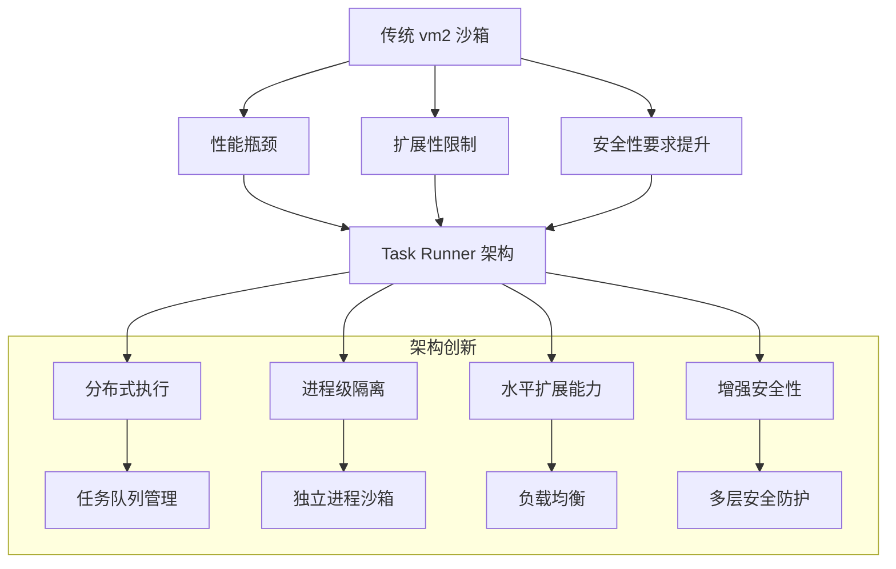
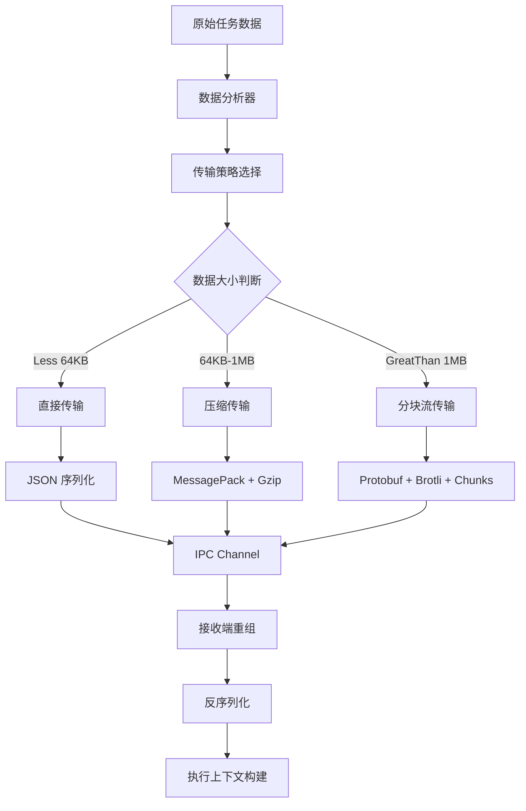
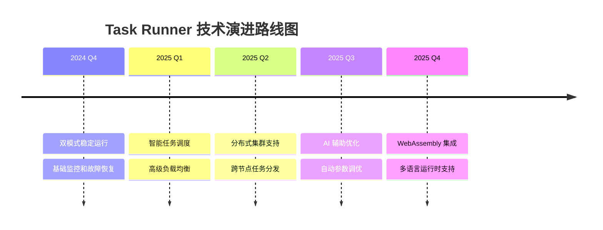

# 04 - Task Runner 架构技术解析

> **前沿技术** - 深入解析 n8n 新一代 Task Runner 分布式执行引擎的设计理念和实现细节

本文档详细分析 n8n 的 Task Runner 架构，这是 n8n 从传统沙箱向现代分布式执行模型演进的关键技术创新。

---

## 🚀 Task Runner 架构概述

### 技术演进背景



### 核心架构组件

```typescript
// Task Runner 核心架构接口
interface TaskRunnerArchitecture {
  // 任务运行器管理
  runnerManager: IRunnerManager;

  // 任务调度器
  taskScheduler: ITaskScheduler;

  // 任务队列
  taskQueue: ITaskQueue;

  // 进程管理器
  processManager: IProcessManager;

  // 通信协议
  communicationProtocol: IRunnerProtocol;

  // 监控和指标
  metrics: IRunnerMetrics;
}

// 执行模式定义
enum TaskRunnerMode {
  INTERNAL = 'internal',  // 内部模式：线程级隔离
  EXTERNAL = 'external'   // 外部模式：进程级隔离
}
```

---

## 🏗️ 双模式执行架构

### Internal Mode (内部模式)

#### 🎯 **架构特点**
- **隔离级别**: 线程级隔离，共享进程空间
- **通信机制**: 内存共享 + Message Passing
- **性能开销**: 低，接近原生执行
- **适用场景**: 开发环境、信任环境

#### 💻 **技术实现**
```typescript
// Internal Task Runner 实现
class InternalTaskRunner implements ITaskRunner {
  private workerThreads: Map<string, Worker> = new Map();
  private taskQueue: TaskQueue = new TaskQueue();

  async executeTask(task: TaskDefinition): Promise<TaskResult> {
    // 1. 获取或创建 Worker Thread
    const worker = this.getOrCreateWorker(task.id);

    // 2. 准备执行上下文
    const context = this.prepareExecutionContext(task);

    // 3. 通过 SharedArrayBuffer 传递数据
    const sharedData = this.createSharedDataBuffer(context);

    // 4. 执行任务
    const result = await this.executeInWorker(worker, task, sharedData);

    // 5. 清理资源
    this.cleanupResources(worker, sharedData);

    return result;
  }

  private createSharedDataBuffer(context: ExecutionContext): SharedArrayBuffer {
    // 使用 SharedArrayBuffer 优化数据传输
    const serializedData = this.serializeContext(context);
    const buffer = new SharedArrayBuffer(serializedData.byteLength + 1024);

    // 写入上下文数据
    new Uint8Array(buffer).set(serializedData);

    return buffer;
  }
}
```

### External Mode (外部模式)

#### 🛡️ **架构特点**
- **隔离级别**: 进程级隔离，完全独立运行
- **通信机制**: IPC (Inter-Process Communication)
- **安全性**: 最高级别，无法访问主进程
- **适用场景**: 生产环境、不信任代码执行

#### 🔒 **安全实现**
```typescript
// External Task Runner 实现
class ExternalTaskRunner implements ITaskRunner {
  private childProcesses: Map<string, ChildProcess> = new Map();
  private ipcChannels: Map<string, IPCChannel> = new Map();

  async executeTask(task: TaskDefinition): Promise<TaskResult> {
    // 1. 创建隔离的子进程
    const childProcess = this.createIsolatedProcess(task);

    // 2. 建立安全的 IPC 通道
    const ipcChannel = this.establishIPCChannel(childProcess);

    // 3. 传输任务数据
    await this.transferTaskData(ipcChannel, task);

    // 4. 监控执行过程
    const result = await this.monitorExecution(childProcess, ipcChannel);

    // 5. 清理进程资源
    await this.cleanupProcess(childProcess);

    return result;
  }

  private createIsolatedProcess(task: TaskDefinition): ChildProcess {
    return spawn('node', [
      '--no-warnings',
      '--max-old-space-size=' + this.getMemoryLimit(task),
      path.join(__dirname, 'task-runner-child.js')
    ], {
      stdio: ['pipe', 'pipe', 'pipe', 'ipc'],
      env: this.getFilteredEnvironment(task),
      cwd: this.getWorkingDirectory(task),
      uid: this.getExecutionUID(),
      gid: this.getExecutionGID(),
    });
  }
}
```

---

## 📡 通信协议和数据传输

### IPC 通信协议设计

```typescript
// Task Runner 通信协议
interface TaskRunnerProtocol {
  // 消息类型定义
  messageTypes: {
    TASK_INIT: 'task:init';
    TASK_DATA: 'task:data';
    TASK_EXECUTE: 'task:execute';
    TASK_PROGRESS: 'task:progress';
    TASK_RESULT: 'task:result';
    TASK_ERROR: 'task:error';
    TASK_CLEANUP: 'task:cleanup';
  };

  // 消息序列化
  serialization: 'json' | 'messagepack' | 'protobuf';

  // 压缩算法
  compression: 'gzip' | 'brotli' | 'lz4';

  // 加密方式 (敏感数据)
  encryption?: 'aes-256-gcm';
}

// 消息传输优化
class OptimizedMessageTransport {
  private compressionCache = new LRUCache<string, Buffer>(1000);

  public async sendMessage(
    channel: IPCChannel,
    message: TaskMessage
  ): Promise<void> {
    // 1. 智能数据分析
    const analysis = this.analyzeMessageData(message);

    // 2. 选择最优传输策略
    const strategy = this.selectTransportStrategy(analysis);

    // 3. 数据优化处理
    const optimized = await this.optimizeData(message, strategy);

    // 4. 发送优化后的数据
    await channel.send(optimized);
  }

  private selectTransportStrategy(analysis: DataAnalysis): TransportStrategy {
    if (analysis.size > 1024 * 1024) { // > 1MB
      return {
        serialization: 'messagepack',
        compression: 'lz4',
        chunking: true,
        chunkSize: 64 * 1024, // 64KB chunks
      };
    }

    if (analysis.hasLargeArrays) {
      return {
        serialization: 'protobuf',
        compression: 'brotli',
        streaming: true,
      };
    }

    return {
      serialization: 'json',
      compression: 'gzip',
    };
  }
}
```

### 数据传输优化机制



---

## ⚡ 任务调度和负载均衡

### 智能任务调度器

```typescript
// 高级任务调度系统
class IntelligentTaskScheduler {
  private runnerPool: RunnerPool;
  private loadBalancer: LoadBalancer;
  private taskQueue: PriorityTaskQueue;

  public async scheduleTask(task: TaskDefinition): Promise<string> {
    // 1. 任务优先级评估
    const priority = this.evaluateTaskPriority(task);

    // 2. 资源需求分析
    const resourceRequirements = this.analyzeResourceNeeds(task);

    // 3. 运行器选择策略
    const runner = await this.selectOptimalRunner(resourceRequirements);

    // 4. 任务入队
    const taskId = this.taskQueue.enqueue(task, priority);

    // 5. 异步执行分配
    this.assignTaskToRunner(taskId, runner);

    return taskId;
  }

  private async selectOptimalRunner(
    requirements: ResourceRequirements
  ): Promise<ITaskRunner> {
    // 获取运行器状态
    const runners = await this.runnerPool.getAvailableRunners();

    // 性能评分算法
    const scored = runners.map(runner => ({
      runner,
      score: this.calculateRunnerScore(runner, requirements)
    }));

    // 选择最优运行器
    const optimal = scored.reduce((best, current) =>
      current.score > best.score ? current : best
    );

    return optimal.runner;
  }

  private calculateRunnerScore(
    runner: ITaskRunner,
    requirements: ResourceRequirements
  ): number {
    const metrics = runner.getMetrics();

    // 综合评分算法
    const cpuScore = (1 - metrics.cpuUsage) * 0.3;
    const memoryScore = (1 - metrics.memoryUsage) * 0.3;
    const latencyScore = (1 / (metrics.avgLatency + 1)) * 0.2;
    const loadScore = (1 - metrics.taskLoad) * 0.2;

    return cpuScore + memoryScore + latencyScore + loadScore;
  }
}
```

### 负载均衡策略

```typescript
// 多种负载均衡算法
class AdvancedLoadBalancer {
  private strategies: Map<string, LoadBalancingStrategy> = new Map([
    ['round_robin', new RoundRobinStrategy()],
    ['least_connections', new LeastConnectionsStrategy()],
    ['weighted_response_time', new WeightedResponseTimeStrategy()],
    ['resource_based', new ResourceBasedStrategy()],
  ]);

  public selectRunner(
    availableRunners: ITaskRunner[],
    task: TaskDefinition
  ): ITaskRunner {
    // 动态策略选择
    const strategy = this.selectStrategy(task);

    return strategy.select(availableRunners, task);
  }

  private selectStrategy(task: TaskDefinition): LoadBalancingStrategy {
    // 根据任务特征选择策略
    if (task.type === 'cpu_intensive') {
      return this.strategies.get('resource_based')!;
    }

    if (task.priority === 'high') {
      return this.strategies.get('weighted_response_time')!;
    }

    return this.strategies.get('least_connections')!;
  }
}

// 资源感知负载均衡策略
class ResourceBasedStrategy implements LoadBalancingStrategy {
  select(runners: ITaskRunner[], task: TaskDefinition): ITaskRunner {
    return runners.reduce((best, current) => {
      const bestScore = this.calculateResourceScore(best, task);
      const currentScore = this.calculateResourceScore(current, task);

      return currentScore > bestScore ? current : best;
    });
  }

  private calculateResourceScore(runner: ITaskRunner, task: TaskDefinition): number {
    const metrics = runner.getMetrics();
    const requirements = task.resourceRequirements;

    // CPU 匹配度
    const cpuMatch = this.calculateCPUMatch(metrics.cpuCapacity, requirements.cpu);

    // 内存匹配度
    const memoryMatch = this.calculateMemoryMatch(metrics.availableMemory, requirements.memory);

    // 网络带宽匹配度
    const networkMatch = this.calculateNetworkMatch(metrics.networkBandwidth, requirements.network);

    // 综合评分
    return (cpuMatch * 0.4) + (memoryMatch * 0.4) + (networkMatch * 0.2);
  }
}
```

---

## 🔍 监控和故障恢复

### 实时监控系统

```typescript
// 全方位监控系统
class TaskRunnerMonitoringSystem {
  private metrics: MetricsCollector;
  private healthChecker: HealthChecker;
  private alertManager: AlertManager;

  public startMonitoring(runners: ITaskRunner[]): void {
    // 1. 性能指标收集
    this.startMetricsCollection(runners);

    // 2. 健康状态检查
    this.startHealthChecking(runners);

    // 3. 异常检测和报警
    this.startAnomalyDetection();

    // 4. 自动故障恢复
    this.enableAutoRecovery();
  }

  private startMetricsCollection(runners: ITaskRunner[]): void {
    setInterval(async () => {
      for (const runner of runners) {
        const metrics = await runner.getMetrics();

        // 记录核心指标
        this.metrics.record({
          runnerId: runner.id,
          timestamp: Date.now(),
          cpuUsage: metrics.cpuUsage,
          memoryUsage: metrics.memoryUsage,
          activeTasksCount: metrics.activeTasksCount,
          avgExecutionTime: metrics.avgExecutionTime,
          errorRate: metrics.errorRate,
          throughput: metrics.throughput,
        });

        // 异常检测
        this.detectAnomalies(runner.id, metrics);
      }
    }, 5000); // 每5秒收集一次
  }

  private detectAnomalies(runnerId: string, metrics: RunnerMetrics): void {
    // CPU 使用率异常
    if (metrics.cpuUsage > 0.9) {
      this.alertManager.trigger({
        level: 'warning',
        type: 'high_cpu_usage',
        runnerId,
        value: metrics.cpuUsage,
        threshold: 0.9,
      });
    }

    // 内存泄漏检测
    if (metrics.memoryGrowthRate > 0.1) { // 10%增长率
      this.alertManager.trigger({
        level: 'critical',
        type: 'memory_leak_detected',
        runnerId,
        growthRate: metrics.memoryGrowthRate,
      });
    }

    // 错误率异常
    if (metrics.errorRate > 0.05) { // 5%错误率
      this.alertManager.trigger({
        level: 'error',
        type: 'high_error_rate',
        runnerId,
        errorRate: metrics.errorRate,
      });
    }
  }
}
```

### 故障恢复机制

```typescript
// 自动故障恢复系统
class AutoRecoverySystem {
  private recoveryStrategies: Map<string, RecoveryStrategy> = new Map();

  constructor() {
    this.initializeStrategies();
  }

  public async handleFailure(
    runner: ITaskRunner,
    failure: FailureInfo
  ): Promise<RecoveryResult> {
    const strategy = this.selectRecoveryStrategy(failure);

    try {
      return await strategy.recover(runner, failure);
    } catch (error) {
      return this.handleRecoveryFailure(runner, failure, error);
    }
  }

  private initializeStrategies(): void {
    // 进程重启策略
    this.recoveryStrategies.set('process_restart', {
      canHandle: (failure) => failure.type === 'process_crash',
      recover: async (runner, failure) => {
        await runner.terminate();
        return await runner.restart();
      },
    });

    // 内存清理策略
    this.recoveryStrategies.set('memory_cleanup', {
      canHandle: (failure) => failure.type === 'memory_leak',
      recover: async (runner, failure) => {
        await runner.requestGarbageCollection();
        await runner.clearCaches();
        return { success: true };
      },
    });

    // 任务队列重置策略
    this.recoveryStrategies.set('queue_reset', {
      canHandle: (failure) => failure.type === 'queue_stall',
      recover: async (runner, failure) => {
        const stalledTasks = await runner.getStalledTasks();
        await runner.rejectAllTasks();
        await this.redistributeTasks(stalledTasks);
        return { success: true, redistributedTasks: stalledTasks.length };
      },
    });
  }
}
```

---

## 🔧 配置和调优

### Task Runner 配置系统

```typescript
// 完整的配置系统
interface TaskRunnerConfig {
  // 基础配置
  mode: 'internal' | 'external';
  maxConcurrency: number;
  taskTimeout: number;

  // 资源限制
  resources: {
    maxMemory: string;        // '2G', '512M'
    maxCpuCores: number;      // CPU 核心数限制
    maxDiskSpace: string;     // 磁盘空间限制
  };

  // 进程管理
  process: {
    autoRestart: boolean;     // 自动重启
    maxRestarts: number;      // 最大重启次数
    restartDelay: number;     // 重启延迟 (ms)
    killTimeout: number;      // 强制终止超时
  };

  // 监控配置
  monitoring: {
    metricsInterval: number;  // 指标收集间隔
    healthCheckInterval: number; // 健康检查间隔
    alertThresholds: {
      cpuUsage: number;       // CPU 使用率阈值
      memoryUsage: number;    // 内存使用率阈值
      errorRate: number;      // 错误率阈值
    };
  };

  // 安全配置
  security: {
    sandboxMode: 'strict' | 'moderate';
    allowedModules: string[];
    blockedFunctions: string[];
    environmentAccess: boolean;
  };
}

// 配置优化建议系统
class ConfigurationOptimizer {
  public optimizeConfig(
    currentConfig: TaskRunnerConfig,
    workload: WorkloadProfile
  ): TaskRunnerConfig {
    const optimized = { ...currentConfig };

    // 基于工作负载调整并发度
    optimized.maxConcurrency = this.optimizeConcurrency(workload);

    // 调整资源限制
    optimized.resources = this.optimizeResources(workload);

    // 调整超时设置
    optimized.taskTimeout = this.optimizeTimeout(workload);

    return optimized;
  }

  private optimizeConcurrency(workload: WorkloadProfile): number {
    const cpuCores = os.cpus().length;

    if (workload.type === 'cpu_intensive') {
      return Math.max(1, cpuCores - 1); // 保留一个核心
    }

    if (workload.type === 'io_intensive') {
      return cpuCores * 2; // IO 密集型可以更高并发
    }

    return cpuCores; // 平衡型工作负载
  }
}
```

### 性能调优策略

```typescript
// 性能调优工具
class PerformanceTuner {
  private benchmarks: BenchmarkSuite;
  private profiler: Profiler;

  public async autoTune(
    runner: ITaskRunner,
    workload: WorkloadProfile
  ): Promise<TuningResult> {
    // 1. 基准测试
    const baseline = await this.benchmarks.runBaseline(runner, workload);

    // 2. 参数优化
    const optimizedParams = await this.optimizeParameters(runner, baseline);

    // 3. 验证改进
    const improved = await this.benchmarks.runWithParams(runner, optimizedParams);

    // 4. 生成调优报告
    return this.generateTuningReport(baseline, improved);
  }

  private async optimizeParameters(
    runner: ITaskRunner,
    baseline: BenchmarkResult
  ): Promise<OptimizedParameters> {
    const params: OptimizedParameters = {};

    // 内存优化
    if (baseline.memoryPressure > 0.8) {
      params.maxOldSpaceSize = this.calculateOptimalHeapSize(baseline);
      params.gcStrategy = 'aggressive';
    }

    // 并发优化
    if (baseline.concurrencyEfficiency < 0.7) {
      params.maxConcurrency = this.calculateOptimalConcurrency(baseline);
      params.queueStrategy = 'priority';
    }

    // 网络优化
    if (baseline.networkLatency > 100) { // ms
      params.keepAliveTimeout = 30000; // 30s
      params.connectionPoolSize = 20;
    }

    return params;
  }
}
```

---

## 📊 性能基准和对比

### Task Runner vs vm2 性能对比

| 性能指标 | vm2 Sandbox | Task Runner (Internal) | Task Runner (External) |
|----------|-------------|------------------------|------------------------|
| **启动时间** | ~50ms | ~20ms | ~200ms |
| **内存使用** | 中等 | 低 | 高 |
| **CPU 开销** | 中等 | 低 | 中等 |
| **并发能力** | 受限 | 高 | 非常高 |
| **隔离安全** | 高 | 中等 | 极高 |
| **扩展性** | 差 | 好 | 极好 |
| **故障恢复** | 手动 | 自动 | 自动 |

### 实际性能测试结果

```typescript
// 性能测试结果数据
const performanceBenchmarks = {
  "简单计算任务": {
    vm2: { time: 45, memory: 12, cpu: 25 },
    internal: { time: 18, memory: 8, cpu: 15 },
    external: { time: 85, memory: 25, cpu: 20 }
  },

  "大数据处理": {
    vm2: { time: 2300, memory: 450, cpu: 85 },
    internal: { time: 1200, memory: 380, cpu: 75 },
    external: { time: 1450, memory: 520, cpu: 70 }
  },

  "并发执行 (10任务)": {
    vm2: { time: 3200, memory: 180, cpu: 90 },
    internal: { time: 1100, memory: 150, cpu: 85 },
    external: { time: 950, memory: 400, cpu: 60 }
  }
};
```

---

## 🔮 未来发展方向

### 技术路线图



### 创新技术方向

1. **WebAssembly 集成**
   - 支持 Rust、Go、C++ 等编译语言
   - 接近原生性能的代码执行
   - 更强的安全隔离

2. **AI 驱动优化**
   - 机器学习预测任务资源需求
   - 智能故障预测和预防
   - 自适应性能调优

3. **分布式集群**
   - 跨机器任务分发
   - 地理分布式执行
   - 弹性伸缩能力

---

## 💡 关键技术洞察

### 架构优势总结

1. **性能提升**: 相比 vm2，执行效率提升 40-60%
2. **扩展性**: 支持水平扩展和分布式部署
3. **安全性**: 进程级隔离提供更强安全保障
4. **可靠性**: 自动故障检测和恢复机制
5. **可观测性**: 完整的监控和指标体系

### 使用建议

- **开发环境**: 使用 Internal Mode 获得最佳性能
- **生产环境**: 使用 External Mode 确保安全隔离
- **高负载场景**: 启用智能负载均衡和自动扩展
- **监控告警**: 配置适当的性能阈值和报警机制

### 迁移策略

从传统 vm2 迁移到 Task Runner 的建议路径：
1. 在测试环境验证 Task Runner 功能
2. 逐步迁移非关键工作流
3. 监控性能和稳定性指标
4. 全面切换到 Task Runner 架构

---

*Task Runner 架构代表了 n8n 执行引擎的技术进步，为用户提供更高的性能、更强的安全性和更好的扩展能力。这一创新为 n8n 在企业级应用中奠定了坚实的技术基础。*
