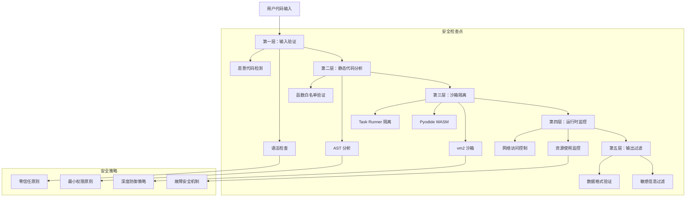

# 05 - 安全模型和沙箱机制

> **安全防护** - 全面解析 n8n 多层安全防护体系和沙箱隔离机制的设计与实现

本文档深入分析 n8n 的安全架构，涵盖从代码执行到数据传输的全方位安全机制，为企业级部署提供安全保障分析。

---

## 🛡️ 安全模型概览

### 多层安全防护架构



### 安全威胁模型

```typescript
// 安全威胁分类和防护矩阵
interface SecurityThreatMatrix {
  codeInjection: {
    threats: ['eval攻击', '函数构造器注入', '原型污染'];
    mitigations: ['AST静态分析', '函数白名单', '原型链冻结'];
    riskLevel: 'CRITICAL';
  };
  
  dataExfiltration: {
    threats: ['环境变量泄露', '文件系统访问', '网络数据窃取'];
    mitigations: ['环境变量隔离', '文件系统沙箱', '网络访问控制'];
    riskLevel: 'HIGH';
  };
  
  resourceAbuse: {
    threats: ['CPU耗尽攻击', '内存炸弹', '磁盘空间滥用'];
    mitigations: ['执行时间限制', '内存使用监控', '磁盘配额控制'];
    riskLevel: 'MEDIUM';
  };
  
  privilegeEscalation: {
    threats: ['沙箱逃逸', '系统调用滥用', '进程权限提升'];
    mitigations: ['多层沙箱隔离', '系统调用拦截', '进程权限限制'];
    riskLevel: 'CRITICAL';
  };
}
```

---

## 🔒 静态代码分析安全机制

### AST 解析和威胁检测

```typescript
// 高级静态代码分析器
class AdvancedCodeAnalyzer {
  private securityRules: SecurityRule[];
  private threatPatterns: ThreatPattern[];
  
  constructor() {
    this.initializeSecurityRules();
    this.initializeThreatPatterns();
  }
  
  public analyzeCode(code: string): SecurityAnalysisResult {
    try {
      // 1. 语法解析
      const ast = this.parseToAST(code);
      
      // 2. 安全规则检查
      const ruleViolations = this.checkSecurityRules(ast);
      
      // 3. 威胁模式匹配
      const threatMatches = this.detectThreatPatterns(ast, code);
      
      // 4. 复杂性分析
      const complexityAnalysis = this.analyzeComplexity(ast);
      
      // 5. 依赖分析
      const dependencyAnalysis = this.analyzeDependencies(ast);
      
      return {
        safe: ruleViolations.length === 0 && threatMatches.length === 0,
        securityScore: this.calculateSecurityScore(ruleViolations, threatMatches),
        violations: ruleViolations,
        threats: threatMatches,
        complexity: complexityAnalysis,
        dependencies: dependencyAnalysis,
        recommendations: this.generateSecurityRecommendations(ruleViolations, threatMatches),
      };
      
    } catch (error) {
      return {
        safe: false,
        securityScore: 0,
        violations: [{
          rule: 'SYNTAX_ERROR',
          severity: 'CRITICAL',
          message: `Syntax error: ${error.message}`,
        }],
        threats: [],
        complexity: { score: 0 },
        dependencies: [],
        recommendations: ['Fix syntax errors before proceeding'],
      };
    }
  }
  
  private initializeSecurityRules(): void {
    this.securityRules = [
      // 禁用危险函数
      {
        id: 'DANGEROUS_EVAL',
        severity: 'CRITICAL',
        description: '禁止使用 eval 和动态代码执行',
        check: (node: any) => {
          return node.type === 'CallExpression' && 
                 node.callee.name === 'eval';
        }
      },
      
      {
        id: 'FUNCTION_CONSTRUCTOR',
        severity: 'CRITICAL', 
        description: '禁止使用 Function 构造器',
        check: (node: any) => {
          return node.type === 'NewExpression' && 
                 node.callee.name === 'Function';
        }
      },
      
      {
        id: 'PROTOTYPE_POLLUTION',
        severity: 'HIGH',
        description: '检测原型污染风险',
        check: (node: any) => {
          if (node.type === 'MemberExpression') {
            const dangerousProps = ['__proto__', 'prototype', 'constructor'];
            return dangerousProps.some(prop => 
              node.property.name === prop || 
              node.property.value === prop
            );
          }
          return false;
        }
      },
      
      {
        id: 'GLOBAL_ACCESS',
        severity: 'MEDIUM',
        description: '检测全局对象访问',
        check: (node: any) => {
          const globalObjects = ['global', 'globalThis', 'window', 'self'];
          return node.type === 'Identifier' && 
                 globalObjects.includes(node.name);
        }
      },
      
      {
        id: 'REQUIRE_INJECTION',
        severity: 'HIGH',
        description: '检测动态 require 调用',
        check: (node: any) => {
          if (node.type === 'CallExpression' && node.callee.name === 'require') {
            // 检查是否为动态参数
            return node.arguments.length > 0 && 
                   node.arguments[0].type !== 'Literal';
          }
          return false;
        }
      },
      
      {
        id: 'PROCESS_ACCESS',
        severity: 'HIGH',
        description: '检测进程对象访问',
        check: (node: any) => {
          return node.type === 'MemberExpression' && 
                 node.object.name === 'process';
        }
      },
    ];
  }
  
  private initializeThreatPatterns(): void {
    this.threatPatterns = [
      {
        id: 'OBFUSCATED_CODE',
        severity: 'HIGH',
        description: '检测代码混淆',
        pattern: /\\x[0-9a-fA-F]{2}|\\u[0-9a-fA-F]{4}|String\.fromCharCode/,
        check: (code: string) => this.pattern.test(code)
      },
      
      {
        id: 'BASE64_DECODE',
        severity: 'MEDIUM',
        description: '检测Base64解码操作',
        pattern: /atob\s*\(|Buffer\.from\s*\([^,]*,\s*['""]base64['""]|\.decode\s*\(\s*['""]base64['""]]/,
        check: (code: string) => this.pattern.test(code)
      },
      
      {
        id: 'CRYPTO_OPERATIONS',
        severity: 'LOW',
        description: '检测加密操作',
        pattern: /crypto\.|CryptoJS\.|forge\.|node-rsa/,
        check: (code: string) => this.pattern.test(code)
      },
      
      {
        id: 'NETWORK_REQUESTS',
        severity: 'MEDIUM',
        description: '检测网络请求',
        pattern: /fetch\s*\(|XMLHttpRequest|axios\.|http\.|https\./,
        check: (code: string) => this.pattern.test(code)
      },
      
      {
        id: 'FILE_OPERATIONS',
        severity: 'HIGH',
        description: '检测文件操作',
        pattern: /fs\.|readFile|writeFile|createReadStream|createWriteStream/,
        check: (code: string) => this.pattern.test(code)
      },
    ];
  }
  
  private checkSecurityRules(ast: any): SecurityViolation[] {
    const violations: SecurityViolation[] = [];
    
    const traverse = (node: any) => {
      for (const rule of this.securityRules) {
        if (rule.check(node)) {
          violations.push({
            rule: rule.id,
            severity: rule.severity,
            message: rule.description,
            line: node.loc?.start.line,
            column: node.loc?.start.column,
          });
        }
      }
      
      // 递归遍历子节点
      for (const key in node) {
        if (node[key] && typeof node[key] === 'object') {
          if (Array.isArray(node[key])) {
            for (const child of node[key]) {
              if (child && typeof child === 'object') {
                traverse(child);
              }
            }
          } else {
            traverse(node[key]);
          }
        }
      }
    };
    
    traverse(ast);
    return violations;
  }
  
  private detectThreatPatterns(ast: any, code: string): ThreatMatch[] {
    const matches: ThreatMatch[] = [];
    
    for (const pattern of this.threatPatterns) {
      if (pattern.check(code)) {
        const regexMatches = Array.from(code.matchAll(new RegExp(pattern.pattern.source, 'g')));
        for (const match of regexMatches) {
          matches.push({
            pattern: pattern.id,
            severity: pattern.severity,
            message: pattern.description,
            match: match[0],
            index: match.index || 0,
          });
        }
      }
    }
    
    return matches;
  }
  
  private calculateSecurityScore(
    violations: SecurityViolation[],
    threats: ThreatMatch[]
  ): number {
    let score = 100; // 满分100
    
    // 扣分规则
    const severityWeights = {
      'CRITICAL': 50,
      'HIGH': 20,
      'MEDIUM': 10,
      'LOW': 5,
    };
    
    for (const violation of violations) {
      score -= severityWeights[violation.severity] || 0;
    }
    
    for (const threat of threats) {
      score -= severityWeights[threat.severity] || 0;
    }
    
    return Math.max(0, score);
  }
}
```

### 代码注入防护

```typescript
// 代码注入防护系统
class CodeInjectionProtection {
  private dangerousPatterns: RegExp[];
  private safetyValidator: SafetyValidator;
  
  constructor() {
    this.initializeDangerousPatterns();
    this.safetyValidator = new SafetyValidator();
  }
  
  private initializeDangerousPatterns(): void {
    this.dangerousPatterns = [
      // JavaScript 代码注入模式
      /eval\s*\(/gi,
      /Function\s*\(/gi,
      /setTimeout\s*\(\s*['"].*?['"],/gi,
      /setInterval\s*\(\s*['"].*?['"],/gi,
      /new\s+Function\s*\(/gi,
      /document\s*\.\s*write/gi,
      /innerHTML\s*=/gi,
      /outerHTML\s*=/gi,
      
      // 原型污染模式
      /__proto__\s*=/gi,
      /prototype\s*\[\s*['"]constructor['"]\s*\]/gi,
      /Object\s*\.\s*prototype/gi,
      
      // 系统调用模式
      /require\s*\(\s*['"]child_process['"]\s*\)/gi,
      /require\s*\(\s*['"]fs['"]\s*\)/gi,
      /require\s*\(\s*['"]os['"]\s*\)/gi,
      /process\s*\.\s*exit/gi,
      /process\s*\.\s*kill/gi,
      
      // 网络访问模式
      /XMLHttpRequest/gi,
      /fetch\s*\(\s*['"]file:/gi,
      /new\s+WebSocket/gi,
    ];
  }
  
  public validateCode(code: string): ValidationResult {
    const violations: CodeViolation[] = [];
    
    // 1. 模式匹配检查
    for (let i = 0; i < this.dangerousPatterns.length; i++) {
      const pattern = this.dangerousPatterns[i];
      const matches = Array.from(code.matchAll(pattern));
      
      for (const match of matches) {
        violations.push({
          type: 'DANGEROUS_PATTERN',
          pattern: pattern.source,
          match: match[0],
          position: match.index || 0,
          severity: this.getSeverityForPattern(pattern),
        });
      }
    }
    
    // 2. 上下文分析
    const contextViolations = this.analyzeContext(code);
    violations.push(...contextViolations);
    
    // 3. 数据流分析
    const dataFlowViolations = this.analyzeDataFlow(code);
    violations.push(...dataFlowViolations);
    
    return {
      safe: violations.length === 0,
      violations,
      riskScore: this.calculateRiskScore(violations),
      recommendations: this.generateRecommendations(violations),
    };
  }
  
  private analyzeContext(code: string): CodeViolation[] {
    const violations: CodeViolation[] = [];
    
    // 检查字符串拼接中的代码执行风险
    const stringConcatPattern = /['"].*?\+.*?['"].*?eval|eval.*?\+.*?['"]/gi;
    const matches = Array.from(code.matchAll(stringConcatPattern));
    
    for (const match of matches) {
      violations.push({
        type: 'DYNAMIC_CODE_CONSTRUCTION',
        pattern: 'String concatenation with eval risk',
        match: match[0],
        position: match.index || 0,
        severity: 'HIGH',
      });
    }
    
    // 检查变量名中的可疑模式
    const suspiciousVarPattern = /(?:var|let|const)\s+(_.*?_|.*?exec.*?|.*?eval.*?)\s*=/gi;
    const varMatches = Array.from(code.matchAll(suspiciousVarPattern));
    
    for (const match of varMatches) {
      violations.push({
        type: 'SUSPICIOUS_VARIABLE_NAMING',
        pattern: 'Suspicious variable naming pattern',
        match: match[0],
        position: match.index || 0,
        severity: 'MEDIUM',
      });
    }
    
    return violations;
  }
  
  private analyzeDataFlow(code: string): CodeViolation[] {
    const violations: CodeViolation[] = [];
    
    try {
      // 简化的数据流分析
      const lines = code.split('\n');
      const variableAssignments = new Map<string, string>();
      
      for (let i = 0; i < lines.length; i++) {
        const line = lines[i];
        
        // 跟踪变量赋值
        const assignmentMatch = line.match(/(?:var|let|const)\s+(\w+)\s*=\s*(.+);?/);
        if (assignmentMatch) {
          variableAssignments.set(assignmentMatch[1], assignmentMatch[2]);
        }
        
        // 检查变量在危险函数中的使用
        const evalMatch = line.match(/eval\s*\(\s*(\w+)\s*\)/);
        if (evalMatch) {
          const varName = evalMatch[1];
          const assignment = variableAssignments.get(varName);
          
          if (assignment && assignment.includes('input')) {
            violations.push({
              type: 'USER_INPUT_TO_EVAL',
              pattern: 'User input passed to eval function',
              match: line.trim(),
              position: i,
              severity: 'CRITICAL',
            });
          }
        }
      }
      
    } catch (error) {
      // 数据流分析失败不阻止验证
      console.warn('Data flow analysis failed:', error);
    }
    
    return violations;
  }
  
  private getSeverityForPattern(pattern: RegExp): string {
    const patternString = pattern.source;
    
    if (patternString.includes('eval') || patternString.includes('Function')) {
      return 'CRITICAL';
    }
    if (patternString.includes('proto') || patternString.includes('process')) {
      return 'HIGH';
    }
    if (patternString.includes('require') || patternString.includes('XMLHttpRequest')) {
      return 'MEDIUM';
    }
    return 'LOW';
  }
  
  private calculateRiskScore(violations: CodeViolation[]): number {
    const weights = {
      'CRITICAL': 100,
      'HIGH': 50,
      'MEDIUM': 20,
      'LOW': 5,
    };
    
    return violations.reduce((score, violation) => {
      return score + (weights[violation.severity] || 0);
    }, 0);
  }
  
  private generateRecommendations(violations: CodeViolation[]): string[] {
    const recommendations = new Set<string>();
    
    for (const violation of violations) {
      switch (violation.type) {
        case 'DANGEROUS_PATTERN':
          recommendations.add('避免使用危险函数，考虑安全的替代方案');
          break;
        case 'DYNAMIC_CODE_CONSTRUCTION':
          recommendations.add('避免动态构造代码字符串，使用预定义的函数');
          break;
        case 'USER_INPUT_TO_EVAL':
          recommendations.add('永远不要将用户输入传递给 eval 函数');
          break;
        case 'SUSPICIOUS_VARIABLE_NAMING':
          recommendations.add('使用清晰、明确的变量命名');
          break;
      }
    }
    
    return Array.from(recommendations);
  }
}

// 类型定义
interface ValidationResult {
  safe: boolean;
  violations: CodeViolation[];
  riskScore: number;
  recommendations: string[];
}

interface CodeViolation {
  type: string;
  pattern: string;
  match: string;
  position: number;
  severity: string;
}
```

---

## 🏗️ 沙箱隔离技术

### vm2 沙箱深度分析

```javascript
// vm2 高级沙箱配置和安全加固
class EnhancedVm2Sandbox {
  constructor() {
    this.initializeSecureSandbox();
  }
  
  initializeSecureSandbox() {
    const { NodeVM } = require('vm2');
    
    this.vm = new NodeVM({
      console: 'redirect',
      
      // 沙箱环境配置
      sandbox: this.createSecureSandbox(),
      
      // 严格的模块控制
      require: {
        external: this.getAllowedExternalModules(),
        builtin: this.getAllowedBuiltinModules(),
        root: './',
        mock: this.createMockModules(),
        resolve: this.createCustomResolver(),
      },
      
      // 禁用危险特性
      eval: false,
      wasm: false,
      fixAsync: true,
      strict: true,
      
      // 资源限制
      timeout: 30000, // 30秒超时
      
      // 编译器设置
      compiler: 'javascript',
      
      // 环境变量过滤
      env: this.createFilteredEnv(),
    });
    
    // 设置额外的安全措施
    this.setupAdditionalSecurity();
  }
  
  createSecureSandbox() {
    // 创建受控的沙箱环境
    const sandbox = {
      // 基础 JavaScript 对象（安全版本）
      console: this.createSecureConsole(),
      setTimeout: this.createSecureTimeout(),
      setInterval: this.createSecureInterval(),
      clearTimeout: clearTimeout,
      clearInterval: clearInterval,
      
      // 受控的全局对象
      Buffer: undefined, // 禁用 Buffer
      global: undefined, // 禁用 global 访问
      process: undefined, // 禁用 process 访问
      
      // 安全的 JSON 处理
      JSON: {
        parse: this.createSecureJSONParse(),
        stringify: JSON.stringify,
      },
      
      // 数学和日期对象（安全的）
      Math: Math,
      Date: Date,
      
      // 基础构造函数
      Array: Array,
      Object: Object,
      String: String,
      Number: Number,
      Boolean: Boolean,
      RegExp: RegExp,
      Error: Error,
      
      // 现代 JavaScript 特性
      Promise: Promise,
      Map: Map,
      Set: Set,
      WeakMap: WeakMap,
      WeakSet: WeakSet,
      Symbol: Symbol,
      
      // 自定义安全函数
      $: this.createUtilityFunctions(),
    };
    
    // 冻结关键原型链
    this.freezePrototypes();
    
    return sandbox;
  }
  
  createSecureConsole() {
    const logs = [];
    const maxLogs = 1000;
    const maxLogLength = 10000;
    
    return {
      log: (...args) => {
        const message = args.map(arg => 
          typeof arg === 'object' ? JSON.stringify(arg) : String(arg)
        ).join(' ');
        
        const truncated = message.length > maxLogLength 
          ? message.substring(0, maxLogLength) + '... [truncated]'
          : message;
        
        logs.push({
          type: 'log',
          message: truncated,
          timestamp: Date.now(),
        });
        
        if (logs.length > maxLogs) {
          logs.shift();
        }
        
        console.log(`[SANDBOX] ${truncated}`);
      },
      
      error: (...args) => {
        const message = args.map(arg => String(arg)).join(' ');
        logs.push({
          type: 'error',
          message: message.substring(0, maxLogLength),
          timestamp: Date.now(),
        });
        console.error(`[SANDBOX ERROR] ${message}`);
      },
      
      warn: (...args) => {
        const message = args.map(arg => String(arg)).join(' ');
        logs.push({
          type: 'warn',
          message: message.substring(0, maxLogLength),
          timestamp: Date.now(),
        });
        console.warn(`[SANDBOX WARN] ${message}`);
      },
      
      getLogs: () => [...logs],
      clearLogs: () => logs.length = 0,
    };
  }
  
  createSecureTimeout() {
    const activeTimeouts = new Set();
    const maxTimeouts = 100;
    const maxDelay = 60000; // 最大1分钟延迟
    
    return (callback, delay, ...args) => {
      if (activeTimeouts.size >= maxTimeouts) {
        throw new Error('Too many active timeouts');
      }
      
      if (delay > maxDelay) {
        throw new Error(`Timeout delay too long: ${delay}ms (max: ${maxDelay}ms)`);
      }
      
      const timeoutId = setTimeout(() => {
        activeTimeouts.delete(timeoutId);
        try {
          callback(...args);
        } catch (error) {
          console.error('Timeout callback error:', error);
        }
      }, delay);
      
      activeTimeouts.add(timeoutId);
      return timeoutId;
    };
  }
  
  createSecureJSONParse() {
    const maxSize = 10 * 1024 * 1024; // 10MB 限制
    
    return (text, reviver) => {
      if (typeof text !== 'string') {
        throw new TypeError('JSON.parse requires a string');
      }
      
      if (text.length > maxSize) {
        throw new Error(`JSON string too large: ${text.length} bytes (max: ${maxSize})`);
      }
      
      // 检查可能的原型污染
      if (text.includes('__proto__') || text.includes('constructor')) {
        throw new Error('Potential prototype pollution detected in JSON');
      }
      
      try {
        const result = JSON.parse(text, reviver);
        
        // 递归清理原型污染
        return this.sanitizeObject(result);
      } catch (error) {
        throw new Error(`JSON parsing failed: ${error.message}`);
      }
    };
  }
  
  sanitizeObject(obj) {
    if (obj === null || typeof obj !== 'object') {
      return obj;
    }
    
    // 移除危险属性
    delete obj.__proto__;
    delete obj.constructor;
    delete obj.prototype;
    
    // 递归处理子对象
    if (Array.isArray(obj)) {
      return obj.map(item => this.sanitizeObject(item));
    } else {
      const sanitized = {};
      for (const [key, value] of Object.entries(obj)) {
        if (!key.startsWith('__') && key !== 'constructor') {
          sanitized[key] = this.sanitizeObject(value);
        }
      }
      return sanitized;
    }
  }
  
  createMockModules() {
    return {
      // Mock 危险模块
      'fs': {
        readFile: () => { throw new Error('File system access denied'); },
        writeFile: () => { throw new Error('File system access denied'); },
        existsSync: () => false,
      },
      
      'child_process': {
        exec: () => { throw new Error('Process execution denied'); },
        spawn: () => { throw new Error('Process spawning denied'); },
      },
      
      'os': {
        platform: () => 'sandbox',
        arch: () => 'unknown',
        cpus: () => [],
      },
      
      'process': {
        env: {},
        exit: () => { throw new Error('Process exit denied'); },
        kill: () => { throw new Error('Process kill denied'); },
      },
    };
  }
  
  freezePrototypes() {
    // 冻结关键原型链防止污染
    const prototypesToFreeze = [
      Object.prototype,
      Array.prototype,
      Function.prototype,
      String.prototype,
      Number.prototype,
      Boolean.prototype,
      Date.prototype,
      RegExp.prototype,
      Error.prototype,
    ];
    
    for (const prototype of prototypesToFreeze) {
      Object.freeze(prototype);
      
      // 防止 constructor 属性修改
      Object.defineProperty(prototype, 'constructor', {
        writable: false,
        configurable: false,
      });
    }
  }
  
  setupAdditionalSecurity() {
    // 监控沙箱行为
    this.setupBehaviorMonitoring();
    
    // 设置资源限制监控
    this.setupResourceMonitoring();
    
    // 设置异常处理
    this.setupExceptionHandling();
  }
  
  executeSecurely(code, context, options = {}) {
    const startTime = Date.now();
    const maxExecutionTime = options.timeout || 30000;
    
    try {
      // 预处理代码
      const processedCode = this.preprocessCode(code);
      
      // 注入执行上下文
      this.injectContext(context);
      
      // 启动监控
      const monitoring = this.startMonitoring();
      
      // 执行代码
      const result = this.vm.run(processedCode);
      
      // 停止监控
      monitoring.stop();
      
      // 检查执行时间
      const executionTime = Date.now() - startTime;
      if (executionTime > maxExecutionTime) {
        throw new Error(`Execution timeout: ${executionTime}ms`);
      }
      
      return {
        success: true,
        result,
        executionTime,
        memoryUsage: monitoring.getMemoryUsage(),
        logs: this.sandbox.console.getLogs(),
      };
      
    } catch (error) {
      return {
        success: false,
        error: {
          message: error.message,
          type: error.constructor.name,
          stack: options.includeStack ? error.stack : undefined,
        },
        executionTime: Date.now() - startTime,
      };
    }
  }
}
```

### Pyodide WASM 安全机制

```python
# Pyodide WASM 环境安全配置
class PyodideSecurityManager:
    """Pyodide WebAssembly 安全管理器"""
    
    def __init__(self):
        self.security_policies = self._initialize_security_policies()
        self.resource_limits = self._initialize_resource_limits()
        self.allowed_modules = self._initialize_allowed_modules()
        self.blocked_operations = self._initialize_blocked_operations()
    
    def _initialize_security_policies(self):
        return {
            'allow_network_access': False,
            'allow_file_system': False,
            'allow_subprocess': False,
            'allow_import_star': False,
            'max_recursion_depth': 100,
            'max_memory_usage': 512 * 1024 * 1024,  # 512MB
            'execution_timeout': 30,  # 30 seconds
        }
    
    def _initialize_resource_limits(self):
        return {
            'max_string_length': 10 * 1024 * 1024,  # 10MB
            'max_list_length': 1000000,
            'max_dict_size': 100000,
            'max_file_size': 50 * 1024 * 1024,  # 50MB
            'max_iterations': 10000000,
        }
    
    def _initialize_allowed_modules(self):
        # 只允许安全的模块
        return {
            # 标准库安全模块
            'json', 'math', 'random', 'datetime', 'decimal',
            'collections', 'itertools', 'functools', 'operator',
            'string', 're', 'unicodedata', 'textwrap',
            
            # 数据科学模块
            'numpy', 'pandas', 'scipy', 'matplotlib',
            'scikit-learn', 'statsmodels',
            
            # Web和数据处理
            'requests', 'urllib', 'beautifulsoup4', 'lxml',
            'openpyxl', 'xlsxwriter', 'pyyaml', 'toml',
            
            # 实用工具
            'tqdm', 'python-dateutil', 'pytz',
        }
    
    def _initialize_blocked_operations(self):
        return {
            # 危险的内置函数
            'eval', 'exec', 'compile', '__import__',
            'open', 'file', 'input', 'raw_input',
            'globals', 'locals', 'vars', 'dir',
            
            # 系统操作
            'exit', 'quit', 'reload', 'help',
            'memoryview', 'bytearray',
            
            # 反射和动态操作
            'getattr', 'setattr', 'delattr', 'hasattr',
            'callable', 'isinstance', 'issubclass',
        }
    
    def create_secure_globals(self, user_context=None):
        """创建安全的全局命名空间"""
        import builtins
        import sys
        import gc
        from types import ModuleType
        
        # 创建受限的内置函数集
        safe_builtins = {}
        
        # 允许的安全内置函数
        allowed_builtins = {
            # 基本类型
            'int', 'float', 'str', 'bool', 'list', 'dict', 'tuple', 'set',
            'frozenset', 'complex', 'bytes', 'bytearray',
            
            # 基本函数
            'len', 'min', 'max', 'sum', 'abs', 'round', 'pow',
            'all', 'any', 'enumerate', 'zip', 'map', 'filter',
            'sorted', 'reversed', 'range', 'slice',
            
            # 类型检查
            'type', 'id', 'hash', 'repr', 'ascii',
            
            # 异常
            'Exception', 'ValueError', 'TypeError', 'IndexError',
            'KeyError', 'AttributeError', 'NameError',
        }
        
        # 只添加允许的内置函数
        for name in allowed_builtins:
            if hasattr(builtins, name):
                safe_builtins[name] = getattr(builtins, name)
        
        # 添加受控的内置函数
        safe_builtins.update({
            'print': self._create_safe_print(),
            'chr': self._create_safe_chr(),
            'ord': self._create_safe_ord(),
        })
        
        # 创建全局命名空间
        secure_globals = {
            '__builtins__': safe_builtins,
            '__name__': '__main__',
            '__doc__': None,
            '__package__': None,
            '__spec__': None,
            
            # 添加用户上下文
            **(user_context or {}),
            
            # 安全工具函数
            '_security': self._create_security_helpers(),
        }
        
        return secure_globals
    
    def _create_safe_print(self):
        """创建安全的 print 函数"""
        printed_lines = []
        max_lines = 1000
        max_line_length = 1000
        
        def safe_print(*args, sep=' ', end='\n', file=None, flush=False):
            if len(printed_lines) >= max_lines:
                raise RuntimeError(f"Too many print statements (max: {max_lines})")
            
            # 转换参数为字符串
            str_args = []
            for arg in args:
                try:
                    str_arg = str(arg)
                    if len(str_arg) > max_line_length:
                        str_arg = str_arg[:max_line_length] + '... [truncated]'
                    str_args.append(str_arg)
                except Exception:
                    str_args.append('[unprintable object]')
            
            line = sep.join(str_args) + end
            printed_lines.append(line)
            
            # 实际打印（可以重定向到日志）
            print(line, end='')
        
        safe_print.get_output = lambda: ''.join(printed_lines)
        safe_print.clear_output = lambda: printed_lines.clear()
        
        return safe_print
    
    def _create_safe_chr(self):
        """创建安全的 chr 函数"""
        def safe_chr(i):
            if not isinstance(i, int):
                raise TypeError("chr() argument must be an integer")
            if i < 0 or i > 1114111:
                raise ValueError("chr() arg not in range(0x110000)")
            return chr(i)
        return safe_chr
    
    def _create_safe_ord(self):
        """创建安全的 ord 函数"""
        def safe_ord(c):
            if not isinstance(c, str) or len(c) != 1:
                raise TypeError("ord() expected a character, got " + type(c).__name__)
            return ord(c)
        return safe_ord
    
    def _create_security_helpers(self):
        """创建安全辅助函数"""
        return {
            'is_safe_value': self._is_safe_value,
            'sanitize_dict': self._sanitize_dict,
            'check_resource_usage': self._check_resource_usage,
        }
    
    def _is_safe_value(self, value):
        """检查值是否安全"""
        import sys
        
        # 检查大小
        if sys.getsizeof(value) > self.resource_limits['max_string_length']:
            return False
        
        # 检查类型
        safe_types = (int, float, str, bool, list, dict, tuple, set, frozenset, type(None))
        if not isinstance(value, safe_types):
            return False
        
        # 递归检查容器类型
        if isinstance(value, (list, tuple)):
            if len(value) > self.resource_limits['max_list_length']:
                return False
            return all(self._is_safe_value(item) for item in value)
        
        elif isinstance(value, dict):
            if len(value) > self.resource_limits['max_dict_size']:
                return False
            return all(
                self._is_safe_value(k) and self._is_safe_value(v)
                for k, v in value.items()
            )
        
        return True
    
    def _sanitize_dict(self, d):
        """清理字典中的不安全内容"""
        if not isinstance(d, dict):
            return d
        
        sanitized = {}
        dangerous_keys = {'__proto__', 'constructor', 'prototype'}
        
        for key, value in d.items():
            # 跳过危险键
            if key in dangerous_keys or str(key).startswith('__'):
                continue
            
            # 递归清理值
            if isinstance(value, dict):
                sanitized[key] = self._sanitize_dict(value)
            elif isinstance(value, list):
                sanitized[key] = [self._sanitize_dict(item) if isinstance(item, dict) else item for item in value]
            else:
                sanitized[key] = value
        
        return sanitized
    
    def _check_resource_usage(self):
        """检查资源使用情况"""
        import gc
        import sys
        
        # 强制垃圾回收
        collected = gc.collect()
        
        # 获取对象计数
        object_count = len(gc.get_objects())
        
        # 估算内存使用
        memory_usage = sum(sys.getsizeof(obj) for obj in gc.get_objects())
        
        return {
            'objects_collected': collected,
            'total_objects': object_count,
            'estimated_memory': memory_usage,
            'memory_limit': self.resource_limits['max_memory_usage'],
            'memory_usage_ratio': memory_usage / self.resource_limits['max_memory_usage'],
        }
    
    def execute_code_securely(self, code, context=None):
        """安全执行 Python 代码"""
        import ast
        import sys
        import time
        import signal
        
        try:
            # 1. 预处理检查
            if not self._validate_code_syntax(code):
                raise SyntaxError("Code contains syntax errors")
            
            if not self._check_code_safety(code):
                raise SecurityError("Code contains unsafe operations")
            
            # 2. 创建安全环境
            secure_globals = self.create_secure_globals(context)
            secure_locals = {}
            
            # 3. 设置执行限制
            old_recursion_limit = sys.getrecursionlimit()
            sys.setrecursionlimit(self.security_policies['max_recursion_depth'])
            
            # 4. 执行代码
            start_time = time.time()
            
            try:
                # 使用 exec 在受控环境中执行
                exec(compile(code, '<user_code>', 'exec'), secure_globals, secure_locals)
                
                execution_time = time.time() - start_time
                
                if execution_time > self.security_policies['execution_timeout']:
                    raise TimeoutError(f"Code execution timed out after {execution_time:.2f} seconds")
                
                # 返回结果
                result = secure_locals.get('result', None)
                
                return {
                    'success': True,
                    'result': self._sanitize_dict(result) if isinstance(result, dict) else result,
                    'execution_time': execution_time,
                    'output': secure_globals['print'].get_output() if 'print' in secure_globals else '',
                    'resource_usage': self._check_resource_usage(),
                }
                
            finally:
                # 恢复递归限制
                sys.setrecursionlimit(old_recursion_limit)
                
        except Exception as e:
            return {
                'success': False,
                'error': {
                    'type': type(e).__name__,
                    'message': str(e),
                },
                'execution_time': time.time() - start_time if 'start_time' in locals() else 0,
            }
    
    def _validate_code_syntax(self, code):
        """验证代码语法"""
        try:
            ast.parse(code)
            return True
        except SyntaxError:
            return False
    
    def _check_code_safety(self, code):
        """检查代码安全性"""
        import ast
        
        try:
            tree = ast.parse(code)
            
            # 遍历 AST 节点检查危险操作
            for node in ast.walk(tree):
                # 检查函数调用
                if isinstance(node, ast.Call):
                    if hasattr(node.func, 'id') and node.func.id in self.blocked_operations:
                        return False
                
                # 检查导入语句
                elif isinstance(node, ast.Import):
                    for alias in node.names:
                        if alias.name not in self.allowed_modules:
                            return False
                
                elif isinstance(node, ast.ImportFrom):
                    if node.module and node.module not in self.allowed_modules:
                        return False
                
                # 检查属性访问
                elif isinstance(node, ast.Attribute):
                    if node.attr.startswith('_'):
                        return False
            
            return True
            
        except Exception:
            return False

# 创建全局安全管理器实例
security_manager = PyodideSecurityManager()

class SecurityError(Exception):
    """安全错误异常"""
    pass
```

---

## 🚨 运行时安全监控

### 实时威胁检测

```typescript
// 运行时安全监控系统
class RuntimeSecurityMonitor {
  private alertSystem: AlertSystem;
  private behaviorAnalyzer: BehaviorAnalyzer;
  private resourceTracker: ResourceTracker;
  private networkMonitor: NetworkMonitor;
  
  constructor() {
    this.alertSystem = new AlertSystem();
    this.behaviorAnalyzer = new BehaviorAnalyzer();
    this.resourceTracker = new ResourceTracker();
    this.networkMonitor = new NetworkMonitor();
  }
  
  public startMonitoring(executionContext: ExecutionContext): MonitoringSession {
    const session = new MonitoringSession(executionContext);
    
    // 启动各种监控器
    session.addMonitor('behavior', this.behaviorAnalyzer.monitor(executionContext));
    session.addMonitor('resources', this.resourceTracker.monitor(executionContext));
    session.addMonitor('network', this.networkMonitor.monitor(executionContext));
    
    // 设置实时告警
    session.onAlert((alert: SecurityAlert) => {
      this.handleSecurityAlert(alert, session);
    });
    
    return session;
  }
  
  private handleSecurityAlert(alert: SecurityAlert, session: MonitoringSession): void {
    switch (alert.severity) {
      case 'CRITICAL':
        // 立即终止执行
        session.terminate('Critical security violation detected');
        this.alertSystem.sendCriticalAlert(alert);
        break;
        
      case 'HIGH':
        // 标记可疑行为，继续监控
        session.markSuspicious(alert);
        this.alertSystem.sendHighAlert(alert);
        break;
        
      case 'MEDIUM':
        // 记录日志，增强监控
        session.logWarning(alert);
        this.alertSystem.sendMediumAlert(alert);
        break;
        
      case 'LOW':
        // 仅记录日志
        session.logInfo(alert);
        break;
    }
  }
}

// 行为分析器
class BehaviorAnalyzer {
  private suspiciousPatterns: Map<string, SuspiciousPattern>;
  private behaviorBaseline: BehaviorBaseline;
  
  constructor() {
    this.initializeSuspiciousPatterns();
    this.behaviorBaseline = new BehaviorBaseline();
  }
  
  private initializeSuspiciousPatterns(): void {
    this.suspiciousPatterns = new Map([
      ['rapid_function_calls', {
        description: '快速重复函数调用',
        threshold: 1000, // 每秒1000次调用
        timeWindow: 1000, // 1秒时间窗口
        severity: 'MEDIUM',
      }],
      
      ['memory_spike', {
        description: '内存使用激增',
        threshold: 100 * 1024 * 1024, // 100MB增长
        timeWindow: 5000, // 5秒时间窗口
        severity: 'HIGH',
      }],
      
      ['excessive_loops', {
        description: '过度循环执行',
        threshold: 10000000, // 1千万次迭代
        timeWindow: 10000, // 10秒时间窗口
        severity: 'HIGH',
      }],
      
      ['forbidden_access_attempts', {
        description: '尝试访问禁止的对象或函数',
        threshold: 5, // 5次尝试
        timeWindow: 60000, // 1分钟时间窗口
        severity: 'CRITICAL',
      }],
      
      ['data_exfiltration_pattern', {
        description: '数据外泄模式',
        threshold: 10 * 1024 * 1024, // 10MB数据传输
        timeWindow: 30000, // 30秒时间窗口
        severity: 'CRITICAL',
      }],
    ]);
  }
  
  public monitor(context: ExecutionContext): BehaviorMonitor {
    const monitor = new BehaviorMonitor(context, this.suspiciousPatterns);
    
    // 设置各种行为监控钩子
    monitor.setHook('function_call', this.monitorFunctionCalls.bind(this));
    monitor.setHook('memory_access', this.monitorMemoryAccess.bind(this));
    monitor.setHook('property_access', this.monitorPropertyAccess.bind(this));
    monitor.setHook('network_request', this.monitorNetworkRequest.bind(this));
    
    return monitor;
  }
  
  private monitorFunctionCalls(call: FunctionCall, monitor: BehaviorMonitor): void {
    const pattern = this.suspiciousPatterns.get('rapid_function_calls');
    if (!pattern) return;
    
    const callHistory = monitor.getCallHistory(pattern.timeWindow);
    const callsPerSecond = (callHistory.length / pattern.timeWindow) * 1000;
    
    if (callsPerSecond > pattern.threshold) {
      monitor.emitAlert({
        type: 'rapid_function_calls',
        severity: pattern.severity,
        message: `Detected ${callsPerSecond.toFixed(0)} function calls per second`,
        data: { callsPerSecond, recentCalls: callHistory.slice(-10) },
      });
    }
  }
  
  private monitorMemoryAccess(access: MemoryAccess, monitor: BehaviorMonitor): void {
    const currentMemory = access.currentUsage;
    const baselineMemory = monitor.getBaselineMemory();
    const memoryIncrease = currentMemory - baselineMemory;
    
    const pattern = this.suspiciousPatterns.get('memory_spike');
    if (pattern && memoryIncrease > pattern.threshold) {
      monitor.emitAlert({
        type: 'memory_spike',
        severity: pattern.severity,
        message: `Memory usage increased by ${(memoryIncrease / 1024 / 1024).toFixed(2)} MB`,
        data: { currentMemory, baselineMemory, increase: memoryIncrease },
      });
    }
  }
  
  private monitorPropertyAccess(access: PropertyAccess, monitor: BehaviorMonitor): void {
    // 检查访问敏感属性
    const sensitiveProperties = [
      'constructor', '__proto__', 'prototype',
      'process', 'global', 'require', 'module',
      'eval', 'Function', 'setTimeout', 'setInterval'
    ];
    
    if (sensitiveProperties.includes(access.property)) {
      const pattern = this.suspiciousPatterns.get('forbidden_access_attempts');
      if (pattern) {
        const attempts = monitor.getForbiddenAttempts(pattern.timeWindow);
        
        if (attempts.length >= pattern.threshold) {
          monitor.emitAlert({
            type: 'forbidden_access_attempts',
            severity: pattern.severity,
            message: `Multiple attempts to access forbidden properties: ${attempts.join(', ')}`,
            data: { attempts, currentAttempt: access.property },
          });
        }
      }
    }
  }
  
  private monitorNetworkRequest(request: NetworkRequest, monitor: BehaviorMonitor): void {
    // 检查数据外泄模式
    const pattern = this.suspiciousPatterns.get('data_exfiltration_pattern');
    if (!pattern) return;
    
    const dataSize = request.body ? request.body.length : 0;
    const recentRequests = monitor.getNetworkHistory(pattern.timeWindow);
    const totalDataTransferred = recentRequests.reduce((sum, req) => sum + (req.dataSize || 0), 0);
    
    if (totalDataTransferred > pattern.threshold) {
      monitor.emitAlert({
        type: 'data_exfiltration_pattern',
        severity: pattern.severity,
        message: `Suspicious data transfer detected: ${(totalDataTransferred / 1024 / 1024).toFixed(2)} MB in ${pattern.timeWindow / 1000}s`,
        data: { totalDataTransferred, requestCount: recentRequests.length, currentRequest: request },
      });
    }
  }
}

// 资源追踪器
class ResourceTracker {
  private limits: ResourceLimits;
  private currentUsage: ResourceUsage;
  
  constructor() {
    this.limits = {
      maxMemory: 512 * 1024 * 1024, // 512MB
      maxCpu: 80, // 80% CPU使用率
      maxExecutionTime: 30000, // 30秒
      maxFileDescriptors: 100,
      maxNetworkConnections: 10,
    };
    
    this.currentUsage = {
      memory: 0,
      cpu: 0,
      executionTime: 0,
      fileDescriptors: 0,
      networkConnections: 0,
    };
  }
  
  public monitor(context: ExecutionContext): ResourceMonitor {
    const monitor = new ResourceMonitor(context, this.limits);
    
    // 启动资源监控
    monitor.startMemoryTracking();
    monitor.startCpuTracking();
    monitor.startTimeTracking();
    monitor.startIOTracking();
    
    return monitor;
  }
}

// 网络监控器
class NetworkMonitor {
  private allowedDomains: Set<string>;
  private blockedDomains: Set<string>;
  private rateLimits: Map<string, RateLimit>;
  
  constructor() {
    this.allowedDomains = new Set([
      'api.n8n.io',
      'webhook.site',
      'httpbin.org',
      // 其他允许的域名
    ]);
    
    this.blockedDomains = new Set([
      'localhost',
      '127.0.0.1',
      '0.0.0.0',
      '192.168.',
      '10.',
      '172.',
      // 其他阻止的域名和IP段
    ]);
    
    this.rateLimits = new Map([
      ['default', { requests: 100, timeWindow: 60000 }], // 每分钟100请求
      ['api.n8n.io', { requests: 1000, timeWindow: 60000 }], // 每分钟1000请求
    ]);
  }
  
  public monitor(context: ExecutionContext): NetworkMonitor {
    const monitor = new NetworkActivityMonitor(context);
    
    monitor.setRequestInterceptor(this.interceptRequest.bind(this));
    monitor.setResponseInterceptor(this.interceptResponse.bind(this));
    
    return monitor;
  }
  
  private interceptRequest(request: NetworkRequest): InterceptResult {
    // 检查域名白名单
    const url = new URL(request.url);
    const hostname = url.hostname;
    
    if (this.isBlockedDomain(hostname)) {
      return {
        allowed: false,
        reason: `Domain ${hostname} is blocked`,
        alert: {
          type: 'blocked_domain_access',
          severity: 'HIGH',
          message: `Attempted to access blocked domain: ${hostname}`,
        }
      };
    }
    
    // 检查频率限制
    const rateLimit = this.rateLimits.get(hostname) || this.rateLimits.get('default');
    if (rateLimit && this.isRateLimited(hostname, rateLimit)) {
      return {
        allowed: false,
        reason: `Rate limit exceeded for ${hostname}`,
        alert: {
          type: 'rate_limit_exceeded',
          severity: 'MEDIUM',
          message: `Rate limit exceeded for domain: ${hostname}`,
        }
      };
    }
    
    return { allowed: true };
  }
  
  private interceptResponse(response: NetworkResponse): void {
    // 检查响应内容安全
    if (response.headers['content-type']?.includes('application/octet-stream')) {
      // 二进制内容可能存在安全风险
      console.warn('Received binary content, security review recommended');
    }
    
    if (response.body && response.body.length > 10 * 1024 * 1024) {
      // 大响应体可能导致内存问题
      console.warn(`Large response received: ${response.body.length} bytes`);
    }
  }
  
  private isBlockedDomain(hostname: string): boolean {
    return Array.from(this.blockedDomains).some(blocked => hostname.includes(blocked));
  }
  
  private isRateLimited(hostname: string, limit: RateLimit): boolean {
    // 实现频率限制检查逻辑
    // 这里简化实现
    return false;
  }
}

// 类型定义
interface SecurityAlert {
  type: string;
  severity: 'LOW' | 'MEDIUM' | 'HIGH' | 'CRITICAL';
  message: string;
  data?: any;
  timestamp: number;
}

interface SuspiciousPattern {
  description: string;
  threshold: number;
  timeWindow: number;
  severity: string;
}

interface ResourceLimits {
  maxMemory: number;
  maxCpu: number;
  maxExecutionTime: number;
  maxFileDescriptors: number;
  maxNetworkConnections: number;
}

interface ResourceUsage {
  memory: number;
  cpu: number;
  executionTime: number;
  fileDescriptors: number;
  networkConnections: number;
}
```

---

## 📊 安全评估和审计

### 安全评分系统

```typescript
// 综合安全评分系统
class SecurityScoreCalculator {
  private weightingFactors: WeightingFactors = {
    codeAnalysis: 0.25,       // 代码分析权重
    runtimeBehavior: 0.30,    // 运行时行为权重  
    resourceUsage: 0.20,      // 资源使用权重
    networkActivity: 0.15,    // 网络活动权重
    complianceCheck: 0.10,    // 合规性检查权重
  };
  
  public calculateSecurityScore(assessment: SecurityAssessment): SecurityScore {
    const scores = {
      codeAnalysis: this.evaluateCodeAnalysis(assessment.codeAnalysis),
      runtimeBehavior: this.evaluateRuntimeBehavior(assessment.runtimeBehavior),
      resourceUsage: this.evaluateResourceUsage(assessment.resourceUsage),
      networkActivity: this.evaluateNetworkActivity(assessment.networkActivity),
      complianceCheck: this.evaluateCompliance(assessment.compliance),
    };
    
    // 计算加权总分
    const totalScore = Object.entries(scores).reduce((sum, [category, score]) => {
      return sum + (score * this.weightingFactors[category]);
    }, 0);
    
    return {
      totalScore: Math.round(totalScore),
      categoryScores: scores,
      riskLevel: this.determineRiskLevel(totalScore),
      recommendations: this.generateRecommendations(scores),
      compliance: this.checkCompliance(scores),
    };
  }
  
  private evaluateCodeAnalysis(analysis: CodeAnalysisResult): number {
    let score = 100;
    
    // 根据违规扣分
    for (const violation of analysis.violations) {
      switch (violation.severity) {
        case 'CRITICAL': score -= 25; break;
        case 'HIGH': score -= 15; break;
        case 'MEDIUM': score -= 8; break;
        case 'LOW': score -= 3; break;
      }
    }
    
    // 根据威胁模式扣分
    for (const threat of analysis.threats) {
      switch (threat.severity) {
        case 'CRITICAL': score -= 20; break;
        case 'HIGH': score -= 12; break;
        case 'MEDIUM': score -= 6; break;
        case 'LOW': score -= 2; break;
      }
    }
    
    return Math.max(0, score);
  }
  
  private evaluateRuntimeBehavior(behavior: RuntimeBehaviorResult): number {
    let score = 100;
    
    // 评估异常行为
    for (const anomaly of behavior.anomalies) {
      score -= this.getAnomalyPenalty(anomaly);
    }
    
    // 评估资源滥用
    if (behavior.resourceAbuse) {
      score -= 20;
    }
    
    // 评估安全事件
    for (const event of behavior.securityEvents) {
      score -= this.getSecurityEventPenalty(event);
    }
    
    return Math.max(0, score);
  }
  
  private determineRiskLevel(score: number): string {
    if (score >= 90) return 'LOW';
    if (score >= 70) return 'MEDIUM';
    if (score >= 50) return 'HIGH';
    return 'CRITICAL';
  }
  
  private generateRecommendations(scores: CategoryScores): string[] {
    const recommendations: string[] = [];
    
    if (scores.codeAnalysis < 70) {
      recommendations.push('Review and refactor code to eliminate security violations');
    }
    
    if (scores.runtimeBehavior < 80) {
      recommendations.push('Implement additional runtime monitoring and controls');
    }
    
    if (scores.resourceUsage < 75) {
      recommendations.push('Optimize resource usage and implement stricter limits');
    }
    
    if (scores.networkActivity < 85) {
      recommendations.push('Review network access patterns and implement stricter controls');
    }
    
    return recommendations;
  }
}

// 安全审计日志系统
class SecurityAuditLogger {
  private auditLogs: AuditLog[] = [];
  private logRetention = 90 * 24 * 60 * 60 * 1000; // 90天保留期
  
  public logSecurityEvent(event: SecurityEvent): void {
    const auditLog: AuditLog = {
      id: this.generateLogId(),
      timestamp: Date.now(),
      eventType: event.type,
      severity: event.severity,
      userId: event.context.userId,
      workflowId: event.context.workflowId,
      nodeId: event.context.nodeId,
      details: event.details,
      remediation: event.remediation,
      riskScore: event.riskScore,
    };
    
    this.auditLogs.push(auditLog);
    this.cleanupOldLogs();
    
    // 如果是高风险事件，立即通知
    if (event.severity === 'CRITICAL' || event.severity === 'HIGH') {
      this.sendSecurityNotification(auditLog);
    }
  }
  
  public generateAuditReport(timeRange: TimeRange): AuditReport {
    const logsInRange = this.auditLogs.filter(log => 
      log.timestamp >= timeRange.start && log.timestamp <= timeRange.end
    );
    
    return {
      timeRange,
      totalEvents: logsInRange.length,
      eventsBySeverity: this.groupEventsBySeverity(logsInRange),
      eventsByType: this.groupEventsByType(logsInRange),
      topRisks: this.identifyTopRisks(logsInRange),
      trends: this.analyzeTrends(logsInRange),
      recommendations: this.generateAuditRecommendations(logsInRange),
    };
  }
  
  private generateLogId(): string {
    return `audit_${Date.now()}_${Math.random().toString(36).substr(2, 9)}`;
  }
  
  private cleanupOldLogs(): void {
    const cutoff = Date.now() - this.logRetention;
    this.auditLogs = this.auditLogs.filter(log => log.timestamp > cutoff);
  }
  
  private sendSecurityNotification(auditLog: AuditLog): void {
    // 实现安全通知逻辑
    console.error('SECURITY ALERT:', {
      severity: auditLog.severity,
      type: auditLog.eventType,
      details: auditLog.details,
      timestamp: new Date(auditLog.timestamp).toISOString(),
    });
  }
}
```

---

## 💡 安全最佳实践建议

### 开发者安全指南

```typescript
// 安全开发最佳实践检查器
class SecurityBestPracticesChecker {
  public checkCodeCompliance(code: string): ComplianceResult {
    const checks: SecurityCheck[] = [
      {
        name: 'No hardcoded secrets',
        check: (code) => !this.hasHardcodedSecrets(code),
        severity: 'CRITICAL',
        description: '代码中不应包含硬编码的密钥或敏感信息',
      },
      {
        name: 'Proper error handling',
        check: (code) => this.hasProperErrorHandling(code),
        severity: 'HIGH',
        description: '应该包含适当的错误处理机制',
      },
      {
        name: 'Input validation',
        check: (code) => this.hasInputValidation(code),
        severity: 'HIGH',
        description: '应该对输入数据进行验证',
      },
      {
        name: 'Safe API usage',
        check: (code) => this.usesSafeAPIs(code),
        severity: 'MEDIUM',
        description: '应该使用安全的API和函数',
      },
      {
        name: 'Resource cleanup',
        check: (code) => this.hasResourceCleanup(code),
        severity: 'MEDIUM',
        description: '应该正确清理资源和对象引用',
      },
    ];
    
    const results = checks.map(check => ({
      ...check,
      passed: check.check(code),
    }));
    
    const failedChecks = results.filter(result => !result.passed);
    
    return {
      overallCompliance: failedChecks.length === 0,
      complianceScore: ((checks.length - failedChecks.length) / checks.length) * 100,
      checkResults: results,
      recommendations: this.generateComplianceRecommendations(failedChecks),
    };
  }
  
  private hasHardcodedSecrets(code: string): boolean {
    const secretPatterns = [
      /password\s*[:=]\s*['"][^'"]+['"]/gi,
      /api[_-]?key\s*[:=]\s*['"][^'"]+['"]/gi,
      /secret\s*[:=]\s*['"][^'"]+['"]/gi,
      /token\s*[:=]\s*['"][^'"]+['"]/gi,
      /['"](sk|pk)_[a-zA-Z0-9]{20,}['"]/gi,
    ];
    
    return secretPatterns.some(pattern => pattern.test(code));
  }
  
  private hasProperErrorHandling(code: string): boolean {
    // 检查是否包含 try-catch 语句
    const hasTryCatch = /try\s*\{[\s\S]*?\}\s*catch\s*\([^)]*\)\s*\{[\s\S]*?\}/gi.test(code);
    
    // 检查是否有错误返回处理
    const hasErrorReturn = /return\s*\{[\s\S]*?error[\s\S]*?\}/gi.test(code);
    
    return hasTryCatch || hasErrorReturn;
  }
  
  private hasInputValidation(code: string): boolean {
    const validationPatterns = [
      /if\s*\(\s*![\w\[\].]+\s*\)/gi,
      /typeof\s+[\w\[\].]+\s*[!=]=\s*['"][\w]+['"]/gi,
      /Array\.isArray\s*\(/gi,
      /\.length\s*[<>=]/gi,
      /validate\w*\(/gi,
    ];
    
    return validationPatterns.some(pattern => pattern.test(code));
  }
  
  private usesSafeAPIs(code: string): boolean {
    const unsafePatterns = [
      /eval\s*\(/gi,
      /Function\s*\(/gi,
      /innerHTML\s*=/gi,
      /document\.write\s*\(/gi,
    ];
    
    return !unsafePatterns.some(pattern => pattern.test(code));
  }
  
  private hasResourceCleanup(code: string): boolean {
    // 检查是否有清理逻辑
    const cleanupPatterns = [
      /finally\s*\{/gi,
      /\.close\s*\(\)/gi,
      /\.destroy\s*\(\)/gi,
      /delete\s+/gi,
      /\.clear\s*\(\)/gi,
    ];
    
    return cleanupPatterns.some(pattern => pattern.test(code));
  }
}
```

---

## 🎯 总结和建议

### 安全架构优势

1. **多层防护**: 从输入验证到输出过滤的全方位保护
2. **实时监控**: 运行时威胁检测和自动响应
3. **智能分析**: 基于行为模式的异常检测
4. **合规支持**: 满足企业级安全和合规要求

### 安全措施建议

#### 🏢 **企业部署建议**
- 启用所有安全监控功能
- 定期进行安全评估和审计
- 建立安全事件响应流程
- 实施定期的安全培训

#### 🔧 **开发者建议**
- 遵循安全编程最佳实践
- 使用提供的安全检查工具
- 定期更新依赖和安全补丁
- 实施代码安全审查

#### 🛠️ **运维建议**
- 监控安全日志和告警
- 定期备份安全配置
- 保持系统组件更新
- 实施网络访问控制

---

*n8n 的多层安全模型为企业级工作流自动化提供了坚实的安全保障，通过持续的监控、分析和防护，确保代码执行的安全性和可靠性。*