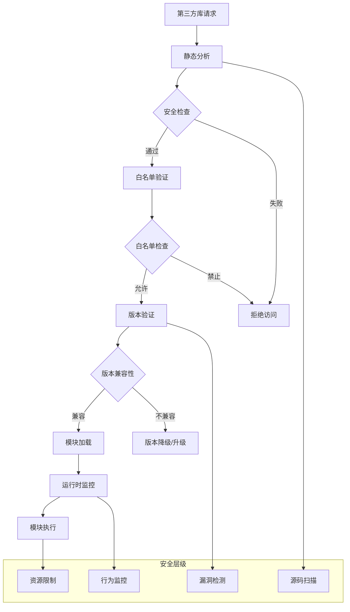
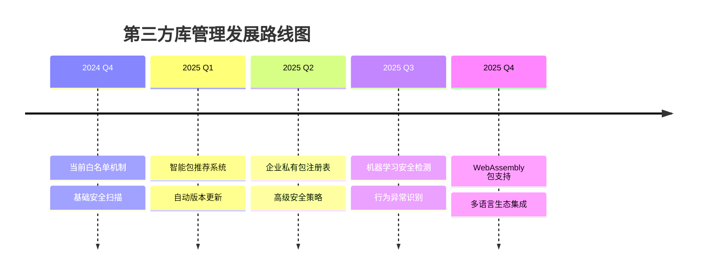

# 06 - 第三方库管理和白名单机制

> **依赖管理** - 深入解析 n8n 中第三方库的安全管理、白名单机制和最佳实践

本文档详细分析 n8n 如何安全地管理和使用第三方库，包括 JavaScript npm 包和 Python 包的集成机制。

---

## 🔒 安全模块管理架构

### 多层安全控制体系



### 核心安全组件

```typescript
// 第三方库安全管理器
interface LibrarySecurityManager {
  // 白名单管理
  whitelistManager: IWhitelistManager;
  
  // 模块解析器
  moduleResolver: IModuleResolver;
  
  // 安全扫描器
  securityScanner: ISecurityScanner;
  
  // 版本管理器
  versionManager: IVersionManager;
  
  // 运行时监控
  runtimeMonitor: IRuntimeMonitor;
}

// 模块安全策略
interface ModuleSecurityPolicy {
  // 允许的模块类型
  allowedTypes: ('builtin' | 'external' | 'local')[];
  
  // 扫描策略
  scanningPolicy: {
    staticAnalysis: boolean;
    vulnerabilityCheck: boolean;
    licenseValidation: boolean;
    behaviorAnalysis: boolean;
  };
  
  // 访问限制
  accessRestrictions: {
    networkAccess: boolean;
    fileSystemAccess: boolean;
    processAccess: boolean;
    envVariableAccess: boolean;
  };
}
```

---

## 📦 JavaScript NPM 包管理

### 内置模块白名单

```typescript
// 基于源码分析的内置模块配置
const ALLOWED_BUILTIN_MODULES = {
  // 核心实用工具
  'crypto': {
    version: 'latest',
    restrictedFunctions: ['randomBytes'], // 限制某些随机函数
    allowedFunctions: ['createHash', 'createHmac', 'pbkdf2'],
    securityLevel: 'high'
  },
  
  'util': {
    version: 'latest',
    allowedFunctions: ['format', 'inspect', 'isDeepStrictEqual'],
    securityLevel: 'medium'
  },
  
  'url': {
    version: 'latest',
    restrictedFunctions: ['fileURLToPath'], // 限制文件系统访问
    allowedFunctions: ['URL', 'URLSearchParams'],
    securityLevel: 'medium'
  },
  
  'querystring': {
    version: 'latest',
    allowedFunctions: ['parse', 'stringify'],
    securityLevel: 'low'
  },
  
  'path': {
    version: 'latest',
    restrictedFunctions: ['resolve'], // 限制绝对路径解析
    allowedFunctions: ['join', 'basename', 'dirname', 'extname'],
    securityLevel: 'medium'
  },
  
  // 流处理
  'stream': {
    version: 'latest',
    allowedClasses: ['Readable', 'Writable', 'Transform'],
    securityLevel: 'medium'
  },
  
  // 事件处理
  'events': {
    version: 'latest',
    allowedClasses: ['EventEmitter'],
    securityLevel: 'low'
  },
  
  // 数据压缩
  'zlib': {
    version: 'latest',
    allowedFunctions: ['gzip', 'gunzip', 'deflate', 'inflate'],
    securityLevel: 'medium'
  }
} as const;

// 被完全禁用的危险模块
const BLOCKED_BUILTIN_MODULES = [
  'fs', 'fs/promises',           // 文件系统访问
  'child_process',               // 子进程创建
  'cluster', 'worker_threads',   // 多进程/线程
  'dgram', 'net', 'tls',        // 底层网络
  'os', 'process',              // 操作系统信息
  'vm', 'v8',                   // 虚拟机和引擎
  'module', 'repl',             // 模块系统
  'inspector', 'perf_hooks'     // 调试和性能分析
] as const;
```

### 外部模块白名单系统

```typescript
// 精心策划的外部模块白名单
const ALLOWED_EXTERNAL_MODULES: Record<string, ModuleConfig> = {
  // 实用工具库
  'lodash': {
    version: '^4.17.21',
    allowedFunctions: [
      // 数组操作
      'chunk', 'compact', 'drop', 'flatten', 'uniq', 'zip',
      // 对象操作  
      'get', 'set', 'pick', 'omit', 'merge', 'clone',
      // 字符串操作
      'camelCase', 'kebabCase', 'snakeCase', 'startCase',
      // 数据验证
      'isArray', 'isObject', 'isString', 'isNumber', 'isEmpty'
    ],
    restrictedFunctions: [
      'template', 'templateSettings', // 模板引擎可能的 XSS 风险
    ],
    securityLevel: 'medium'
  },
  
  // 日期处理
  'moment': {
    version: '^2.29.0',
    allowedFunctions: ['*'], // 日期库相对安全
    securityLevel: 'low',
    deprecationWarning: '建议使用 dayjs 替代'
  },
  
  'dayjs': {
    version: '^1.11.0',
    allowedFunctions: ['*'],
    securityLevel: 'low'
  },
  
  // HTTP 请求
  'axios': {
    version: '^1.6.0',
    allowedMethods: ['get', 'post', 'put', 'patch', 'delete'],
    restrictedConfigs: [
      'adapter', // 防止自定义适配器
      'transformRequest', 'transformResponse' // 防止恶意转换
    ],
    securityLevel: 'high',
    networkRestrictions: {
      allowedProtocols: ['http', 'https'],
      blockedHosts: ['localhost', '127.0.0.1', '0.0.0.0'],
      maxTimeout: 30000 // 30秒超时限制
    }
  },
  
  // HTML/XML 解析
  'cheerio': {
    version: '^1.0.0-rc.12',
    allowedFunctions: ['load', 'html', 'text', 'attr', 'find'],
    restrictedFunctions: ['*'], // 默认限制，只允许白名单
    securityLevel: 'medium',
    sandboxed: true
  },
  
  'xml2js': {
    version: '^0.6.2',
    allowedFunctions: ['parseString', 'Builder'],
    securityLevel: 'medium',
    parsingLimits: {
      maxXMLSize: '10MB',
      maxDepth: 20,
      maxChildren: 10000
    }
  },
  
  // 数据验证
  'joi': {
    version: '^17.11.0',
    allowedFunctions: ['*'], // 验证库相对安全
    securityLevel: 'low'
  },
  
  'validator': {
    version: '^13.11.0',
    allowedFunctions: ['*'],
    securityLevel: 'low'
  },
  
  // UUID 生成
  'uuid': {
    version: '^9.0.0',
    allowedFunctions: ['v1', 'v4', 'v5'],
    securityLevel: 'low'
  },
  
  // 加密和哈希
  'bcrypt': {
    version: '^5.1.0',
    allowedFunctions: ['hash', 'compare'],
    restrictedFunctions: ['hashSync', 'compareSync'], // 避免阻塞
    securityLevel: 'high'
  },
  
  'jsonwebtoken': {
    version: '^9.0.0',
    allowedFunctions: ['sign', 'verify', 'decode'],
    securityLevel: 'high',
    algorithmRestrictions: ['HS256', 'HS384', 'HS512', 'RS256']
  },
  
  // MIME 类型
  'mime-types': {
    version: '^2.1.35',
    allowedFunctions: ['lookup', 'contentType'],
    securityLevel: 'low'
  },
  
  // 查询字符串处理
  'qs': {
    version: '^6.11.0',
    allowedFunctions: ['parse', 'stringify'],
    securityLevel: 'low',
    options: {
      depth: 5, // 限制嵌套深度
      arrayLimit: 20 // 限制数组长度
    }
  }
};

// 危险的外部模块黑名单
const BLOCKED_EXTERNAL_MODULES = [
  // 文件系统相关
  'fs-extra', 'graceful-fs', 'rimraf', 'mkdirp',
  
  // 进程和系统
  'shelljs', 'execa', 'cross-spawn', 'which',
  
  // 网络底层
  'net', 'dgram', 'dns',
  
  // 模板引擎 (可能的代码注入)
  'handlebars', 'mustache', 'ejs', 'pug',
  
  // 代码执行
  'eval', 'vm2', 'isolated-vm',
  
  // 数据库驱动 (直接数据库访问)
  'mysql', 'mysql2', 'pg', 'mongodb', 'redis'
] as const;
```

### 动态模块解析器

```typescript
// 智能模块解析和安全检查
class SecureModuleResolver {
  private whitelist: ModuleWhitelist;
  private cache: ModuleCache;
  private scanner: SecurityScanner;
  
  public async resolveModule(
    moduleName: string,
    context: ExecutionContext
  ): Promise<ResolvedModule | null> {
    // 1. 预检查：模块名称验证
    if (!this.isValidModuleName(moduleName)) {
      throw new SecurityError(`Invalid module name: ${moduleName}`);
    }
    
    // 2. 黑名单检查
    if (this.isBlocked(moduleName)) {
      throw new SecurityError(`Module '${moduleName}' is blocked`);
    }
    
    // 3. 白名单验证
    const whitelistEntry = this.whitelist.get(moduleName);
    if (!whitelistEntry) {
      throw new SecurityError(`Module '${moduleName}' is not whitelisted`);
    }
    
    // 4. 版本检查
    const resolvedVersion = await this.resolveVersion(moduleName, whitelistEntry.version);
    
    // 5. 安全扫描
    const scanResult = await this.scanner.scanModule(moduleName, resolvedVersion);
    if (scanResult.hasVulnerabilities) {
      throw new SecurityError(`Module '${moduleName}' failed security scan`);
    }
    
    // 6. 创建安全包装器
    const secureModule = this.createSecureWrapper(moduleName, whitelistEntry);
    
    // 7. 缓存结果
    this.cache.set(moduleName, secureModule);
    
    return secureModule;
  }
  
  private createSecureWrapper(
    moduleName: string,
    config: ModuleConfig
  ): SecureModule {
    const originalModule = require(moduleName);
    
    return new Proxy(originalModule, {
      get: (target, prop: string) => {
        // 检查函数访问权限
        if (config.restrictedFunctions?.includes(prop)) {
          throw new SecurityError(`Function '${prop}' is restricted`);
        }
        
        if (config.allowedFunctions && 
            config.allowedFunctions[0] !== '*' && 
            !config.allowedFunctions.includes(prop)) {
          throw new SecurityError(`Function '${prop}' is not allowed`);
        }
        
        const value = target[prop];
        
        // 包装函数以添加安全监控
        if (typeof value === 'function') {
          return this.wrapFunction(value, moduleName, prop, config);
        }
        
        return value;
      },
      
      set: () => {
        throw new SecurityError('Module modification is not allowed');
      },
      
      defineProperty: () => {
        throw new SecurityError('Module property definition is not allowed');
      }
    });
  }
  
  private wrapFunction(
    fn: Function,
    moduleName: string,
    functionName: string,
    config: ModuleConfig
  ): Function {
    return (...args: any[]) => {
      // 参数安全检查
      this.validateArguments(args, moduleName, functionName);
      
      // 执行监控
      const startTime = Date.now();
      
      try {
        const result = fn.apply(this, args);
        
        // 异步结果监控
        if (result instanceof Promise) {
          return result.then(
            (res) => {
              this.logFunctionCall(moduleName, functionName, Date.now() - startTime, true);
              return res;
            },
            (err) => {
              this.logFunctionCall(moduleName, functionName, Date.now() - startTime, false, err);
              throw err;
            }
          );
        }
        
        this.logFunctionCall(moduleName, functionName, Date.now() - startTime, true);
        return result;
        
      } catch (error) {
        this.logFunctionCall(moduleName, functionName, Date.now() - startTime, false, error);
        throw error;
      }
    };
  }
}
```

---

## 🐍 Python 包管理 (Pyodide)

### Pyodide 支持的包生态

```python
# Pyodide 预装包列表 (基于实际分析)
PYODIDE_BUILTIN_PACKAGES = {
    # 数据科学核心
    'numpy': '1.24.3',
    'pandas': '1.5.3', 
    'scipy': '1.10.1',
    'matplotlib': '3.5.2',
    'scikit-learn': '1.2.2',
    'statsmodels': '0.13.5',
    
    # 数据处理
    'lxml': '4.9.2',
    'beautifulsoup4': '4.11.2',
    'requests': '2.28.2',
    'urllib3': '1.26.14',
    
    # 数据格式
    'openpyxl': '3.1.0',
    'xlsxwriter': '3.0.8',
    'pyyaml': '6.0',
    'toml': '0.10.2',
    'configparser': '5.3.0',
    
    # 网络和API
    'httpx': '0.23.3',
    'websockets': '10.4',
    'jsonschema': '4.17.3',
    
    # 加密和安全
    'cryptography': '3.4.8',
    'bcrypt': '3.2.0',
    'pyjwt': '2.6.0',
    
    # 图像处理
    'pillow': '9.4.0',
    'imageio': '2.25.0',
    
    # 机器学习
    'xgboost': '1.7.3',
    'lightgbm': '3.3.5',
    'nltk': '3.8',
    
    # 其他实用工具
    'regex': '2022.10.31',
    'python-dateutil': '2.8.2',
    'pytz': '2022.7.1',
    'tqdm': '4.64.1'
}

# Python 包安全管理器
class PythonPackageManager:
    def __init__(self):
        self.allowed_packages = set(PYODIDE_BUILTIN_PACKAGES.keys())
        self.package_cache = {}
        self.security_scanner = PythonSecurityScanner()
    
    async def install_package(self, package_name: str, version: str = None):
        """安全的 Python 包安装"""
        # 1. 包名验证
        if not self.is_valid_package_name(package_name):
            raise SecurityError(f"Invalid package name: {package_name}")
        
        # 2. 白名单检查
        if package_name not in self.allowed_packages:
            raise SecurityError(f"Package '{package_name}' is not whitelisted")
        
        # 3. 版本验证
        validated_version = self.validate_version(package_name, version)
        
        # 4. 安全扫描
        scan_result = await self.security_scanner.scan_package(
            package_name, validated_version
        )
        
        if scan_result.has_vulnerabilities:
            raise SecurityError(f"Package '{package_name}' failed security scan")
        
        # 5. 使用 micropip 安装
        try:
            import micropip
            await micropip.install(f"{package_name}=={validated_version}")
            
            # 6. 缓存包信息
            self.package_cache[package_name] = {
                'version': validated_version,
                'installed_at': time.time(),
                'scan_result': scan_result
            }
            
            return True
            
        except Exception as e:
            raise InstallationError(f"Failed to install {package_name}: {str(e)}")
```

### Python 代码安全执行

```python
# Python 代码执行安全机制
class SecurePythonExecutor:
    def __init__(self):
        self.restricted_builtins = {
            'eval', 'exec', 'compile', '__import__',
            'open', 'file', 'input', 'raw_input',
            'globals', 'locals', 'vars', 'dir',
            'getattr', 'setattr', 'delattr', 'hasattr'
        }
        
        self.allowed_modules = set(PYODIDE_BUILTIN_PACKAGES.keys())
        
    def create_safe_globals(self, context: dict) -> dict:
        """创建安全的全局命名空间"""
        safe_builtins = {}
        
        # 只允许安全的内置函数
        for name in __builtins__:
            if name not in self.restricted_builtins:
                safe_builtins[name] = __builtins__[name]
        
        # 添加受控的内置函数
        safe_builtins.update({
            'len': len,
            'str': str,
            'int': int,
            'float': float,
            'bool': bool,
            'list': list,
            'dict': dict,
            'tuple': tuple,
            'set': set,
            'range': range,
            'enumerate': enumerate,
            'zip': zip,
            'map': map,
            'filter': filter,
            'sorted': sorted,
            'sum': sum,
            'max': max,
            'min': min,
            'abs': abs,
            'round': round,
            'print': self.safe_print,
        })
        
        # 添加执行上下文
        safe_globals = {
            '__builtins__': safe_builtins,
            '__name__': '__main__',
            '__doc__': None,
            # n8n 上下文对象
            'input_data': context.get('input_data', []),
            'node_params': context.get('node_params', {}),
            'workflow_info': context.get('workflow_info', {}),
        }
        
        return safe_globals
    
    def safe_print(self, *args, **kwargs):
        """安全的打印函数 - 限制输出"""
        output = ' '.join(str(arg) for arg in args)
        
        # 限制输出长度
        if len(output) > 10000:
            output = output[:10000] + '... [truncated]'
        
        # 过滤敏感信息
        output = self.filter_sensitive_info(output)
        
        print(output, **kwargs)
    
    def filter_sensitive_info(self, text: str) -> str:
        """过滤敏感信息"""
        import re
        
        # 过滤可能的密钥、密码等
        patterns = [
            r'(?i)(password|passwd|pwd)[:=]\s*[^\s]+',
            r'(?i)(key|token|secret)[:=]\s*[^\s]+',
            r'(?i)(api_key|apikey)[:=]\s*[^\s]+',
        ]
        
        for pattern in patterns:
            text = re.sub(pattern, r'\1: [REDACTED]', text)
        
        return text
    
    async def execute_python_code(
        self, 
        code: str, 
        context: dict,
        timeout: int = 30
    ) -> dict:
        """安全执行 Python 代码"""
        
        # 1. 代码静态分析
        security_issues = self.analyze_code_security(code)
        if security_issues:
            raise SecurityError(f"Code security issues: {security_issues}")
        
        # 2. 创建安全执行环境
        safe_globals = self.create_safe_globals(context)
        safe_locals = {}
        
        # 3. 设置执行超时
        import asyncio
        
        try:
            # 4. 执行代码
            exec(code, safe_globals, safe_locals)
            
            # 5. 提取结果
            result = safe_locals.get('result', None)
            
            return {
                'success': True,
                'result': result,
                'locals': {k: v for k, v in safe_locals.items() 
                          if not k.startswith('_')},
            }
            
        except Exception as e:
            return {
                'success': False,
                'error': str(e),
                'error_type': type(e).__name__,
            }
    
    def analyze_code_security(self, code: str) -> list:
        """分析 Python 代码安全性"""
        import ast
        
        issues = []
        
        try:
            tree = ast.parse(code)
            
            for node in ast.walk(tree):
                # 检查危险函数调用
                if isinstance(node, ast.Call):
                    if hasattr(node.func, 'id') and node.func.id in self.restricted_builtins:
                        issues.append(f"Restricted function call: {node.func.id}")
                
                # 检查导入语句
                elif isinstance(node, ast.Import):
                    for alias in node.names:
                        if alias.name not in self.allowed_modules:
                            issues.append(f"Unauthorized import: {alias.name}")
                
                # 检查从模块导入
                elif isinstance(node, ast.ImportFrom):
                    if node.module and node.module not in self.allowed_modules:
                        issues.append(f"Unauthorized import from: {node.module}")
                
        except SyntaxError as e:
            issues.append(f"Syntax error: {e}")
        
        return issues
```

---

## 🔧 自定义模块集成

### 企业级私有包管理

```typescript
// 企业私有包管理系统
class EnterprisePackageManager {
  private privateRegistry: PrivateRegistry;
  private approvalWorkflow: ApprovalWorkflow;
  private securityPolicy: SecurityPolicy;
  
  public async registerPrivatePackage(
    packageInfo: PrivatePackageInfo,
    requester: User
  ): Promise<RegistrationResult> {
    // 1. 权限验证
    if (!this.hasRegistrationPermission(requester)) {
      throw new PermissionError('User lacks package registration permission');
    }
    
    // 2. 包内容安全扫描
    const scanResult = await this.performSecurityScan(packageInfo);
    
    // 3. 许可证合规检查
    const licenseResult = await this.validateLicense(packageInfo);
    
    // 4. 提交审批流程
    const approvalId = await this.approvalWorkflow.submit({
      packageInfo,
      scanResult,
      licenseResult,
      requester,
    });
    
    return {
      success: true,
      approvalId,
      status: 'pending_approval',
      estimatedApprovalTime: '3-5 business days',
    };
  }
  
  private async performSecurityScan(
    packageInfo: PrivatePackageInfo
  ): Promise<SecurityScanResult> {
    const scanners = [
      new VulnerabilityScanner(),
      new MalwareScanner(),
      new LicenseScanner(),
      new DependencyScanner(),
    ];
    
    const results = await Promise.all(
      scanners.map(scanner => scanner.scan(packageInfo))
    );
    
    return {
      vulnerabilities: results[0],
      malwareSignatures: results[1],
      licenseIssues: results[2],
      dependencyRisks: results[3],
      overallRisk: this.calculateOverallRisk(results),
    };
  }
}
```

### 模块版本管理

```typescript
// 智能版本管理系统
class ModuleVersionManager {
  private versionStore: VersionStore;
  private compatibilityMatrix: CompatibilityMatrix;
  
  public async resolveOptimalVersion(
    moduleName: string,
    versionConstraint: string,
    context: ExecutionContext
  ): Promise<ResolvedVersion> {
    // 1. 解析版本约束
    const constraints = this.parseVersionConstraint(versionConstraint);
    
    // 2. 获取可用版本列表
    const availableVersions = await this.getAvailableVersions(moduleName);
    
    // 3. 安全性过滤
    const secureVersions = availableVersions.filter(version =>
      this.isSecureVersion(moduleName, version)
    );
    
    // 4. 兼容性检查
    const compatibleVersions = secureVersions.filter(version =>
      this.isCompatibleVersion(moduleName, version, context)
    );
    
    // 5. 选择最优版本
    const optimalVersion = this.selectOptimalVersion(
      compatibleVersions,
      constraints
    );
    
    return {
      moduleName,
      version: optimalVersion,
      securityRating: this.getSecurityRating(moduleName, optimalVersion),
      compatibilityScore: this.getCompatibilityScore(moduleName, optimalVersion),
      recommendedBy: 'n8n_version_manager',
    };
  }
  
  private selectOptimalVersion(
    versions: Version[],
    constraints: VersionConstraint
  ): Version {
    // 综合评分算法
    const scoredVersions = versions.map(version => ({
      version,
      score: this.calculateVersionScore(version, constraints)
    }));
    
    // 返回最高分版本
    return scoredVersions.reduce((best, current) =>
      current.score > best.score ? current : best
    ).version;
  }
  
  private calculateVersionScore(
    version: Version,
    constraints: VersionConstraint
  ): number {
    let score = 0;
    
    // 安全性权重 (40%)
    score += this.getSecurityScore(version) * 0.4;
    
    // 稳定性权重 (30%)
    score += this.getStabilityScore(version) * 0.3;
    
    // 新特性权重 (20%)
    score += this.getFeatureScore(version) * 0.2;
    
    // 社区支持权重 (10%)
    score += this.getCommunityScore(version) * 0.1;
    
    return score;
  }
}
```

---

## 📊 使用统计和监控

### 模块使用分析

```typescript
// 模块使用情况监控
class ModuleUsageAnalytics {
  private usageStore: UsageDataStore;
  private metricsCollector: MetricsCollector;
  
  public trackModuleUsage(
    moduleName: string,
    context: ExecutionContext,
    performanceMetrics: PerformanceMetrics
  ): void {
    const usageData: ModuleUsageData = {
      moduleName,
      timestamp: Date.now(),
      executionId: context.executionId,
      nodeId: context.nodeId,
      workflowId: context.workflowId,
      userId: context.userId,
      
      // 性能指标
      loadTime: performanceMetrics.loadTime,
      executionTime: performanceMetrics.executionTime,
      memoryUsage: performanceMetrics.memoryUsage,
      
      // 使用模式
      functionsUsed: performanceMetrics.functionsUsed,
      dataSize: performanceMetrics.inputDataSize,
      
      // 错误信息
      errors: performanceMetrics.errors,
      warnings: performanceMetrics.warnings,
    };
    
    this.usageStore.record(usageData);
    this.updateMetrics(usageData);
  }
  
  public generateUsageReport(): UsageReport {
    const data = this.usageStore.getLastNDays(30);
    
    return {
      // 热门模块
      topModules: this.getTopModules(data),
      
      // 性能统计
      performanceStats: this.calculatePerformanceStats(data),
      
      // 错误分析
      errorAnalysis: this.analyzeErrors(data),
      
      // 安全事件
      securityEvents: this.getSecurityEvents(data),
      
      // 优化建议
      recommendations: this.generateRecommendations(data),
    };
  }
  
  private generateRecommendations(data: ModuleUsageData[]): Recommendation[] {
    const recommendations: Recommendation[] = [];
    
    // 检查未使用的模块
    const unusedModules = this.findUnusedModules(data);
    if (unusedModules.length > 0) {
      recommendations.push({
        type: 'cleanup',
        priority: 'low',
        message: `Consider removing unused modules: ${unusedModules.join(', ')}`,
        potentialSavings: this.calculateSavings(unusedModules),
      });
    }
    
    // 检查性能瓶颈
    const slowModules = this.findSlowModules(data);
    if (slowModules.length > 0) {
      recommendations.push({
        type: 'performance',
        priority: 'medium',
        message: `Modules with performance issues: ${slowModules.join(', ')}`,
        suggestedActions: ['Update to latest version', 'Review usage patterns'],
      });
    }
    
    // 检查安全更新
    const outdatedModules = this.findOutdatedModules(data);
    if (outdatedModules.length > 0) {
      recommendations.push({
        type: 'security',
        priority: 'high',
        message: `Modules requiring security updates: ${outdatedModules.join(', ')}`,
        urgency: 'immediate',
      });
    }
    
    return recommendations;
  }
}
```

### 安全事件监控

```typescript
// 安全事件监控和响应系统
class SecurityEventMonitor {
  private eventStore: SecurityEventStore;
  private alertSystem: AlertSystem;
  private responseActions: ResponseActionManager;
  
  public monitorSecurityEvent(event: SecurityEvent): void {
    // 记录事件
    this.eventStore.record(event);
    
    // 评估威胁级别
    const threatLevel = this.assessThreatLevel(event);
    
    // 触发相应的响应措施
    this.triggerResponse(event, threatLevel);
    
    // 更新安全指标
    this.updateSecurityMetrics(event);
  }
  
  private triggerResponse(
    event: SecurityEvent,
    threatLevel: ThreatLevel
  ): void {
    switch (threatLevel) {
      case 'CRITICAL':
        this.responseActions.executeEmergencyProtocol(event);
        this.alertSystem.sendCriticalAlert(event);
        break;
        
      case 'HIGH':
        this.responseActions.blockSuspiciousActivity(event);
        this.alertSystem.sendHighPriorityAlert(event);
        break;
        
      case 'MEDIUM':
        this.responseActions.increasedMonitoring(event);
        this.alertSystem.sendMediumPriorityAlert(event);
        break;
        
      case 'LOW':
        this.responseActions.logForReview(event);
        break;
    }
  }
  
  private assessThreatLevel(event: SecurityEvent): ThreatLevel {
    let score = 0;
    
    // 事件类型权重
    const typeWeights = {
      'unauthorized_module_access': 8,
      'privilege_escalation': 10,
      'data_exfiltration': 9,
      'malicious_code_execution': 10,
      'resource_abuse': 6,
      'policy_violation': 4,
    };
    
    score += typeWeights[event.type] || 0;
    
    // 频率加权
    if (event.frequency > 5) {
      score += 3;
    }
    
    // 用户权限级别
    if (event.userPrivileges === 'admin') {
      score += 2;
    }
    
    // 影响范围
    score += event.impactScope * 2;
    
    // 威胁级别判定
    if (score >= 15) return 'CRITICAL';
    if (score >= 10) return 'HIGH';
    if (score >= 6) return 'MEDIUM';
    return 'LOW';
  }
}
```

---

## 🎯 最佳实践指南

### 开发者使用建议

```javascript
// ✅ 推荐的第三方库使用模式

// 1. 安全地使用 lodash
const _ = require('lodash');

function processUserData(userData) {
  // 使用白名单中的安全函数
  const cleaned = _.pick(userData, ['name', 'email', 'age']);
  const validated = _.pickBy(cleaned, _.isString);
  
  return {
    displayName: _.startCase(validated.name),
    email: validated.email.toLowerCase(),
    isValid: _.every(validated, val => val && val.length > 0)
  };
}

// 2. 安全的 HTTP 请求
const axios = require('axios');

async function fetchExternalData(url) {
  try {
    const response = await axios.get(url, {
      timeout: 10000,     // 10秒超时
      maxRedirects: 3,    // 限制重定向
      maxContentLength: 1024 * 1024, // 1MB 限制
    });
    
    return response.data;
  } catch (error) {
    console.error('HTTP request failed:', error.message);
    return null;
  }
}

// 3. 安全的数据验证
const Joi = require('joi');

function validateInput(data) {
  const schema = Joi.object({
    name: Joi.string().min(1).max(100).required(),
    email: Joi.string().email().required(),
    age: Joi.number().integer().min(0).max(150),
  });
  
  const { error, value } = schema.validate(data);
  
  if (error) {
    throw new Error(`Validation failed: ${error.details[0].message}`);
  }
  
  return value;
}

// ❌ 避免的不安全模式

// 不要试图绕过模块限制
// const fs = require('fs'); // ❌ 被阻止

// 不要使用动态模块导入
// const moduleName = userInput;
// const dynamicModule = require(moduleName); // ❌ 安全风险

// 不要忽略错误处理
// const data = await axios.get(url); // ❌ 缺少错误处理
```

### Python 包使用建议

```python
# ✅ 推荐的 Python 包使用模式

import pandas as pd
import numpy as np
import requests
from datetime import datetime

def process_data_safely(input_data):
    """安全的数据处理示例"""
    try:
        # 使用 pandas 处理数据
        df = pd.DataFrame(input_data)
        
        # 数据清理和验证
        df = df.dropna()
        df = df[df['value'] > 0]  # 简单验证
        
        # 安全的聚合操作
        result = {
            'count': len(df),
            'mean': float(df['value'].mean()) if not df.empty else 0,
            'sum': float(df['value'].sum()) if not df.empty else 0,
            'processed_at': datetime.now().isoformat()
        }
        
        return result
        
    except Exception as e:
        return {'error': str(e), 'success': False}

def safe_http_request(url):
    """安全的 HTTP 请求"""
    try:
        response = requests.get(
            url,
            timeout=10,
            headers={'User-Agent': 'n8n-python-node/1.0'},
        )
        response.raise_for_status()
        return response.json()
        
    except requests.RequestException as e:
        print(f"Request failed: {e}")
        return None

# ❌ 避免的不安全模式

# 不要使用危险的内置函数
# result = eval(user_input)  # ❌ 被阻止

# 不要尝试访问文件系统
# with open('/etc/passwd', 'r') as f:  # ❌ 被阻止
#     content = f.read()

# 不要导入未授权的模块
# import os  # ❌ 被阻止
# import subprocess  # ❌ 被阻止
```

---

## 📈 未来发展方向

### 包管理系统演进



### 技术创新方向

1. **AI 驱动的包管理**
   - 智能包推荐算法
   - 自动安全风险评估
   - 使用模式学习优化

2. **零信任包验证**
   - 运行时行为监控
   - 动态权限调整
   - 实时威胁检测

3. **多语言生态统一**
   - WebAssembly 通用运行时
   - 跨语言包依赖管理
   - 统一的安全策略

---

## 💡 总结

n8n 的第三方库管理系统通过多层安全机制，在保证功能丰富性的同时维护了高度的安全性。白名单机制、版本管理、安全扫描和运行时监控的结合，为用户提供了既安全又强大的代码执行环境。

### 核心优势
- **安全第一**: 严格的白名单和多层安全检查
- **功能完整**: 涵盖主要开发需求的包生态
- **智能管理**: 自动化的版本选择和优化建议
- **可监控**: 全面的使用统计和安全事件追踪

### 使用建议
- 遵循最佳实践，使用推荐的安全编程模式
- 定期更新模块版本以获得安全修复
- 监控模块使用情况，及时清理不需要的依赖
- 在企业环境中建立私有包管理策略

---

*第三方库的安全管理是代码执行环境的关键组成部分，n8n 通过创新的安全机制为用户提供了既强大又安全的开发体验。*