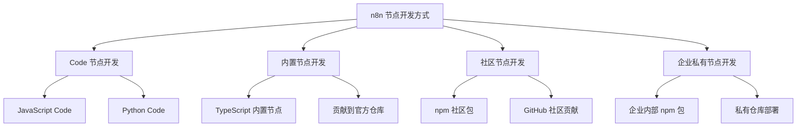
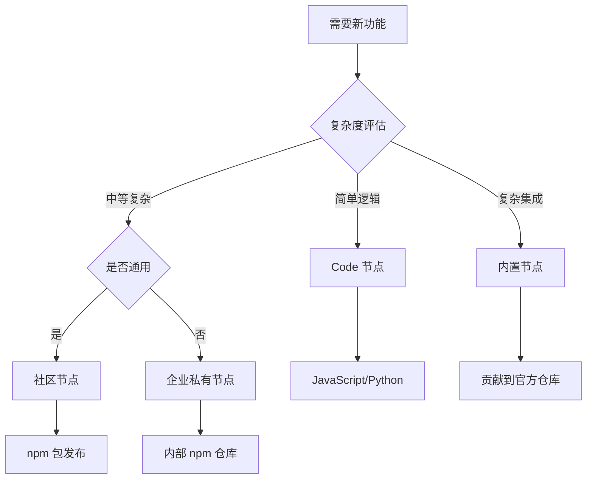

# 10 - 最佳实践和开发指南

> **实战指导** - n8n 节点开发的完整实践指南，包括第三方节点开发、Code 节点最佳实践和性能优化技巧

本文档为 n8n 开发者提供全方位的实践指导，涵盖从简单 Code 节点到复杂第三方节点的完整开发流程。

---

## 🎯 开发方式概览

### 四种主要开发方式



### 开发方式对比分析

| 开发方式 | 技术要求 | 开发时间 | 部署复杂度 | 维护成本 | 适用场景 |
|----------|----------|----------|------------|----------|----------|
| **Code 节点** | 低 ⭐⭐ | 短 ⭐ | 无 | 低 ⭐ | 快速原型、简单逻辑 |
| **内置节点** | 高 ⭐⭐⭐⭐ | 长 ⭐⭐⭐⭐ | 中 ⭐⭐⭐ | 中 ⭐⭐⭐ | 官方功能扩展 |
| **社区节点** | 中 ⭐⭐⭐ | 中 ⭐⭐⭐ | 低 ⭐⭐ | 中 ⭐⭐⭐ | 通用功能分享 |
| **企业节点** | 中 ⭐⭐⭐ | 中 ⭐⭐⭐ | 高 ⭐⭐⭐⭐ | 高 ⭐⭐⭐⭐ | 企业内部集成 |

---

## 💻 Code 节点开发最佳实践

### JavaScript Code 节点开发

#### 🎯 **基础结构和模式**

```javascript
// ✅ 推荐的 JavaScript Code 节点结构
function main() {
  // 1. 输入数据获取和验证
  const inputData = $input.all();
  
  if (!inputData || inputData.length === 0) {
    return [{ json: { error: 'No input data provided' } }];
  }
  
  // 2. 参数获取和默认值设置
  const options = {
    operation: $node.parameter.operation || 'transform',
    includeMetadata: $node.parameter.includeMetadata || false,
    batchSize: parseInt($node.parameter.batchSize) || 100,
  };
  
  // 3. 核心业务逻辑
  const results = [];
  
  try {
    for (const item of inputData) {
      if (!item.json) continue;
      
      const processed = processItem(item.json, options);
      
      results.push({
        json: processed,
        // 保留二进制数据
        binary: item.binary || {},
        // 添加元数据
        ...(options.includeMetadata && { 
          metadata: {
            processedAt: new Date().toISOString(),
            nodeId: $node.id,
            executionId: $execution.id
          }
        })
      });
    }
    
    return [results];
    
  } catch (error) {
    // 4. 统一错误处理
    return handleError(error, inputData);
  }
}

// 业务逻辑分离
function processItem(data, options) {
  switch (options.operation) {
    case 'transform':
      return transformData(data);
    case 'validate':
      return validateData(data);
    case 'aggregate':
      return aggregateData(data);
    default:
      throw new Error(`Unknown operation: ${options.operation}`);
  }
}

function transformData(data) {
  return {
    id: data.id,
    // 使用可选链避免错误
    name: data.user?.name || 'Unknown',
    // 安全的类型转换
    age: parseInt(data.age) || 0,
    // 数据清理和标准化
    email: (data.email || '').toLowerCase().trim(),
    // 计算字段
    displayName: `${data.user?.firstName || ''} ${data.user?.lastName || ''}`.trim(),
    // 时间处理
    createdAt: new Date(data.created_at).toISOString(),
  };
}

function validateData(data) {
  const errors = [];
  
  if (!data.id) errors.push('Missing required field: id');
  if (!data.email || !/\S+@\S+\.\S+/.test(data.email)) {
    errors.push('Invalid email format');
  }
  if (data.age && (data.age < 0 || data.age > 150)) {
    errors.push('Invalid age range');
  }
  
  return {
    ...data,
    isValid: errors.length === 0,
    validationErrors: errors,
  };
}

function handleError(error, inputData) {
  console.error('Processing error:', error.message);
  
  // 返回错误信息和原始数据
  return [{
    json: {
      error: true,
      message: error.message,
      timestamp: new Date().toISOString(),
      inputCount: inputData.length,
    }
  }];
}

// 执行主函数
return main();
```

#### 🚀 **异步操作和性能优化**

```javascript
// ✅ 异步操作最佳实践
async function asyncMain() {
  const inputData = $input.all();
  const batchSize = 10; // 控制并发数量
  
  // 批量处理避免内存溢出
  const results = [];
  
  for (let i = 0; i < inputData.length; i += batchSize) {
    const batch = inputData.slice(i, i + batchSize);
    
    // 并行处理批次内的项目
    const batchPromises = batch.map(async (item) => {
      try {
        return await processItemAsync(item.json);
      } catch (error) {
        console.error(`Error processing item ${item.json.id}:`, error.message);
        return { error: true, message: error.message, originalData: item.json };
      }
    });
    
    const batchResults = await Promise.all(batchPromises);
    results.push(...batchResults.map(result => ({ json: result })));
    
    // 批次间短暂延迟，避免过载
    if (i + batchSize < inputData.length) {
      await sleep(100); // 100ms 延迟
    }
  }
  
  return [results];
}

async function processItemAsync(data) {
  // 模拟异步处理（API 调用、数据库操作等）
  const response = await $request.get(`https://api.example.com/enrich/${data.id}`, {
    timeout: 5000,
    headers: {
      'Authorization': `Bearer ${$env.API_TOKEN}`,
      'Content-Type': 'application/json',
    }
  });
  
  return {
    ...data,
    enriched: response.data,
    processedAt: new Date().toISOString(),
  };
}

function sleep(ms) {
  return new Promise(resolve => setTimeout(resolve, ms));
}

return await asyncMain();
```

#### 🔒 **安全编程实践**

```javascript
// ✅ 安全编程最佳实践
function secureProcessing() {
  const inputData = $input.all();
  
  // 输入验证和清理
  const cleanedData = inputData.map(item => {
    if (!item.json || typeof item.json !== 'object') {
      throw new Error('Invalid input: Expected JSON object');
    }
    
    return {
      json: sanitizeInput(item.json),
      binary: item.binary || {}
    };
  });
  
  return processSecurely(cleanedData);
}

function sanitizeInput(data) {
  // 深度克隆避免原始数据污染
  const sanitized = JSON.parse(JSON.stringify(data));
  
  // 移除潜在危险字段
  delete sanitized.__proto__;
  delete sanitized.constructor;
  delete sanitized.prototype;
  
  // 字符串清理
  if (typeof sanitized.content === 'string') {
    // 移除潜在的脚本内容
    sanitized.content = sanitized.content
      .replace(/<script\b[^<]*(?:(?!<\/script>)<[^<]*)*<\/script>/gi, '')
      .replace(/javascript:/gi, '')
      .replace(/on\w+\s*=\s*["'][^"']*["']/gi, '');
  }
  
  // URL 验证
  if (sanitized.url && typeof sanitized.url === 'string') {
    try {
      const parsed = new URL(sanitized.url);
      // 只允许 http/https 协议
      if (!['http:', 'https:'].includes(parsed.protocol)) {
        delete sanitized.url;
      }
    } catch (error) {
      delete sanitized.url;
    }
  }
  
  return sanitized;
}

function processSecurely(data) {
  const results = [];
  
  for (const item of data) {
    try {
      // 使用安全的数据访问模式
      const processed = {
        id: safeGet(item.json, 'id'),
        name: safeGet(item.json, 'name', '').substring(0, 100), // 长度限制
        email: validateEmail(safeGet(item.json, 'email')),
        metadata: {
          processedAt: new Date().toISOString(),
          version: '1.0.0',
        }
      };
      
      results.push({ json: processed });
      
    } catch (error) {
      console.error('Secure processing error:', error.message);
      results.push({
        json: {
          error: true,
          message: 'Processing failed due to security constraints',
        }
      });
    }
  }
  
  return [results];
}

function safeGet(obj, path, defaultValue = null) {
  try {
    return path.split('.').reduce((current, key) => {
      if (current && typeof current === 'object' && key in current) {
        return current[key];
      }
      return defaultValue;
    }, obj);
  } catch (error) {
    return defaultValue;
  }
}

function validateEmail(email) {
  if (!email || typeof email !== 'string') {
    return null;
  }
  
  const emailRegex = /^[^\s@]+@[^\s@]+\.[^\s@]+$/;
  return emailRegex.test(email) ? email.toLowerCase() : null;
}

return secureProcessing();
```

### Python Code 节点开发

#### 🐍 **Python 最佳实践结构**

```python
import json
from datetime import datetime, timezone
import re
from typing import Dict, List, Any, Optional

def main() -> List[Dict]:
    """Python Code 节点主函数"""
    try:
        # 1. 获取输入数据
        input_data = input_data or []
        
        if not input_data:
            return [{"json": {"error": "No input data provided"}}]
        
        # 2. 获取节点参数
        params = get_node_parameters()
        
        # 3. 处理数据
        results = process_data(input_data, params)
        
        return results
        
    except Exception as e:
        return handle_error(e, input_data)

def get_node_parameters() -> Dict[str, Any]:
    """获取节点参数并设置默认值"""
    return {
        'operation': node_params.get('operation', 'transform'),
        'include_metadata': node_params.get('includeMetadata', False),
        'batch_size': int(node_params.get('batchSize', 100)),
        'timeout': int(node_params.get('timeout', 30)),
    }

def process_data(data: List[Dict], params: Dict[str, Any]) -> List[Dict]:
    """核心数据处理逻辑"""
    results = []
    
    for item in data:
        if not item.get('json'):
            continue
            
        try:
            processed = process_single_item(item['json'], params)
            
            result_item = {
                'json': processed,
                'binary': item.get('binary', {})
            }
            
            # 添加元数据
            if params['include_metadata']:
                result_item['json']['_metadata'] = {
                    'processed_at': datetime.now(timezone.utc).isoformat(),
                    'processor': 'python_code_node',
                    'version': '1.0.0'
                }
            
            results.append(result_item)
            
        except Exception as e:
            print(f"Error processing item: {str(e)}")
            results.append({
                'json': {
                    'error': True,
                    'message': str(e),
                    'original_data': item['json']
                }
            })
    
    return results

def process_single_item(data: Dict[str, Any], params: Dict[str, Any]) -> Dict[str, Any]:
    """处理单个数据项"""
    operation = params['operation']
    
    if operation == 'transform':
        return transform_data(data)
    elif operation == 'validate':
        return validate_data(data)
    elif operation == 'analyze':
        return analyze_data(data)
    else:
        raise ValueError(f"Unknown operation: {operation}")

def transform_data(data: Dict[str, Any]) -> Dict[str, Any]:
    """数据转换逻辑"""
    import pandas as pd
    
    # 使用 pandas 进行数据处理
    if isinstance(data, dict):
        df = pd.DataFrame([data])
    else:
        df = pd.DataFrame(data)
    
    # 数据清理
    df = df.dropna()
    
    # 数据转换
    result = {
        'record_count': len(df),
        'columns': list(df.columns),
        'summary': df.describe().to_dict() if not df.empty else {},
        'processed_data': df.to_dict('records') if not df.empty else []
    }
    
    return result

def validate_data(data: Dict[str, Any]) -> Dict[str, Any]:
    """数据验证逻辑"""
    errors = []
    warnings = []
    
    # 必填字段检查
    required_fields = ['id', 'name', 'email']
    for field in required_fields:
        if not data.get(field):
            errors.append(f"Missing required field: {field}")
    
    # 邮箱格式验证
    email = data.get('email')
    if email and not is_valid_email(email):
        errors.append("Invalid email format")
    
    # 数值范围检查
    age = data.get('age')
    if age is not None:
        if not isinstance(age, (int, float)) or age < 0 or age > 150:
            errors.append("Invalid age value")
    
    # 字符串长度检查
    name = data.get('name')
    if name and len(str(name)) > 100:
        warnings.append("Name is unusually long")
    
    return {
        **data,
        'is_valid': len(errors) == 0,
        'validation_errors': errors,
        'validation_warnings': warnings,
        'validated_at': datetime.now(timezone.utc).isoformat()
    }

def analyze_data(data: Dict[str, Any]) -> Dict[str, Any]:
    """数据分析逻辑"""
    import numpy as np
    
    analysis = {
        'data_type_analysis': analyze_data_types(data),
        'content_analysis': analyze_content(data),
        'quality_score': calculate_quality_score(data),
    }
    
    return {
        **data,
        'analysis': analysis
    }

def analyze_data_types(data: Dict[str, Any]) -> Dict[str, Any]:
    """分析数据类型"""
    type_info = {}
    
    for key, value in data.items():
        type_info[key] = {
            'type': type(value).__name__,
            'is_null': value is None,
            'length': len(str(value)) if value is not None else 0,
        }
        
        # 数值类型的额外信息
        if isinstance(value, (int, float)):
            type_info[key]['is_positive'] = value > 0
            type_info[key]['is_integer'] = isinstance(value, int) or value.is_integer()
    
    return type_info

def analyze_content(data: Dict[str, Any]) -> Dict[str, Any]:
    """内容分析"""
    content_stats = {
        'total_fields': len(data),
        'non_empty_fields': len([v for v in data.values() if v]),
        'text_fields': len([v for v in data.values() if isinstance(v, str)]),
        'numeric_fields': len([v for v in data.values() if isinstance(v, (int, float))]),
    }
    
    return content_stats

def calculate_quality_score(data: Dict[str, Any]) -> float:
    """计算数据质量评分"""
    total_fields = len(data)
    if total_fields == 0:
        return 0.0
    
    non_empty_fields = len([v for v in data.values() if v])
    completeness_score = non_empty_fields / total_fields
    
    # 简单的质量评分算法
    quality_score = completeness_score * 100
    
    return round(quality_score, 2)

def is_valid_email(email: str) -> bool:
    """验证邮箱格式"""
    email_pattern = r'^[a-zA-Z0-9._%+-]+@[a-zA-Z0-9.-]+\.[a-zA-Z]{2,}$'
    return bool(re.match(email_pattern, email))

def handle_error(error: Exception, input_data: List[Dict]) -> List[Dict]:
    """统一错误处理"""
    print(f"Python Code Node Error: {str(error)}")
    
    return [{
        'json': {
            'error': True,
            'error_type': type(error).__name__,
            'message': str(error),
            'input_count': len(input_data) if input_data else 0,
            'timestamp': datetime.now(timezone.utc).isoformat(),
        }
    }]

# 执行主函数
result = main()
```

---

## 🔧 第三方节点开发完整指南

### TypeScript 自定义节点开发

#### 🏗️ **项目初始化和脚手架**

```bash
# 1. 创建节点项目
mkdir n8n-nodes-my-service
cd n8n-nodes-my-service

# 2. 初始化 npm 项目
npm init -y

# 3. 安装 n8n 开发依赖
npm install --save-dev @types/node typescript n8n-workflow n8n-core

# 4. 安装生产依赖
npm install axios dotenv

# 5. 创建 TypeScript 配置
cat > tsconfig.json << 'EOF'
{
  "compilerOptions": {
    "target": "ES2019",
    "module": "commonjs",
    "lib": ["ES2019"],
    "declaration": true,
    "outDir": "./dist",
    "rootDir": "./src",
    "strict": true,
    "esModuleInterop": true,
    "skipLibCheck": true,
    "forceConsistentCasingInFileNames": true,
    "resolveJsonModule": true
  },
  "include": ["src/**/*"],
  "exclude": ["node_modules", "dist"]
}
EOF

# 6. 创建项目结构
mkdir -p src/nodes src/credentials
```

#### 📦 **package.json 配置**

```json
{
  "name": "n8n-nodes-my-service",
  "version": "1.0.0",
  "description": "n8n nodes for MyService integration",
  "keywords": ["n8n-community-node-package"],
  "license": "MIT",
  "homepage": "https://github.com/username/n8n-nodes-my-service",
  "author": {
    "name": "Your Name",
    "email": "your.email@example.com"
  },
  "repository": {
    "type": "git",
    "url": "git+https://github.com/username/n8n-nodes-my-service.git"
  },
  "main": "index.js",
  "scripts": {
    "build": "tsc && npm run copy-icons",
    "copy-icons": "copyfiles -u 1 \"src/**/*.{png,svg}\" dist/",
    "dev": "tsc --watch",
    "format": "prettier --write \"src/**/*.ts\"",
    "lint": "eslint src --ext .ts --fix",
    "test": "jest",
    "prepack": "npm run build"
  },
  "files": [
    "dist"
  ],
  "n8n": {
    "n8nNodesApiVersion": 1,
    "credentials": [
      "dist/credentials/MyServiceApi.credentials.js"
    ],
    "nodes": [
      "dist/nodes/MyService/MyService.node.js"
    ]
  },
  "devDependencies": {
    "@types/node": "^18.0.0",
    "@typescript-eslint/eslint-plugin": "^5.0.0",
    "@typescript-eslint/parser": "^5.0.0",
    "copyfiles": "^2.4.1",
    "eslint": "^8.0.0",
    "jest": "^29.0.0",
    "prettier": "^2.8.0",
    "typescript": "^4.9.0"
  },
  "dependencies": {
    "n8n-workflow": "^1.0.0",
    "axios": "^1.0.0"
  }
}
```

#### 🔐 **凭据配置开发**

```typescript
// src/credentials/MyServiceApi.credentials.ts
import {
    IAuthenticateGeneric,
    ICredentialTestRequest,
    ICredentialType,
    INodeProperties,
} from 'n8n-workflow';

export class MyServiceApi implements ICredentialType {
    name = 'myServiceApi';
    displayName = 'MyService API';
    documentationUrl = 'https://docs.myservice.com/api';
    properties: INodeProperties[] = [
        {
            displayName: 'API Key',
            name: 'apiKey',
            type: 'string',
            typeOptions: {
                password: true,
            },
            default: '',
            required: true,
            description: 'The API key for MyService',
        },
        {
            displayName: 'Base URL',
            name: 'baseUrl',
            type: 'string',
            default: 'https://api.myservice.com',
            required: true,
            description: 'The base URL for the MyService API',
        },
        {
            displayName: 'Environment',
            name: 'environment',
            type: 'options',
            options: [
                {
                    name: 'Production',
                    value: 'production',
                },
                {
                    name: 'Staging',
                    value: 'staging',
                },
                {
                    name: 'Development',
                    value: 'development',
                },
            ],
            default: 'production',
            description: 'The environment to use',
        },
    ];

    // 认证方式配置
    authenticate: IAuthenticateGeneric = {
        type: 'generic',
        properties: {
            headers: {
                'Authorization': '=Bearer {{$credentials.apiKey}}',
                'X-Environment': '={{$credentials.environment}}',
                'Content-Type': 'application/json',
            },
        },
    };

    // 凭据测试
    test: ICredentialTestRequest = {
        request: {
            baseURL: '={{$credentials.baseUrl}}',
            url: '/v1/auth/verify',
            method: 'GET',
        },
        rules: [
            {
                type: 'responseSuccessBody',
                properties: {
                    key: 'authenticated',
                    value: true,
                },
            },
        ],
    };
}
```

#### 🎛️ **节点核心实现**

```typescript
// src/nodes/MyService/MyService.node.ts
import {
    IExecuteFunctions,
    INodeExecutionData,
    INodeType,
    INodeTypeDescription,
    NodeOperationError,
    NodeConnectionType,
} from 'n8n-workflow';

import { myServiceApiRequest, myServiceApiRequestAllItems } from './GenericFunctions';

export class MyService implements INodeType {
    description: INodeTypeDescription = {
        displayName: 'MyService',
        name: 'myService',
        icon: 'file:myservice.svg',
        group: ['transform'],
        version: 1,
        subtitle: '={{$parameter["operation"] + ": " + $parameter["resource"]}}',
        description: 'Interact with MyService API',
        defaults: {
            name: 'MyService',
        },
        inputs: [NodeConnectionType.Main],
        outputs: [NodeConnectionType.Main],
        credentials: [
            {
                name: 'myServiceApi',
                required: true,
            },
        ],
        properties: [
            {
                displayName: 'Resource',
                name: 'resource',
                type: 'options',
                noDataExpression: true,
                options: [
                    {
                        name: 'User',
                        value: 'user',
                        description: 'Operations on users',
                    },
                    {
                        name: 'Project',
                        value: 'project',
                        description: 'Operations on projects',
                    },
                    {
                        name: 'Task',
                        value: 'task',
                        description: 'Operations on tasks',
                    },
                ],
                default: 'user',
            },
            {
                displayName: 'Operation',
                name: 'operation',
                type: 'options',
                noDataExpression: true,
                displayOptions: {
                    show: {
                        resource: ['user'],
                    },
                },
                options: [
                    {
                        name: 'Create',
                        value: 'create',
                        description: 'Create a new user',
                        action: 'Create a user',
                    },
                    {
                        name: 'Delete',
                        value: 'delete',
                        description: 'Delete a user',
                        action: 'Delete a user',
                    },
                    {
                        name: 'Get',
                        value: 'get',
                        description: 'Get a user',
                        action: 'Get a user',
                    },
                    {
                        name: 'Get All',
                        value: 'getAll',
                        description: 'Get all users',
                        action: 'Get all users',
                    },
                    {
                        name: 'Update',
                        value: 'update',
                        description: 'Update a user',
                        action: 'Update a user',
                    },
                ],
                default: 'get',
            },
            
            // User 资源的具体参数
            {
                displayName: 'User ID',
                name: 'userId',
                type: 'string',
                displayOptions: {
                    show: {
                        resource: ['user'],
                        operation: ['get', 'update', 'delete'],
                    },
                },
                default: '',
                required: true,
                description: 'ID of the user to operate on',
            },
            
            // 创建和更新用户的字段
            {
                displayName: 'Name',
                name: 'name',
                type: 'string',
                displayOptions: {
                    show: {
                        resource: ['user'],
                        operation: ['create', 'update'],
                    },
                },
                default: '',
                description: 'Name of the user',
            },
            {
                displayName: 'Email',
                name: 'email',
                type: 'string',
                placeholder: 'name@email.com',
                displayOptions: {
                    show: {
                        resource: ['user'],
                        operation: ['create', 'update'],
                    },
                },
                default: '',
                description: 'Email of the user',
            },
            
            // 高级选项
            {
                displayName: 'Additional Fields',
                name: 'additionalFields',
                type: 'collection',
                placeholder: 'Add Field',
                displayOptions: {
                    show: {
                        resource: ['user'],
                        operation: ['create', 'update'],
                    },
                },
                default: {},
                options: [
                    {
                        displayName: 'Department',
                        name: 'department',
                        type: 'string',
                        default: '',
                        description: 'Department of the user',
                    },
                    {
                        displayName: 'Role',
                        name: 'role',
                        type: 'options',
                        options: [
                            { name: 'Admin', value: 'admin' },
                            { name: 'User', value: 'user' },
                            { name: 'Viewer', value: 'viewer' },
                        ],
                        default: 'user',
                        description: 'Role of the user',
                    },
                    {
                        displayName: 'Active',
                        name: 'active',
                        type: 'boolean',
                        default: true,
                        description: 'Whether the user is active',
                    },
                ],
            },
            
            // 分页选项
            {
                displayName: 'Return All',
                name: 'returnAll',
                type: 'boolean',
                displayOptions: {
                    show: {
                        resource: ['user'],
                        operation: ['getAll'],
                    },
                },
                default: false,
                description: 'Whether to return all results or only up to a given limit',
            },
            {
                displayName: 'Limit',
                name: 'limit',
                type: 'number',
                displayOptions: {
                    show: {
                        resource: ['user'],
                        operation: ['getAll'],
                        returnAll: [false],
                    },
                },
                typeOptions: {
                    minValue: 1,
                    maxValue: 500,
                },
                default: 50,
                description: 'Max number of results to return',
            },
        ],
    };

    async execute(this: IExecuteFunctions): Promise<INodeExecutionData[][]> {
        const items = this.getInputData();
        const returnData: INodeExecutionData[] = [];
        
        const resource = this.getNodeParameter('resource', 0) as string;
        const operation = this.getNodeParameter('operation', 0) as string;
        
        for (let i = 0; i < items.length; i++) {
            try {
                let responseData;
                
                if (resource === 'user') {
                    responseData = await this.executeUserOperation(operation, i);
                } else if (resource === 'project') {
                    responseData = await this.executeProjectOperation(operation, i);
                } else if (resource === 'task') {
                    responseData = await this.executeTaskOperation(operation, i);
                }
                
                // 处理响应数据
                if (Array.isArray(responseData)) {
                    returnData.push(...responseData.map(item => ({ json: item })));
                } else {
                    returnData.push({ json: responseData });
                }
                
            } catch (error) {
                if (this.continueOnFail()) {
                    returnData.push({
                        json: { error: error.message },
                        error: error,
                    });
                    continue;
                }
                throw error;
            }
        }
        
        return [returnData];
    }
    
    private async executeUserOperation(operation: string, itemIndex: number): Promise<any> {
        switch (operation) {
            case 'create':
                return this.createUser(itemIndex);
            case 'get':
                return this.getUser(itemIndex);
            case 'getAll':
                return this.getAllUsers(itemIndex);
            case 'update':
                return this.updateUser(itemIndex);
            case 'delete':
                return this.deleteUser(itemIndex);
            default:
                throw new NodeOperationError(
                    this.getNode(),
                    `The operation "${operation}" is not known!`,
                    { itemIndex }
                );
        }
    }
    
    private async createUser(itemIndex: number): Promise<any> {
        const name = this.getNodeParameter('name', itemIndex) as string;
        const email = this.getNodeParameter('email', itemIndex) as string;
        const additionalFields = this.getNodeParameter('additionalFields', itemIndex) as any;
        
        const body: any = {
            name,
            email,
            ...additionalFields,
        };
        
        return myServiceApiRequest.call(this, 'POST', '/v1/users', body);
    }
    
    private async getUser(itemIndex: number): Promise<any> {
        const userId = this.getNodeParameter('userId', itemIndex) as string;
        
        return myServiceApiRequest.call(this, 'GET', `/v1/users/${userId}`);
    }
    
    private async getAllUsers(itemIndex: number): Promise<any> {
        const returnAll = this.getNodeParameter('returnAll', itemIndex) as boolean;
        
        if (returnAll) {
            return myServiceApiRequestAllItems.call(this, 'GET', '/v1/users');
        } else {
            const limit = this.getNodeParameter('limit', itemIndex) as number;
            const response = await myServiceApiRequest.call(
                this,
                'GET',
                '/v1/users',
                {},
                { limit }
            );
            return response.users || response;
        }
    }
    
    private async updateUser(itemIndex: number): Promise<any> {
        const userId = this.getNodeParameter('userId', itemIndex) as string;
        const updateFields = this.getNodeParameter('additionalFields', itemIndex) as any;
        
        // 获取可更新的字段
        const body: any = {};
        
        if (this.getNodeParameter('name', itemIndex)) {
            body.name = this.getNodeParameter('name', itemIndex);
        }
        if (this.getNodeParameter('email', itemIndex)) {
            body.email = this.getNodeParameter('email', itemIndex);
        }
        
        Object.assign(body, updateFields);
        
        return myServiceApiRequest.call(this, 'PUT', `/v1/users/${userId}`, body);
    }
    
    private async deleteUser(itemIndex: number): Promise<any> {
        const userId = this.getNodeParameter('userId', itemIndex) as string;
        
        return myServiceApiRequest.call(this, 'DELETE', `/v1/users/${userId}`);
    }
    
    // 其他资源的操作方法
    private async executeProjectOperation(operation: string, itemIndex: number): Promise<any> {
        // Project 相关操作实现
        throw new NodeOperationError(
            this.getNode(),
            'Project operations not yet implemented',
            { itemIndex }
        );
    }
    
    private async executeTaskOperation(operation: string, itemIndex: number): Promise<any> {
        // Task 相关操作实现
        throw new NodeOperationError(
            this.getNode(),
            'Task operations not yet implemented',
            { itemIndex }
        );
    }
}
```

#### 🔧 **通用函数实现**

```typescript
// src/nodes/MyService/GenericFunctions.ts
import {
    IExecuteFunctions,
    IHttpRequestMethods,
    IRequestOptions,
    NodeApiError,
    NodeOperationError,
} from 'n8n-workflow';

/**
 * 执行 MyService API 请求
 */
export async function myServiceApiRequest(
    this: IExecuteFunctions,
    method: IHttpRequestMethods,
    endpoint: string,
    body: any = {},
    qs: any = {},
): Promise<any> {
    const credentials = await this.getCredentials('myServiceApi');
    
    const options: IRequestOptions = {
        method,
        headers: {
            'Accept': 'application/json',
            'Content-Type': 'application/json',
        },
        body,
        qs,
        uri: `${credentials.baseUrl}${endpoint}`,
        json: true,
    };
    
    try {
        const response = await this.helpers.requestWithAuthentication.call(
            this,
            'myServiceApi',
            options
        );
        
        return response;
    } catch (error) {
        // 处理特定的 API 错误
        if (error.response?.status === 401) {
            throw new NodeApiError(this.getNode(), error, {
                message: 'Authentication failed. Please check your API credentials.',
            });
        }
        
        if (error.response?.status === 429) {
            throw new NodeApiError(this.getNode(), error, {
                message: 'Rate limit exceeded. Please try again later.',
            });
        }
        
        if (error.response?.status >= 400) {
            const errorMessage = error.response?.data?.message || error.message;
            throw new NodeApiError(this.getNode(), error, {
                message: `MyService API Error: ${errorMessage}`,
            });
        }
        
        throw new NodeOperationError(this.getNode(), `Network Error: ${error.message}`);
    }
}

/**
 * 获取所有项目（处理分页）
 */
export async function myServiceApiRequestAllItems(
    this: IExecuteFunctions,
    method: IHttpRequestMethods,
    endpoint: string,
    body: any = {},
    query: any = {},
): Promise<any[]> {
    const returnData: any[] = [];
    
    let page = 1;
    const limit = 100; // 每页项目数
    
    do {
        const qs = {
            ...query,
            page,
            limit,
        };
        
        const responseData = await myServiceApiRequest.call(this, method, endpoint, body, qs);
        
        // 根据 API 响应结构调整
        const items = responseData.data || responseData.users || responseData;
        const hasMore = responseData.has_more || responseData.pagination?.has_next || false;
        
        if (Array.isArray(items)) {
            returnData.push(...items);
        } else {
            returnData.push(items);
        }
        
        if (!hasMore || items.length < limit) {
            break;
        }
        
        page++;
        
    } while (true);
    
    return returnData;
}

/**
 * 验证必需参数
 */
export function validateRequiredParameters(
    node: any,
    parameters: { [key: string]: any },
    requiredFields: string[],
    itemIndex: number,
): void {
    for (const field of requiredFields) {
        if (!parameters[field]) {
            throw new NodeOperationError(
                node,
                `Missing required parameter: ${field}`,
                { itemIndex }
            );
        }
    }
}

/**
 * 格式化错误消息
 */
export function formatErrorMessage(error: any): string {
    if (error.response?.data?.message) {
        return error.response.data.message;
    }
    
    if (error.response?.data?.error) {
        return error.response.data.error;
    }
    
    return error.message || 'An unknown error occurred';
}

/**
 * 安全地获取嵌套属性
 */
export function safeGet(obj: any, path: string, defaultValue: any = null): any {
    return path.split('.').reduce((current, key) => {
        return current && current[key] !== undefined ? current[key] : defaultValue;
    }, obj);
}

/**
 * 构建查询字符串
 */
export function buildQueryString(params: { [key: string]: any }): { [key: string]: any } {
    const query: { [key: string]: any } = {};
    
    for (const [key, value] of Object.entries(params)) {
        if (value !== undefined && value !== null && value !== '') {
            query[key] = value;
        }
    }
    
    return query;
}
```

---

## 🧪 测试和调试

### 单元测试实现

```typescript
// src/nodes/MyService/MyService.node.test.ts
import { IExecuteFunctions, INodeExecutionData } from 'n8n-workflow';
import { MyService } from './MyService.node';

describe('MyService Node', () => {
    let myService: MyService;
    let mockExecuteFunctions: Partial<IExecuteFunctions>;

    beforeEach(() => {
        myService = new MyService();
        
        mockExecuteFunctions = {
            getInputData: jest.fn(),
            getNodeParameter: jest.fn(),
            getCredentials: jest.fn(),
            helpers: {
                requestWithAuthentication: jest.fn(),
            } as any,
            getNode: jest.fn(() => ({ name: 'MyService', type: 'myService' })),
            continueOnFail: jest.fn(() => false),
        };
    });

    describe('User Operations', () => {
        it('should create a user successfully', async () => {
            // Arrange
            const inputData: INodeExecutionData[] = [{ json: {} }];
            const expectedResponse = { id: '123', name: 'John Doe', email: 'john@example.com' };

            (mockExecuteFunctions.getInputData as jest.Mock).mockReturnValue(inputData);
            (mockExecuteFunctions.getNodeParameter as jest.Mock)
                .mockReturnValueOnce('user') // resource
                .mockReturnValueOnce('create') // operation
                .mockReturnValueOnce('John Doe') // name
                .mockReturnValueOnce('john@example.com') // email
                .mockReturnValueOnce({}); // additionalFields

            (mockExecuteFunctions.getCredentials as jest.Mock).mockResolvedValue({
                apiKey: 'test-api-key',
                baseUrl: 'https://api.myservice.com',
                environment: 'test',
            });

            (mockExecuteFunctions.helpers!.requestWithAuthentication as jest.Mock)
                .mockResolvedValue(expectedResponse);

            // Act
            const result = await myService.execute.call(mockExecuteFunctions as IExecuteFunctions);

            // Assert
            expect(result).toHaveLength(1);
            expect(result[0]).toHaveLength(1);
            expect(result[0][0].json).toEqual(expectedResponse);
        });

        it('should handle API errors gracefully', async () => {
            // Arrange
            const inputData: INodeExecutionData[] = [{ json: {} }];
            const apiError = new Error('API Error');
            (apiError as any).response = { status: 400, data: { message: 'Invalid request' } };

            (mockExecuteFunctions.getInputData as jest.Mock).mockReturnValue(inputData);
            (mockExecuteFunctions.getNodeParameter as jest.Mock)
                .mockReturnValueOnce('user')
                .mockReturnValueOnce('create');
            
            (mockExecuteFunctions.continueOnFail as jest.Mock).mockReturnValue(true);
            (mockExecuteFunctions.helpers!.requestWithAuthentication as jest.Mock)
                .mockRejectedValue(apiError);

            // Act
            const result = await myService.execute.call(mockExecuteFunctions as IExecuteFunctions);

            // Assert
            expect(result[0][0].json.error).toBeDefined();
            expect(result[0][0].error).toEqual(apiError);
        });
    });
});
```

### 集成测试

```typescript
// tests/integration/MyService.integration.test.ts
import { IExecuteFunctions, INodeExecutionData } from 'n8n-workflow';
import { MyService } from '../../src/nodes/MyService/MyService.node';

describe('MyService Integration Tests', () => {
    let myService: MyService;
    let executeFunctions: IExecuteFunctions;

    beforeAll(async () => {
        // 设置测试环境
        process.env.MY_SERVICE_API_KEY = 'test-api-key';
        process.env.MY_SERVICE_BASE_URL = 'https://api-test.myservice.com';
    });

    beforeEach(() => {
        myService = new MyService();
        
        // 创建真实的执行函数模拟
        executeFunctions = createExecuteFunctionsMock();
    });

    it('should integrate with real API', async () => {
        // 这里可以添加真实的 API 集成测试
        // 注意：需要测试环境或者 mock 服务器
    });

    function createExecuteFunctionsMock(): IExecuteFunctions {
        return {
            // 实现所有必要的方法
        } as IExecuteFunctions;
    }
});
```

---

## 🚀 发布和部署

### NPM 包发布流程

```bash
# 1. 构建项目
npm run build

# 2. 运行测试
npm test

# 3. 检查包内容
npm pack --dry-run

# 4. 发布到 npm（首次）
npm publish

# 5. 后续版本发布
npm version patch  # 或 minor, major
npm publish
```

### GitHub Actions CI/CD

```yaml
# .github/workflows/ci.yml
name: CI/CD

on:
  push:
    branches: [ main, develop ]
  pull_request:
    branches: [ main ]

jobs:
  test:
    runs-on: ubuntu-latest
    
    strategy:
      matrix:
        node-version: [16.x, 18.x, 20.x]
    
    steps:
    - uses: actions/checkout@v3
    
    - name: Use Node.js ${{ matrix.node-version }}
      uses: actions/setup-node@v3
      with:
        node-version: ${{ matrix.node-version }}
        cache: 'npm'
    
    - name: Install dependencies
      run: npm ci
    
    - name: Run linting
      run: npm run lint
    
    - name: Run tests
      run: npm test
    
    - name: Build
      run: npm run build

  publish:
    needs: test
    runs-on: ubuntu-latest
    if: github.ref == 'refs/heads/main' && github.event_name == 'push'
    
    steps:
    - uses: actions/checkout@v3
    
    - name: Setup Node.js
      uses: actions/setup-node@v3
      with:
        node-version: '18'
        registry-url: 'https://registry.npmjs.org'
    
    - name: Install dependencies
      run: npm ci
    
    - name: Build
      run: npm run build
    
    - name: Publish to npm
      run: npm publish
      env:
        NODE_AUTH_TOKEN: ${{ secrets.NPM_TOKEN }}
```

---

## 📋 性能优化指南

### Code 节点性能优化

```javascript
// ✅ 性能优化最佳实践

// 1. 批量处理优化
function optimizedBatchProcessing() {
  const inputData = $input.all();
  const batchSize = 50; // 根据数据复杂度调整
  const results = [];
  
  // 使用 for 循环比 forEach 更快
  for (let i = 0; i < inputData.length; i += batchSize) {
    const batch = inputData.slice(i, i + batchSize);
    
    // 批量处理减少函数调用开销
    const batchResults = batch.map(item => {
      // 内联简单操作，避免函数调用
      return {
        json: {
          id: item.json.id,
          processed: true,
          timestamp: Date.now(),
        }
      };
    });
    
    results.push(...batchResults);
    
    // 大数据集时定期清理内存
    if (i % 1000 === 0 && global.gc) {
      global.gc();
    }
  }
  
  return [results];
}

// 2. 内存优化策略
function memoryOptimizedProcessing() {
  const inputData = $input.all();
  
  // 流式处理大数据集
  function* processItems(items) {
    for (const item of items) {
      yield {
        json: processItem(item.json),
        // 不保留原始数据引用
      };
    }
  }
  
  // 转换为数组
  const results = Array.from(processItems(inputData));
  
  return [results];
}

// 3. 异步操作优化
async function optimizedAsyncProcessing() {
  const inputData = $input.all();
  const concurrency = 5; // 限制并发数量
  
  // 使用 Promise.all 但控制并发
  const results = [];
  
  for (let i = 0; i < inputData.length; i += concurrency) {
    const batch = inputData.slice(i, i + concurrency);
    
    const batchPromises = batch.map(async (item) => {
      try {
        const response = await $request.get(`/api/data/${item.json.id}`);
        return { json: response.data };
      } catch (error) {
        return { json: { error: error.message } };
      }
    });
    
    const batchResults = await Promise.all(batchPromises);
    results.push(...batchResults);
  }
  
  return [results];
}
```

### 第三方节点性能优化

```typescript
// 节点性能优化实践
export class OptimizedMyService implements INodeType {
    // 缓存策略
    private static cache = new Map<string, any>();
    private static cacheTimeout = 5 * 60 * 1000; // 5分钟缓存
    
    async execute(this: IExecuteFunctions): Promise<INodeExecutionData[][]> {
        const items = this.getInputData();
        const returnData: INodeExecutionData[] = [];
        
        // 批量处理优化
        const batchSize = 10;
        
        for (let i = 0; i < items.length; i += batchSize) {
            const batch = items.slice(i, i + batchSize);
            
            // 并行处理批次
            const batchPromises = batch.map((item, index) => 
                this.processItem(item, i + index)
            );
            
            const batchResults = await Promise.allSettled(batchPromises);
            
            // 处理结果
            for (const result of batchResults) {
                if (result.status === 'fulfilled') {
                    returnData.push(result.value);
                } else {
                    // 错误处理
                    if (this.continueOnFail()) {
                        returnData.push({
                            json: { error: result.reason.message },
                            error: result.reason,
                        });
                    } else {
                        throw result.reason;
                    }
                }
            }
        }
        
        return [returnData];
    }
    
    private async processItem(item: INodeExecutionData, index: number): Promise<INodeExecutionData> {
        const operation = this.getNodeParameter('operation', index) as string;
        const cacheKey = `${operation}_${JSON.stringify(item.json)}`;
        
        // 检查缓存
        const cached = this.getFromCache(cacheKey);
        if (cached) {
            return { json: cached };
        }
        
        // 处理逻辑
        const result = await this.executeOperation(operation, item, index);
        
        // 缓存结果
        this.setCache(cacheKey, result);
        
        return { json: result };
    }
    
    private getFromCache(key: string): any {
        const cached = OptimizedMyService.cache.get(key);
        if (cached && Date.now() - cached.timestamp < OptimizedMyService.cacheTimeout) {
            return cached.data;
        }
        return null;
    }
    
    private setCache(key: string, data: any): void {
        OptimizedMyService.cache.set(key, {
            data,
            timestamp: Date.now(),
        });
        
        // 清理过期缓存
        if (OptimizedMyService.cache.size > 1000) {
            const now = Date.now();
            for (const [k, v] of OptimizedMyService.cache.entries()) {
                if (now - v.timestamp > OptimizedMyService.cacheTimeout) {
                    OptimizedMyService.cache.delete(k);
                }
            }
        }
    }
}
```

---

## 🔍 调试和故障排除

### 常见问题和解决方案

#### 1. Code 节点常见问题

```javascript
// ❌ 常见错误
function badPractices() {
  // 错误1：未处理空数据
  const data = $input.all()[0].json; // 可能出错
  
  // 错误2：同步操作阻塞
  const result = someSyncOperation(); // 阻塞其他工作流
  
  // 错误3：内存泄漏
  const largeArray = [];
  for (let i = 0; i < 1000000; i++) {
    largeArray.push(createLargeObject()); // 内存泄漏
  }
  
  // 错误4：未捕获异常
  const parsed = JSON.parse(userInput); // 可能抛出异常
}

// ✅ 正确做法
async function bestPractices() {
  try {
    // 1. 安全的数据访问
    const inputData = $input.all();
    if (!inputData || inputData.length === 0) {
      return [{ json: { message: 'No data to process' } }];
    }
    
    // 2. 异步操作
    const results = await Promise.all(
      inputData.map(async (item) => {
        if (!item.json) return { json: { error: 'Invalid data' } };
        
        try {
          const processed = await processItemSafely(item.json);
          return { json: processed };
        } catch (error) {
          return { json: { error: error.message } };
        }
      })
    );
    
    return [results];
    
  } catch (error) {
    console.error('Execution error:', error);
    return [{ json: { error: error.message } }];
  }
}

function processItemSafely(data) {
  // 3. 安全的 JSON 解析
  function safeJsonParse(str, fallback = null) {
    try {
      return JSON.parse(str);
    } catch {
      return fallback;
    }
  }
  
  // 4. 内存友好的处理
  const result = {
    id: data.id,
    processed: true,
    timestamp: new Date().toISOString(),
  };
  
  return result;
}
```

#### 2. 第三方节点调试

```typescript
// 调试辅助函数
export function debugLog(message: string, data?: any): void {
    if (process.env.NODE_ENV === 'development') {
        console.log(`[DEBUG] ${message}`, data ? JSON.stringify(data, null, 2) : '');
    }
}

// 错误跟踪
export function trackError(error: any, context: any): void {
    console.error('Node Error:', {
        message: error.message,
        stack: error.stack,
        context,
        timestamp: new Date().toISOString(),
    });
}

// 性能监控
export function performanceMonitor<T>(
    operation: string,
    fn: () => Promise<T>
): Promise<T> {
    return new Promise(async (resolve, reject) => {
        const start = Date.now();
        
        try {
            const result = await fn();
            const duration = Date.now() - start;
            
            if (duration > 1000) { // 超过1秒的操作
                console.warn(`Slow operation detected: ${operation} took ${duration}ms`);
            }
            
            resolve(result);
        } catch (error) {
            const duration = Date.now() - start;
            console.error(`Operation failed: ${operation} after ${duration}ms`, error);
            reject(error);
        }
    });
}
```

---

## 💡 总结和建议

### 开发方式选择指南



### 最佳实践总结

#### ✅ **推荐做法**
1. **代码质量**: 使用 TypeScript、ESLint、Prettier
2. **错误处理**: 全面的错误捕获和用户友好的错误消息
3. **性能优化**: 批量处理、缓存策略、内存管理
4. **安全性**: 输入验证、输出清理、权限控制
5. **测试覆盖**: 单元测试、集成测试、E2E 测试
6. **文档完整**: 详细的使用说明和示例代码

#### ❌ **避免的做法**
1. **阻塞操作**: 避免长时间同步操作
2. **内存泄漏**: 及时清理大对象和循环引用
3. **硬编码**: 使用参数和环境变量
4. **忽略错误**: 总是处理可能的错误情况
5. **过度复杂**: 保持代码简洁和可维护性

### 开发流程建议

1. **规划阶段**: 明确需求、设计接口、评估复杂度
2. **开发阶段**: 遵循最佳实践、编写测试、文档同步
3. **测试阶段**: 单元测试、集成测试、性能测试
4. **部署阶段**: 版本管理、CI/CD、监控告警
5. **维护阶段**: 用户反馈、安全更新、性能优化

---

*本指南提供了从简单 Code 节点到复杂第三方节点开发的完整实践经验，帮助开发者在 n8n 生态中创建高质量、高性能的自动化解决方案。*