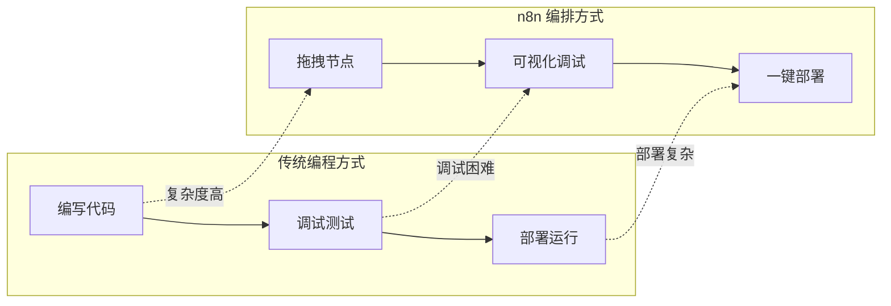
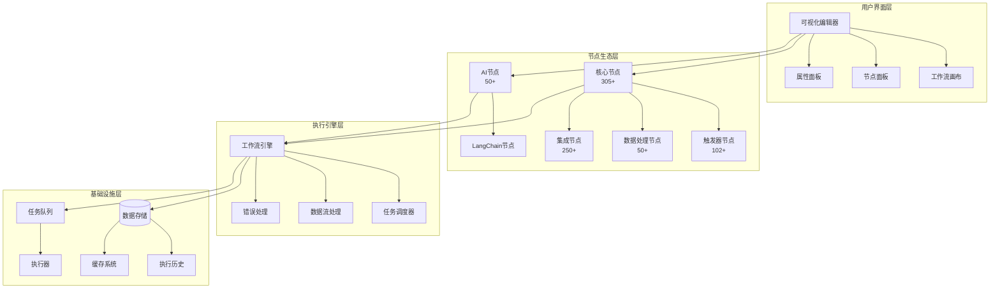
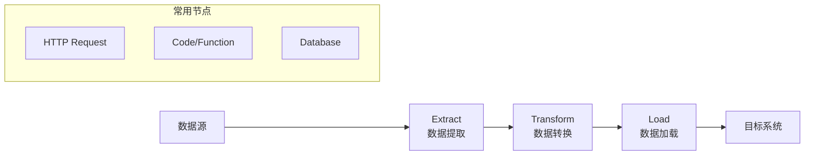
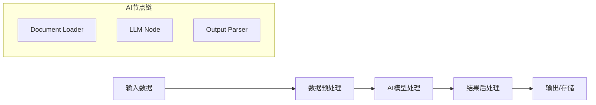
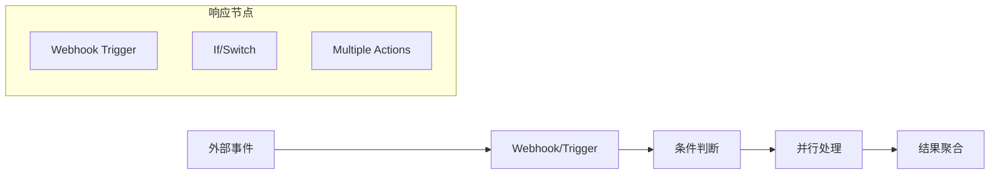

# 00 - n8n 节点编排概览

> **核心理念** - 深入理解 n8n 的节点编排哲学、设计原则和整体架构

本文档全面介绍 n8n 的节点编排系统，从设计理念到技术实现，为深入理解 n8n 的核心能力奠定基础。

---

## 1. 编排哲学与核心理念

### 1.1 设计哲学

n8n 的节点编排系统建立在以下核心理念之上：

#### 🎯 **可视化优先，代码为辅**
- **可视化工作流**: 通过拖拽节点和连接线构建复杂业务逻辑
- **代码嵌入**: 在需要时可以无缝嵌入 JavaScript/Python 代码
- **低代码高效**: 降低技术门槛的同时保持高度灵活性

#### 🔗 **连接一切，集成无限**
- **API 优先**: 每个节点都是标准化的 API 封装
- **标准化接口**: 统一的输入输出数据格式
- **插件化架构**: 支持无限扩展和自定义集成

#### 🔄 **数据驱动，流程导向**
- **数据流**: 数据在节点间自由流动和转换
- **批处理**: 支持批量数据的高效处理
- **流程控制**: 提供条件分支、循环、错误处理等控制能力

### 1.2 核心价值主张

#### 对比传统编程


#### 独特优势
1. **开发效率提升 10x**: 将原本需要几天的集成工作缩短到几小时
2. **维护成本降低**: 可视化流程易于理解和维护
3. **团队协作增强**: 非技术人员也能参与流程设计
4. **快速迭代**: 实时调试和即时反馈

---

## 2. 节点编排架构

### 2.1 整体架构图



### 2.2 核心组件

#### 🎨 **节点系统**
- **节点注册机制**: 动态加载和注册节点类型
- **版本管理**: 支持节点的多版本并存
- **类型系统**: 基于 TypeScript 的强类型定义
- **图标资源**: 统一的视觉识别系统

#### 🔄 **数据流系统**
- **数据格式**: 统一的 JSON 数据结构
- **数据转换**: 自动类型转换和格式适配
- **批处理**: 高效的批量数据处理机制
- **内存管理**: 优化的大数据集处理策略

#### ⚡ **执行引擎**
- **异步执行**: 基于 Node.js 的高并发处理
- **错误恢复**: 完善的异常处理和重试机制
- **调试支持**: 实时断点和步进调试
- **性能监控**: 详细的执行统计和性能指标

---

## 3. 节点分类体系

### 3.1 功能维度分类

#### 🏗️ **基础设施节点** (核心工具)
```
├── 数据处理
│   ├── Code (代码执行)
│   ├── Function (函数处理) 
│   ├── Set (数据设置)
│   ├── Transform (数据转换)
│   └── AiTransform (AI数据处理)
├── 流程控制
│   ├── If (条件判断)
│   ├── Switch (多路分支)
│   ├── Merge (数据合并)
│   └── Schedule (定时触发)
└── 通信工具
    ├── HttpRequest (HTTP请求)
    ├── Webhook (Webhook处理)
    ├── EmailSend (邮件发送)
    └── EmailReadImap (邮件接收)
```

#### 🌐 **集成服务节点** (外部系统)
```
├── 云平台 (8个)
│   ├── Google (17+子服务)
│   ├── Microsoft (10+子服务)
│   ├── AWS (Lambda, SNS等)
│   └── Azure (存储等)
├── 通信平台 (15个)
│   ├── Slack, Discord, Telegram
│   ├── WhatsApp, Signal
│   └── 邮件服务商 (Gmail, Outlook等)
├── 营销工具 (30+个)
│   ├── CRM (Salesforce, HubSpot等)
│   ├── 邮件营销 (Mailchimp, ActiveCampaign等)
│   └── 社交媒体 (Twitter, Facebook等)
├── 开发工具 (20+个)
│   ├── 代码管理 (GitHub, GitLab等)
│   ├── CI/CD (Jenkins, CircleCI等)
│   └── 监控工具 (Datadog, Sentry等)
└── 数据服务 (25+个)
    ├── 数据库 (PostgreSQL, MongoDB等)
    ├── 文件存储 (S3, Dropbox等)
    └── API服务 (REST, GraphQL等)
```

#### 🤖 **AI 智能节点** (LangChain生态)
```
├── 语言模型
│   ├── OpenAI (GPT系列)
│   ├── Anthropic (Claude系列)
│   ├── Cohere (Command系列)
│   └── 本地模型 (Ollama等)
├── 向量处理
│   ├── 嵌入模型 (Embeddings)
│   ├── 向量数据库 (Pinecone, Qdrant等)
│   └── 检索增强 (RAG)
├── 智能代理
│   ├── AI Agent (智能代理)
│   ├── Tool Calling (工具调用)
│   └── Memory (记忆管理)
└── 数据处理
    ├── Document Loaders (文档加载)
    ├── Text Splitters (文本分割)
    └── Output Parsers (输出解析)
```

### 3.2 复杂度维度分类

#### 🟢 **简单节点** (即配即用)
- **特点**: 配置项少，功能单一，易于理解
- **示例**: Set, If, Schedule, Code
- **用户**: 所有用户

#### 🟡 **标准节点** (需要配置)
- **特点**: 需要API凭证，多个功能选项
- **示例**: Slack, Gmail, Notion, Airtable
- **用户**: 有API使用经验的用户

#### 🟠 **复杂节点** (需要专业知识)
- **特点**: 多层级配置，复杂业务逻辑
- **示例**: Salesforce, SAP, Microsoft Dynamics
- **用户**: 专业系统集成工程师

#### 🔴 **专家节点** (需要深度定制)
- **特点**: 需要编程知识，高度定制化
- **示例**: LangChain AI节点, 自定义HTTP请求
- **用户**: 开发人员和AI专家

---

## 4. 编排模式与最佳实践

### 4.1 经典编排模式

#### 🔄 **数据ETL模式**


#### 🤖 **AI工作流模式**


#### ⚡ **事件驱动模式**


### 4.2 编排最佳实践

#### 🏗️ **架构设计原则**

1. **模块化设计**
   - 将复杂工作流拆分为可重用的子流程
   - 使用子工作流节点实现功能复用
   - 保持单个工作流的复杂度可控

2. **错误处理策略**
   - 在关键节点设置错误处理分支
   - 使用重试机制处理临时故障
   - 实现优雅的错误通知机制

3. **性能优化**
   - 合理使用并行处理提升效率
   - 避免不必要的大数据传输
   - 利用缓存减少重复计算

#### 📊 **监控和维护**

1. **执行监控**
   - 设置关键指标监控
   - 定期检查执行日志
   - 建立异常告警机制

2. **版本管理**
   - 使用Git管理工作流版本
   - 建立测试和生产环境
   - 实施变更审批流程

---

## 5. 技术实现特色

### 5.1 节点开发框架

#### 🔧 **开发架构**
```typescript
// 节点定义示例
export class ExampleNode implements INodeType {
  description: INodeTypeDescription = {
    displayName: '示例节点',
    name: 'exampleNode',
    icon: 'file:example.svg',
    group: ['transform'],
    inputs: ['main'],
    outputs: ['main'],
    properties: [
      // 节点属性定义
    ]
  };

  async execute(this: IExecuteFunctions): Promise<INodeExecutionData[][]> {
    // 节点执行逻辑
    const items = this.getInputData();
    return this.prepareOutputData(processedItems);
  }
}
```

#### 🎨 **UI组件系统**
- **动态表单**: 基于配置自动生成UI表单
- **类型验证**: 实时参数验证和错误提示
- **条件显示**: 根据用户选择动态显示/隐藏选项
- **国际化**: 多语言支持和本地化

### 5.2 扩展机制

#### 🔌 **插件系统**
1. **社区节点**: 通过npm安装第三方节点
2. **自定义节点**: 开发企业内部专用节点
3. **动态加载**: 运行时动态加载节点定义
4. **版本兼容**: 向后兼容的版本升级机制

#### 🌐 **生态系统**
```
n8n 生态系统
├── 官方节点包 (400+节点)
├── 社区节点包 (100+包)
├── AI节点生态 (LangChain集成)
├── 企业版节点 (高级功能)
└── 自定义节点 (用户开发)
```

---

## 6. 应用场景与价值创造

### 6.1 典型应用场景

#### 🏢 **企业级应用**
- **系统集成**: 连接ERP、CRM、HR等企业系统
- **数据同步**: 实现多系统间的数据实时同步
- **业务流程自动化**: 自动化审批、报告生成等流程
- **监控报警**: 构建全面的业务监控体系

#### 🤖 **AI应用场景**
- **智能客服**: 基于LLM的自动客服系统
- **内容生成**: 自动化内容创作和管理
- **数据分析**: AI驱动的数据洞察和报告
- **决策支持**: 智能化的业务决策辅助

#### 🔄 **运维自动化**
- **部署流水线**: CI/CD流程自动化
- **监控告警**: 系统监控和自动化响应
- **备份恢复**: 自动化数据备份和恢复
- **性能优化**: 基于数据的自动化性能调优

### 6.2 价值创造点

#### 💰 **经济效益**
- **开发效率**: 开发速度提升5-10倍
- **维护成本**: 维护工作量减少60-80%
- **人力节省**: 减少重复性手工操作
- **错误减少**: 自动化减少人为错误

#### 🚀 **技术价值**
- **技术栈统一**: 降低多技术栈维护成本
- **知识复用**: 工作流模板和最佳实践复用
- **快速响应**: 敏捷应对业务需求变化
- **创新加速**: 快速验证和实现新想法

---

## 7. 发展趋势与展望

### 7.1 当前发展重点

#### 🤖 **AI原生化**
- 深化LangChain集成
- 扩展多模态AI能力
- 增强AI Agent功能
- 优化AI工作流性能

#### 🌐 **生态完善**
- 扩展社区节点生态
- 增强企业级功能
- 完善开发者工具
- 加强文档和培训

### 7.2 未来发展方向

#### 🔮 **技术演进**
- **边缘计算**: 支持边缘环境部署和执行
- **实时处理**: 增强流处理和实时响应能力
- **智能优化**: AI驱动的工作流优化建议
- **协作增强**: 多人协作和版本管理功能

#### 🌍 **市场拓展**
- **行业解决方案**: 针对特定行业的深度集成
- **中小企业**: 更多适合中小企业的简化方案
- **教育培训**: 完善的学习路径和认证体系
- **国际化**: 更好的多语言和本地化支持

---

## 总结

n8n 的节点编排系统代表了现代自动化平台的发展方向，通过：

### 🎯 **核心优势**
1. **可视化优先**: 降低技术门槛，提升开发效率
2. **生态完整**: 300+节点覆盖主流业务场景
3. **AI原生**: 深度集成AI能力，引领智能化趋势
4. **高度可扩展**: 开放的架构支持无限扩展

### 📈 **价值体现**
- **开发提效**: 10倍的开发效率提升
- **运维简化**: 可视化管理大幅简化运维工作
- **创新加速**: 快速的原型验证和功能迭代
- **成本优化**: 显著降低系统集成和维护成本

### 🚀 **未来潜力**
随着AI技术的发展和企业数字化的深入，n8n的节点编排能力将在更多场景中发挥核心作用，成为企业数字化转型的重要基础设施。

---

*本文档为n8n节点编排分析系列的开篇，后续文档将深入探讨具体的分类体系、节点功能和应用实践。*