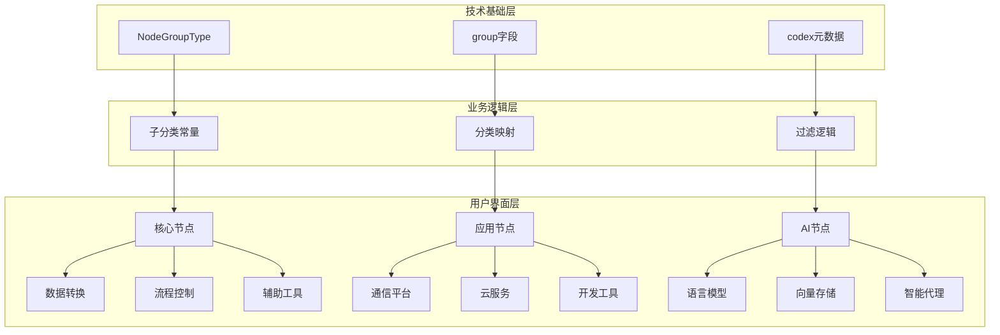
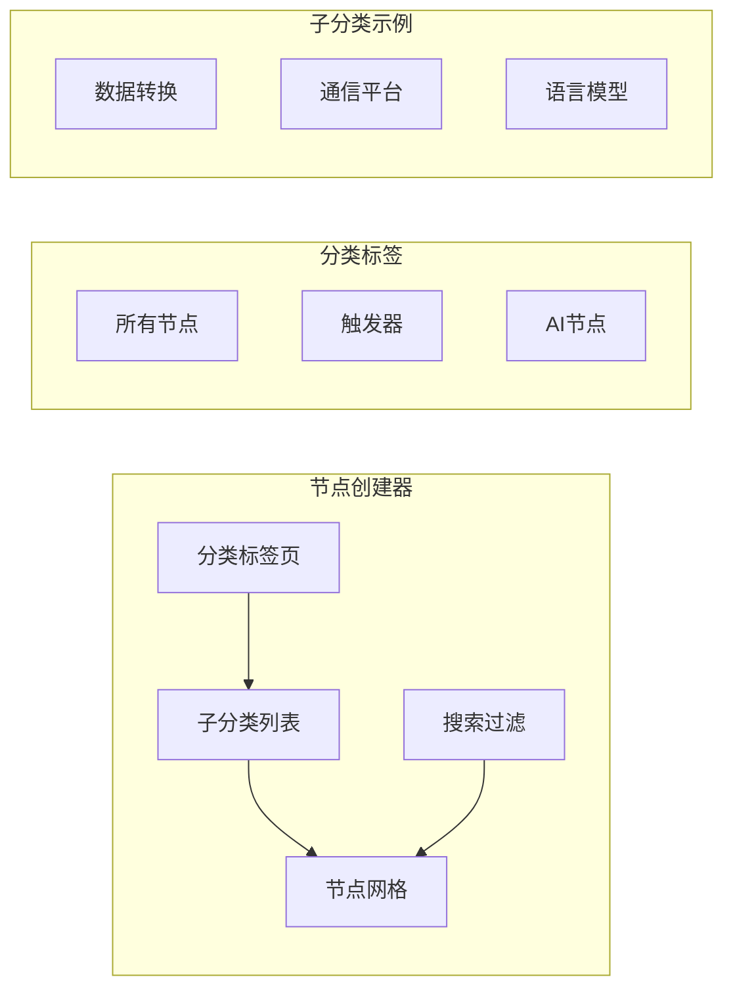

# 01 - n8n 节点分类体系分析

> **系统架构** - 深入分析 n8n 的节点分类机制、组织逻辑和用户界面展示

本文档详细分析 n8n 的节点分类体系，从底层技术实现到用户界面展示，全面理解节点的组织和管理机制。

---

## 1. 分类体系概述

### 1.1 多层次分类架构

n8n 采用三层分类架构，从底层到用户界面逐步抽象和细化：



### 1.2 设计理念

#### 🎯 **技术与业务分离**
- **技术分类**: 基于节点功能特性的底层分类
- **业务分类**: 面向用户使用场景的高层分类
- **映射关系**: 灵活的映射机制支持多维度分类

#### 🔄 **可扩展性优先**
- **开放架构**: 支持新分类的动态添加
- **向后兼容**: 保持现有分类的稳定性
- **社区友好**: 便于第三方节点的分类集成

---

## 2. 技术基础层：NodeGroupType

### 2.1 核心分组类型定义

n8n 在 `packages/workflow/src/interfaces.ts` 中定义了 6 种基础分组类型：

```typescript
type NodeGroupType = 
  | 'input'        // 数据输入节点
  | 'output'       // 数据输出节点  
  | 'transform'    // 数据转换节点
  | 'trigger'      // 触发器节点
  | 'organization' // 组织控制节点
  | 'schedule';    // 定时相关节点

interface INodeTypeBaseDescription {
  group: NodeGroupType[];  // 支持多分组归属
  // 其他属性...
}
```

### 2.2 分组类型详解

#### 📥 **input (数据输入)**
- **功能**: 从外部系统获取、读取或接收数据
- **特点**: 工作流的起始节点或数据源节点
- **示例**: RSS Trigger, File Trigger, HTTP Request (GET)
- **节点数量**: 122个

#### 📤 **output (数据输出)**  
- **功能**: 向外部系统发送、存储或传输数据
- **特点**: 工作流的终端节点或数据目标节点
- **示例**: Email Send, Slack Message, Database Insert
- **节点数量**: 113个

#### 🔄 **transform (数据转换)**
- **功能**: 处理、修改、格式化或转换数据
- **特点**: 工作流的中间处理节点
- **示例**: Code, Function, Set, DateTime, Crypto
- **节点数量**: 142个 (最多)

#### ⚡ **trigger (触发器)**
- **功能**: 监听事件并启动工作流执行
- **特点**: 工作流的入口节点，自动或被动触发
- **示例**: Webhook, Schedule Trigger, File Trigger  
- **节点数量**: 113个

#### 🏗️ **organization (组织控制)**
- **功能**: 控制工作流执行流程和逻辑
- **特点**: 提供条件判断、流程分支等控制能力
- **示例**: If, Switch, Merge, Wait, Stop and Error
- **节点数量**: 7个 (核心控制节点)

#### ⏰ **schedule (定时)**
- **功能**: 与时间调度相关的特殊功能
- **特点**: 较少使用，主要用于复杂的时间控制
- **示例**: Cron 节点的特殊用法
- **节点数量**: 较少使用

### 2.3 多分组支持

部分节点支持多分组归属，体现其多重功能特性：

```typescript
// HTTP Request 节点示例
export class HttpRequest implements INodeType {
  description: INodeTypeDescription = {
    displayName: 'HTTP Request',
    name: 'httpRequest',
    group: ['input', 'output'], // 既可输入也可输出
    // ...
  };
}

// 分组组合统计
const groupCombinations = {
  ['input', 'output']: 8,      // 双向通信节点
  ['transform', 'input']: 3,   // 具备输入能力的转换节点
  ['trigger', 'input']: 2,     // 具备输入功能的触发器
};
```

---

## 3. 业务逻辑层：子分类系统

### 3.1 子分类常量定义

在 `packages/editor-ui/src/constants.ts` 中定义了面向用户的业务分类：

#### 🏗️ **核心节点分类**
```typescript
export const CORE_NODES_CATEGORY = 'Core Nodes';
export const TRANSFORM_DATA_SUBCATEGORY = 'Data Transformation';
export const FLOWS_CONTROL_SUBCATEGORY = 'Flow';
export const HELPERS_SUBCATEGORY = 'Helpers';
export const HITL_SUBCATEGORY = 'Human in the Loop';
```

#### 🤖 **AI 节点分类**
```typescript
export const AI_CATEGORY_AGENTS = 'Agents';
export const AI_CATEGORY_CHAINS = 'Chains'; 
export const AI_CATEGORY_LANGUAGE_MODELS = 'Language Models';
export const AI_CATEGORY_MEMORY = 'Memory';
export const AI_CATEGORY_DOCUMENT_LOADERS = 'Document Loaders';
export const AI_CATEGORY_RETRIEVERS = 'Retrievers';
export const AI_CATEGORY_TEXT_SPLITTERS = 'Text Splitters';
export const AI_CATEGORY_VECTOR_STORES = 'Vector Stores';
export const AI_CATEGORY_EMBEDDINGS = 'Embeddings';
export const AI_CATEGORY_OUTPUT_PARSERS = 'Output Parsers';
export const AI_CATEGORY_TOOLS = 'Tools';
```

### 3.2 分类映射机制

#### 📋 **技术分组到业务分类的映射**
```typescript
// 映射关系示例
const categoryMapping = {
  // 核心功能节点
  'transform': {
    'Data Transformation': ['Code', 'Function', 'Set', 'Transform'],
    'Helpers': ['DateTime', 'Crypto', 'HTML', 'XML'],
    'Flow': ['If', 'Switch', 'Merge'],
  },
  
  // 触发器节点  
  'trigger': {
    'Triggers': ['Webhook', 'Schedule Trigger', 'Manual Trigger'],
    'App Triggers': ['Slack Trigger', 'Gmail Trigger'],
  },
  
  // 应用集成节点
  'input,output': {
    'Communication': ['Slack', 'Discord', 'Telegram'],
    'Productivity': ['Google Sheets', 'Notion', 'Airtable'],
    'Developer Tools': ['GitHub', 'GitLab', 'Jenkins'],
  }
};
```

### 3.3 视图模式分类

#### 🎯 **三种主要视图模式**

1. **触发器视图** (`TRIGGER_NODE_CREATOR_VIEW`)
   - **目标**: 工作流启动节点选择
   - **过滤**: 仅显示 `group` 包含 `trigger` 的节点
   - **分类**: 按触发方式分组 (Webhook, Schedule, App Triggers)

2. **常规节点视图** (`REGULAR_NODE_CREATOR_VIEW`)
   - **目标**: 工作流中间和结束节点选择  
   - **过滤**: 排除 `trigger` 分组节点
   - **分类**: 按功能和应用类型分组

3. **AI 节点视图** (`AI_NODE_CREATOR_VIEW`)
   - **目标**: AI/LangChain 相关节点选择
   - **过滤**: 仅显示 AI 相关节点
   - **分类**: 按 LangChain 组件类型分组

---

## 4. 用户界面层：分类展示

### 4.1 节点创建器界面结构



### 4.2 分类视觉设计

#### 🎨 **分类图标系统**
```typescript
const categoryIcons = {
  'Data Transformation': 'pen',
  'Flow': 'code-branch', 
  'Communication': 'comments',
  'Productivity': 'briefcase',
  'Developer Tools': 'code',
  'Language Models': 'brain',
  'Vector Stores': 'database',
  'Agents': 'robot'
};
```

#### 📊 **分类结构展示**
```typescript
// 视图数据结构
const viewStructure = {
  items: [
    {
      key: 'app_regular',
      type: 'subcategory',
      properties: {
        title: '应用节点',
        icon: 'globe',
        sections: [
          {
            key: 'popular',
            title: '热门节点',  
            items: ['Slack', 'Gmail', 'HTTP Request']
          },
          {
            key: 'communication',
            title: '通信平台',
            items: ['Discord', 'Telegram', 'WhatsApp']
          }
        ]
      }
    }
  ]
};
```

### 4.3 智能分类和推荐

#### 🔍 **搜索集成**
- **别名支持**: 节点可配置多个搜索别名
- **模糊匹配**: 支持部分关键词匹配
- **分类过滤**: 可按分类缩小搜索范围

#### 📈 **使用频率排序**
- **热门节点**: 基于使用频率的智能排序
- **最近使用**: 记录用户最近使用的节点
- **推荐算法**: 基于工作流模式的节点推荐

---

## 5. 扩展机制与自定义

### 5.1 Codex 元数据系统

节点可通过 `codex` 字段定义扩展的分类信息：

```typescript
interface CodexData {
  categories?: string[];           // 主分类数组
  subcategories?: {               // 子分类映射
    [category: string]: string[];
  };
  alias?: string[];               // 搜索别名
  resources?: {                   // 相关资源
    primaryDocumentation?: {
      url: string;
    };
    credentialDocumentation?: {
      url: string;  
    };
  };
}

// 节点定义示例
export class CustomNode implements INodeType {
  description: INodeTypeDescription = {
    // 基础分类
    group: ['transform'],
    
    // 扩展分类
    codex: {
      categories: ['Data Processing', 'Analytics'],
      subcategories: {
        'Data Processing': ['ETL', 'Cleaning'],
        'Analytics': ['Statistics', 'Visualization']
      },
      alias: ['data', 'process', 'analytics']
    }
  };
}
```

### 5.2 第三方节点分类

#### 🔌 **社区节点支持**
```typescript
// 社区节点分类配置
const communityNodeCategories = {
  whitelist: [
    'Core Nodes',
    'AI',
    'Human in the Loop',
    'Custom'
  ],
  
  validation: (category: string) => {
    return WHITE_LISTED_SUBCATEGORIES.includes(category);
  }
};
```

#### 🏢 **企业节点分类**
- **命名空间**: 支持企业级节点的分类命名空间
- **权限控制**: 基于角色的节点分类可见性
- **定制分类**: 企业可定义内部专用分类

---

## 6. 分类管理最佳实践

### 6.1 节点开发分类指南

#### ✅ **分类选择原则**
1. **功能优先**: 根据节点的主要功能选择主分类
2. **用户视角**: 考虑用户如何搜索和发现节点
3. **一致性**: 与同类型节点保持分类一致性
4. **扩展性**: 预留未来功能扩展的分类空间

#### 📋 **分类最佳实践**
```typescript
// 推荐的节点分类配置
const bestPracticeConfig = {
  // 单一职责节点
  singlePurpose: {
    group: ['transform'],  // 明确的单一分组
    codex: {
      categories: ['Data Transformation'],
      alias: ['transform', 'convert']
    }
  },
  
  // 多功能节点
  multiPurpose: {
    group: ['input', 'output'], // 多分组反映多功能
    codex: {
      categories: ['Communication', 'Integration'],
      subcategories: {
        'Communication': ['Messaging'],
        'Integration': ['API', 'Webhook']
      }
    }
  }
};
```

### 6.2 分类维护策略

#### 🔄 **版本兼容性**
- **向后兼容**: 新版本保持旧分类的有效性
- **迁移路径**: 提供平滑的分类迁移机制
- **弃用管理**: 渐进式淘汰过时的分类

#### 📊 **分类优化**
- **使用分析**: 定期分析分类的使用频率和效果
- **用户反馈**: 收集用户对分类系统的反馈和建议
- **持续改进**: 基于数据和反馈持续优化分类体系

---

## 7. 技术实现细节

### 7.1 分类过滤逻辑

#### 🔍 **前端过滤实现**
```typescript
// 基础分类过滤函数
function baseSubcategoriesFilter(item: INodeCreateElement): boolean {
  if (item.type !== 'node') return false;
  
  const hasTriggerGroup = item.properties.group.includes('trigger');
  const hasActions = nodeActions.length > 0;
  
  const isTriggerRootView = activeViewStack.value.rootView === TRIGGER_NODE_CREATOR_VIEW;
  
  if (isTriggerRootView) {
    // 触发器视图: 显示有动作或是触发器的节点
    return hasActions || hasTriggerGroup;
  }
  
  // 常规视图: 显示有动作或不是触发器的节点
  return hasActions || !hasTriggerGroup;
}

// AI 节点专用过滤
function aiNodesFilter(item: INodeCreateElement): boolean {
  const isAiNode = AI_NODES.includes(item.properties.name);
  const hasAiCategory = item.properties.codex?.categories?.some(
    category => category.startsWith('AI')
  );
  
  return isAiNode || hasAiCategory;
}
```

### 7.2 动态分类生成

#### ⚙️ **分类数据结构生成**
```typescript
// 动态生成分类树结构
function generateCategoryTree(nodes: INodeTypeDescription[]): CategoryTree {
  const tree: CategoryTree = {};
  
  nodes.forEach(node => {
    const groups = node.group;
    const categories = node.codex?.categories || [];
    
    groups.forEach(group => {
      if (!tree[group]) {
        tree[group] = {
          name: group,
          displayName: getGroupDisplayName(group),
          icon: getGroupIcon(group),
          subcategories: {}
        };
      }
      
      categories.forEach(category => {
        if (!tree[group].subcategories[category]) {
          tree[group].subcategories[category] = {
            name: category,
            nodes: []
          };
        }
        
        tree[group].subcategories[category].nodes.push(node);
      });
    });
  });
  
  return tree;
}
```

---

## 8. 分类体系发展趋势

### 8.1 当前挑战

#### 📈 **规模增长挑战**
- **节点数量激增**: 300+ 节点带来的分类管理复杂度
- **新兴技术**: AI、Web3 等新技术领域的分类需求
- **用户多样性**: 不同技术背景用户的分类需求差异

#### 🔄 **维护挑战**
- **分类一致性**: 保持不同开发者贡献节点的分类一致性
- **国际化**: 多语言环境下的分类名称和描述
- **个性化**: 用户自定义分类和个人化需求

### 8.2 未来发展方向

#### 🤖 **智能分类**
- **自动分类**: AI 驱动的节点自动分类建议
- **语义分析**: 基于节点描述和功能的语义分类
- **用户行为学习**: 基于使用模式的个性化分类推荐

#### 🌐 **生态化分类**
- **领域专门化**: 针对特定行业的专门分类体系
- **社区驱动**: 社区贡献的分类标准和最佳实践
- **开放标准**: 与其他自动化平台的分类标准互操作

---

## 总结

n8n 的节点分类体系体现了优秀的系统设计原则：

### 🎯 **核心优势**
1. **多层次架构**: 技术与业务分离的清晰层次
2. **灵活扩展**: 支持新分类和自定义分类的动态添加
3. **用户友好**: 直观的分类导航和智能搜索
4. **标准化**: 一致的分类定义和实现规范

### 🔍 **设计亮点**
- **group 字段的简洁性**: 6 种基础分组覆盖所有节点类型
- **codex 元数据的扩展性**: 支持复杂的业务分类需求  
- **视图模式的专门化**: 不同场景下的最优分类展示
- **过滤逻辑的智能化**: 基于上下文的动态分类过滤

### 🚀 **发展潜力**
随着节点生态的不断扩大和 AI 技术的深入集成，n8n 的分类体系将继续演进，为用户提供更加智能化和个性化的节点发现和使用体验。

---

*下一篇文档将深入分析基础节点库的具体实现，提供每个分类下节点的详细功能说明。*