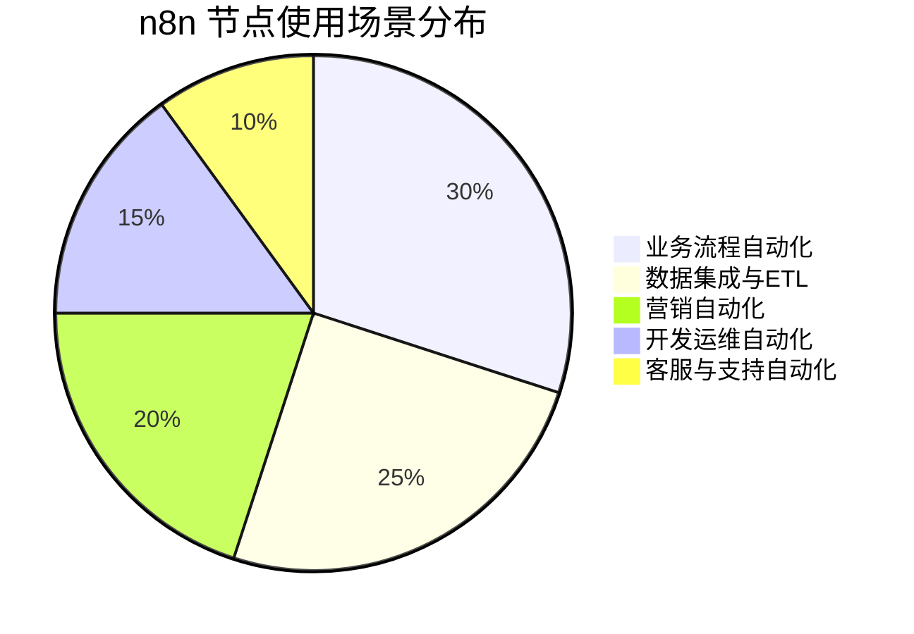

# 02 - n8n 基础节点库深度分析

> **完整清单** - n8n nodes-base 包中 305 个节点的全面分析和分类详解

本文档提供 n8n 基础节点库的完整分析，涵盖所有 305 个节点的功能、分类和使用场景，为开发者和用户选择合适的节点提供详尽参考。

---

## 📊 总体概览

### 统计数据
- **节点目录总数**: 305 个
- **节点实现文件**: 528 个 `.node.ts` 文件
- **触发器节点**: 102 个 `*Trigger.node.ts` 文件
- **版本化节点**: 13 个节点具有多版本结构
- **图标资源**: 364 个图标文件 (299 SVG + 65 PNG)

### 技术架构特点
- **模块化设计**: 每个节点独立封装，支持热插拔
- **版本兼容**: 支持节点的多版本并存和平滑升级
- **统一接口**: 所有节点遵循 `INodeType` 接口规范
- **国际化**: 完整的多语言支持和本地化

---

## 🏗️ 核心工具节点 (Foundation Nodes)

这些节点构成了 n8n 工作流的基础架构，提供数据处理、流程控制和基本功能。

### 🔄 数据处理与转换

#### **Code** 节点
- **功能**: 执行自定义 JavaScript/Python 代码
- **使用场景**: 复杂数据处理、自定义业务逻辑
- **特点**: 支持 npm 包导入、完整的调试支持
- **代码示例**:
  ```javascript
  // 数据转换示例
  return items.map(item => ({
    ...item,
    processedAt: new Date().toISOString(),
    status: item.amount > 1000 ? 'high' : 'low'
  }));
  ```

#### **Function** / **FunctionItem** 节点
- **功能**: 执行简单的数据处理函数
- **区别**: Function 处理所有数据，FunctionItem 逐项处理
- **使用场景**: 快速数据格式化、简单计算
- **限制**: 功能相对简单，不支持外部包导入

#### **Set** 节点
- **功能**: 设置、修改数据字段
- **操作类型**:
  - 添加新字段
  - 修改现有字段
  - 删除指定字段
  - 重命名字段
- **使用频率**: 极高，几乎每个工作流都会用到

#### **Transform** 节点
- **功能**: 高级数据结构转换
- **特点**: 可视化配置，支持复杂嵌套转换
- **适用场景**: API 数据格式适配、数据结构重组

#### **AiTransform** 节点 ⭐
- **功能**: AI 驱动的智能数据转换
- **特点**: 使用大语言模型理解和转换数据
- **使用场景**: 非结构化数据处理、智能内容生成

### ⚡ 流程控制

#### **If** 节点 (V1/V2)
- **功能**: 条件判断分支
- **版本差异**:
  - V1: 简单布尔条件判断
  - V2: 支持复杂表达式、多条件组合
- **配置选项**: 数值比较、文本匹配、存在性检查

#### **Switch** 节点 (V1/V2/V3)
- **功能**: 多路分支选择
- **演进历程**:
  - V1: 基础多分支
  - V2: 增强条件表达式
  - V3: 支持正则表达式、默认分支
- **使用场景**: 根据不同条件执行不同流程

#### **Merge** 节点
- **功能**: 合并多个数据流
- **合并模式**:
  - Append: 数据追加
  - Keep Key Matches: 按键匹配合并
  - Merge By Index: 按索引合并
  - Multiply: 数据相乘组合

#### **Filter** 节点 (V1/V2)
- **功能**: 数据过滤
- **过滤条件**: 支持复杂的逻辑表达式
- **性能**: V2 版本大幅优化大数据集处理性能

### ⏰ 时间与调度

#### **DateTime** 节点 (V1/V2)
- **功能**: 日期时间处理
- **操作类型**:
  - 格式转换
  - 时区转换
  - 日期计算
  - 格式化输出
- **V2 增强**: 更多格式支持、更好的时区处理

#### **Wait** 节点
- **功能**: 工作流延迟执行
- **等待类型**:
  - 固定时间延迟
  - 等待特定时间点
  - 等待外部条件满足

#### **Schedule** / **Cron** 节点
- **功能**: 定时任务触发
- **支持格式**: Cron 表达式、简化时间配置
- **使用场景**: 定期报告、数据同步、监控任务

### 📁 文件与数据处理

#### **Files** 节点
- **功能**: 文件系统操作
- **支持操作**: 读取、写入、删除、移动、复制
- **文件类型**: 支持所有常见文件格式

#### **ReadBinaryFile** / **WriteBinaryFile**
- **功能**: 二进制文件处理
- **使用场景**: 图片、视频、文档处理
- **性能**: 优化大文件处理性能

#### **EditImage** 节点
- **功能**: 图像编辑处理
- **支持操作**:
  - 尺寸调整
  - 格式转换
  - 滤镜效果
  - 水印添加

#### **Compression** 节点
- **功能**: 文件压缩解压
- **支持格式**: ZIP, GZIP, TAR 等
- **使用场景**: 大文件传输、备份存档

### 🔐 安全与加密

#### **Crypto** 节点
- **功能**: 加密解密操作
- **支持算法**:
  - 对称加密: AES, DES
  - 非对称加密: RSA
  - 哈希算法: MD5, SHA系列
- **使用场景**: 数据安全、密码处理

#### **Jwt** 节点
- **功能**: JWT 令牌处理
- **操作**: 生成、验证、解析 JWT
- **使用场景**: API 认证、单点登录

---

## 💬 通信平台节点 (Communication)

### 🚀 主流即时通讯

#### **Slack** 节点 (V1/V2 + Trigger)
- **功能覆盖**:
  - 消息发送 (文本、附件、富文本)
  - 频道管理 (创建、邀请、设置)
  - 用户管理 (信息获取、状态设置)
  - 文件操作 (上传、分享)
- **触发器**: 消息接收、频道事件、用户状态变化
- **企业特性**: 支持 Slack Connect、应用权限管理

#### **Microsoft Teams** 节点 (V1/V2 + Trigger)
- **功能特点**:
  - 团队协作 (频道消息、@提醒)
  - 会议集成 (创建会议、获取录制)
  - 文件协作 (SharePoint 集成)
  - 应用生态 (Tabs、Bots、Connectors)
- **企业集成**: Azure AD 认证、权限继承

#### **Discord** 节点
- **社区功能**:
  - 服务器管理 (角色、权限)
  - 消息系统 (嵌入消息、反应)
  - 语音功能 (频道管理)
  - 机器人集成
- **使用场景**: 游戏社区、开发团队、在线教育

#### **Telegram** 节点
- **机器人能力**:
  - 消息处理 (文本、媒体、文档)
  - 键盘交互 (inline keyboard, reply markup)
  - 群组管理 (管理员功能)
  - 支付集成 (Telegram Payments)

### 📱 移动通信

#### **WhatsApp** 节点
- **Business API**:
  - 模板消息发送
  - 媒体消息支持
  - 群发消息管理
  - 消息状态跟踪
- **合规要求**: Meta Business 认证、模板审核

#### **SMS 服务节点集群**
- **Twilio**: 全球领先，功能最全
- **MessageBird**: 欧洲市场强势
- **Vonage** (原 Nexmo): 企业级解决方案
- **Plivo**: 性价比优秀
- **本土化服务**: Msg91 (印度)、Sms77 (德国)

### 🔔 推送通知

#### **推送服务矩阵**
```
┌─────────────┬──────────────┬─────────────┬──────────────┐
│   服务名    │   适用平台   │   特色功能  │   最佳场景   │
├─────────────┼──────────────┼─────────────┼──────────────┤
│ Pushbullet  │ 跨设备推送   │ 设备同步    │ 个人使用     │
│ Pushover    │ iOS/Android  │ 优先级管理  │ 系统监控     │
│ Signl4      │ 团队警报     │ 升级机制    │ 运维团队     │
│ Gotify      │ 自托管       │ 开源免费    │ 隐私保护     │
└─────────────┴──────────────┴─────────────┴──────────────┘
```

---

## ☁️ 云服务节点 (Cloud Services)

### 🌐 Google 生态系统 (25+ 服务)

#### **核心生产力套件**
- **Google Sheets** (V1/V2): 电子表格操作
  - 数据读写、格式设置
  - 公式计算、图表生成
  - 协作功能、权限管理
- **Gmail** (V1/V2): 邮件服务
  - 邮件发送、接收、搜索
  - 标签管理、过滤规则
  - 附件处理、自动回复
- **Google Drive** (V1/V2): 云存储
  - 文件上传下载、同步
  - 文件夹管理、权限设置
  - 版本控制、共享链接

#### **企业协作**
- **Google Calendar**: 日程管理
- **Google Docs**: 文档协作
- **Google Slides**: 演示文稿
- **Google Tasks**: 任务管理
- **Google Chat**: 企业聊天

#### **开发者服务**
- **Google Cloud Storage**: 对象存储
- **Google BigQuery** (V1/V2): 大数据分析
- **Google Translate**: 机器翻译
- **Firebase**: 移动应用后端
  - CloudFirestore: NoSQL 数据库
  - RealtimeDatabase: 实时数据库

#### **业务分析**
- **Google Analytics** (V1/V2): 网站分析
- **Google Ads**: 广告投放
- **Google Business Profile**: 商家信息

### 🏢 Microsoft 生态系统 (12+ 服务)

#### **Office 365 套件**
- **Excel** (V1/V2): 电子表格
  - 复杂公式支持
  - 数据透视表操作
  - 宏集成 (限制性)
- **Outlook** (V1/V2): 邮件客户端
  - 邮件管理、日历集成
  - 联系人同步、任务管理
- **OneDrive**: 文件存储同步
- **SharePoint**: 企业协作平台
- **Microsoft Teams**: 统一通信
- **ToDo**: 任务管理应用

#### **Azure 云服务**
- **Azure AD** (现 Entra): 身份管理
- **Azure Cosmos DB**: 全球分布式数据库
- **Azure Storage**: 云存储服务
- **Azure Monitor**: 监控服务

#### **业务应用**
- **Dynamics 365**: CRM/ERP 系统
- **Microsoft Graph Security**: 安全服务
- **Power Platform** 集成支持

### ☁️ 其他主要云平台

#### **AWS 服务**
- **Lambda**: 无服务器计算
  - 函数执行、事件触发
  - 自动扩展、按需计费
- **SNS**: 消息通知服务
  - 多协议推送 (SMS, Email, HTTP)
  - 主题订阅、消息过滤
- **S3**: 对象存储
  - 文件存储、静态网站托管
  - 版本控制、生命周期管理

---

## 🗄️ 数据库节点 (Database)

### 关系型数据库

#### **PostgreSQL** 节点
- **功能全面性**: 支持所有 PostgreSQL 特性
- **高级功能**:
  - JSON/JSONB 数据类型操作
  - 全文搜索 (FTS)
  - 地理空间查询 (PostGIS)
  - 窗口函数、CTE
- **性能优化**: 连接池、预处理语句、批量操作

#### **MySQL** 节点
- **兼容性**: 支持 MySQL 5.7+ 和 MariaDB
- **特色功能**:
  - 存储引擎选择 (InnoDB, MyISAM)
  - 分区表支持
  - 复制配置管理
- **企业特性**: SSL 连接、读写分离

#### **Microsoft SQL Server** 节点
- **企业集成**: Windows 认证、AD 集成
- **高级特性**:
  - T-SQL 存储过程调用
  - CLR 集成
  - 全文索引搜索
  - Always On 可用性组

#### **专业数据库**
- **Snowflake**: 云数据仓库
  - 计算存储分离架构
  - 自动扩缩容
  - Time Travel 查询
- **TimescaleDB**: 时序数据库
  - PostgreSQL 扩展
  - 自动分区
  - 数据压缩
- **QuestDB**: 高性能时序数据库

### NoSQL 数据库

#### **MongoDB** 节点
- **文档操作**: CRUD、聚合管道
- **索引管理**: 复合索引、地理空间索引
- **高级功能**: 事务支持、变更流
- **集群支持**: 副本集、分片集群

#### **Redis** 节点
- **数据类型支持**: String、Hash、List、Set、ZSet
- **高级功能**: Lua 脚本、发布订阅、流处理
- **集群**: 哨兵模式、集群模式
- **持久化**: RDB、AOF 配置

### 现代数据平台

#### **Airtable** 节点
- **低代码数据库**: 电子表格界面 + 数据库功能
- **丰富字段类型**: 附件、链接、公式、选择器
- **协作功能**: 权限管理、评论、历史记录
- **自动化**: Airtable Automations 集成

#### **Notion** 节点
- **All-in-One 工作区**: 文档、数据库、任务、Wiki
- **块级编辑**: 灵活的内容组织方式
- **数据库视图**: 表格、看板、日历、画廊
- **API 限制**: 速率限制较严格

---

## 🛠️ 开发工具节点 (Development Tools)

### 版本控制与代码管理

#### **GitHub** 节点
- **仓库管理**: 创建、删除、设置
- **代码操作**: 文件 CRUD、提交历史
- **协作功能**: Issues、Pull Requests、Reviews
- **自动化**: Actions 集成、Webhook 处理
- **组织管理**: 团队、权限、设置

#### **GitLab** 节点
- **完整 DevOps**: 代码、CI/CD、监控一体化
- **项目管理**: Issues、Merge Requests、Milestones
- **CI/CD 集成**: Pipeline 触发、状态监控
- **容器注册**: Docker 镜像管理

### CI/CD 与部署

#### **Jenkins** 节点
- **任务管理**: 创建、触发、监控 Job
- **构建操作**: 参数化构建、构建队列
- **流水线**: Declarative 和 Scripted Pipeline
- **插件生态**: 与 Jenkins 插件系统集成

#### **CircleCI** 节点
- **现代 CI/CD**: 容器化构建环境
- **工作流管理**: 并行执行、依赖管理
- **性能监控**: 构建时间、成功率统计
- **成本优化**: 构建时间和资源使用追踪

### 项目管理

#### **Jira** 节点
- **问题管理**: 创建、更新、分配、关闭
- **工作流自定义**: 状态转换、自动化规则
- **报告分析**: 燃尽图、速度图表
- **敏捷支持**: Scrum、Kanban 看板

#### **Linear** 节点
- **现代项目管理**: 快速响应、直观界面
- **问题跟踪**: 自动优先级、智能分配
- **团队协作**: 评论、通知、同步
- **集成生态**: GitHub、Slack 等深度集成

#### **Asana** 节点
- **任务管理**: 项目、任务、子任务层级
- **团队协作**: 评论、校对、依赖关系
- **进度跟踪**: 时间线、日历、仪表板
- **自动化规则**: 基于条件的自动操作

---

## 📈 营销工具节点 (Marketing Tools)

### 邮件营销平台

#### **Mailchimp** 节点
- **受众管理**: 列表、标签、分段
- **邮件设计**: 模板、拖拽编辑器
- **营销自动化**: 客户旅程、触发邮件
- **分析报告**: 打开率、点击率、转化率
- **集成生态**: 电商、CRM、社交媒体

#### **ActiveCampaign** 节点
- **智能自动化**: 基于行为的触发器
- **个性化**: 动态内容、预测发送
- **多渠道营销**: 邮件、SMS、社交媒体
- **CRM 集成**: 销售流程自动化
- **机器学习**: 发送时间优化、内容推荐

### CRM 系统

#### **Salesforce** 节点
- **对象管理**: Leads、Accounts、Opportunities、Contacts
- **自定义对象**: 企业特定业务实体
- **工作流规则**: 自动化业务流程
- **报告分析**: 销售漏斗、预测分析
- **AppExchange**: 第三方应用集成

#### **HubSpot** 节点 (V1/V2)
- **入站营销**: 内容管理、SEO 优化
- **销售自动化**: 交易跟踪、邮件序列
- **客服工具**: 票务系统、知识库
- **分析报告**: 营销归因、ROI 分析
- **免费增值**: 强大的免费版本

### 客服与支持

#### **Zendesk** 节点
- **票务系统**: 多渠道工单管理
- **知识库**: 自助服务文档
- **客户满意度**: CSAT、NPS 调研
- **报告分析**: 响应时间、解决率
- **市场应用**: 丰富的集成应用

#### **Intercom** 节点
- **对话式支持**: 实时聊天、机器人
- **客户数据**: 用户画像、行为追踪
- **产品推广**: 应用内消息、产品导览
- **销售工具**: 潜客识别、会话转化

---

## 💰 电商与支付节点 (E-commerce & Payment)

### 电商平台

#### **Shopify** 节点
- **店铺管理**: 产品、库存、订单
- **客户管理**: 客户信息、购买历史
- **营销工具**: 折扣码、邮件营销
- **分析报告**: 销售数据、流量分析
- **应用生态**: Shopify App Store 集成

#### **WooCommerce** 节点
- **WordPress 集成**: 内容与商务一体化
- **产品管理**: 变体、库存、定价
- **订单处理**: 状态管理、发货跟踪
- **支付网关**: 多种支付方式支持
- **扩展性**: 丰富的插件生态

### 支付处理

#### **Stripe** 节点
- **支付处理**: 信用卡、数字钱包、银行转账
- **订阅管理**: 定期付款、升级降级
- **发票开具**: 自动化计费、税费计算
- **欺诈检测**: 机器学习风险评估
- **全球支持**: 多币种、本地支付方式

#### **PayPal** 节点
- **支付接收**: PayPal、信用卡支付
- **批量支付**: 批量转账、佣金发放
- **订阅服务**: 定期付款计划
- **争议处理**: 退款、争议解决
- **买家保护**: 购买保险、安全交易

---

## 🤖 AI 与智能节点 (AI & Intelligence)

### 核心 AI 能力

#### **AiTransform** 节点 ⭐
- **智能数据转换**: 使用 LLM 理解和转换数据结构
- **自然语言处理**: 文本分类、情感分析、摘要生成
- **代码生成**: 根据描述生成代码片段
- **多语言支持**: 翻译、本地化处理

### 传统 AI 服务

#### **Google Cloud Natural Language**
- **文本分析**: 实体识别、情感分析、语法分析
- **内容分类**: 自动文档分类
- **多语言支持**: 100+ 种语言
- **批量处理**: 大规模文本分析

#### **Microsoft Cognitive Services**
- **视觉 AI**: 图像识别、OCR、人脸检测
- **语音服务**: 语音识别、文本转语音
- **语言理解**: LUIS 自然语言理解
- **搜索服务**: Bing 搜索 API

---

## 🔧 专业工具节点 (Specialized Tools)

### 安全与监控

#### **Elastic Security** 节点
- **SIEM 功能**: 安全事件管理
- **威胁检测**: 异常行为识别
- **事件响应**: 自动化响应流程
- **合规报告**: 安全合规检查

#### **Grafana** 节点
- **仪表板管理**: 创建、更新监控面板
- **数据源集成**: 多种数据源支持
- **告警规则**: 自动化告警设置
- **团队管理**: 用户权限、组织管理

### 设计与创意

#### **Figma** 节点
- **设计文件**: 获取设计稿、组件信息
- **团队协作**: 评论、版本管理
- **开发交付**: 设计规范导出
- **插件生态**: Figma 插件集成

#### **Bannerbear** 节点
- **自动图片生成**: 基于模板批量生成
- **动态内容**: 文本、图片动态替换
- **品牌一致性**: 模板标准化
- **API 集成**: 程序化图片生成

---

## 📊 使用场景与应用模式

### 典型应用场景分布



### 节点组合模式

#### **数据处理流水线**
```
数据源 → 数据清洗 → 数据转换 → 数据存储 → 通知
(HTTP) → (Filter)  → (Code)    → (Database) → (Slack)
```

#### **营销自动化工作流**
```
潜客捕获 → 数据清洗 → CRM存储 → 邮件营销 → 效果跟踪
(Webhook) → (Set)    → (HubSpot) → (Mailchimp) → (Analytics)
```

#### **监控告警系统**
```
数据监控 → 异常检测 → 条件判断 → 多渠道通知 → 日志记录
(HTTP)   → (Code)   → (If)     → (Slack/Email) → (Database)
```

---

## 🚀 性能与最佳实践

### 节点性能特征

#### **高性能节点** (处理大量数据)
- **Database 节点**: 支持批量操作、连接池
- **HTTP Request**: 并发请求、连接复用
- **Code 节点**: V8 引擎优化、内存管理

#### **I/O 密集节点** (网络依赖)
- **云服务节点**: API 速率限制、重试机制
- **邮件节点**: SMTP 连接管理、批量发送
- **文件节点**: 大文件处理、流式传输

### 使用建议

#### **节点选择原则**
1. **功能匹配**: 选择最符合业务需求的节点
2. **性能考虑**: 大数据量处理选择优化版本
3. **维护成本**: 考虑节点的学习曲线和维护复杂度
4. **生态集成**: 优先选择与现有系统集成度高的节点

#### **常见陷阱规避**
1. **过度复杂**: 避免在单个工作流中使用过多复杂节点
2. **数据传输**: 注意大数据在节点间的传输开销
3. **API 限制**: 遵循第三方服务的 API 调用限制
4. **错误处理**: 为关键节点设置适当的错误处理

---

## 📈 发展趋势与展望

### 节点生态演进

#### **当前发展重点**
- **AI 集成深化**: 更多 AI 驱动的智能节点
- **云原生优化**: 针对容器化环境的性能优化
- **企业级增强**: 权限管理、审计日志、合规支持
- **开发者体验**: 更好的调试工具、文档、示例

#### **未来发展方向**
- **自动化节点选择**: AI 推荐最适合的节点组合
- **性能智能优化**: 基于使用模式的自动性能调优
- **跨平台标准**: 与其他自动化平台的互操作性
- **边缘计算支持**: 支持边缘环境的轻量级节点

---

## 总结

n8n 的基础节点库展现了现代自动化平台的完整性和专业性：

### 🎯 **核心优势**
1. **覆盖全面**: 305 个节点涵盖企业应用的各个方面
2. **技术先进**: 支持最新的 AI、云原生技术
3. **生态开放**: 标准化接口支持第三方扩展
4. **持续演进**: 活跃的开发和版本更新

### 📊 **生态特点**
- **平衡性**: 在功能丰富与易用性间取得平衡
- **标准化**: 一致的接口设计降低学习成本
- **可扩展性**: 支持企业级和社区级扩展
- **国际化**: 全球化产品的本地化支持

### 🚀 **应用价值**
通过这个庞大而精心设计的节点生态，n8n 为企业提供了构建复杂自动化解决方案的强大基础，支持从简单的数据处理到复杂的跨平台业务流程自动化的各种需求。

---

*下一篇文档将专门分析 AI/LangChain 节点的特殊功能和应用场景。*