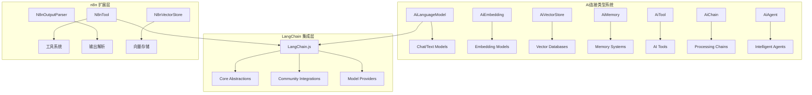
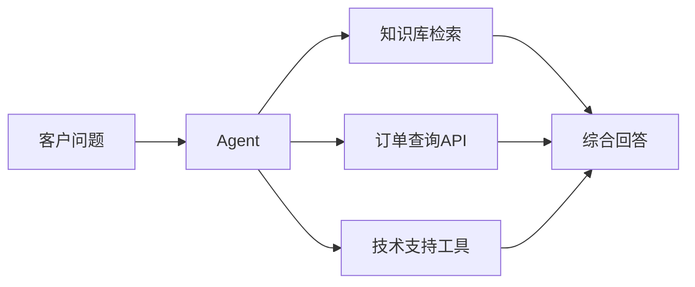
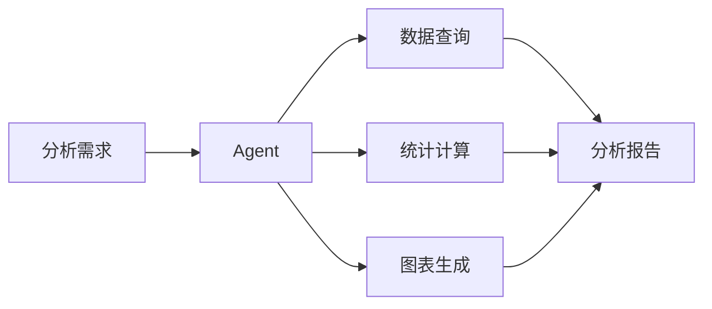
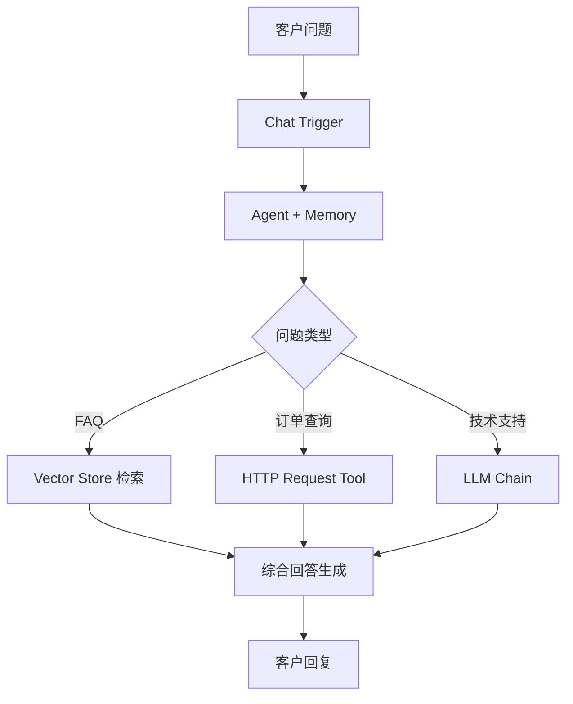
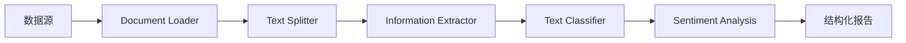
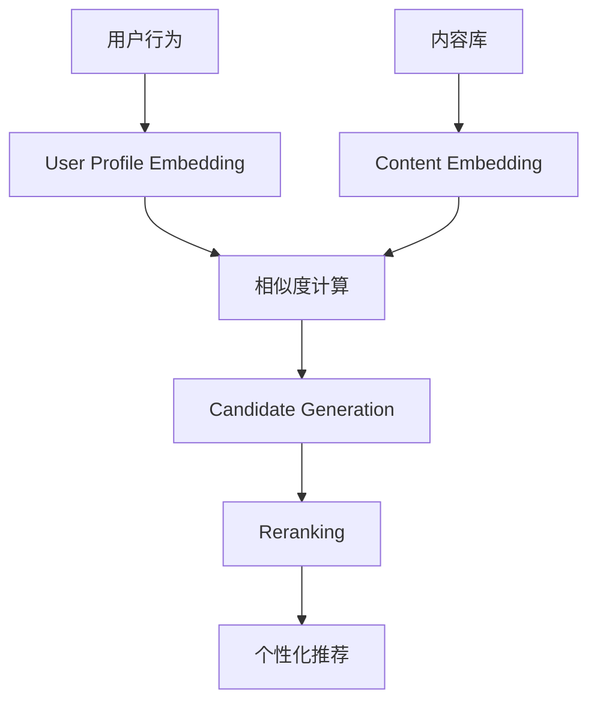

# 03 - AI LangChain 节点分析

> **智能化核心** - 深入分析 n8n 的 AI/LangChain 节点生态，探索智能工作流的无限可能

本文档全面分析 n8n 的 AI 和 LangChain 节点系统，从技术架构到应用场景，为构建智能化工作流提供完整指南。

---

## 🧠 AI 节点生态概览

### 📊 规模统计
- **AI 节点总数**: 146 个专业 AI 节点
- **服务提供商**: 22 种 AI 服务集成
- **功能分类**: 11 个主要功能类别
- **支持模型**: 100+ 种 AI 模型
- **版本兼容**: 支持多版本节点并存

### 🏗️ 技术架构特点


---

## 🤖 语言模型节点 (LLM Nodes)

### Chat Models (聊天模型) - 13个

#### **主流商业模型**

##### **OpenAI 生态系统**
- **LmChatOpenAi** 
  - **支持模型**: GPT-4o, GPT-4 Turbo, GPT-3.5 Turbo
  - **多模态**: 支持文本、图像、音频输入
  - **函数调用**: Native Function Calling 支持
  - **流式输出**: 实时响应流
  - **企业特性**: 批量 API、嵌入安全过滤

- **LmChatAzureOpenAi**
  - **部署模型**: Azure 托管的 OpenAI 模型
  - **企业集成**: Azure AD 认证、VNet 支持
  - **合规性**: 企业级数据保护、审计日志
  - **性能**: 专用部署、自定义配额

##### **Anthropic Claude**
- **LmChatAnthropic**
  - **模型系列**: Claude 3.5 Sonnet, Claude 3 Opus/Haiku
  - **长上下文**: 支持 200k token 上下文窗口
  - **安全性**: 内置安全过滤、无害性对齐
  - **代码能力**: 强大的代码理解和生成能力

##### **Google AI**
- **LmChatGoogleGemini**
  - **模型**: Gemini 1.5 Pro/Flash, Gemini Ultra
  - **多模态**: 原生支持文本、图像、视频、音频
  - **代码执行**: 内置代码解释器
  - **实时推理**: 低延迟推理优化

- **LmChatGoogleVertex**
  - **企业 AI**: Vertex AI 平台集成
  - **模型花园**: 预训练模型和自定义模型
  - **MLOps**: 模型版本管理、A/B 测试
  - **自定义训练**: 支持模型微调和训练

#### **新兴创新模型**

##### **高性能推理**
- **LmChatGroq**
  - **硬件加速**: LPU (Language Processing Units) 超高速推理
  - **支持模型**: Llama 3, Mixtral, Gemma
  - **极低延迟**: 毫秒级响应时间
  - **成本优势**: 高性价比推理服务

##### **专业化模型**
- **LmChatDeepSeek**
  - **代码专精**: 专注编程和技术内容
  - **长上下文**: 支持 16k-32k token 窗口
  - **中文优化**: 中英文混合处理优势

- **LmChatXAiGrok**
  - **实时信息**: 接入 X (Twitter) 实时数据
  - **幽默对话**: 独特的对话风格
  - **多模态**: 图文理解能力

##### **开源生态**
- **LmChatOllama**
  - **本地部署**: 完全私有化 AI 推理
  - **模型丰富**: Llama 3, Qwen, CodeLlama, Phi-3 等
  - **资源可控**: 自定义硬件配置
  - **隐私保护**: 数据不出本地环境

### Text Models (文本补全) - 4个

#### **传统补全模型**
- **LmOpenAi**: GPT-3.5 Instruct, GPT-4 Base
- **LmCohere**: Command, Command Light 系列
- **LmOllama**: 开源文本生成模型
- **LmOpenHuggingFaceInference**: Hugging Face 推理 API

### 🎯 模型选择策略

#### **场景适配矩阵**
| 使用场景 | 推荐模型 | 关键特性 | 成本考虑 |
|----------|----------|----------|----------|
| **企业客服** | Claude 3.5 Sonnet | 安全性、长上下文 | 中等 |
| **代码生成** | GPT-4o, DeepSeek | 代码理解、函数调用 | 中高 |
| **内容创作** | Gemini 1.5 Pro | 多模态、创意能力 | 中等 |
| **实时应用** | Groq + Llama 3 | 极低延迟、高吞吐 | 低 |
| **隐私敏感** | Ollama 本地 | 完全私有化 | 硬件成本 |
| **批量处理** | Azure OpenAI | 专用配额、批量折扣 | 可控 |

---

## 🔍 嵌入模型节点 (Embedding Models)

### 嵌入能力全景 - 9个节点

#### **OpenAI 嵌入生态**
- **EmbeddingsOpenAI**
  - **最新模型**: text-embedding-3-large/small
  - **可变维度**: 支持自定义嵌入维度
  - **语言支持**: 100+ 种语言
  - **任务优化**: 检索、相似度、聚类专门优化

- **EmbeddingsAzureOpenAi**
  - **企业部署**: Azure 私有化部署
  - **批量处理**: 大规模文档嵌入
  - **成本控制**: 专用资源配额

#### **多语言嵌入专家**
- **EmbeddingsCohere**
  - **多语言**: 100+ 语言原生支持
  - **语义搜索**: 专门针对搜索优化
  - **领域适应**: 支持领域特定嵌入

- **EmbeddingsMistralCloud**
  - **欧洲特色**: 多语言、隐私友好
  - **高质量**: 强语义理解能力

#### **云原生嵌入**
- **EmbeddingsGoogleGemini/Vertex**
  - **多模态嵌入**: 文本、图像统一嵌入空间
  - **实时更新**: 支持增量嵌入更新

- **EmbeddingsAwsBedrock**
  - **Titan Embeddings**: AWS 自研嵌入模型
  - **企业级**: 完整的 AWS 生态集成

#### **开源自主可控**
- **EmbeddingsOllama**
  - **本地嵌入**: 完全离线嵌入生成
  - **模型选择**: 多种开源嵌入模型
  - **隐私保护**: 敏感数据不外流

### 🎯 嵌入应用场景

#### **向量检索 (RAG)**
```typescript
// 文档嵌入工作流
Document → Text Splitter → Embeddings → Vector Store
Query → Embeddings → Similarity Search → Top-k Results
```

#### **语义搜索**
```typescript
// 智能搜索系统
User Query → Embedding → Vector Search → Rerank → Results
```

#### **内容推荐**
```typescript
// 推荐系统
User Profile → Embedding → Similarity Match → Content Filtering → Recommendations
```

---

## 🧠 AI 代理节点 (Agents)

### 智能代理核心 - 3个节点

#### **Agent** 节点 (多版本)
- **代理策略**:
  - **ReAct** (Reasoning + Acting): 思维链推理
  - **Plan-and-Execute**: 制定计划后执行
  - **OpenAI Functions**: 函数调用代理
  - **Conversational**: 对话式代理

- **工具集成**: 支持无限工具组合
- **记忆系统**: 短期、长期记忆管理
- **错误处理**: 智能错误恢复和重试

#### **AgentTool** 节点
- **工具定义**: 为代理提供可调用工具
- **参数验证**: Zod schema 严格验证
- **执行隔离**: 安全的工具执行环境

#### **OpenAiAssistant** 节点
- **Assistant API**: OpenAI 官方助手 API
- **文件处理**: 支持文件上传和分析
- **代码解释**: 内置代码解释器
- **函数调用**: 自定义函数集成

### 🔧 代理工具生态 - 10个工具节点

#### **基础工具**
- **ToolCalculator**: 数学计算工具
- **ToolCode**: 代码执行环境
- **ToolHttpRequest**: HTTP API 调用
- **ToolThink**: 内部思考工具

#### **信息检索工具**
- **ToolSearXng**: 开源搜索引擎
- **ToolSerpApi**: 商业搜索 API
- **ToolWikipedia**: 百科知识查询
- **ToolWolframAlpha**: 科学计算工具

#### **系统集成工具**
- **ToolVectorStore**: 向量数据库查询
- **ToolWorkflow**: n8n 工作流调用

### 🎯 代理应用模式

#### **客户服务代理**


#### **数据分析代理**


---

## 🔗 链式处理节点 (Chains)

### 预构建处理链 - 6个

#### **核心处理链**
- **ChainLlm**: 基础大语言模型链
  - **结构化输出**: JSON/XML 格式输出
  - **模板系统**: 可复用提示模板
  - **批处理**: 高效批量处理

- **ChainRetrievalQA**: 检索增强问答
  - **向量检索**: 相关文档检索
  - **上下文融合**: 智能上下文组织
  - **答案生成**: 基于检索内容回答

#### **专业处理链**
- **InformationExtractor**: 信息提取链
  - **实体识别**: 人名、地名、机构等
  - **关系抽取**: 实体间关系识别
  - **结构化输出**: 标准 JSON 格式

- **SentimentAnalysis**: 情感分析链
  - **情感极性**: 正面、负面、中性
  - **情感强度**: 置信度评分
  - **多维分析**: 喜怒哀乐细分

- **TextClassifier**: 文本分类链
  - **多标签分类**: 同时支持多个类别
  - **层次分类**: 支持分类层次结构
  - **自定义类别**: 用户定义分类体系

- **ChainSummarization**: 文本摘要链
  - **抽取式摘要**: 关键句子提取
  - **生成式摘要**: 重新组织表述
  - **长度控制**: 摘要长度精确控制

---

## 🗄️ 向量存储节点 (Vector Stores)

### 完整向量生态 - 21个节点

#### **云原生向量数据库**

##### **Pinecone** - 向量数据库先驱
- **特点**: 完全托管、自动扩展、毫秒级查询
- **优势**: 企业级稳定性、99.9% SLA、全球部署
- **适用**: 生产环境、大规模应用、商业产品

##### **Qdrant** - 高性能向量搜索
- **特点**: Rust 构建、高性能、丰富过滤
- **优势**: 本地部署、云服务、混合搜索
- **适用**: 高并发、复杂查询、成本敏感

##### **Weaviate** - 知识图谱向量化
- **特点**: GraphQL 查询、模块化架构、RESTful API
- **优势**: 语义搜索、知识图谱、多模态
- **适用**: 知识管理、语义搜索、研究项目

#### **传统数据库扩展**

##### **PostgreSQL + pgvector**
- **特点**: SQL 查询、ACID 事务、成熟生态
- **优势**: 数据一致性、复杂查询、运维熟悉
- **适用**: 现有 PG 环境、需要事务、混合数据

##### **MongoDB Atlas Vector Search**
- **特点**: 文档数据库、灵活 Schema、水平扩展
- **优势**: 文档存储、聚合查询、云原生
- **适用**: 非结构化数据、快速原型、NoSQL 偏好

#### **专用操作节点**
每个主要向量数据库都提供：
- **Insert**: 向量插入操作
- **Load/Retrieve**: 向量检索操作
- **Upsert**: 插入或更新操作

### 🎯 向量存储选择指南

| 数据库 | 最佳场景 | 优势 | 限制 |
|--------|----------|------|------|
| **Pinecone** | 商业产品、生产环境 | 稳定性、性能、支持 | 成本较高 |
| **Qdrant** | 高性能需求 | 速度、灵活性 | 相对新兴 |
| **PGVector** | 现有 PG 环境 | SQL 兼容、成熟 | 性能限制 |
| **Weaviate** | 知识图谱 | 语义能力、模块化 | 学习曲线 |
| **内存向量** | 原型验证 | 简单、快速 | 数据丢失 |

---

## 🧠 记忆管理节点 (Memory)

### 记忆系统全景 - 9个节点

#### **缓冲记忆**
- **MemoryBufferWindow**: 滑动窗口记忆
  - **窗口大小**: 可配置消息数量
  - **自动清理**: 超出窗口自动删除
  - **适用场景**: 短期对话、实时交互

#### **持久化记忆**
- **MemoryPostgresChat**: PostgreSQL 聊天记忆
- **MemoryMongoDbChat**: MongoDB 聊天记忆
- **MemoryRedisChat**: Redis 聊天记忆

#### **专业记忆服务**
- **MemoryZep**: 长期记忆管理平台
  - **自动摘要**: 对话内容自动摘要
  - **实体提取**: 重要信息自动识别
  - **向量搜索**: 语义相似记忆检索

- **MemoryMotorhead**: Rust 构建的高性能记忆
  - **低延迟**: 毫秒级记忆操作
  - **高并发**: 支持大规模并发用户
  - **自动优化**: 智能记忆压缩和优化

### 🎯 记忆策略设计

#### **会话级记忆**
```typescript
// 短期对话记忆
User Session → Buffer Memory → Context Window → LLM
```

#### **用户级记忆**
```typescript
// 跨会话用户记忆
User ID → Persistent Memory → Historical Context → Personalized Response
```

#### **知识级记忆**
```typescript
// 组织知识记忆
Domain Knowledge → Vector Memory → Semantic Retrieval → Expert Response
```

---

## 📄 文档处理节点 (Document Processing)

### 文档加载器 - 4个

#### **数据源适配器**
- **DocumentDefaultDataLoader**: 通用数据加载
- **DocumentBinaryInputLoader**: 二进制文件处理
- **DocumentJsonInputLoader**: JSON 数据结构化
- **DocumentGithubLoader**: GitHub 代码仓库

### 文本分割器 - 3个

#### **智能分割策略**
- **TextSplitterRecursiveCharacterTextSplitter**: 递归分割
  - **层次分割**: 段落→句子→词汇
  - **语义保持**: 保持语义完整性
  - **重叠控制**: 可配置重叠区域

- **TextSplitterCharacterTextSplitter**: 字符级分割
- **TextSplitterTokenSplitter**: Token 级分割

---

## ⚙️ 输出解析节点 (Output Parsers)

### 结构化输出 - 3个节点

#### **智能解析器**
- **OutputParserStructured**: 结构化数据解析
  - **Schema 验证**: Zod schema 自动验证
  - **类型转换**: 自动类型转换和校正
  - **错误恢复**: 智能解析错误修复

- **OutputParserAutofixing**: 自修复解析器
  - **智能纠错**: LLM 驱动的错误修复
  - **格式适配**: 自动适配输出格式

- **OutputParserItemList**: 列表解析器
  - **批量处理**: 列表项批量解析
  - **格式统一**: 统一列表项格式

---

## 🔄 检索器节点 (Retrievers)

### 高级检索 - 4个节点

#### **检索优化**
- **RetrieverContextualCompression**: 上下文压缩检索
  - **相关性提升**: 压缩无关内容
  - **上下文优化**: 保留核心信息
  - **效率提升**: 减少 LLM 输入长度

- **RetrieverMultiQuery**: 多查询检索
  - **查询扩展**: 自动生成多个查询
  - **结果融合**: 多查询结果智能合并
  - **召回提升**: 提高检索召回率

---

## 🚀 实际应用场景深度分析

### 🤖 智能客服系统

#### **架构设计**


#### **技术栈组合**
- **触发器**: ChatTrigger 接收用户消息
- **核心**: Agent + GPT-4o + 长期记忆
- **工具**: VectorStore、HTTP Request、Database 查询
- **输出**: 结构化回复 + 情感检测

### 📊 智能数据分析平台

#### **分析流水线**


#### **应用特点**
- **多源数据**: 支持 CSV、JSON、API、数据库
- **智能分析**: 实体识别、关系抽取、情感分析
- **自动报告**: 结构化输出、图表生成、洞察摘要

### 🎯 个性化内容推荐

#### **推荐引擎**


#### **技术实现**
- **嵌入模型**: 用户和内容的向量表示
- **向量数据库**: 高效相似度检索
- **重排序**: Cohere Reranker 精排
- **实时更新**: 增量学习用户偏好

---

## ⚡ 性能优化与最佳实践

### 🎯 成本优化策略

#### **模型选择优化**
```typescript
// 智能模型路由
const selectModel = (taskType: string, complexity: number) => {
  if (taskType === 'simple_chat' && complexity < 3) {
    return 'gpt-3.5-turbo'; // 成本低
  } else if (taskType === 'code_generation') {
    return 'gpt-4o'; // 能力强
  } else if (taskType === 'bulk_processing') {
    return 'groq-llama3'; // 速度快
  }
};
```

#### **批处理优化**
- **批量嵌入**: 单次 API 调用处理多个文档
- **向量批量插入**: 减少数据库写入次数
- **缓存策略**: 重复查询结果缓存

### 🔧 技术最佳实践

#### **错误处理机制**
```typescript
// 智能重试策略
const retryConfig = {
  attempts: 3,
  backoff: 'exponential',
  retryCondition: (error) => {
    return error.code === 'RATE_LIMIT' || error.code === 'TIMEOUT';
  }
};
```

#### **安全性保障**
- **敏感信息过滤**: 自动检测和屏蔽敏感内容
- **访问控制**: 基于角色的 AI 功能访问权限
- **审计日志**: 完整的 AI 操作审计记录

---

## 🔮 发展趋势与展望

### 当前技术热点

#### **多模态 AI 集成**
- **视觉理解**: GPT-4V、Claude 3 多模态能力
- **音频处理**: Whisper 语音识别集成
- **视频分析**: 视频内容理解和摘要

#### **Agent 能力增强**
- **Planning**: 更复杂的任务规划能力
- **Tool Use**: 更智能的工具选择和组合
- **Self-Reflection**: 自我评估和改进能力

### 未来发展方向

#### **技术演进**
1. **本地化部署**: 更多本地部署的 AI 能力
2. **边缘计算**: 边缘设备的 AI 推理支持
3. **专用芯片**: GPU/TPU 等硬件加速支持
4. **联邦学习**: 分布式 AI 训练和推理

#### **应用拓展**
1. **行业专用**: 医疗、金融、法律等专业领域
2. **多语言**: 更好的非英语语言支持
3. **实时交互**: 毫秒级实时 AI 交互
4. **自主决策**: 更高层次的自主决策能力

---

## 总结

n8n 的 AI/LangChain 节点系统代表了智能工作流的技术前沿：

### 🎯 **技术优势**
1. **生态完整**: 146个节点覆盖AI应用全场景
2. **架构先进**: 基于LangChain的模块化设计
3. **性能卓越**: 多层次优化的执行引擎
4. **扩展灵活**: 支持自定义AI组件和模型

### 🚀 **创新价值**
- **可视化AI**: 将复杂AI逻辑转换为可视化流程
- **无代码AI**: 降低AI应用开发门槛
- **企业就绪**: 生产级的稳定性和安全性
- **持续演进**: 紧跟AI技术发展趋势

### 🌟 **应用潜力**
随着大模型技术的快速发展，n8n的AI节点系统将成为企业构建智能化应用的核心基础设施，支持从简单的聊天机器人到复杂的智能决策系统的各种AI应用需求。

---

*下一篇文档将通过详细的统计数据，量化分析n8n节点生态的规模和分布特征。*