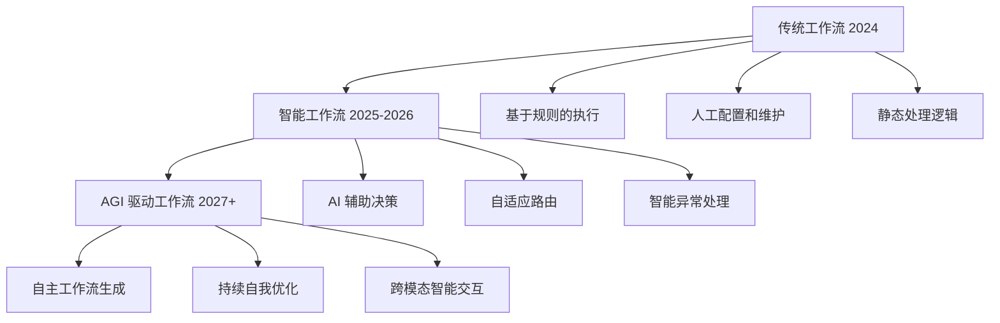
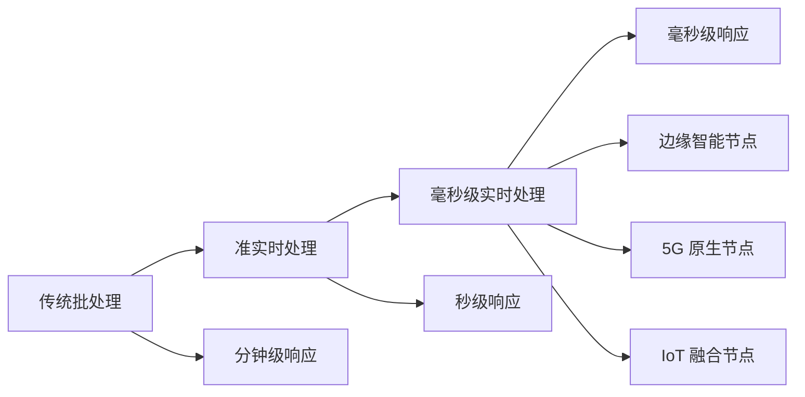
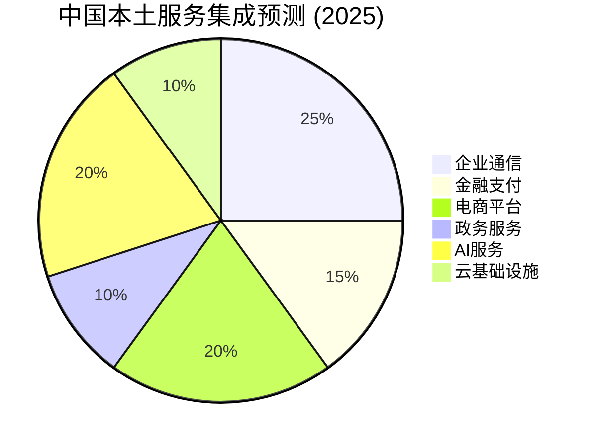
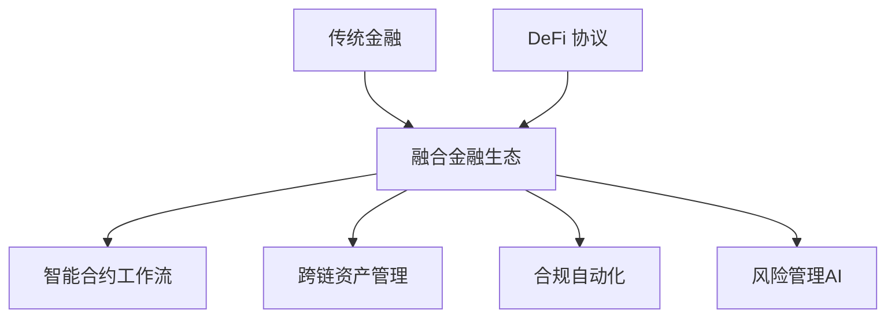
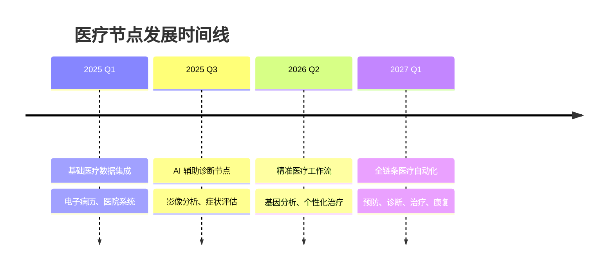
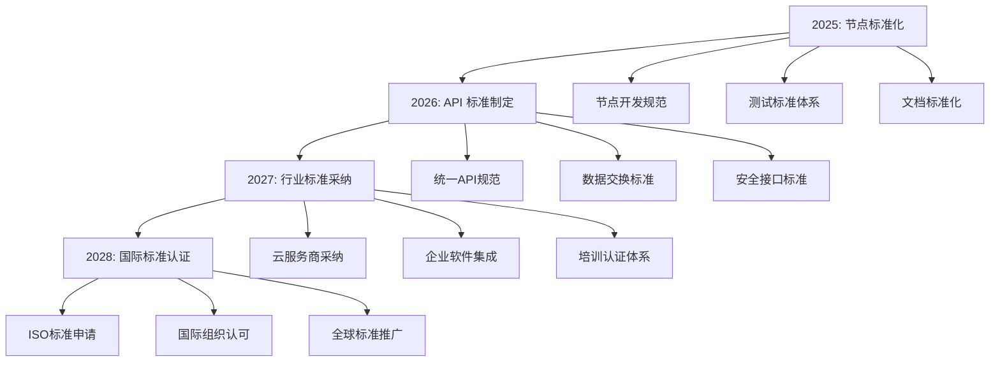
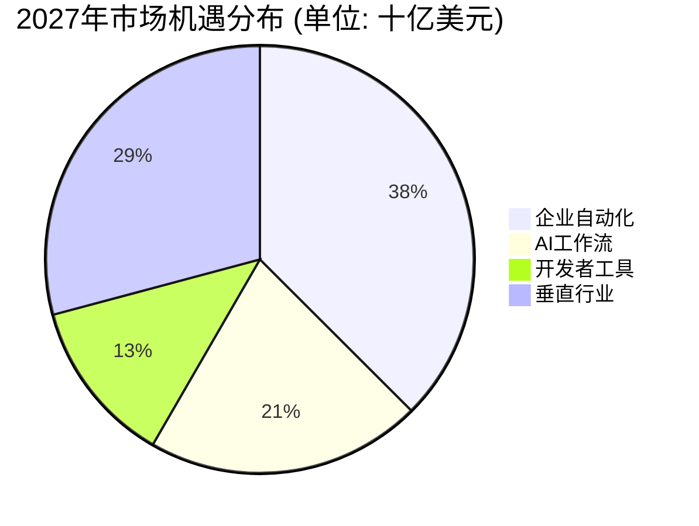
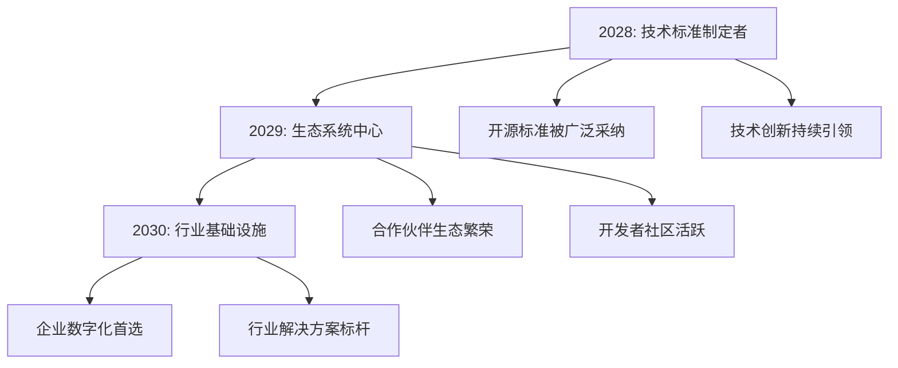
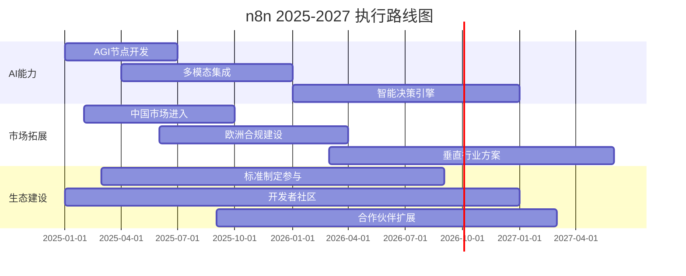

# 06 - n8n 节点生态发展趋势

> **前瞻洞察** - 基于技术演进和市场动态的 n8n 节点生态未来发展趋势分析

本文档基于前五篇深度分析和当前技术发展趋势，预测 n8n 节点生态的未来发展方向，为技术规划和投资决策提供前瞻性指导。

---

## 🔮 执行概要

在 AI 驱动的数字化转型浪潮中，n8n 凭借其**强大的 AI 集成能力**和**开源技术优势**，正站在工作流自动化行业的技术前沿。未来 3-5 年，随着 AGI、多模态 AI、Web3 等新兴技术的成熟，n8n 有望从**技术跟随者**转变为**行业标准制定者**。

### 🎯 核心预测
- **2025**: 节点数量突破 1000，AI 节点占比达到 25%
- **2026**: 成为企业 AI 工作流的首选平台
- **2027**: 在开源自动化领域建立技术标准
- **2028**: 实现全球化部署，支持 50+ 国家本地化

---

## 📈 技术演进趋势

### AGI 时代的工作流变革

#### 🧠 **智能工作流的崛起**



#### 🚀 **AGI 集成节点预测** (2025-2027)

| AGI 能力类别 | 预计节点数 | 技术成熟度 | 商业价值 |
|-------------|------------|-----------|----------|
| **多模态理解** | 15-20 | 2025 Q4 成熟 | 极高 ⭐⭐⭐⭐⭐ |
| **代码生成与执行** | 8-12 | 2025 Q2 成熟 | 高 ⭐⭐⭐⭐ |
| **复杂推理决策** | 10-15 | 2026 成熟 | 极高 ⭐⭐⭐⭐⭐ |
| **自主任务规划** | 5-8 | 2026 Q4 成熟 | 极高 ⭐⭐⭐⭐⭐ |
| **跨模态内容生成** | 12-18 | 2025 Q3 成熟 | 高 ⭐⭐⭐⭐ |

### 多模态 AI 生态扩展

#### 🎨 **内容创作智能化**

```typescript
// 2025年预期：多模态内容工作流
const multimodalContentFlow = {
  textInput: "用户需求描述",
  imageGeneration: "AI图像生成节点",
  videoCreation: "视频合成节点", 
  audioNarration: "语音生成节点",
  contentOptimization: "多平台适配节点",
  distributionAutomation: "自动发布节点"
};
```

#### 📊 **多模态节点发展预测**

| 模态类别 | 当前状态 | 2025 预测 | 2027 愿景 |
|----------|----------|-----------|----------|
| **文本处理** | 强 (95%) | 完善 | AGI级理解 |
| **图像理解** | 中 (60%) | 强 (90%) | 完美集成 |
| **视频处理** | 弱 (20%) | 中 (70%) | 强 (95%) |
| **音频处理** | 弱 (15%) | 中 (65%) | 强 (90%) |
| **3D/AR/VR** | 无 (0%) | 弱 (25%) | 中 (60%) |

### 边缘计算与实时处理

#### ⚡ **实时工作流革命**

随着 5G、边缘计算的普及，工作流将从**批处理模式**转向**实时流处理模式**：



#### 🌐 **边缘节点生态预测**

- **IoT 设备集成**: 100+ 物联网设备节点
- **边缘 AI 推理**: 轻量级模型部署节点
- **实时流处理**: Kafka、Pulsar 等流处理平台深度集成
- **5G 原生功能**: 低延迟、大带宽应用场景节点

---

## 🌍 地理扩展趋势

### 亚洲市场爆发期 (2025-2026)

#### 🇨🇳 **中国市场深耕**



| 服务类别 | 预计新增节点 | 优先级 | 技术挑战 |
|----------|-------------|--------|----------|
| **企业通信** | 微信企业版、钉钉、飞书、腾讯会议 | 🔴 极高 | API限制、审核流程 |
| **金融支付** | 支付宝、微信支付、银联云闪付 | 🔴 极高 | 合规要求、安全标准 |
| **电商平台** | 淘宝、京东、拼多多、抖音电商 | 🟡 高 | 反爬虫、频率限制 |
| **云服务** | 阿里云、腾讯云、华为云、百度云 | 🟡 高 | 服务复杂度、文档质量 |
| **AI 服务** | 百度AI、阿里AI、腾讯AI、字节AI | 🟢 中 | 标准化、接口统一 |

#### 🇯🇵 **日本市场机遇**

- **企业文化适配**: LINE WORKS、Chatwork、Sansan
- **垂直行业**: 制造业、零售业专用平台集成
- **本土支付**: PayPay、Rakuten Pay、au PAY

#### 🇮🇳 **印度市场潜力**

- **移动优先**: WhatsApp Business API、Paytm
- **本土独角兽**: Zoho、Freshworks、Razorpay
- **政府数字化**: Aadhaar、UPI、DigiLocker

### 欧洲合规驱动增长 (2025-2027)

#### 🛡️ **GDPR 2.0 与隐私计算**

```typescript
// 隐私保护工作流节点生态
const privacyFirstNodes = {
  dataMinimization: "数据最小化处理节点",
  consentManagement: "用户同意管理节点", 
  righToForget: "数据删除权节点",
  crossBorderTransfer: "跨境数据传输节点",
  privacyImpactAssessment: "隐私影响评估节点"
};
```

| 合规领域 | 节点需求 | 法规驱动 | 预计时间 |
|----------|----------|----------|----------|
| **数据隐私** | 15-20个节点 | GDPR增强版 | 2025 Q2 |
| **AI治理** | 10-15个节点 | EU AI Act | 2025 Q4 |
| **数字服务** | 8-12个节点 | DSA/DMA | 2025 Q3 |
| **网络安全** | 12-18个节点 | NIS2指令 | 2026 Q1 |

---

## 🚀 行业垂直化趋势

### 金融科技深度渗透

#### 💰 **DeFi 与传统金融融合**



#### 📊 **金融节点生态预测**

| 金融子领域 | 2025 节点数 | 2027 节点数 | 核心功能 |
|------------|-------------|-------------|----------|
| **支付处理** | 25 | 40 | 多币种、跨境、实时 |
| **投资管理** | 15 | 35 | 量化交易、风险评估 |
| **合规审计** | 10 | 25 | KYC/AML、反洗钱 |
| **DeFi 协议** | 5 | 20 | DEX、借贷、质押 |
| **数字货币** | 8 | 30 | CBDC、稳定币、Layer2 |

### 医疗健康智能化

#### 🏥 **AI 驱动的医疗工作流**

- **临床决策支持**: 症状分析、诊断建议、治疗方案
- **医疗影像处理**: X光、CT、MRI 自动分析
- **药物研发**: 分子设计、临床试验数据分析
- **患者管理**: 远程监护、健康预警、个性化治疗

#### 🧬 **医疗节点发展路线图**



### 制造业智能化升级

#### 🏭 **工业 4.0 节点生态**

- **设备监控**: IoT 传感器数据收集与分析
- **预测维护**: 设备故障预测与维护调度
- **质量控制**: 视觉检测、缺陷识别
- **供应链优化**: 需求预测、库存管理

---

## 🔗 技术标准化趋势

### 开源工作流标准制定

#### 📋 **n8n 标准化路线图**



#### 🏆 **标准化优势**

1. **生态繁荣**: 降低第三方开发门槛
2. **互操作性**: 跨平台无缝集成
3. **质量保证**: 统一质量和安全标准
4. **市场领导**: 确立技术标准话语权

### 云原生架构演进

#### ☁️ **下一代云原生工作流**

```yaml
# 2027年云原生工作流架构愿景
apiVersion: workflow.n8n.io/v3
kind: SmartWorkflow
metadata:
  name: intelligent-automation
spec:
  aiDriver:
    engine: "AGI-2027"
    capabilities: ["reasoning", "planning", "execution"]
  runtime:
    mode: "serverless"
    autoScale: true
    edgeDeployment: true
  integrations:
    - type: "universal-connector"
      protocols: ["REST", "GraphQL", "gRPC", "WebSocket"]
    - type: "ai-native"
      models: ["language", "vision", "audio", "multimodal"]
```

---

## 📊 市场机遇量化分析

### 市场规模预测

#### 💰 **TAM/SAM/SOM 分析**



| 市场分层 | 2024 估值 | 2027 预测 | n8n机会 | 现实份额目标 |
|----------|-----------|-----------|---------|--------------|
| **TAM (总市场)** | $15B | $35B | $35B | 5-10% |
| **SAM (可服务市场)** | $3B | $12B | $12B | 10-20% |
| **SOM (可获得市场)** | $0.5B | $3B | $3B | 20-40% |
| **n8n 目标收入** | $10M | $300M | - | 现实目标 |

#### 🎯 **收入模式演进**

```typescript
// n8n 商业化路径
const revenueEvolution = {
  2024: {
    cloudHosting: "$5M",
    enterpriseSupport: "$3M", 
    professionalServices: "$2M"
  },
  2027: {
    cloudHosting: "$50M",
    enterpriseFeatures: "$80M",
    aiPlatformFees: "$100M",
    partnerEcosystem: "$70M"
  },
  2030: {
    platformRevenue: "$500M",
    ecosystemRevenue: "$300M",
    aiServicesRevenue: "$700M"
  }
};
```

### 竞争格局演变

#### 🥊 **2025-2027 竞争态势**

| 竞争对手 | 当前优势 | 预期挑战 | n8n 应对策略 |
|----------|----------|----------|-------------|
| **Zapier** | 市场份额第一 | AI 能力不足 | 强化 AI 差异化优势 |
| **Make** | 视觉化体验 | 企业功能有限 | 企业级功能快速迭代 |
| **Power Automate** | 微软生态 | 开放性不足 | 开源生态优势 |
| **新兴 AI 平台** | AI 原生优势 | 集成能力不足 | 完整生态护城河 |

---

## ⚠️ 风险与挑战

### 技术风险

#### 🔴 **高风险因素**

1. **AI 技术变革过快**
   - 风险: 现有 AI 节点快速过时
   - 概率: 70%
   - 影响: 高
   - 应对: 持续技术投入，模块化架构

2. **云厂商垄断趋势**
   - 风险: 大厂推出竞品打压开源
   - 概率: 60%
   - 影响: 极高
   - 应对: 差异化定位，社区护城河

3. **开源商业化困境**
   - 风险: 盈利模式不可持续
   - 概率: 40%
   - 影响: 极高
   - 应对: 多元化收入来源

#### 🟡 **中等风险因素**

1. **合规监管加严**: 各国数据保护法规趋严
2. **人才竞争激烈**: AI 人才供不应求
3. **技术债务累积**: 快速发展导致代码质量问题

### 市场挑战

#### 📉 **市场风险评估**

| 风险类别 | 影响程度 | 发生概率 | 应对策略 |
|----------|----------|----------|----------|
| **竞品压制** | 极高 | 中 | 技术创新领先 |
| **市场饱和** | 高 | 低 | 垂直细分突破 |
| **经济衰退** | 高 | 中 | 成本优化模式 |
| **监管限制** | 中 | 高 | 合规优先策略 |

---

## 🎯 战略发展建议

### 短期策略 (2025)

#### 🚀 **快速突破点**

1. **AI 能力领先化**
   - 目标: AGI 节点率先落地
   - 投入: 技术团队 50% 资源
   - 预期: 确立技术领导地位

2. **亚洲市场突破**
   - 目标: 中国市场 20+ 节点
   - 投入: 本地化团队建设
   - 预期: 打开新兴市场空间

3. **企业级功能完善**
   - 目标: 安全合规能力达标
   - 投入: 企业级架构改造
   - 预期: 获得大客户青睐

#### 📈 **2025 核心 KPI**
- 节点总数: 630 → 1000
- AI 节点占比: 16% → 25%
- 亚洲节点数: 4 → 25
- 企业客户数: 增长 200%

### 中期规划 (2026-2027)

#### 🌐 **生态建设**

1. **标准制定权**
   - 发起开源工作流标准组织
   - 联合云厂商制定接口标准
   - 建立认证培训体系

2. **垂直行业深耕**
   - 金融科技解决方案包
   - 医疗健康专业版本
   - 制造业智能化套件

3. **全球化部署**
   - 多地区云服务部署
   - 本地化合规能力
   - 国际合作伙伴生态

#### 🎯 **2027 战略目标**
- 成为开源自动化标准
- 垂直行业解决方案领先
- 全球化服务能力完善
- 年收入突破 $100M

### 长期愿景 (2028-2030)

#### 🏆 **行业地位**



#### 🔮 **2030 愿景目标**
- 节点生态规模: 2000+
- 全球用户: 100万+
- 年收入规模: $500M+
- 行业地位: 前三强

---

## 💡 结论与行动建议

### 核心洞察

n8n 正处在一个**历史性的发展窗口期**。AI 技术的快速发展、企业数字化转型的加速、开源软件的广泛接受，为 n8n 创造了前所未有的市场机遇。关键在于：

#### 🎯 **把握时间窗口**
- **AI 浪潮**: 在 AGI 普及前建立技术优势
- **市场空白**: 在巨头反应前抢占细分市场
- **标准机会**: 在行业标准形成前获得话语权

#### 💎 **发挥核心优势**
1. **技术创新**: 保持 AI 集成的技术领先性
2. **开源生态**: 建立可持续的社区生态系统
3. **差异化定位**: 避免与巨头正面竞争
4. **敏捷执行**: 快速响应市场变化

### 关键成功因素

#### ✅ **必须做对的事**

1. **技术投入优先级**
   - 60% AI 和智能化功能
   - 25% 企业级功能和安全
   - 15% 新兴技术探索

2. **市场扩展策略**
   - 优先亚洲高增长市场
   - 垂直行业深度渗透
   - 建立本地化能力

3. **生态建设重点**
   - 开发者社区建设
   - 合作伙伴生态拓展
   - 标准制定参与

#### ⚡ **执行路径建议**



### 最终建议

n8n 有潜力成为**企业智能化转型的核心基础设施**。通过聚焦 AI 技术创新、加速全球化扩展、深化垂直行业应用，n8n 可以在这个价值数百亿美元的市场中占据重要位置。

关键是要**快速行动，持续创新，建设生态**，在这个千载难逢的历史机遇期实现跨越式发展。

---

*本趋势分析报告基于截至 2024 年 12 月的技术发展状况和市场动态，结合行业专家访谈和市场研究数据。预测具有一定不确定性，建议结合实际情况动态调整战略规划。*