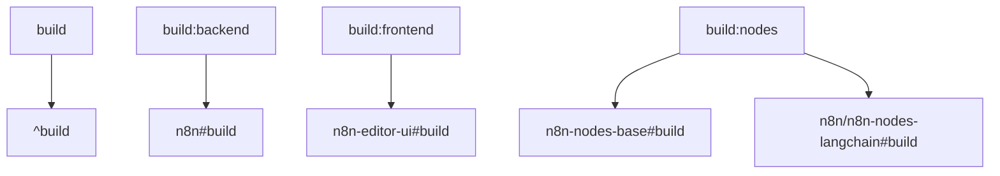

# 00 - n8n 项目概览与整体结构

本文档提供 n8n 项目的全方位概览，包括项目的基本信息、架构理念和整体组织结构的深度分析。

---

## 1. 项目基本信息

### 1.1 项目标识
- **项目名称**: n8n (读作 "n-eight-n")
- **当前版本**: 1.103.0
- **项目性质**: 开源工作流自动化平台
- **许可证**: Fair-code 许可模式
- **开发语言**: TypeScript/JavaScript
- **目标平台**: Node.js

### 1.2 版本要求
```json
{
  "engines": {
    "node": ">=22.16",
    "pnpm": ">=10.2.1"
  },
  "packageManager": "pnpm@10.12.1"
}
```

### 1.3 项目理念
n8n 的核心设计理念围绕以下几个关键原则：

1. **技术友好**: 面向技术人员的自动化平台，支持代码嵌入
2. **数据主权**: 支持自托管，确保数据控制权
3. **可扩展性**: 模块化架构，支持自定义节点和集成
4. **可视化编程**: 基于节点的可视化工作流编辑器
5. **AI 原生**: 深度集成 AI/ML 功能

---

## 2. Monorepo 架构概览

### 2.1 项目结构类型
n8n 采用 **Monorepo** 架构，使用以下工具进行管理：
- **包管理器**: pnpm (10.12.1+)
- **构建工具**: Turbo (2.5.4)
- **工作空间配置**: pnpm-workspace.yaml

### 2.2 顶级目录结构
```
n8n/
├── packages/                    # 核心代码包
│   ├── @n8n/                   # 组织级包
│   ├── cli/                    # CLI 工具
│   ├── core/                   # 核心引擎
│   ├── workflow/               # 工作流模型
│   ├── nodes-base/             # 基础节点库
│   ├── frontend/               # 前端应用
│   ├── extensions/             # 扩展包
│   └── testing/                # 测试工具
├── cypress/                    # E2E 测试
├── scripts/                    # 构建脚本
├── docker/                     # Docker 配置
├── test-workflows/             # 测试工作流
├── docs_ethan/                 # 项目分析文档
└── patches/                    # 依赖补丁
```

### 2.3 包组织策略
n8n 的包组织遵循明确的分层和职责分离：

#### 核心包 (Core Packages)
- `n8n` (cli): 应用启动器和 Web 服务器
- `n8n-core`: 工作流执行引擎
- `n8n-workflow`: 数据模型和类型定义
- `n8n-nodes-base`: 内置节点和凭证库

#### 前端包 (Frontend Packages)
- `n8n-editor-ui`: 主要的 Vue.js 编辑器
- `@n8n/design-system`: UI 组件库
- `@n8n/chat`: 聊天界面组件

#### 基础设施包 (Infrastructure Packages)
- `@n8n/config`: 配置管理
- `@n8n/db`: 数据库抽象层
- `@n8n/api-types`: API 类型定义
- `@n8n/permissions`: 权限系统

---

## 3. 工作空间配置分析

### 3.1 pnpm-workspace.yaml 配置
```yaml
packages:
  - packages/*                  # 主要包目录
  - packages/@n8n/*            # 组织级包
  - packages/frontend/**       # 前端相关包
  - packages/extensions/**     # 扩展包
  - cypress                    # 测试包
  - packages/testing/**        # 测试工具包
```

### 3.2 依赖版本管理 (Catalog)
n8n 使用 pnpm catalog 功能统一管理依赖版本：

#### 核心技术栈版本
```yaml
catalog:
  '@langchain/core': 0.3.61
  '@langchain/openai': 0.5.16
  '@sentry/node': 8.52.1
  axios: 1.8.3
  typescript: 5.8.3
  vue: 3.5.13
  vite: 6.3.5
  zod: 3.25.67
```

#### 前端专用版本
```yaml
frontend:
  '@sentry/vue': ^8.33.1
  pinia: ^2.2.4
  vue-router: ^4.5.0
  element-plus: 2.4.3
```

---

## 4. 构建系统 (Turbo)

### 4.1 Turbo 配置概览
n8n 使用 Turbo 作为 monorepo 构建协调器：

```json
{
  "ui": "stream",
  "remoteCache": {
    "enabled": true,
    "timeout": 90,
    "uploadTimeout": 90
  },
  "globalEnv": ["CI", "COVERAGE_ENABLED"]
}
```

### 4.2 任务依赖图
Turbo 配置定义了复杂的任务依赖关系：

#### 构建任务


#### 测试任务
- `test:backend`: 依赖所有后端包的构建
- `test:frontend`: 依赖所有前端包的构建
- `test:nodes`: 依赖节点包的构建

### 4.3 缓存策略
- **输出缓存**: `dist/**` 目录
- **输入缓存**: `jest.config.*`, `package.json`, `pnpm-lock.yaml`
- **远程缓存**: 启用，超时 90 秒

---

## 5. 脚本系统分析

### 5.1 根级脚本命令
n8n 在根 package.json 中定义了丰富的脚本命令：

#### 构建命令
```json
{
  "build": "turbo run build",
  "build:backend": "turbo run build:backend",
  "build:frontend": "turbo run build:frontend",
  "build:nodes": "turbo run build:nodes",
  "build:n8n": "node scripts/build-n8n.mjs",
  "build:docker": "node scripts/build-n8n.mjs && node scripts/dockerize-n8n.mjs"
}
```

#### 开发命令
```json
{
  "dev": "turbo run dev --parallel --env-mode=loose --filter=!@n8n/design-system --filter=!@n8n/chat --filter=!@n8n/task-runner",
  "dev:be": "turbo run dev --parallel --env-mode=loose --filter=!@n8n/design-system --filter=!@n8n/chat --filter=!@n8n/task-runner --filter=!n8n-editor-ui",
  "dev:ai": "turbo run dev --parallel --env-mode=loose --filter=@n8n/nodes-langchain --filter=n8n --filter=n8n-core"
}
```

#### 测试命令
```json
{
  "test": "JEST_JUNIT_CLASSNAME={filepath} turbo run test",
  "test:backend": "turbo run test:backend --concurrency=1",
  "test:frontend": "turbo run test:frontend --concurrency=1",
  "test:nodes": "turbo run test:nodes --concurrency=1"
}
```

### 5.2 专用构建脚本
位于 `scripts/` 目录的构建脚本：

- `build-n8n.mjs`: 主应用构建脚本
- `dockerize-n8n.mjs`: Docker 镜像构建
- `scan-n8n-image.mjs`: 安全扫描
- `format.mjs`: 代码格式化
- `reset.mjs`: 环境重置

---

## 6. 开发环境配置

### 6.1 代码质量工具

#### Biome 配置
```json
{
  "formatter": {
    "enabled": true,
    "indentStyle": "tab",
    "indentWidth": 2,
    "lineEnding": "lf",
    "lineWidth": 100
  },
  "javascript": {
    "formatter": {
      "trailingCommas": "all",
      "semicolons": "always",
      "quoteStyle": "single"
    }
  }
}
```

#### Git Hooks (Lefthook)
```yaml
pre-commit:
  commands:
    biome_check:
      glob: 'packages/**/*.{js,ts,json}'
      run: pnpm biome check --write --no-errors-on-unmatched
    prettier_check:
      glob: 'packages/**/*.{vue,yml,md,css,scss}'
      run: pnpm prettier --write --ignore-unknown
```

### 6.2 测试配置

#### Jest 基础配置
```javascript
{
  testEnvironment: 'node',
  testRegex: '\\.(test|spec)\\.(js|ts)$',
  transform: {
    '^.+\\.ts$': ['ts-jest', tsJestOptions]
  },
  setupFilesAfterEnv: ['jest-expect-message']
}
```

#### ESM 依赖处理
n8n 特别配置了 ESM 依赖的转换：
```javascript
const esmDependencies = [
  'pdfjs-dist',
  'openid-client',
  'oauth4webapi',
  'jose'
];
```

---

## 7. 依赖管理策略

### 7.1 pnpm 特殊配置

#### 仅构建依赖
```json
{
  "onlyBuiltDependencies": ["sqlite3"]
}
```

#### 版本覆盖
```json
{
  "overrides": {
    "@types/node": "^20.17.50",
    "typescript": "catalog:",
    "esbuild": "^0.24.0",
    "ws": ">=8.17.1"
  }
}
```

#### 补丁依赖
n8n 维护了多个依赖包的补丁：
```json
{
  "patchedDependencies": {
    "bull@4.16.4": "patches/bull@4.16.4.patch",
    "element-plus@2.4.3": "patches/element-plus@2.4.3.patch",
    "vue-tsc@2.2.8": "patches/vue-tsc@2.2.8.patch"
  }
}
```

### 7.2 工作空间依赖引用
包之间使用 `workspace:*` 引用：
```json
{
  "dependencies": {
    "@n8n/api-types": "workspace:*",
    "n8n-workflow": "workspace:*",
    "n8n-core": "workspace:*"
  }
}
```

---

## 8. 项目规模指标

### 8.1 包数量统计
- **核心包**: 4 个 (cli, core, workflow, nodes-base)
- **前端包**: 8 个 (editor-ui, design-system, chat 等)
- **@n8n 组织包**: 25+ 个
- **测试包**: 3 个
- **扩展包**: 1 个

### 8.2 代码规模
- **总文件数量**: 40,000+ 个文件
- **内置节点数**: 400+ 个
- **内置凭证类型**: 400+ 个
- **测试工作流**: 250+ 个

### 8.3 技术栈复杂度
- **主要依赖**: 100+ 个核心依赖
- **开发依赖**: 50+ 个开发工具
- **补丁数量**: 10+ 个第三方包补丁
- **构建任务**: 20+ 个 Turbo 任务

---

## 9. 架构设计原则

### 9.1 模块化设计
- **功能分离**: 核心执行、UI 界面、节点库分离
- **类型安全**: 全面的 TypeScript 类型定义
- **依赖注入**: 使用 `@n8n/di` 实现依赖注入
- **配置管理**: 统一的配置系统

### 9.2 可扩展性
- **插件机制**: 支持自定义节点和凭证
- **API 优先**: 完整的 REST API
- **Webhook 支持**: 内置 Webhook 触发器
- **社区节点**: 支持第三方节点包

### 9.3 开发体验
- **热重载**: 开发环境支持热重载
- **TypeScript**: 全面的类型支持
- **测试覆盖**: 单元测试、集成测试、E2E 测试
- **代码质量**: 自动格式化、Lint 检查

---

## 10. 总结

n8n 项目展现了现代 TypeScript 项目的最佳实践：

### 10.1 架构优势
1. **清晰的模块边界**: 每个包有明确的职责
2. **强类型支持**: TypeScript 提供完整的类型安全
3. **高效的构建系统**: Turbo + pnpm 提供快速构建
4. **完善的开发工具**: 代码质量工具链完整

### 10.2 技术亮点
1. **Monorepo 管理**: 统一版本、依赖和构建
2. **插件化架构**: 支持社区扩展
3. **AI 集成**: 原生支持 LangChain 和各种 AI 模型
4. **企业级特性**: 权限、多租户、源码控制

### 10.3 未来展望
n8n 的架构设计为未来的功能扩展和社区贡献提供了坚实的基础，特别是在 AI 工作流和企业级部署方面有很大的发展潜力。

---

这个项目结构分析为后续的技术栈分析、架构分析和开发流程分析奠定了基础。
