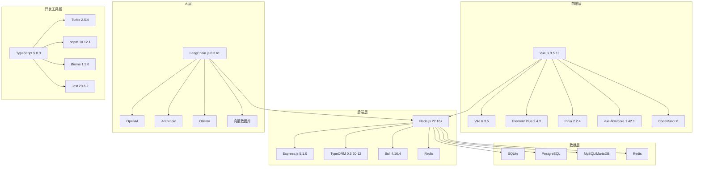

# 00 - 技术栈概览

本文档提供 n8n 项目完整技术栈的高层概览，总结各个技术层面的核心组件、版本信息和技术选型策略。

---

## 1. 技术栈架构图

### 1.1 整体架构


### 1.2 技术分层
- **表现层**: Vue.js 生态系统 + 设计系统
- **业务层**: Node.js + Express.js + 工作流引擎
- **数据层**: 多数据库支持 + 缓存系统
- **AI 层**: LangChain.js + 多模型集成
- **工具层**: TypeScript + 现代化开发工具链

---

## 2. 核心技术版本统计

### 2.1 主要技术栈版本
| 技术分类 | 核心组件 | 版本 | 说明 |
|---------|----------|------|------|
| **前端框架** | Vue.js | 3.5.13 | 主要前端框架 |
| **构建工具** | Vite | 6.3.5 | 现代化构建工具 |
| **UI 框架** | Element Plus | 2.4.3 | 企业级 UI 组件库 |
| **状态管理** | Pinia | 2.2.4 | Vue 3 官方状态管理 |
| **后端运行时** | Node.js | 22.16+ | JavaScript 运行环境 |
| **Web 框架** | Express.js | 5.1.0 | Node.js Web 框架 |
| **ORM** | TypeORM | 0.3.20-12 | 数据库对象关系映射 |
| **队列系统** | Bull | 4.16.4 | Redis 队列处理 |
| **语言** | TypeScript | 5.8.3 | 类型安全的 JavaScript |
| **包管理** | pnpm | 10.12.1 | 高效包管理器 |
| **构建系统** | Turbo | 2.5.4 | Monorepo 构建工具 |

### 2.2 AI/ML 技术栈版本
| AI 组件 | 版本 | 用途 |
|---------|------|------|
| **@langchain/core** | 0.3.61 | LangChain 核心抽象 |
| **@langchain/openai** | 0.5.16 | OpenAI 模型集成 |
| **@langchain/anthropic** | 0.3.23 | Anthropic Claude 集成 |
| **@langchain/community** | 0.3.47 | 社区扩展包 |
| **@n8n_io/ai-assistant-sdk** | 1.15.0 | n8n AI 助手 SDK |

---

## 3. 技术选型分析

### 3.1 前端技术选型

#### Vue.js 3 选择理由
- **渐进式框架**: 易于集成和扩展
- **Composition API**: 更好的 TypeScript 支持
- **性能优化**: Vue 3 的响应式系统优化
- **生态成熟**: 丰富的组件和工具生态

#### Vite 构建工具优势
- **快速冷启动**: ES 模块的原生支持
- **热更新**: 毫秒级的模块热替换
- **现代化**: 支持最新的 Web 标准
- **插件生态**: 丰富的插件系统

#### Element Plus UI 框架
- **企业级**: 完整的企业级组件库
- **Vue 3 原生**: 专为 Vue 3 设计
- **主题定制**: 灵活的主题定制能力
- **国际化**: 完善的多语言支持

### 3.2 后端技术选型

#### Node.js 运行时
- **JavaScript 统一**: 前后端语言统一
- **异步 I/O**: 高并发处理能力
- **生态丰富**: npm 生态系统
- **版本先进**: 支持最新 JavaScript 特性

#### Express.js 框架
- **成熟稳定**: 久经考验的 Web 框架
- **中间件生态**: 丰富的中间件支持
- **灵活性**: 高度可定制的架构
- **社区支持**: 活跃的社区和文档

#### TypeORM 数据库
- **TypeScript 原生**: 完美的 TypeScript 集成
- **多数据库**: 支持多种数据库类型
- **活跃记录**: 优雅的数据操作 API
- **迁移支持**: 完善的数据库迁移机制

### 3.3 开发工具选型

#### TypeScript 语言
- **类型安全**: 编译时错误检查
- **开发体验**: 优秀的 IDE 支持
- **重构友好**: 安全的代码重构
- **JavaScript 超集**: 平滑的迁移路径

#### Turbo Monorepo 工具
- **缓存优化**: 智能的构建缓存
- **并行构建**: 高效的并行任务执行
- **依赖分析**: 自动的依赖关系管理
- **远程缓存**: 团队协作的缓存共享

#### pnpm 包管理器
- **磁盘效率**: 硬链接节省磁盘空间
- **速度优势**: 并行安装和快速解析
- **工作空间**: 原生的 Monorepo 支持
- **严格性**: 避免幻影依赖问题

---

## 4. 架构设计原则

### 4.1 核心设计原则

#### 模块化设计
- **包级模块化**: 每个包有明确的职责边界
- **功能模块化**: 功能按模块组织
- **接口标准化**: 统一的接口设计规范
- **依赖清晰**: 明确的依赖关系

#### 类型安全
- **全栈 TypeScript**: 前后端统一类型系统
- **严格模式**: 启用 TypeScript 严格检查
- **接口优先**: 基于接口的设计模式
- **类型共享**: 跨包的类型定义共享

#### 可扩展性
- **插件架构**: 支持第三方节点和扩展
- **配置驱动**: 基于配置的功能开关
- **API 优先**: 完整的 REST API 支持
- **钩子系统**: 灵活的扩展点

#### 开发体验
- **热重载**: 快速的开发反馈
- **自动化**: 完善的自动化工具链
- **调试友好**: 优秀的调试支持
- **文档完善**: 详尽的开发文档

### 4.2 性能设计原则

#### 前端性能
- **代码分割**: 按需加载的路由和组件
- **虚拟滚动**: 大数据集的高效渲染
- **缓存策略**: 多层次的缓存机制
- **打包优化**: Tree Shaking 和压缩优化

#### 后端性能
- **异步处理**: 非阻塞的 I/O 操作
- **队列系统**: 后台任务处理
- **数据库优化**: 连接池和查询优化
- **缓存层**: Redis 缓存加速

#### 构建性能
- **增量构建**: Turbo 的智能缓存
- **并行处理**: 多核 CPU 利用
- **依赖优化**: 精确的依赖分析
- **缓存共享**: 团队级别的构建缓存

---

## 5. 数据库架构

### 5.1 支持的数据库类型

#### 关系型数据库
- **SQLite**: 开发环境默认数据库
- **PostgreSQL**: 推荐的生产环境数据库
- **MySQL/MariaDB**: 企业环境支持
- **Microsoft SQL Server**: 企业级数据库支持

#### NoSQL 数据库
- **Redis**: 缓存和队列存储
- **MongoDB**: 通过节点支持文档数据库

#### 向量数据库
- **Pinecone**: 托管向量数据库服务
- **Qdrant**: 开源向量搜索引擎
- **Weaviate**: 知识图谱向量数据库
- **Chroma**: 嵌入式向量数据库

### 5.2 数据库选择策略

#### 环境配置建议
```typescript
// 开发环境
const developmentConfig = {
  type: 'sqlite',
  database: './database.sqlite',
  synchronize: true,
  logging: true
};

// 生产环境
const productionConfig = {
  type: 'postgres',
  host: process.env.DB_HOST,
  port: 5432,
  database: process.env.DB_NAME,
  synchronize: false,
  logging: false,
  ssl: true
};
```

---

## 6. AI/ML 技术生态

### 6.1 LangChain.js 生态系统

#### 核心组件
- **@langchain/core**: 基础抽象和接口
- **模型集成包**: 各种 LLM 提供商的集成
- **向量存储包**: 向量数据库集成
- **工具包**: 实用工具和扩展

#### 支持的模型提供商
- **OpenAI**: GPT 系列模型
- **Anthropic**: Claude 系列模型
- **Google**: Gemini 系列模型
- **Cohere**: Command 系列模型
- **Ollama**: 本地模型部署
- **Azure OpenAI**: 企业级 OpenAI 服务

### 6.2 AI 功能集成

#### 核心 AI 能力
- **对话模型**: 多种 LLM 的统一接口
- **嵌入模型**: 文本向量化处理
- **向量搜索**: 相似性搜索和 RAG
- **AI Agent**: 智能代理和工具使用
- **多模态**: 文本、图像、音频处理

---

## 7. 监控和运维技术

### 7.1 监控技术栈

#### 应用监控
- **Sentry**: 错误监控和性能分析
- **Winston**: 结构化日志记录
- **Prometheus**: 指标收集和监控
- **Grafana**: 可视化监控面板

#### 基础设施监控
- **Docker**: 容器化部署
- **Kubernetes**: 容器编排 (可选)
- **nginx**: 反向代理和负载均衡
- **Systemd**: 系统服务管理

### 7.2 CI/CD 技术

#### 持续集成
- **GitHub Actions**: 主要 CI/CD 平台
- **Jest**: 单元测试框架
- **Cypress**: E2E 测试框架
- **Playwright**: 现代 E2E 测试

#### 部署策略
- **Docker 镜像**: 标准化部署包
- **云原生**: 支持各种云平台
- **自托管**: 本地部署支持
- **边缘部署**: CDN 和边缘计算

---

## 8. 安全技术栈

### 8.1 认证与授权

#### 认证机制
- **JWT**: 无状态身份验证
- **OAuth 2.0**: 第三方登录集成
- **SAML**: 企业级单点登录
- **LDAP**: 目录服务集成

#### 授权系统
- **RBAC**: 基于角色的访问控制
- **权限矩阵**: 细粒度权限管理
- **资源级权限**: 工作流和数据级别控制
- **API 权限**: RESTful API 访问控制

### 8.2 数据安全

#### 加密技术
- **传输加密**: HTTPS/TLS 1.3
- **存储加密**: 数据库字段级加密
- **密钥管理**: 环境变量和密钥轮换
- **凭证加密**: 第三方服务凭证加密

#### 安全防护
- **CSRF 防护**: 跨站请求伪造防护
- **XSS 防护**: 跨站脚本攻击防护
- **SQL 注入防护**: 参数化查询
- **输入验证**: Zod schema 验证

---

## 9. 国际化和本地化

### 9.1 i18n 技术栈

#### 前端国际化
- **Vue I18n**: Vue.js 国际化框架
- **多语言支持**: 英语、德语、中文等
- **动态切换**: 运行时语言切换
- **格式化**: 日期、数字、货币格式化

#### 后端国际化
- **消息国际化**: 服务器端消息本地化
- **时区处理**: 用户时区感知
- **区域设置**: 地区特定的配置
- **内容本地化**: 动态内容的本地化

---

## 10. 性能优化技术

### 10.1 前端性能优化

#### 构建优化
- **Tree Shaking**: 未使用代码消除
- **代码分割**: 动态导入和懒加载
- **资源压缩**: 代码和资源压缩
- **缓存策略**: 浏览器和 CDN 缓存

#### 运行时优化
- **虚拟滚动**: 大列表性能优化
- **防抖节流**: 用户交互优化
- **内存管理**: 组件和数据清理
- **渲染优化**: Vue 3 响应式优化

### 10.2 后端性能优化

#### 数据库优化
- **连接池**: 数据库连接管理
- **查询优化**: 索引和查询计划
- **读写分离**: 主从数据库配置
- **分页查询**: 大数据集处理

#### 应用优化
- **异步处理**: 非阻塞操作
- **队列处理**: 后台任务优化
- **缓存层**: 多级缓存策略
- **集群部署**: 水平扩展支持

---

## 11. 技术债务管理

### 11.1 版本管理策略

#### 依赖版本策略
- **Catalog 管理**: 统一版本管理
- **安全更新**: 及时的安全补丁
- **兼容性测试**: 升级前的充分测试
- **回滚策略**: 版本回滚机制

#### 技术演进规划
- **渐进式升级**: 平滑的技术迁移
- **实验性功能**: 特性开关和 A/B 测试
- **弃用管理**: 有序的功能废弃
- **迁移指南**: 详细的升级文档

### 11.2 代码质量保证

#### 静态分析
- **TypeScript**: 编译时类型检查
- **ESLint**: 代码风格和质量检查
- **Biome**: 现代化代码格式化
- **Prettier**: 代码格式统一

#### 动态测试
- **单元测试**: Jest 单元测试
- **集成测试**: API 和组件集成测试
- **E2E 测试**: Cypress 端到端测试
- **性能测试**: 负载和压力测试

---

## 12. 未来技术规划

### 12.1 短期技术目标 (6-12 个月)

#### 性能优化
- **构建性能**: 进一步优化构建速度
- **运行时性能**: 大型工作流的性能优化
- **内存使用**: 内存使用优化和监控
- **网络优化**: API 响应和传输优化

#### 功能增强
- **AI 功能扩展**: 更多 AI 模型和功能
- **实时协作**: 多用户协作编辑
- **移动端适配**: 响应式设计改进
- **可访问性**: WCAG 合规性改进

### 12.2 中期技术规划 (1-2 年)

#### 架构演进
- **微服务架构**: 可选的微服务部署
- **云原生**: Kubernetes 原生支持
- **边缘计算**: 边缘节点部署
- **WebAssembly**: WASM 模块支持

#### 新技术集成
- **Web3 集成**: 区块链和去中心化技术
- **IoT 支持**: 物联网设备集成
- **AR/VR**: 沉浸式工作流编辑
- **量子计算**: 量子算法集成准备

### 12.3 长期愿景 (2+ 年)

#### 平台演进
- **无代码平台**: 完全可视化的业务逻辑构建
- **AI 原生**: AI 驱动的自动化平台
- **生态系统**: 丰富的第三方集成生态
- **标准制定**: 工作流自动化行业标准

---

## 13. 总结

### 13.1 技术栈优势

1. **现代化**: 采用最新的技术栈和最佳实践
2. **类型安全**: 全面的 TypeScript 类型保护
3. **高性能**: 优化的构建和运行时性能
4. **可扩展**: 灵活的架构和插件系统
5. **AI 集成**: 深度的 AI/ML 技术集成

### 13.2 创新亮点

1. **可视化 AI**: 将复杂 AI 逻辑可视化
2. **统一类型**: 前后端共享的类型系统
3. **智能缓存**: Turbo 的构建缓存优化
4. **模块化设计**: 清晰的包结构和依赖管理
5. **开发体验**: 优秀的开发工具和环境

### 13.3 技术领先性

n8n 的技术栈展现了现代软件开发的最佳实践，特别是在以下方面具有领先性：

- **AI 工作流**: 将 LangChain 深度集成到可视化工作流中
- **TypeScript 生态**: 全栈 TypeScript 的完美实现
- **Monorepo 管理**: 现代化的大型项目管理实践
- **开发工具链**: 高效的开发和构建流程
- **可扩展架构**: 支持企业级扩展和定制

这个技术栈为 n8n 提供了强大的技术基础，支持其在工作流自动化和 AI 集成领域的持续创新和发展。
