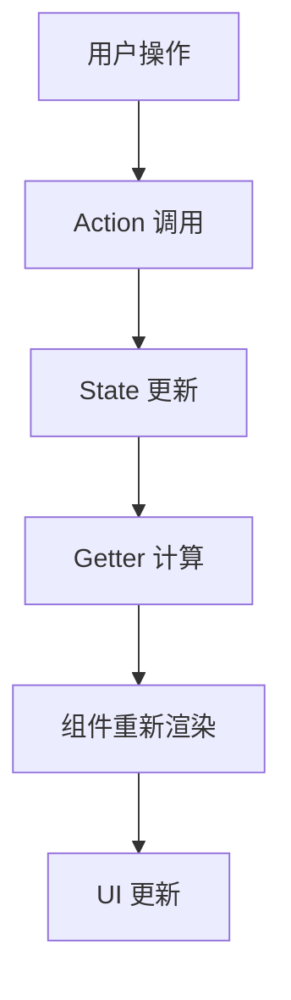

# 01 - 前端技术栈深度分析

本文档深入分析 n8n 前端技术栈的构成、架构设计和技术选型，涵盖了从 Vue.js 生态到构建工具链的全方位技术解析。

---

## 1. 前端架构概览

### 1.1 整体架构模式
n8n 前端采用 **组件化 + 模块化** 的现代前端架构：

```
n8n 前端架构
├── 主应用 (n8n-editor-ui)      # Vue 3 SPA
├── 设计系统 (@n8n/design-system) # 共享组件库
├── 聊天组件 (@n8n/chat)        # 独立聊天界面
├── 工具库 (@n8n/utils)         # 通用工具函数
└── 类型定义 (@n8n/api-types)   # TypeScript 类型
```

### 1.2 技术栈核心组件
- **框架**: Vue.js 3.5.13 (Composition API)
- **构建工具**: Vite 6.3.5
- **UI 框架**: Element Plus 2.4.3 + 自研设计系统
- **状态管理**: Pinia 2.2.4
- **路由**: Vue Router 4.5.0
- **工作流画布**: @vue-flow/core 1.42.1
- **代码编辑**: CodeMirror 6

---

## 2. Vue.js 生态分析

### 2.1 Vue 3 核心特性使用

#### Composition API
n8n 全面采用 Vue 3 Composition API：

```typescript
// 示例：使用 Composition API
import { ref, computed, onMounted } from 'vue';
import { useStore } from '@/stores';

export default defineComponent({
  setup() {
    const store = useStore();
    const workflowData = ref(null);
    
    const isWorkflowActive = computed(() => 
      store.workflow.active
    );
    
    onMounted(() => {
      loadWorkflow();
    });
    
    return {
      workflowData,
      isWorkflowActive
    };
  }
});
```

#### Reactivity System
利用 Vue 3 的响应式系统进行状态管理：
- **ref()**: 基本数据类型响应式
- **reactive()**: 复杂对象响应式  
- **computed()**: 计算属性
- **watch()**: 监听器

### 2.2 Vue Router 4 配置

#### 路由架构
```typescript
// 主要路由结构
const routes = [
  { path: '/', name: 'home', component: WorkflowsView },
  { path: '/workflow/:id', name: 'workflow', component: WorkflowEditor },
  { path: '/credentials', name: 'credentials', component: CredentialsView },
  { path: '/executions', name: 'executions', component: ExecutionsView },
  { path: '/settings', name: 'settings', component: SettingsView }
];
```

#### 导航守卫
- **全局前置守卫**: 权限验证
- **路由独享守卫**: 特定页面逻辑
- **组件内守卫**: 组件级别控制

### 2.3 Vue 组件架构

#### 组件分层
```
组件层次结构
├── 页面组件 (Views)
│   ├── WorkflowEditor.vue
│   ├── CredentialsView.vue
│   └── SettingsView.vue
├── 布局组件 (Layouts)
│   ├── MainLayout.vue
│   └── AuthLayout.vue
├── 功能组件 (Features)
│   ├── NodeCreator/
│   ├── WorkflowCanvas/
│   └── ParameterInput/
└── 基础组件 (Base)
    ├── N8nButton
    ├── N8nInput
    └── N8nModal
```

---

## 3. 状态管理 (Pinia)

### 3.1 Pinia Store 架构

#### 主要 Store 模块
```typescript
// Store 结构概览
interface RootStore {
  ui: UIStore;              // UI 状态
  workflow: WorkflowStore;   // 工作流状态
  nodes: NodesStore;         // 节点管理
  credentials: CredentialsStore; // 凭证管理
  executions: ExecutionsStore;   // 执行历史
  settings: SettingsStore;       // 应用设置
}
```

#### Store 实现示例
```typescript
// workflow store 示例
export const useWorkflowStore = defineStore('workflow', {
  state: () => ({
    workflow: {} as IWorkflowDb,
    isExecuting: false,
    executionData: null
  }),
  
  getters: {
    workflowName(): string {
      return this.workflow.name || 'Untitled';
    },
    
    activeNodes(): INode[] {
      return this.workflow.nodes?.filter(node => !node.disabled) || [];
    }
  },
  
  actions: {
    async saveWorkflow() {
      try {
        const response = await api.workflows.save(this.workflow);
        this.workflow = response.data;
      } catch (error) {
        throw new Error('Failed to save workflow');
      }
    }
  }
});
```

### 3.2 响应式数据流


---

## 4. UI 框架与设计系统

### 4.1 Element Plus 集成

#### 核心组件使用
```typescript
// Element Plus 主要组件
import {
  ElButton,
  ElInput,
  ElSelect,
  ElDialog,
  ElTable,
  ElForm,
  ElMenu,
  ElTree
} from 'element-plus';
```

#### 主题定制
```scss
// Element Plus 主题变量覆盖
:root {
  --el-color-primary: #ff6d5a;
  --el-color-success: #13ce66;
  --el-color-warning: #ffba00;
  --el-color-danger: #ff4949;
  --el-border-radius-base: 6px;
}
```

### 4.2 @n8n/design-system 自研组件

#### 核心组件库
- **N8nButton**: 按钮组件（多种变体）
- **N8nInput**: 输入框组件
- **N8nSelect**: 选择器组件
- **N8nModal**: 模态框组件
- **N8nDataTable**: 数据表格组件
- **N8nNodeIcon**: 节点图标组件

#### 组件设计原则
```typescript
// 组件 Props 设计示例
interface ButtonProps {
  type?: 'primary' | 'secondary' | 'tertiary';
  size?: 'small' | 'medium' | 'large';
  loading?: boolean;
  disabled?: boolean;
  icon?: string;
  label?: string;
}
```

### 4.3 图标系统

#### Font Awesome 集成
```typescript
// Font Awesome 配置
import { FontAwesomeIcon } from '@fortawesome/vue-fontawesome';
import { 
  faPlay, 
  faStop, 
  faCog, 
  faPlus 
} from '@fortawesome/free-solid-svg-icons';
```

#### 自定义图标
- **节点图标**: SVG 格式的节点类型图标
- **状态图标**: 执行状态指示图标
- **操作图标**: UI 交互操作图标

---

## 5. 工作流可视化 (@vue-flow)

### 5.1 Vue Flow 核心功能

#### 主要特性
- **节点拖拽**: 支持节点的拖拽和定位
- **连线管理**: 节点间的连接线绘制
- **画布操作**: 缩放、平移、框选
- **自定义节点**: 完全自定义的节点组件

#### 基础配置
```typescript
import { VueFlow } from '@vue-flow/core';
import { Background } from '@vue-flow/background';
import { Controls } from '@vue-flow/controls';
import { MiniMap } from '@vue-flow/minimap';

// Vue Flow 实例
const { 
  addNodes, 
  addEdges, 
  onConnect, 
  onNodeDragStop 
} = useVueFlow();
```

### 5.2 自定义节点组件

#### 节点组件结构
```vue
<template>
  <div class="n8n-node" :class="nodeClasses">
    <div class="node-header">
      <NodeIcon :type="nodeType" />
      <span class="node-name">{{ node.name }}</span>
    </div>
    
    <div class="node-body">
      <NodeParameters :parameters="node.parameters" />
    </div>
    
    <Handle
      v-for="handle in nodeHandles"
      :key="handle.id"
      :type="handle.type"
      :position="handle.position"
    />
  </div>
</template>
```

#### 连接处理
```typescript
// 节点连接逻辑
const onConnect = (connection: Connection) => {
  const newEdge = {
    id: `${connection.source}-${connection.target}`,
    source: connection.source,
    target: connection.target,
    type: 'custom'
  };
  
  addEdges([newEdge]);
  updateWorkflowConnections();
};
```

### 5.3 画布交互功能

#### 键盘快捷键
```typescript
// 快捷键配置
const keyboardShortcuts = {
  'Ctrl+S': saveWorkflow,
  'Ctrl+Z': undoAction,
  'Ctrl+Y': redoAction,
  'Delete': deleteSelectedNodes,
  'Ctrl+A': selectAllNodes
};
```

#### 上下文菜单
- **节点操作**: 复制、删除、禁用
- **画布操作**: 粘贴、全选、对齐
- **调试功能**: 运行节点、查看数据

---

## 6. 代码编辑器 (CodeMirror 6)

### 6.1 CodeMirror 配置

#### 基础配置
```typescript
import { EditorView } from '@codemirror/view';
import { EditorState } from '@codemirror/state';
import { javascript } from '@codemirror/lang-javascript';
import { python } from '@codemirror/lang-python';
import { json } from '@codemirror/lang-json';

// 编辑器实例
const editorView = new EditorView({
  state: EditorState.create({
    doc: code,
    extensions: [
      javascript(),
      EditorView.theme({
        '.cm-editor': { height: '300px' }
      })
    ]
  }),
  parent: editorContainer
});
```

#### 语言支持
- **JavaScript**: 表达式和函数编写
- **Python**: Python 代码节点
- **JSON**: 数据格式化和编辑
- **SQL**: 数据库查询
- **HTML/CSS**: 模板和样式

### 6.2 智能补全

#### 自动补全配置
```typescript
import { autocompletion } from '@codemirror/autocomplete';

// n8n 特定补全
const n8nCompletions = [
  { label: '$json', type: 'variable' },
  { label: '$binary', type: 'variable' },
  { label: '$input', type: 'variable' },
  { label: '$node', type: 'function' },
  { label: '$workflow', type: 'function' }
];
```

### 6.3 语法高亮与验证

#### 自定义主题
```css
.cm-editor {
  --cm-keyword-color: #ff6d5a;
  --cm-variable-color: #13ce66;
  --cm-string-color: #ffba00;
  --cm-comment-color: #999;
}
```

---

## 7. 构建工具 (Vite)

### 7.1 Vite 配置分析

#### 主要配置文件
```typescript
// vite.config.mts
export default defineConfig({
  plugins: [
    vue(),
    VueDevTools(),
    UnpluginIcons(),
    ViteStaticCopy()
  ],
  
  resolve: {
    alias: {
      '@': path.resolve(__dirname, 'src'),
      '~': path.resolve(__dirname)
    }
  },
  
  build: {
    target: 'esnext',
    outDir: 'dist',
    sourcemap: true,
    rollupOptions: {
      output: {
        manualChunks: {
          vendor: ['vue', 'vue-router', 'pinia'],
          editor: ['@codemirror/view', '@codemirror/state']
        }
      }
    }
  }
});
```

### 7.2 插件生态

#### 核心插件
- **@vitejs/plugin-vue**: Vue SFC 支持
- **@vitejs/plugin-legacy**: 兼容性处理
- **unplugin-icons**: 图标自动导入
- **unplugin-vue-components**: 组件自动导入
- **vite-svg-loader**: SVG 组件化

#### 开发工具
```typescript
// 开发环境配置
server: {
  host: '0.0.0.0',
  port: 8080,
  proxy: {
    '/api': {
      target: 'http://localhost:5678',
      changeOrigin: true
    }
  }
}
```

### 7.3 构建优化

#### 代码分割
```typescript
// 动态导入实现代码分割
const AsyncComponent = defineAsyncComponent(
  () => import('./components/HeavyComponent.vue')
);
```

#### 资源优化
- **图片压缩**: 自动图片优化
- **代码压缩**: Terser 压缩 JS
- **CSS 优化**: PostCSS 处理
- **Tree Shaking**: 未使用代码移除

---

## 8. 开发体验优化

### 8.1 TypeScript 集成

#### 严格模式配置
```json
{
  "compilerOptions": {
    "strict": true,
    "noImplicitAny": true,
    "strictNullChecks": true,
    "strictFunctionTypes": true
  }
}
```

#### 类型定义
```typescript
// 工作流相关类型
interface IWorkflow {
  id: string;
  name: string;
  nodes: INode[];
  connections: IConnections;
  active: boolean;
  settings: IWorkflowSettings;
}

interface INode {
  id: string;
  name: string;
  type: string;
  parameters: INodeParameters;
  position: [number, number];
}
```

### 8.2 热重载配置

#### HMR 支持
```typescript
// Vite HMR API
if (import.meta.hot) {
  import.meta.hot.accept('./store', (newModule) => {
    // 热更新 store
    updateStore(newModule);
  });
}
```

### 8.3 调试工具

#### Vue DevTools
- **组件检查**: 组件树和 props 查看
- **状态管理**: Pinia store 状态调试
- **性能分析**: 组件渲染性能
- **事件追踪**: 事件流追踪

---

## 9. 测试策略

### 9.1 单元测试 (Vitest)

#### 测试配置
```typescript
// vitest.config.ts
export default defineConfig({
  test: {
    environment: 'jsdom',
    setupFiles: ['./src/tests/setup.ts'],
    coverage: {
      provider: 'v8',
      reporter: ['text', 'html']
    }
  }
});
```

#### 组件测试示例
```typescript
import { mount } from '@vue/test-utils';
import { describe, it, expect } from 'vitest';
import N8nButton from '@/components/N8nButton.vue';

describe('N8nButton', () => {
  it('renders correctly', () => {
    const wrapper = mount(N8nButton, {
      props: { label: 'Test Button' }
    });
    
    expect(wrapper.text()).toBe('Test Button');
  });
});
```

### 9.2 E2E 测试 (Cypress)

#### 测试场景
- **工作流创建**: 完整工作流搭建流程
- **节点操作**: 节点添加、配置、连接
- **执行测试**: 工作流执行和结果验证
- **用户交互**: 复杂用户操作流程

---

## 10. 性能优化策略

### 10.1 渲染优化

#### 虚拟滚动
```vue
<template>
  <VirtualScroller
    :items="largeDataSet"
    :item-height="60"
    v-slot="{ item }"
  >
    <NodeListItem :node="item" />
  </VirtualScroller>
</template>
```

#### 组件懒加载
```typescript
// 路由级别懒加载
const routes = [
  {
    path: '/heavy-view',
    component: () => import('./views/HeavyView.vue')
  }
];
```

### 10.2 状态优化

#### 计算属性缓存
```typescript
const expensiveComputation = computed(() => {
  return heavyCalculation(data.value);
});
```

#### 防抖和节流
```typescript
import { debounce } from 'lodash';

const debouncedSearch = debounce((query: string) => {
  performSearch(query);
}, 300);
```

---

## 11. 国际化 (i18n)

### 11.1 Vue I18n 配置

#### 基础配置
```typescript
import { createI18n } from 'vue-i18n';

const i18n = createI18n({
  locale: 'en',
  fallbackLocale: 'en',
  messages: {
    en: enMessages,
    de: deMessages,
    zh: zhMessages
  }
});
```

### 11.2 多语言支持

#### 支持语言
- **English**: 默认语言
- **German**: 德语支持
- **Chinese**: 中文支持
- **Spanish**: 西班牙语支持
- **French**: 法语支持

---

## 12. 前端安全

### 12.1 XSS 防护

#### 内容过滤
```typescript
import xss from 'xss';

// HTML 内容过滤
const sanitizedHtml = xss(userInput, {
  allowedTags: ['b', 'i', 'em', 'strong'],
  allowedAttributes: {}
});
```

### 12.2 CSP 配置

#### Content Security Policy
```html
<meta http-equiv="Content-Security-Policy" 
      content="default-src 'self'; 
               script-src 'self' 'unsafe-eval'; 
               style-src 'self' 'unsafe-inline';">
```

---

## 13. 总结

### 13.1 技术栈优势

1. **现代化**: Vue 3 + Composition API 提供现代开发体验
2. **性能优秀**: Vite 构建工具提供快速开发和构建
3. **类型安全**: 全面的 TypeScript 支持
4. **组件化**: 完善的组件库和设计系统
5. **可扩展**: 插件化架构支持功能扩展

### 13.2 架构亮点

1. **状态管理**: Pinia 提供简洁的状态管理方案
2. **可视化**: Vue Flow 实现强大的工作流画布
3. **代码编辑**: CodeMirror 6 提供专业编辑体验
4. **开发工具**: 完整的开发工具链
5. **测试覆盖**: 多层次测试策略

### 13.3 未来发展方向

1. **性能优化**: 持续优化大型工作流的渲染性能
2. **移动端**: 考虑移动端适配和 PWA 支持
3. **协作功能**: 实时协作编辑功能
4. **AI 增强**: 更深度的 AI 辅助功能集成

n8n 的前端技术栈展现了现代 Vue.js 应用的最佳实践，为构建复杂的工作流编辑器提供了坚实的技术基础。